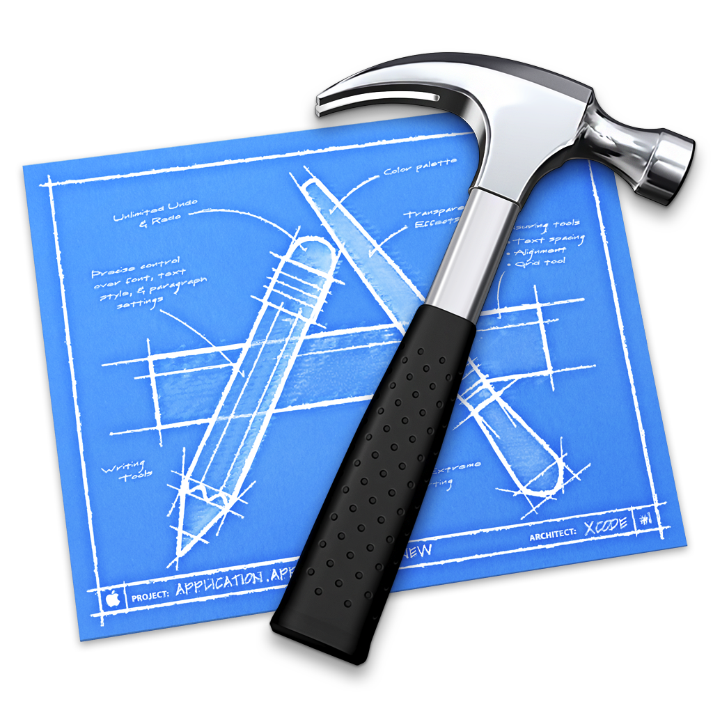
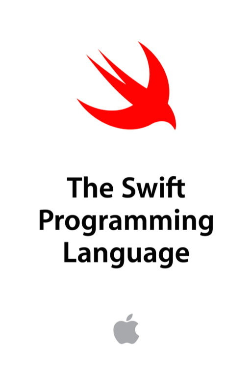
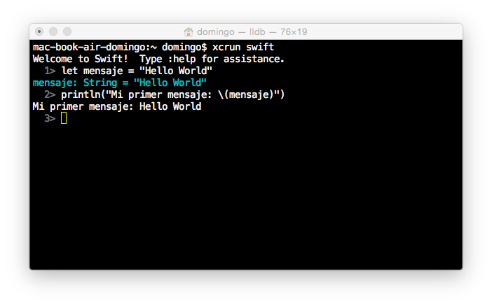
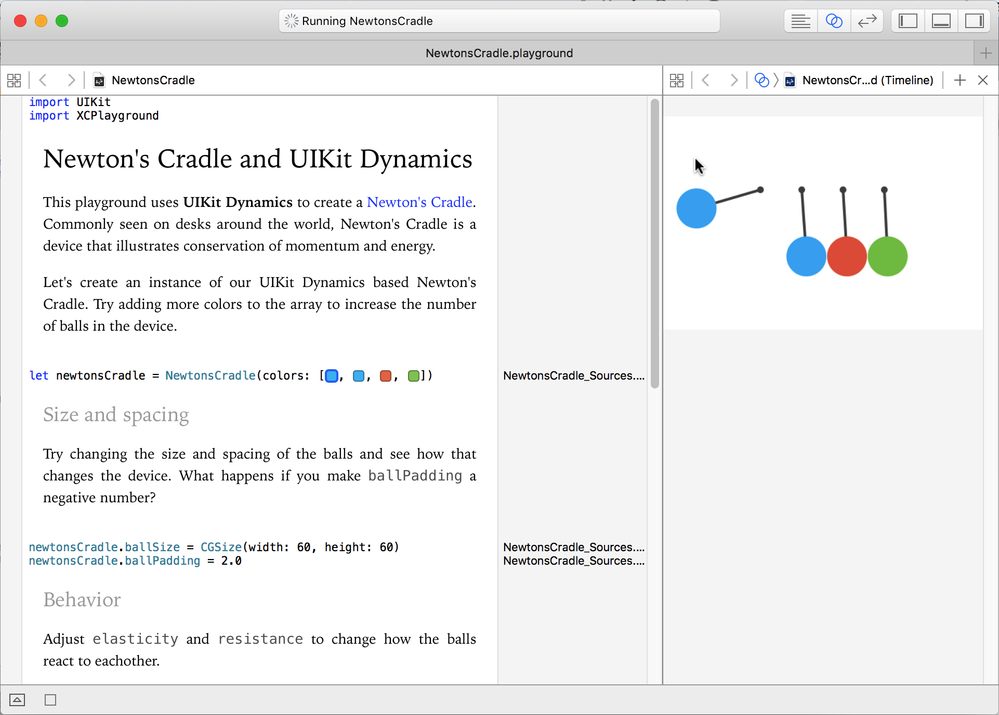
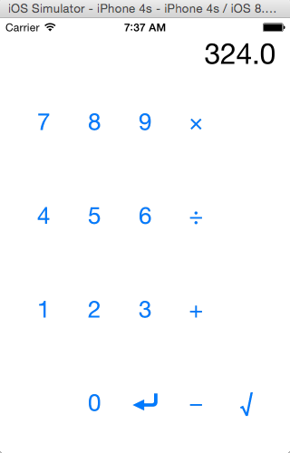
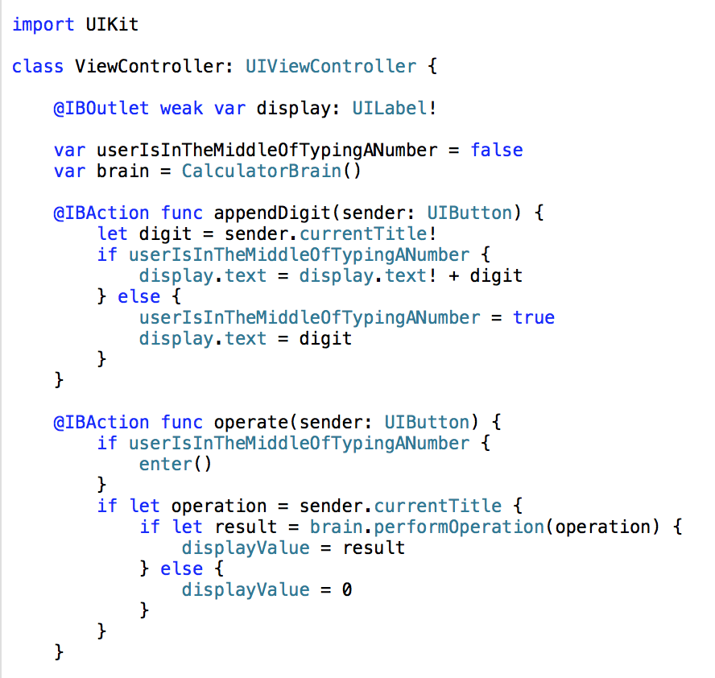
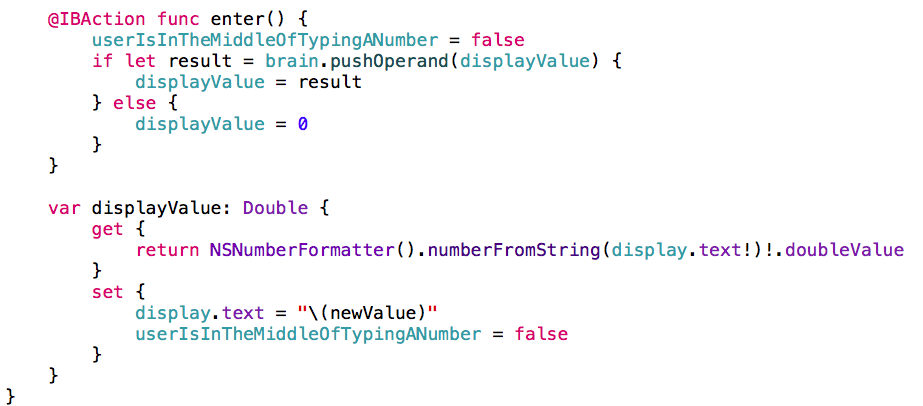
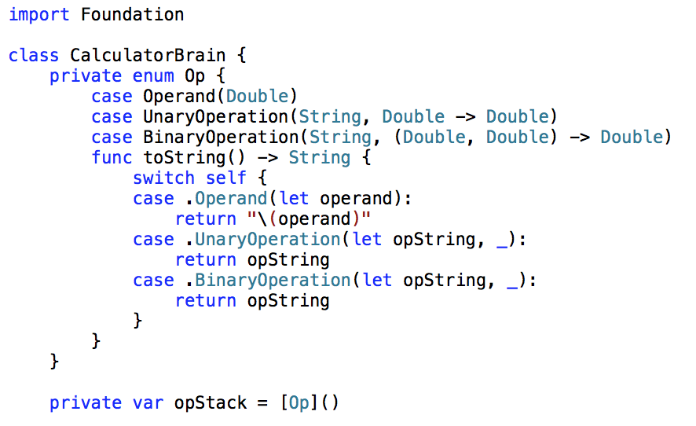
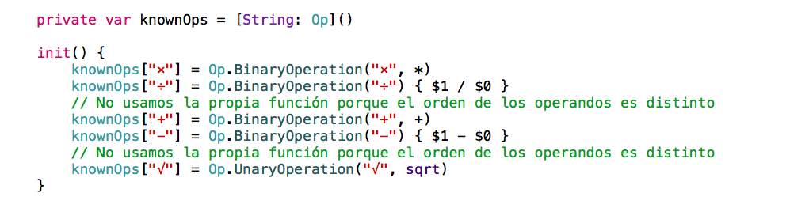
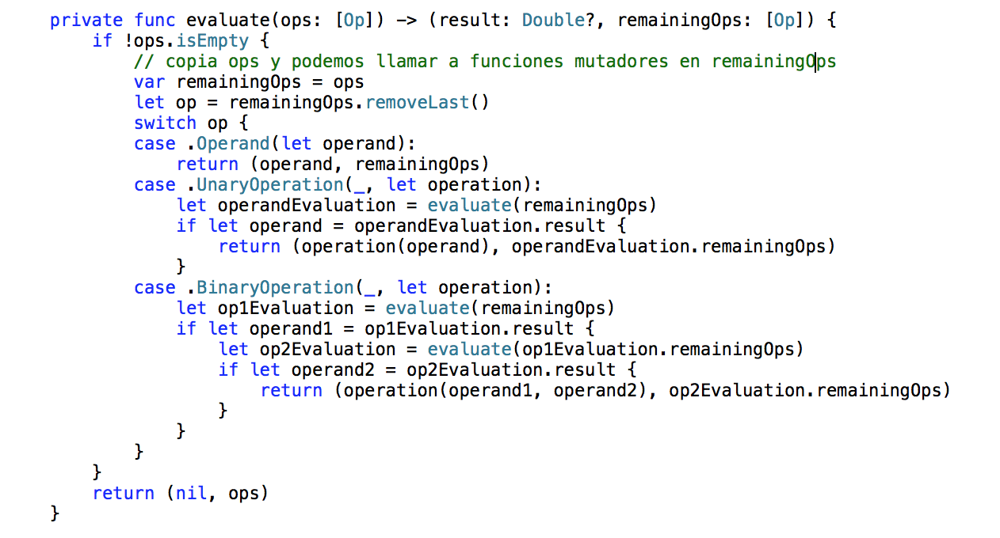

# Sesión 1: Introducción <br/> a Swift 1

#### Servicios de las plataformas móviles - iOS

<small>Domingo Gallardo - domingo.gallardo@ua.es  
Departamento Ciencia de la Computación e Inteligencia Artificial  
Master Programación de Dispositivos Móviles</small>

<!-- Tres líneas en blanco para la siguiente transparencia -->


#### Recursos

 

- [Xcode 7.3](http://itunes.apple.com/us/app/xcode/id497799835?ls=1&mt=12) disponible en la Mac App Store.
- Libro [_The Swift Programming Language_](https://developer.apple.com/library/ios/documentation/Swift/Conceptual/Swift_Programming_Language/) disponible en el portal de desarrolladores de Apple.
- Además del libro es recomendable consultar la página de Apple con los [recursos sobre Swift](https://developer.apple.com/swift/resources/).

---
<!-- Los comentarios después de los tres guiones no salen en la diapositiva  -->

Vamos a utilizar como guía el libro de Apple _The Swift Programming Language_ que puedes descargar de forma gratuita de [iBooks Store](https://itunes.apple.com/es/book/swift-programming-language/id881256329?mt=11) o consultar en el [portal de desarrolladores de Apple](https://developer.apple.com/library/ios/documentation/Swift/Conceptual/Swift_Programming_Language/).

Para cuestiones avanzadas, como integración con Objective-C y con Cocoa, también recomendamos el libro de Apple _Using Swift with Cocoa and Objective-C_ descargable desde [iBooks Store](https://itunes.apple.com/us/book/using-swift-cocoa-objective/id888894773?mt=11) o [consultable en el portal de desarrolladores](https://developer.apple.com/library/ios/documentation/Swift/Conceptual/BuildingCocoaApps/).

Vamos a trabajar con la última versión estable de Xcode (en marzo de 2016), la 7.3.

Vamos a dedicar más de una sesión a repasar los aspectos más importantes de Swift, basándonos en conceptos de estos libros. Haremos énfasis en los más importantes y difíciles de entender. Hay bastantes aspectos de Swift similares a C que no comentaremos.

<!-- Tres líneas en blanco para la siguiente transparencia -->


#### Características de Swift de esta sesión

- Aspectos y tipos básicos
- Colecciones
- Control de flujo
- Opcionales
- Funciones
- _Closures_
- Clases 
- Enumeraciones 
- Estructuras

<!-- Tres líneas en blanco para la siguiente transparencia -->


#### Ejecución de los ejemplos

- Es posible crear **_playgrounds_** en Xcode, hojas interactivas que ejecutan código Swift
- Es posible también ejecutar los ejemplos en un **intérprete** en el terminal

<!-- Tres líneas en blanco para la siguiente transparencia -->


#### Intérprete de Swift en el terminal



- Intérprete REPL en el terminal: `$ swift`
- Programa de script que se ejecuta con el intérprete:  
	`$ swift programa.swift`
- Compilar con `$ swiftc` y ejecutar el programa resultante

---

Es posible probar programas en Swift sin tener que ejecutar código en el simulador del dispositivo, utilizando el intérprete en el terminal de Mac OS. El funcionamiento de este intérprete sigue el estilo _REPL_ típico de los lenguajes funcionales como Lisp: _Read_, _Eval_, _Print_ _Loop_. El intérprete lee una expresión, la evalúa, imprime el resultado por la salida estándar y vuelve a leer la siguiente expresión.

El intérprete tiene características avanzadas que facilitan su uso, como la edición de múltiples líneas, la historia de comandos y la completación automática de código Swift. En la página del blog de Apple sobre Swift [Introduction to the Swift REPL](https://developer.apple.com/swift/blog/?id=18) puedes encontrar más información sobre los comandos y la forma de interactuar con el intérprete.

Para lanzar el intérprete de Swift debes ejecutar desde un terminal:

```
$ swift
1> println("Hello World")
Hello World
```

O crear el fichero `hello.swift`:

```swift
println("Hello World")
```

```
$ swift hello.swift
Hello World

$ swift hello.swift
```

Referencias:

- [Introduction to the Swift REPL](https://developer.apple.com/swift/blog/?id=18), post del blog de Apple sobre Swift

<!-- Tres líneas en blanco para la siguiente transparencia -->


#### _Playgrounds_



[Playgrounds interactivos](https://developer.apple.com/swift/blog/?id=35)

<!-- Tres líneas en blanco para la siguiente transparencia -->


#### Descarga de las plantillas
<!-- .slide: data-background="#cbe0fc"-->

- Las plantillas y ejemplos iniciales de los proyectos se encuentran en el [repositorio `mastermoviles-servicios-ios`](https://bitbucket.org/mastermoviles/mastermoviles-servicios-ios/) de la cuenta `mastermoviles` de Bitbucket. Descárgalo en un directorio aparte para ir cogiendo de ahí los distintos proyectos.

- Carga en Xcode el playground `NewtonsCradle` y pruébalo.

- Crea un _playground_ en el que puedes probar el código de los ejemplos que hay a continuación. También hay ejercicios sombreados en azul que puedes resolver para aprender mejor Swift. Todos estos ejercicios son opcionales, no hay que entregar este _playground_.

<!-- Tres líneas en blanco para la siguiente transparencia -->


#### Constantes y variables

```swift
var miVariable = 42
miVariable = 50
let miConstante = 42
```

- La palabra clave `let` sirve para definir constantes. No es necesario que se conozca en tiempo de compilación el valor de una constante, pero debes asignarle un valor exactamente una vez.
- La palabra clave `var` se utiliza para definir variables. 

<!-- Tres líneas en blanco para la siguiente transparencia -->


#### Tipos e inferencia de tipos

```swift
let implicitInteger = 70
let implicitDouble = 70.0
let explicitDouble: Double = 70
```
- Los tipos de las variables se **infieren** a partir de los tipos devueltos por las expresiones de la derecha.

> Crea una constante con el tipo explícito de Float y un valor de 4.


<!-- Tres líneas en blanco para la siguiente transparencia -->


#### Conversión de tipos

- Los valores nunca se convierten implícitamente a otro tipo. Si necesitas convertir un valor a un tipo diferente, construye explícitamente una instancia del tipo deseado.

```swift
let etiqueta = "El ancho es "
let ancho = 94
let anchoEtiqueta = etiqueta + String(ancho)
```

> Intenta eliminar la conversión a `String` en la última línea. ¿Qué error obtienes?

<!-- Tres líneas en blanco para la siguiente transparencia -->


#### Valores en cadenas

- Podemos incluir un valor en una cadena escribiendo el valor entre paréntesis y una barra invertida  (`\`) antes de los paréntesis. Por ejemplo:

```swift
let manzanas = 3
let naranjas = 5
let resumenManzanas = "Tengo \(manzanas) manzanas."
let resumenFrutas = "Tengo \(manzanas + naranjas) frutas."
```

> Usa `\()` para incluir un cálculo en punto flotante en una cadena y para incluir el nombre de alguien en un saludo.

<!-- Tres líneas en blanco para la siguiente transparencia -->


#### Arrays y diccionarios

- Arrays: listas ordenads de valores de un mismo tipo.
- Diccionarios: colecciones desordenadas de valores de un mismo tipo que pueden ser referenciados y buscados a través de un identificador único (_clave_).
- La mutabilidad o inmutabilidad de las colecciones dependen de si se asignan a variables (`var`) o a constantes (`let`).

```swift
var listaCompra = ["huevos", "agua", "tomates", "pant"]
listaCompra[1] = "botella de agua"

var trabajos = [
    "Malcolm": "Capitán",
    "Kaylee": "Mecánico",
]
trabajos["Jayne"] = "Relaciones públicas"
```
<!-- Tres líneas en blanco para la siguiente transparencia -->


#### Inicialización arrays y diccionarios vacíos

```swift
let arrayVacio = [String]()
let diccionarioVacio = [String: Float]()
```

<!-- Tres líneas en blanco para la siguiente transparencia -->


#### Arrays y diccionarios vacíos con tipos inferidos

```swift
listaCompra = []
trabajos = [:]
```

<!-- Tres líneas en blanco para la siguiente transparencia -->


#### Control de flujo

- Se usa `if` y `switch` para hacer condicionales y `for-in`, `for`, `while` y `repeat-while` para hacer bucles. 
- Los paréntesis alrededor de las condiciones o de la variable del bucle son opcionales. 
- Se requieren llaves alrededor del cuerpo.

```swift
let puntuacionesIndividuales = [75, 43, 103, 87, 12]
var puntuacionEquipo = 0
for puntuacion in puntuacionesIndividuales {
    if puntuacion > 50 {
        puntuacionEquipo += 3
    } else {
        puntuacionEquipo += 1
    }
}
print(puntuacionEquipo)
```

- En una sentencia `if`, el condicional debe ser una expresión booleana; esto significa que código como `if score { ... }` es un error, no una comparación implícita con cero.

<!-- Tres líneas en blanco para la siguiente transparencia -->


#### Sentencia `switch` 

- Las sentencias `switch` permiten cualquier tipo de datos y una amplia variedad de operaciones de comparación; no están limitados a enteros y pruebas de igualdad.

```swift
let verdura = "pimiento rojo"
switch verdura {
    case "zanahoria":
        print("Buena para la vista.")
    case "lechuga", "tomates":
        print("Podrías hacer una buena ensalada.")
    case let x where x.hasPrefix("pimiento"):
        print("¿Es un \(x) picante?")
    default:
        print("Siempre puedes hacer una buena sopa.")
}
```
<!-- Tres líneas en blanco para la siguiente transparencia -->


#### Bucle `for-in` sobre diccionarios

```swift
let numerosInteresantes = [
    "Primos": [2, 3, 5, 7, 11, 13],
    "Fibonacci": [1, 1, 2, 3, 5, 8],
    "Cuadrados": [1, 4, 9, 16, 25],
]
var mayor = 0
for (clase, numeros) in numerosInteresantes {
    for numero in numeros {
        if numero > mayor {
            mayor = numero
        }
    }
}
print(mayor)
```

> Añade otra variable para seguir qué clase de número es el mayor.

<!-- Tres líneas en blanco para la siguiente transparencia -->


#### Bucle `while`

- Usamos `while` para repetir un bloque de código hasta que una condición cambie. 

```swift
var n = 2
while n < 100 {
    n = n * 2
}
print(n)
```
- La condición de un bucle puede estar también al final, asegurando que el bucle se ejecuta al menos una vez.
 
```swift
var m = 2
repeat {
    m = m * 2
} while m < 100
print(m)
```

<!-- Tres líneas en blanco para la siguiente transparencia -->


#### Rangos

```swift
var primerBucleFor = 0
for i in 0..<4 {
    primerBucleFor += i
}
print(primerBucleFor)

var segundoBucleFor = 0
for i in 0...4 {
    segundoBucleFor += i
}
print(segundoBucleFor)
```

<!-- Tres líneas en blanco para la siguiente transparencia -->


#### Valores opcionales

- En Swift todos los tipos deben tener valor.
- Un valor opcional o bien contiene un valor o contiene `nil` para indicar que el valor falta.
- Escribimos una interrogación (`?`) después del tipo de un valor para marcar el valor como opcional.

```swift
var saludo = "Hola"
saludo = nil
// error: una variable de tipo no puede tener el valor nil
var cadenaOpcional: String? = "Hola"
print(cadenaOpcional == nil)
```

---

El concepto de _optional_ no existe ni en C, ni en Objective-C. Lo más cercano en Objective-C es la posibilidad de devolver `nil` desde un método que en otras ocasiones debería devolver un objeto. Sin embargo, esto sólo funciona para objetos, no funciona ni para estructuras, ni para tipos básicos de C, ni para enumeraciones. Para estos tipos Objective-C devuelve típicamente un valor especial (como `NSNotFound`) para indicar la ausencia de valor.

El problema de este enfoque es que se asume que el llamador del método sabe que hay que chequear este valor especial, pero no hay nada en el tipo que lo indique y que pueda ser utilizado por el compilador para detectar posibles errores. Además, se debe saber cuál es el literal que define este valor especial.

Los opcionales de Swift permiten expresar la ausencia de valor en _cualquier tipo_, sin la necesidad de constantes especiales.

> Importante: `String? saludo` representa que la variable `saludo` puede tener un valor de tipo `String` o que puede no tener valor. No que sea un `String` que puede tener el valor `nil`. En Swift los valores de los tipos nunca pueden ser `nil`.

<!-- Tres líneas en blanco para la siguiente transparencia -->


#### Trabajar con valores opcionales

- Los opcionales proporcionan una forma de devolver valores en métodos que deben tratar entradas erróneas:

```swift
let numero = "123"
let numeroConError = "123a"
let numeroConvertido = Int(numero) // Int? = 123
let numeroConvertidoConError = Int(numeroConError) // Int? = nil
```

- Se debe usar `if` y `let` juntos para trabajar con valores que pueden faltar, valores se representan como opcionales. 

```swift
var nombreOpcional: String? = "John Appleseed"
var saludo = "Hola!"
if let nombre = nombreOpcional {
    saludo = "Hola, \(nombre)"
}
```

> Cambia `nombreOpcional` a `nil`. ¿Qué saludo obtienes? Añade una cláusula `else` que establezca un saludo diferente si `nombreOpcional` es `nil`.

<!-- Tres líneas en blanco para la siguiente transparencia -->


#### Opcionales sin valor

- Otra forma de manejar valores opcionales es proporcionar un valor por defecto usando el operador `??`. Si falta el valor valor opcional, se usa el valor por defecto en su lugar.

```swift
let nombrePila: String? = nil
let nombreCompleto: String = "John Appleseed"
let saludoInformal = "¿Qué tal, \(nombrePila ?? nombreCompleto)?"
```

<!-- Tres líneas en blanco para la siguiente transparencia -->


##### Desenvolver un _optional_

- En un tipo opcional el valor está _envuelto_ (_wrapped_). Obtendremos un error si lo intentamos usar.

```swift
numeroConvertido + 100
// error: value of optional type 'Int?' not unwrapped;
```
- El valor se puede _desenvolver_ usando la exclamación (`!`):

```swift
numeroConvertido! + 100 // Int = 223
```
- Si desenvolvemos `nil` se obtiene un error en tiempo de ejecución:

```swift
numeroConvertidoConError! + 100 
// fatal error: unexpectedly found nil unwrapping an Optional
```

<!-- Tres líneas en blanco para la siguiente transparencia -->


##### Opcionales implícitamente desenvueltos

- En inglés: _implicitly unwrapped optionals_.
- Es un opcional que puede usarse como un no opcional, sin necesidad de desenvolver el valor opcional cada vez que se accede.

```swift
var num: Int! 
num = Int("100")
let num2 = num + 200 // No es necesario desenvolver numero
```
- Se puede pensar en un opcional implícitamente desenvuelto como una forma de desenvolver automáticamente la variable cada vez que se usa. En lugar de poner una exclamación cada vez que se usa, se pone sólo una vez cuando se declara.

<!-- Tres líneas en blanco para la siguiente transparencia -->


#### Función

- Usamos `func` para declarar una función. Usamos `->` para separar los nombres de los parámetros y sus tipos del tipo devuelto de la función.
- Para llamar a una función hay que escribir el nombre externo de los parámetros 2 .. n. El primer parámetro se pasa sin escribir su nombre.

```swift
func saluda(nombre: String, dia: String) -> String {
    return "Hola \(nombre), hoy es \(dia)."
}
saluda("Bob", dia: "martes")
```

- Podemos definir nombres externos distintos de los internos

```swift
func une(s1: String, con s2: String) -> String {
    return s1 + s2
}
une("Hola", con: ", mundo")
```

<!-- Tres líneas en blanco para la siguiente transparencia -->


#### Tuplas

```swift
func calculaEstadisticas(puntuaciones: [Int]) -> 
                        (min: Int, max: Int, sum: Int) {
    var min = puntuaciones[0]
    var max = puntuaciones[0]
    var sum = 0

    for puntuacion in puntuaciones {
        if puntuacion > max {
            max = puntuacion
        } else if puntuacion < min {
            min = puntuacion
        }
        sum += puntuacion
    }

    return (min, max, sum)
}
let estadisticas = calculaEstadisticas([5, 3, 100, 3, 9])
print(estadisticas.sum)
print(estadisticas.2)
```

<!-- Tres líneas en blanco para la siguiente transparencia -->


#### Número variable de argumentos

- Las funciones también pueden tener un número variable de argumentos, agrupándose todos ellos en un array.

```swift
func sumaDe(numeros: Int...) -> Int {
    var suma = 0
    for numeros in numeros {
        suma += numeros
    }
    return suma
}
sumaDe()
sumaDe(42, 597, 12)
```

> Escribe una función que calcule la media de sus argumentos.

<!-- Tres líneas en blanco para la siguiente transparencia -->


#### Funciones anidadas

- Las funciones pueden anidarse. Las funciones pueden acceder variables declaradas en la función exterior. Puedes usar funciones anidadas para organizar el código en una función que es larga o complicada.

```swift
func devuelveQuince() -> Int {
    var y = 10
    func suma() {
        y += 5
    }
    suma()
    return y
}
devuelveQuince()
```

<!-- Tres líneas en blanco para la siguiente transparencia -->


#### Las funciones son un tipo de primera clase

- Las funciones son un tipo de primera clase. Una función puede devolver otra función como resultado.

```swift
func construyeIncrementador() -> ((Int) -> Int) {
    func sumaUno(numero: Int) -> Int {
        return 1 + numero
    }
    return sumaUno
}
var incrementa = construyeIncrementador()
incrementa(7)
```

<!-- Tres líneas en blanco para la siguiente transparencia -->


#### Función argumento de otra función

- Una función puede tomar otra función como uno de sus argumentos.

```swift
func cumpleCondicion(lista: [Int], condicion: (Int) -> Bool) -> Bool {
    for item in lista {
        if condicion(item) {
            return true
        }
    }
    return false
}
func menorQueDiez(numero: Int) -> Bool {
    return numero < 10
}
var numeros = [20, 19, 7, 12]
cumpleCondicion(numeros, condicion: menorQueDiez)
```

<!-- Tres líneas en blanco para la siguiente transparencia -->


#### Clausuras

- Clausura: bloque de código que puede ser llamado después.
- El código en la clausura tiene acceso a cosas como variables y funciones que estaban disponibles en el ámbito (*scope*) en el que se creó la clausura, incluso si la clausura se está en un ámbito distinto cuando se ejecuta; ya viste un ejemplo de esto con las funciones anidadas.

```swift
numeros.map({
    (numero: Int) -> Int in
    let resultado = 3 * numero
    return resultado
})
```

> Reescribe la clausura para que devuelva cero para todos los números impares.

<!-- Tres líneas en blanco para la siguiente transparencia -->


#### Formas abreviadas de clausuras

- Cuando ya se conoce el tipo de una clausura se puede  omitir el tipo de sus parámetros, el tipo devuelto o ambos. 
- Las clausuras escritas en una línea devuelven implícitamente el valor de su única sentencia.

```swift
let numerosMapeados = numeros.map({ numero in 3 * numero })
print(numerosMapeados)
```

- Podemos referirnos a los parámetros por número en lugar de por nombre.
- Una clausura pasada como último argumento puede aparecer inmediatamente después de los paréntesis.
- Cuando una clausura es el único argumento de una función, puedes omitir los paréntesis por completo.

```swift
let numerosOrdenados = numeros.sort { $0 > $1 }
print(numerosOrdenados)
```
<!-- Tres líneas en blanco para la siguiente transparencia -->


#### Clases

- Usamos `class` seguido por el nombre de la clase para crear una clase. 
- Una declaración de una propiedad en una clase se escribe de la misma forma que la declaración de una constante o una variable, excepto que está en el contexto de una clase. 
- De la misma forma, las declaraciones de los métodos se escriben de la misma forma que las funciones.

```swift
class Figura {
    var numeroDeLados = 0
    func descripcionSencilla() -> String {
        return "Una figura con \(numeroDeLados) lados."
    }
}
```

> Añade una propiedad constante con `let`, y añade otro método que tome un argumento.

<!-- Tres líneas en blanco para la siguiente transparencia -->


#### Instancias de clases

- Creamos una instancia de una clase poniendo paréntesis después del nombre de la clase. 
- Usamos la sintaxis de punto para acceder a las propiedades y los métodos de la instancia.

```swift
var figura = Figura()
figura.numeroDeLados = 7
var descripcionFigura = figura.descripcionSencilla()
```
<!-- Tres líneas en blanco para la siguiente transparencia -->


#### Inicializadores

- Se definen los inicializadores con `init`

```swift
class FiguraConNombre {
    var numeroDeLados: Int = 0
    var nombre: String
    
    init(nombre: String) {
        self.nombre = nombre
    }
    
    func descripcionSencilla() -> String {
        return "Una figura con \(numeroDeLados) lados."
    }
}
```

<!-- Tres líneas en blanco para la siguiente transparencia -->


#### Subclases

- Las subclases incluyen el nombre de su subclase después del nombre de la clase, separado por una coma. 
- No hay ningún requisito de que las clases deban ser subclases de alguna clase raíz, por lo que puedes omitir una superclase si así lo necesitas.
- Los métodos en una subclase que sobreescriben la implementación de la superclase se marcan con `override`; la sobreescritura de un método por accidente, sin `override`, se detecta por el compilador como un error. El compilador también detecta métodos con `override` que realmente no sobreescriben ningún método de la superclase.

<!-- Tres líneas en blanco para la siguiente transparencia -->


#### Ejemplo

```swift
class Cuadrado: FiguraConNombre {
    var longitudLado: Double
    
    init(longitudLado: Double, nombre: String) {
        self.longitudLado = longitudLado
        super.init(nombre: nombre)
        numeroDeLados = 4
    }
    
    func area() ->  Double {
        return longitudLado * longitudLado
    }
    
    override func descripcionSencilla() -> String {
        return "Un cuadrado con lados de longitud \(longitudLado)."
    }
}
let test = Cuadrado(longitudLado: 5.2, nombre: "Mi cuadrado de prueba")
test.area()
test.descripcionSencilla()
```

> Construye otra subclase de `FiguraConNombre` llamada `Circulo` que tome un radio y un nombre como argumentos de su inicializador. Implementa un método `area()` y `descripcionSencilla()` en la clase `Circulo`.

<!-- Tres líneas en blanco para la siguiente transparencia -->


#### Getters y setters en propiedades

- Además de propiedades simples que se almacenan, las propiedades pueden tener un *getter* y un *setter*.

```swift
class TrianguloEquilatero: FiguraConNombre {
    var longitudLado: Double = 0.0
    
    init(longitudLado: Double, nombre: String) {
        self.longitudLado = longitudLado
        super.init(nombre: nombre)
        numeroDeLados = 3
    }
    
    var perimetro: Double {
        get {
            return 3.0 * longitudLado
        }
        set {
            longitudLado = newValue / 3.0
        }
    }
    
    override func descripcionSencilla() -> String {
        return "Un triangulo equilátero con lados de longitud \(longitudLado)."
    }
}
var triangulo = TrianguloEquilatero(longitudLado: 3.1, nombre: "un triángulo")
print(triangulo.perimetro)
triangulo.perimetro = 9.9
print(triangulo.longitudLado)
```

---

Date cuenta de que el inicializador de la clase `TrianguloEquilatero` tiene tres pasos diferentes:

1. Establecer el valor de las propiedades que declara la subclase.
2. Llamar al inicializador de la superclase.
3. Cambiar el valor de las propiedades definidas por la superclase. Cualquier trabajo adicional que use métodos, *getters* o *setters* puede hacerse también en este punto.

<!-- Tres líneas en blanco para la siguiente transparencia -->


#### `willSet` y `didSet`

- Si necesitamos proporcionar código que se ejecuta antes y después de establecer un nuevo valor, usaremos `willSet` y `didSet`. El código proporcionado se ejecuta cada vez que el valor cambia fuera de un inicializador. 
- Por ejemplo, la siguiente clase se asegura de que la longitud del lado de su triángulo siempre es la misma que la longitud del lado de su cuadrado.

```swift
class TrianguloYCuadrado {
    var triangulo: TrianguloEquilatero {
        willSet {
            cuadrado.longitudLado = newValue.longitudLado
        }
    }
    var cuadrado: Cuadrado {
        willSet {
            triangulo.longitudLado = newValue.longitudLado
        }
    }
    init(tamaño: Double, nombre: String) {
        cuadrado = Cuadrado(longitudLado: tamaño, nombre: nombre)
        triangulo = TrianguloEquilatero(longitudLado: tamaño, nombre: nombre)
    }
}
var trianguloYCuadrado = TrianguloYCuadrado(tamaño: 10, nombre: "Otra figura de prueba")
print(trianguloYCuadrado.cuadrado.longitudLado)
print(trianguloYCuadrado.triangulo.longitudLado)
trianguloYCuadrado.cuadrado = Cuadrado(longitudLado: 50, nombre: "Cuadrado mayor")
print(trianguloYCuadrado.triangulo.longitudLado)
```

<!-- Tres líneas en blanco para la siguiente transparencia -->


#### Valores opcionales en métodos

- Cuando trabajamos con valores opcionales, podemos escribir `?` antes de operaciones como métodos, propiedades y subíndices. 
- Si el valor antes del `?` es `nil`, todo lo que hay después se ignora y el valor de la expresión completa es `nil`. En otro caso, el valor opcional se desenvuelve, y todo lo que hay después del `?` se realiza sobre el valor desenvuelto. 
- En ambos casos, el valor de la expresión completa es un valor opcional.

```swift
let cuadradoOpcional: Cuadrado? = 
          Cuadrado(longitudLado: 2.5, nombre: "Cuadrado opcional")
let longitudLado = cuadradoOpcional?.longitudLado
```

<!-- Tres líneas en blanco para la siguiente transparencia -->


#### Enumeraciones

- Como las clases y otros tipos con nombre, las enumeraciones pueden tener métodos asociados.

```swift
enum Valor: Int {
    case As = 1
    case Dos, Tres, Cuatro, Cinco, Seis, Siete, Ocho, Nueve, Diez
    case Sota, Caballo, Rey
    func descripcionSencilla() -> String {
        switch self {
        case .As:
            return "as"
        case .Sota:
            return "sota"
        case .Caballo:
            return "caballo"
        case .Rey:
            return "rey"
        default:
            return String(self.rawValue)
        }
    }
}
let carta = Valor.As
let valorBrutoCarta = carta.rawValue
```

> Escribe una función que compare dos valores `Valor` usando sus valores brutos.

<!-- Tres líneas en blanco para la siguiente transparencia -->


#### Inicialización enum

- Por defecto, Swift asigna los valores brutos comenzando en cero e incrementándolos por uno cada vez. 
- Se puede cambiar esta conducta especificando explícitamente los valores. 
- Se puede también usar cadenas o números en punto flotante como valores brutos de una enumeración. 
- Se utiliza la propiedad `rawValue` para acceder al valor bruto de una enumeración.
- Se usa el inicializador `init?(rawValue:)` para construir una instancia de una enumeración a través de un valor bruto.

```swift
if let valorConvertido = Valor(rawValue: 3) {
    let descripcionTres = valorConvertido.descripcionSencilla()
}
```

<!-- Tres líneas en blanco para la siguiente transparencia -->


#### Valores `case` del `enum`

- Los valores *case* de una enumeración son valores reales, no una forma nueva de escribir sus valores brutos. 

```
enum Palo {
    case Oros, Bastos, Copas, Espadas
    func descripcionSencilla() -> String {
        switch self {
        case .Oros:
            return "oros"
        case .Bastos:
            return "bastos"
        case .Copas:
            return "copas"
        case .Espadas:
            return "espadas"
        }
    }
}
let copas = Palo.Copas
let descripcionCopas = copas.descripcionSencilla()
```

> Añade un método `color()` a `Palo` que devuelva "agresivo" para *bastos* y *espadas* y devuelva "reflexivo" para *oros* y *copas*.

<!-- Tres líneas en blanco para la siguiente transparencia -->


#### Valores asociados a instancias de enums

- Una instancia de un caso de enumeración puede tener valores asociados con la instancia. Instancias del mismo caso de enumeración pueden tener asociados valores diferentes. 
- Proporcionamos los valores asociados cuando creamos la instancia. 

```swift
enum RespuestaServidor {
    case Resultado(String, String)
    case Error(String)
}
 
let exito = RespuestaServidor.Resultado("6:00 am", "8:09 pm")
let fallo = RespuestaServidor.Error("Sin queso.")
 
switch exito {
    case let .Resultado(salidaSol, puestaSol):
        print("La salida del sol es a las \(salidaSol) y la puesta es a \(puestaSol).")
    case let .Error(error):
        print("Fallo...  \(error)")
}
```

<!-- Tres líneas en blanco para la siguiente transparencia -->


#### Structs

- Usamos `struct` para crear una estructura. 
- Las estructuras comparten muchas características de las clases, incluyendo métodos e inicializadores. 
- Una de las diferencias más importantes entre estructuras y clases es que las estructuras siempre se copian cuando las pasas en tu código, mientras que las clases se pasan por referencia.

```swift
struct Carta {
    var valor: Valor
    var palo: Palo
    func descripcionSencilla() -> String {
        return "El \(valor.descripcionSencilla()) de \(palo.descripcionSencilla())"
    }
}
let tresDeEspadas = Carta(valor: .Tres, palo: .Espadas)
let descripcionTresDeEspadas = tresDeEspadas.descripcionSencilla()
```

> Añade un método a `Carta` que cree un mazo completo de cartas, con una carta de cada combinación de valor y palo.

<!-- Tres líneas en blanco para la siguiente transparencia -->


#### Prácticas
<!-- .slide: data-background="#cbe0fc"-->
<!-- Tres líneas en blanco para la siguiente transparencia -->


#### Trabajo con Git y Bitbucket
<!-- .slide: data-background="#cbe0fc"-->

- Debes crear todos los proyectos en el único repositorio `mastermoviles-servicios-ios` en tu cuenta de _Bitbucket_. Crea ese repositorio y da permisos de lectura al usuario `entregas-mastermoviles`.
- Ve haciendo pequeños _commits_ conforme vayas añadiendo funcionalidades a los proyectos. Los _commits_ no deben tener errores de compilación. Haz _push_ regularmente al repositorio _Bitbucket_.

<!-- Tres líneas en blanco para la siguiente transparencia -->


#### Creación del repositorio en _Bitbucket_ y en local
<!-- .slide: data-background="#cbe0fc"-->

- Crea en tu cuenta de _Bitbucket_ un repositorio `mastermoviles-servicios-ios`.
- Crea en local un directorio con el mismo nombre.
- Copia el fichero .gitignore del repositorio de plantillas
- Abre un terminal, muévete al directorio recién creado y ejecuta los siguientes comandos para inicializar el repositorio y subir el fichero `.gitignore` a _Bitbucket_

```shell
git init
git remote add origin https://<usuario>@bitbucket.org/usuario/mastermoviles-servicios-ios.git
git add .gitignore
git commit -m 'Commit inicial'
git push -u origin master
```

- Una vez creado el repositorio git en el directorio `mastermoviles-servicios-ios` Xcode lo reconocerá en cualquier proyecto que crees dentro de él y podrás hacer _commits_ y _push_ desde la propia herramienta. Para ello, lo único que tienes que hacer es activar el control de código fuente en el proyecto (con _Xcode > Preferences > Source Control > Enable Source Control_).

<!-- Tres líneas en blanco para la siguiente transparencia -->


#### Ejercicio: Calculadora
<!-- .slide: data-background="#cbe0fc"-->



- Como ejercicio de esta sesión de introducción a Swift copia el código que falta de la aplicación `Calculadora`.
- Aplicación del curso sobre iOS de Standford en _iTunes U_.

<!-- Tres líneas en blanco para la siguiente transparencia -->


#### Tareas a realizar
<!-- .slide: data-background="#cbe0fc"-->

- Copia el proyecto `Calculadora` del repositorio de plantillas en tu repositorio de entregas. Se trata de una aplicación que muestra un ejemplo sencillo de patrón MVC en Swift. 
- Completa la aplicación, súbela a tu repositorio _Bitbucket_ y escribe en la entrega Moodle la entrega de Moodle la URL de tu repositorio y cualquier indicación que quieras comentar.

--- 

##### Notas 

- La aplicación está incompleta, contiene el _storyboard_ que define la vista y el fichero `ViewController.swift` incompleto. Le falta el fichero `CalculatorBrain.swift` que define el modelo.
- Ejecútala en el simulador y comprueba que funciona la entrada de números (escribiendo los dígitos y pulsando ENTER), pero falta el código que realiza los cálculos. 
- Copia el código que falta, que puedes encontrar en las siguientes transparencias, reflexionando sobre la implementación y sobre las características de Swift. 
- Las instrucciones se introducen en forma de pila. Por ejemplo, si se escribe `6 ENTER 5 ENTER 4 ENTER + *` se ejecuta `((4 + 5) * 6)`.

<!-- Tres líneas en blanco para la siguiente transparencia -->


#### `ViewController.swift (1)`
<!-- .slide: data-background="#cbe0fc"-->




<!-- Tres líneas en blanco para la siguiente transparencia -->


#### `ViewController.swift` (2)
<!-- .slide: data-background="#cbe0fc"-->



<!-- Tres líneas en blanco para la siguiente transparencia -->


#### `CalculatorBrain.swift` (1)
<!-- .slide: data-background="#cbe0fc"-->



<!-- Tres líneas en blanco para la siguiente transparencia -->


#### `CalculatorBrain.swift` (2)
<!-- .slide: data-background="#cbe0fc"-->


<!-- Tres líneas en blanco para la siguiente transparencia -->


#### `CalculatorBrain.swift` (3)
<!-- .slide: data-background="#cbe0fc"-->


<!-- Tres líneas en blanco para la siguiente transparencia -->


#### `CalculatorBrain.swift` (4)
<!-- .slide: data-background="#cbe0fc"-->


<!-- Tres líneas en blanco para la siguiente transparencia -->


<!-- 

#### Algunas ideas sueltas de Xcode
.slide: data-background="#cbe0fc"
- El panel a la izquierda del _storyboard_ muestra el _outline_ con todos los elementos de la interfaz de usuario.
- Cuando se hace un click del botón derecho sobre un elemento de la interfaz de usuario aparecen los eventos y las acciones a las que está conectado. Esto nos permite eliminar conexiones y volverlas a realizar. No es posible modificar conexiones, por lo que hay que tener cuidado con editar los elementos generados por el Ctrl+Drag cuando inicializamos una conexión.
- CMD + "/" comenta el texto seleccionado.

 Tres líneas en blanco para la siguiente transparencia
-->


# Master Programación <br/> de Dispositivos Móviles


