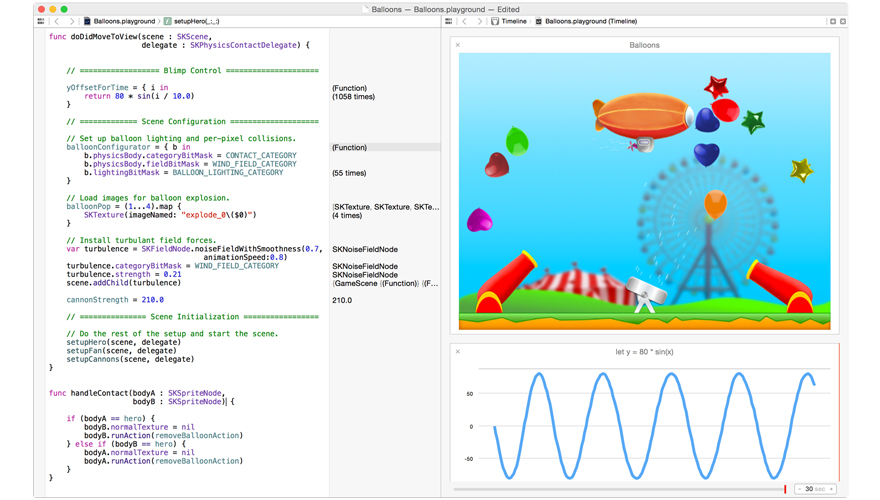

# Sesión 1: Introducción <br/> a Swift 1

### Servicios de las plataformas móviles - iOS

<small>Domingo Gallardo - domingo.gallardo@ua.es  
Departamento Ciencia de la Computación e Inteligencia Artificial  
Master Programación de Dispositivos Móviles</small>

<!-- Tres líneas en blanco para la siguiente transparencia -->


## Recursos

 

- [Xcode 6.3](http://itunes.apple.com/us/app/xcode/id497799835?ls=1&mt=12) disponible en la Mac App Store.
- Libro [_The Swift Programming Language_](https://developer.apple.com/library/ios/documentation/Swift/Conceptual/Swift_Programming_Language/) disponible en el portal de desarrolladores de Apple.
- Además del libro es recomendable consultar la página de Apple con los [recursos sobre Swift](https://developer.apple.com/swift/resources/).

---

Vamos a utilizar como guía el libro de Apple _The Swift Programming Language_ que puedes descargar de forma gratuita de [iBooks Store](https://itunes.apple.com/es/book/swift-programming-language/id881256329?mt=11) o consultar en el [portal de desarrolladores de Apple](https://developer.apple.com/library/ios/documentation/Swift/Conceptual/Swift_Programming_Language/).

Para cuestiones avanzadas, como integración con Objective-C y con Cocoa, también recomendamos el libro de Apple _Using Swift with Cocoa and Objective-C_ descargable desde [iBooks Store](https://itunes.apple.com/us/book/using-swift-cocoa-objective/id888894773?mt=11) o [consultable en el portal de desarrolladores](https://developer.apple.com/library/ios/documentation/Swift/Conceptual/BuildingCocoaApps/).

Vamos a trabajar con la última versión estable de Xcode (en marzo de 2015), la 6.2.

Vamos a dedicar más de una sesión a repasar los aspectos más importantes de Swift, basándonos en conceptos de estos libros. Haremos énfasis en los más importantes y difíciles de entender. Hay bastantes aspectos de Swift similares a C que no comentaremos.

<!-- Tres líneas en blanco para la siguiente transparencia -->


## Características de Swift de esta sesión

- Aspectos básicos
- Cadenas y caracteres
- Tipos _Collection_
- Control de flujo
- Funciones
- _Closures_
- Clases y estructuras

<!-- Tres líneas en blanco para la siguiente transparencia -->


## Ejecución de los ejemplos

- Es posible ejecutar los ejemplos de Swift sin crear un proyecto de aplicación en Xcode:
    - En un **intérprete** en el terminal
    - Es posible crear **_playgrounds_** en Xcode, hojas interactivas que ejecutan código Swift

<!-- Tres líneas en blanco para la siguiente transparencia -->


### Intérprete de Swift en el terminal


- Intérprete REPL en el terminal: `$ xcrun swift`
- En Yosemite: `$ swift`
- Programa de script que se ejecuta con el intérprete:  
	`$ xcrun swift programa.swift`
- Compilar con `$ swiftc` y ejecutar el programa resultante

---

Es posible probar programas en Swift sin tener que ejecutar código en el simulador del dispositivo, utilizando el intérprete en el terminal de Mac OS. El funcionamiento de este intérprete sigue el estilo _REPL_ típico de los lenguajes funcionales como Lisp: _Read_, _Eval_, _Print_ _Loop_. El intérprete lee una expresión, la evalúa, imprime el resultado por la salida estándar y vuelve a leer la siguiente expresión.

El intérprete tiene características avanzadas que facilitan su uso, como la edición de múltiples líneas, la historia de comandos y la completación automática de código Swift. En la página del blog de Apple sobre Swift [Introduction to the Swift REPL](https://developer.apple.com/swift/blog/?id=18) puedes encontrar más información sobre los comandos y la forma de interactuar con el intérprete.

Para lanzar el intérprete de Swift debes ejecutar desde un terminal:

```
$ xcrun swift
1> println("Hello World")
Hello World
```

O crear el fichero `hello.swift`:

```swift
println("Hello World")
```

```
$ xcrun swift hello.swift
Hello World

$ xcrun swift hello.swift
```

Referencias:

- [Introduction to the Swift REPL](https://developer.apple.com/swift/blog/?id=18), post del blog de Apple sobre Swift

<!-- Tres líneas en blanco para la siguiente transparencia -->


### _Playgrounds_



[Ballons.playground](https://developer.apple.com/swift/blog/downloads/Balloons.zip)

<!-- Tres líneas en blanco para la siguiente transparencia -->


## Aspectos básicos


<!-- Tres líneas en blanco para la siguiente transparencia -->


### Constantes y variables

```swift
let maximoNumeroDeIntentosDeLogin = 10
var intentosDeLoginActuales = 0
var x = 0.0, y = 0.0, z = 0.0
```

- La palabra clave `let` sirve para definir constantes.
- La palabra clave `var` se utiliza para definir variables. Podemos definir más de un identificador en cada línea, separándolas por comas.

<!-- Tres líneas en blanco para la siguiente transparencia -->


### Tipos e inferencia de tipos

```swift
var mensajeBienvenida: String = "Hola"
var rojo, verde, azul: Double
```

- Los tipos de las variables se **infieren** a partir de los tipos devueltos por las expresiones de la derecha:

```swift
var mensajeBienvenida = "Hola"
⇒ mensajeBienvenida: String = "Hola"
var cantidad = 1 / 0.3
⇒ cantidad: Double = 3.3333333333333335
```
<!-- Tres líneas en blanco para la siguiente transparencia -->


### Tipos numéricos

```swift
var numInt: Int = 10
var numDouble: Double = 10.0 // punto flotante de 64 bits
var numFloat: Float = 10.0 // punto flotante de 32 bits
```
<!-- Tres líneas en blanco para la siguiente transparencia -->


### Conversión de tipos numéricos

```swift
let tres = 3
let puntoUnoCuatroUnoCincoNueve = 0.14159
let pi = tres + puntoUnoCuatroUnoCincoNueve  // error
let pi = Double(tres) + puntoUnoCuatroUnoCincoNueve
// pi se infiere de tipo Double
```
<!-- Tres líneas en blanco para la siguiente transparencia -->


### _Booleans_

- El tipo _booleano_ es `Bool`. Existen dos constantes: `true` y `false`.
- En las sentencias `if` sólo se admiten condiciones booleanas

```swift
if i { 
    // este ejemplo no compila y da error
} 
```
<!-- Tres líneas en blanco para la siguiente transparencia -->


### Tuplas

- Una tupla agrupa varios valores en un único valor compuesto
- El tipo de la tupla es `(Int, String)`

```swift
let http404Error = (404, "Not Found")
```

- Para obtener los valores de la tupla podemos _descomponerla_. Si queremos ignorar una parte podemos utilizar un subrrayado (`_`).

```swift
let (statusCode, statusMensaje) = http404Error
⇒ statusCode: Int = 404
⇒ statusMensaje: String = "Not Found"
let (soloStatusCode, _) = http404Error
```
- También podemos acceder por posición:

```swift
println("El código de estado es \(http404Error.0)")
⇒ El código de estado es 404
```

<!-- Tres líneas en blanco para la siguiente transparencia -->


### _Optionals_

- Los _opcionales_ permiten expresar situaciones en las que un valor puede estar ausente.
- En Swift todos los tipos deben tener valor:

```swift
var saludo = "Hola"
saludo = nil
// error: una variable de tipo no puede tener el valor nil
```

- El tipo `String?` representa un `String` _opcional_. Una variable de ese tipo puede contener un `String` o `nil`:

```swift
var saludo: String? = "Hola"
saludo = nil
println("Mi saludo es \(saludo)")
```

---

El concepto de _optional_ no existe ni en C, ni en Objective-C. Lo más cercano en Objective-C es la posibilidad de devolver `nil` desde un método que en otras ocasiones debería devolver un objeto. Sin embargo, esto sólo funciona para objetos, no funciona ni para estructuras, ni para tipos básicos de C, ni para enumeraciones. Para estos tipos Objective-C devuelve típicamente un valor especial (como `NSNotFound`) para indicar la ausencia de valor.

El problema de este enfoque es que se asume que el llamador del método sabe que hay que chequear este valor especial, pero no hay nada en el tipo que lo indique y que pueda ser utilizado por el compilador para detectar posibles errores. Además, se debe saber cuál es el literal que define este valor especial.

Los opcionales de Swift permiten expresar la ausencia de valor en _cualquier tipo_, sin la necesidad de constantes especiales.

> Importante: `String? saludo` representa que la variable `saludo` puede tener un valor de tipo `String` o que puede no tener valor. No que sea un `String` que puede tener el valor `nil`. En Swift los valores de los tipos nunca pueden ser `nil`.

<!-- Tres líneas en blanco para la siguiente transparencia -->


#### Métodos que devuelven _optionals_

- En Swift no existen excepciones.
- La forma de indicar que se ha producido un error es devolviendo un _optional_.

```swift
let numero = "123"
let numeroConError = "123a"
let numeroConvertido = numero.toInt()
⇒ numeroConvertido: Int? = 123
let numeroConvertidoConError = numeroConError.toInt()
⇒ numeroConvertido2: Int? = nil
```

<!-- Tres líneas en blanco para la siguiente transparencia -->


#### Desenvolver un _optional_

- Un _optional_ no es un valor del tipo opcional, el valor está _envuelto_ (_wrapped_). Obtendremos un error si lo intentamos usar como _optional_.

```swift
numeroConvertido + 100
\\ error: value of optional type 'Int?' not unwrapped;
```

- El valor de un _optional_ se puede _desenvolver_ usando la exclamación (`!`):

```swift
numeroConvertido! + 100
⇒ Int = 223
```

- Si desenvolvemos `nil` se obtiene un error en tiempo de ejecución:

```swift
numeroConvertidoConError! + 100
⇒ fatal error: unexpectedly found nil unwrapping an Optional
```
<!-- Tres líneas en blanco para la siguiente transparencia -->


#### Cómo comprobar si un _optional_ es `nil`

- Se puede comparar con `nil` y obtener su valor:

```swift
if numeroConvertido != nil { 
    println("Valor entero: \(numeroConvertido!)")
}
```

- Se puede usar _optional binding_:

```swift
if let numeroVerdadero = posibleNumero.toInt() {
    println("Numero convertido: \(numeroVerdadero)")
} else { 
    println("\(posibleNumero) no se pudo convertir a entero")
}
```
<!-- Tres líneas en blanco para la siguiente transparencia -->


#### Opcionales implícitamente desenvueltos

- En inglés: _implicitly unwrapped optionals_.

```swift
let posibleCadena: String? = "Hola"
let supuestaCadena: String! = "Hola"
let cadena1: String = posibleCadena!
let cadena2: String = supuestaCadena // No es necesario desdenvolver
```

```swift
let numero: Int! = "100".toInt()
let numero2 = numero + 200 // No es necesario desenvolver numero
```

- Es un opcional que puede usarse como un no opcional, sin necesidad de desenvolver el valor opcional cada vez que se accede.

---

Se puede pensar en un opcional implícitamente desenvuelto como una forma de desenvolver automáticamente la variable cada vez que se usa. En lugar de poner una exclamación cada vez que se usa, se pone sólo una vez cuando se declara.

Se puede tratar un opcional implícitamente desenvuelto como un opcional normal, comprobando si contiene un valor:

```swift
if numero != nil { 
     println(numero) 
}
// Imprime el int implícitamente desenvuelto	 
```

Pero no es recomendable hacer esto. Si hay que chequear si una variable es `nil` es mejor declararla como opcional.

<!-- Tres líneas en blanco para la siguiente transparencia -->


#### Llamando a métodos en opcionales

- Aunque un opcional tenga el valor `nil` es posible llamar a propiedades, métodos, etc. de la clase original y estas llamadas siempre devolverán `nil`.
- Se denomina _optional chaining_.

```swift
class Person {
    var residence: Residence?
}
 
class Residence {
    var numberOfRooms = 1
}
```

```swift
let roomCount = john.residence?.numberOfRooms
println("John's residence has \(roomCount) room(s)."
```

- `roomCount` será de tipo `Int?` y tendrá `nil` o un valor dependiendo de si `residence` está inicializada.
- Más información sobre _optional chaining_ en [este enlace](https://developer.apple.com/library/ios/documentation/Swift/Conceptual/Swift_Programming_Language/OptionalChaining.html#//apple_ref/doc/uid/TP40014097-CH21-ID245).

<!-- Tres líneas en blanco para la siguiente transparencia -->


## Cadenas y caracteres

<!-- Tres líneas en blanco para la siguiente transparencia -->


### Aspectos generales

- Implementación moderna y rápida. Guardan caracteres Unicode.
- Se puede usar todo el API `NSString`.
- Se puede usar cadenas para insertar constantes, variables y expresiones dentro de cadenas más largas (_interpolación de cadenas_), lo que hace fácil la creación de valores _custom_ de cadenas para mostrarlos por pantalla, almacenarlos o imprimirlos.
- Las cadenas son objetos de _tipo valor_. Esto quiere decir que cuando se asignan o se pasan como parámetro siempre se realiza una copia de valor y no una copia de referencia. El compilador optimiza el funcionamiento de las cadenas para hacer eficiente este comportamiento.


```swift
for caracter in "áé@#😀\u{1F425}" { 
   println(caracter) 
} 
```

<!-- Tres líneas en blanco para la siguiente transparencia -->


### Operaciones sobre cadenas

- El operador `+` se utiliza para concatenar cadenas. Es posible mutar cadenas cuando las variables son de tipo `var`.
- El método `isEmpty` se utiliza para comprobar si una cadena es vacía:

```swift
var cadenaVacia = ""
if cadenaVacia.isEmpty { 
    cadenaVacia += "Hola" 
    println(cadenaVacia + " ya no está vacía") 
}
```

<!-- Tres líneas en blanco para la siguiente transparencia -->


### Comparaciones entre cadenas

- La igualdad de cadenas se compara con el operador `==`. Podemos también comparar si una es el prefijo o el sufijo de otra con los métodos `hasPrefix` y `hasSuffix`:

```swift
let cadena1 = "Hola, amigos"
let cadena2 = "Hola, amigos"
let cadena3 = "Hola"
let cadena4 = ", amigos"
if cadena1 == cadena2 &&
   cadena1.hasPrefix(cadena3) &&
   cadena1.hasSuffix(cadena4) {
   println("Iguales, prefijo y sufijo")
}
```   

<!-- Tres líneas en blanco para la siguiente transparencia -->


## Tipos _Collection_
<!-- Tres líneas en blanco para la siguiente transparencia -->


### Arrays y diccionarios

- Los más importantes: arrays y diccionarios.
- Arrays: listas ordenads de valores de un mismo tipo.
- Diccionarios: colecciones desordenadas de valores de un mismo tipo que pueden ser referenciados y buscados a través de un identificador único (_clave_).
- La mutabilidad o inmutabilidad de las colecciones dependen de si se asignan a variables (`var`) o a constantes (`let`).

```swift
var listaCompra: [String] = ["Huevos", "Tomates", "Pan"]
listaCompra[2] = "Fruta"
```

<!-- Tres líneas en blanco para la siguiente transparencia -->


### Arrays

- Es posible aumentar el tamaño de un array con el método `append` y con el operador `+=`:

```swift
listaCompra.append("Harina")
listaCompra += ["Queso", "Mantequilla", "Chocolate"]
```

- Iteración sobre arrays:

```swift
for item in listaCompra {
    println(item)
}
```

```swift
for (index, value) in enumerate(listaCompra) {
    println("Item \(index + 1): \(value)")
}
```

<!-- Tres líneas en blanco para la siguiente transparencia -->


### Diccionarios

- Inicialización y declaración:

```swift
var aeropuertos: [String: String] = ["YYZ": "Toronto Pearson",
                                     "DUB": "Dublin"]
```

- El acceso devuelve un valor opcional y devuelve `nil` si la clave no existe:

```swift
if let nombreAeropuerto = aeropuertos["YYZ"] {
   println("Aeropuerto YYZ = \(nombreAeropuerto)")
} else {
   println("El aeropuerto no está en el diccionario")
}
```

<!-- Tres líneas en blanco para la siguiente transparencia -->


### Modificación de diccionarios

- Añadir elementos:

```swift
aeropuertos["LHR"] = "London"
// el diccionario tiene ahora tres ítems
aeropuertos["LHR"] = "London Heathrow"
// cambiamos un ítem
```

- Actualizar y recuperar el valor antiguo:

```swift
if let antiguo = aeropuertos.updateValue("Dublin Airport",
                                         forKey: "DUB") {
   println("El valor antiguo de DUB era \(antiguo)")
}
```
<!-- Tres líneas en blanco para la siguiente transparencia -->


### Iteración sobre un diccionario

- Iteración de clave y valor:

```swift
for (codigoAeropuerto, nombreAeropuerto) in aeropuertos {
    println("\(codigoAeropuerto): \(nombreAeropuerto)")
}
```

- Iteración por las claves:

```swift
for codigoAeropuerto in aeropuertos.keys {
    println("Código aeropuerto: \(codigoAeropuerto)")
}
```

- Iteración por los valores:

```swift
for nombreAeropuerto in aeropuertos.values {
    println("Nombre aeropuerto: \(nombreAeropuerto)")
}
```


<!-- Tres líneas en blanco para la siguiente transparencia -->


## Tuplas


<!-- Tres líneas en blanco para la siguiente transparencia -->


## Control de flujo

**_Ejercicio de lectura_**: Estudia por tu cuenta las páginas XX-XX del libro _The Swift Programming Language_.

- Bucle `for-in` y `for`
- Bucle `while`
- Bucle `do-while`
- Sentencia `if`
- Sentencia `switch` y distintas condiciones `case`: rango, tuplas
- Sentencias de transferencia de control: `continue`, `break`, `fallthrough`, `return`

<!-- Tres líneas en blanco para la siguiente transparencia -->


## Funciones

<!-- Tres líneas en blanco para la siguiente transparencia -->


### Definición y llamadas a funciones

- Definición de una función:

```swift
func diHola(nombrePersona: String) -> String {
    let saludo = "¡Hola, " + nombrePersona + "!"
    return saludo
}
```

- Llamada a una función:

```swift
println(diHola("Ana"))
⇒ ¡Hola, Ana!
println(diHola("Jordi"))
⇒ ¡Hola, Jordi!
```

- Podemos simplificar la definición de la función a una única línea:

```swift
func diHolaOtraVez(nombrePersona: String) -> String {
    return "¡Hola otra vez, " + nombrePersona + "!"
}
println(diHola("Ana"))
⇒ ¡Hola otra vez, Ana!
```

<!-- Tres líneas en blanco para la siguiente transparencia -->


### Nombres externos de parámetros

- Nombres externos de parámetros:

```swift
func join(string s1: String, toString s2: String,
          withJoiner joiner: String) -> String {
    return s1 + joiner + s2
}
join(string: "Hola", toString: "mundo", withJoiner: ", ")
⇒ Hola, mundo
```

- Los mismos nombres externos e internos:

```swift
func containsCharacter(#string: String, #characterToFind: Character)
        -> Bool {
    for character in string {
        if character == characterToFind {
            return true
        }
    }
    return false
}
containsCharacter(string: "cerdo hormiguero", characterToFind: "u")
⇒ true
```

<!-- Tres líneas en blanco para la siguiente transparencia -->


### Valores por defecto

- Es posible definir valores por defecto en los parámetros. En ese caso, el nombre del parámetro también es su nombre externo.

```swift
func join(s1: String, s2: String, joiner: String = " ") -> String {
    return s1 + joiner + s2
}
join("Hola", "mundo", joiner: "- ")
⇒ Hola-mundo
join("Hola", "mundo")
⇒ Hola mundo
```


<!-- Tres líneas en blanco para la siguiente transparencia -->


### Parámetros constantes y variables

- Por defecto los parámetros son constantes y no es posible cambiar su valor en el cuerpo de la función
- A veces es interesante tener _una copia_ variable del parámetro en la función, para ahorrarnos la definición de variables auxiliares. Se puede conseguir con la palabra clave `var`:

```
func alignRight(var string: String, count: Int, pad: Character) -> String {
    let amountToPad = count - countElements(string)
    if amountToPad < 1 {
        return string
    }
    let padString = String(pad)
    for _ in 1...amountToPad {
        string = padString + string
    }
    return string
}
let originalString = "hello"
let paddedString = alignRight(originalString, 10, "*")
// paddedString is equal to "*****hello"
// originalString is still equal to "hello"
```

<!-- Tres líneas en blanco para la siguiente transparencia -->


### Tipos _función_

- Cada función tiene un _tipo función_ específico, definido a partir de los tipos de los parámetros y del tipo devuelto por la función.
- Por ejemplo:

```swift
func sumaDosInts(a: Int, b: Int) -> Int {
   return a + b
}
func multiplicaDosInts(a: Int, b: Int) -> Int {
   return a * b
}
```

- El tipo de estas dos funciones es `(Int, Int) -> Int`, que puede leerse: "Un tipo función que tiene dos parámetros, ambos de tipo `Int` y que devuelve un valor de tipo `Int`."

<!-- Tres líneas en blanco para la siguiente transparencia -->


### Variables de tipo función

- Al igual que otros tipos de datos, en Swift es posible declarar variables o constantes de tipo función y asignarlas a funciones definidas.

```swift
var funcionMatematica: (Int, Int) -> Int = sumaDosInts
```

- Se puede entender así: "Define una variable llamada `funcionMatematica`, que tiene el tipo de una función que coge dos valores `Int` y devuelve un valor Int. Actualiza esta variable para que se refiera a la función llamada `sumaDosInts`".
- Podemos llamar a `funcionMatematica` de la misma forma que se llama a cualquier otra función:

```swift
println(funcionMatematica(10, 20))
⇒ 30
```

- Al ser una variable, podemos asignar otro valor a `funcionMatematica`:

```swift
funcionMatematica = multiplicaDosInts
println(funcionMatematica(10, 20))
⇒ 200
```

---

Como cualquier otro valor de Swift, en las variables y constantes de tipo función también se realiza una inferencia de tipos:

```swift
let otraFuncionMatematica = sumaDosInts
⇒ otraFuncionMatematica: (Int, Int) -> Int = ...
println(otraFuncionMatematica(2,3))
⇒ 5
```


<!-- Tres líneas en blanco para la siguiente transparencia -->


### Parámetros de tipo función

```swift
func doble(x: Int) -> Int { return x + x }
func cuadrado(x: Int) -> Int { return x * x }
func sumaRango(desde: Int, hasta: Int, f: (Int) -> Int) -> Int { 
     var suma = 0 
     for i in desde ... hasta { 
         suma = suma + f(i)
     } 
     return suma 
}
println(sumaRango(1, 10, doble))
⇒ 110
println(sumaRango(1, 10, cuadrado))
⇒ 385
```

<!-- Tres líneas en blanco para la siguiente transparencia -->


### Resultados de tipo función y funciones anidadas

```swift
func seleccionaFuncionIncremento(haciaAtras: Bool) -> (Int) -> Int {
    func pasoAtras(input: Int) -> Int { return input - 1 }
    func pasoAdelante(input: Int) -> Int { return input + 1 }
    return haciaAtras ? pasoAtras : pasoAdelante
}
var valorActual = -4
let acercarseACero = seleccionaFuncionIncremento(valorActual > 0)
// acercarseACero ahora se refiere a la función anidada pasoAdelante()
while valorActual != 0 {
   println("\(valorActual)... ")
   valorActual = acercarseACero(valorActual)
}
println("cero!")
```

<!-- Tres líneas en blanco para la siguiente transparencia -->


## Clausuras

<!-- Tres líneas en blanco para la siguiente transparencia -->


### Definición

- El concepto de **_clausura_** es idéntico al de **_bloque_** en Objective-C o **_lambda_** en otros lenguajes.
- Una clausura es una función (o bloque de código) creada en tiempo de ejecución que puede ser pasada a otras funciones y usada en tu código.
- Podemos definir clausuras:
    - Usando funciones anidadas.
	- Usando expresiones de clausura (_closure expressions_).

<!-- Tres líneas en blanco para la siguiente transparencia -->


### Ejemplo

- Vamos a ver un ejemplo usando la función `sorted` que ordena un array:

```swift
let nombres = ["Cris", "Alex", "Eva", "Martín", "Daniela"]
sorted(nombres)
⇒ $R0: ([String]) = 5 values {
  [0] = "Alex"
  [1] = "Cris"
  [2] = "Daniela"
  [3] = "Eva"
  [4] = "Martín"
}
```
<!-- Tres líneas en blanco para la siguiente transparencia -->


### Clausura para comparar

- La función `sorted` permite especificar la función de ordenación mediante una clausura que toma dos argumentos del mismo tipo de los del contenido del array y devuelve un valor `Bool` que indica si el primer argumento debería aparecer antes o después del segundo una vez que los valores estén ordenados. En este caso, la clausura de ordenación debe ser del tipo:

```swift
(String, String) -> Bool
```

- Una forma de especificar la clausura es escribiendo la función de ordenación de forma normal y pasándola como parámetro:

```swift
func haciaAtras(s1: String, s2: String) -> Bool {
    return s1 > s2
}
var inverso = sorted(nombres, haciaAtras)
⇒ inverso: [String] = 5 values {
  [0] = "Martín"
  [1] = "Eva"
  [2] = "Daniela"
  [3] = "Cris"
  [4] = "Alex"
}
```
<!-- Tres líneas en blanco para la siguiente transparencia -->


### Expresiones clausura

- En lugar de definir la función y pasar su nombre, podemos usar la sintaxis de **_expresiones clausura_** (_closure expressions_) para escribir en una expresión el código sin darle nombre:

```swift
inverso = sorted(nombres, { (s1: String, s2: String) -> Bool in
    return s1 > s2
})
```

- El compilador de Swift infiere los tipos a partir del contexto de la definición:

```swift
inverso = sorted(nombres, {s1, s2 in return s1 > s2} )
```

- Es posible eliminar la palabra `return`:

```swift
inverso = sorted(nombres, {s1, s2 in s1 > s2} )
```

- Y utilizar abreviaturas en los nombres de los argumentos y eliminar `in`:

```swift
inverso = sorted(nombres, { $0 > $1 } )
```

<!-- Tres líneas en blanco para la siguiente transparencia -->


### Clausuras al final (_trailing closures_)

- Al llamar a una función con una clausura como último argumento es posible escribir el código de la clausura fuera del paréntesis de llamada a la función:

```swift
inverso = sorted(nombres) { $0 > $1 }
```
- Y si la función no tiene más argumentos que la clausura, es posible omitir los paréntesis vacíos. Por ejemplo, el método `map` tiene como único parámetro una clasusura que se aplica a todos los elementos de un `Array`:

```swift
func cuadrado(x: Int) -> Int {return x * x}
let numeros = [1, 2, 3, 4, 5]
numeros.map(cuadrado)
⇒ [1, 4, 9, 16, 25]
```

- Lo podemos expresar en forma de clausura al final:

```swift
numeros.map { $0 * $0 }
```

<!-- Tres líneas en blanco para la siguiente transparencia -->


### Un ejemplo más largo

```swift
let nombresDigitos = [
    0: "Cero",  1: "Uno",  2: "Dos",   3: "Tres", 4: "Cuatro",
    5: "Cinco", 6: "Seis", 7: "Siete", 8: "Ocho", 9: "Nueve"
]
let numeros = [16, 58, 510]
let cadenas = numeros.map {
    (var numero) -> String in
    var salida = ""
    while numero > 0 {
        salida = nombresDigitos[numero % 10]! + salida
        numero /= 10
    }
    return salida
}
```
<!-- Tres líneas en blanco para la siguiente transparencia -->


## Clases

<!-- Tres líneas en blanco para la siguiente transparencia -->


### Propiedades

- Una clase: propiedades, métodos, inicialización
- Propiedades almacenadas y propiedades calculada (_computed properties_):

```swift
class Vehiculo {
    var numeroRuedas = 0
    var descripcion: String {
            return "\(numeroRuedas) ruedas"
    }
}
```

```swift
let vehiculo = Vehiculo()
println(vehiculo.descripcion)
vehiculo.numeroRuedas = 2
println(vehiculo.descripcion)
```

---

Algunas notas sobre el ejemplo anterior, la clase `Vehiculo`:

- No es necesario que la clase herede de una clase superior.
- La propiedad `numeroRuedas` es una variable, pero también podría ser una constante sustituyendo `var` por `let`.
- No existe ninguna diferencia entre propiedades y variables de instancia.
- La propiedad `descripcion` es una propiedad calculada, no se almacena ningún valor asociada a ella, se calcula mediante otras propiedades.

En cuanto a la creación y al uso de las instancias:

- No es necesaria ninguna instrucción para obtener memoria.
- El compilador infiere el tipo de la instancia:

```swift
let vehiculo: Vehiculo = Vehiculo()
```

<!-- Tres líneas en blanco para la siguiente transparencia -->


### Herencia

```swift
class Bicicleta: Vehiculo {
    override init() {
        super.init()
        numeroRuedas = 2
    }
}
```

```swift
let bicicleta = Bicicleta()
println(bicicleta.descripcion)
```

<!-- Tres líneas en blanco para la siguiente transparencia -->


### Nuevas propiedades en las subclases

```swift
class Coche: Vehiculo {
    var velocidad = 0.0
    override init() {
        super.init()
        numeroRuedas = 4
    }
    override var descripcion: String {
        return super.descripcion + ", \(velocidad) km/h"
    }
}
```

```swift
let coche = Coche()
println(coche.descripcion)
coche.velocidad = 35.0 
println(coche.descripcion)
```

<!-- Tres líneas en blanco para la siguiente transparencia -->


### Observadores de propiedades

```swift
class CochePadres: Coche { 
    override var velocidad: Double { 
        willSet { 
            if newValue > 120.0 { 
                println("Cuidado, has pasado el máximo") 
            } 
        } 
        didSet { 
            println("Has cambiado la velocidad") 
            println("Velocidad antigua: \(oldValue). Nueva: \(velocidad)") 
        } 
    } 
} 
```

```swift
let cochePadres = CochePadres()
cochePadres.velocidad = 100.0
cochePadres.velocidad = 130.0
```
<!-- Tres líneas en blanco para la siguiente transparencia -->


### Métodos


```swift
class Contador {
    var contador = 0
    func incrementaEn(cantidad: Int) {
        contador += cantidad
    }
    func restaurarValor(contador: Int) {
        self.contador = contador
    }
}
```

```swift
let c = Contador()
c.incrementaEn(10)
println("El valor del contador es \(c.contador)")
```
---

- Se usa `self.contador` para evitar la ambiguedad con el nombre del parámetro del método.


<!-- Tres líneas en blanco para la siguiente transparencia -->


## Estructuras

```swift
struct Punto { 
    var x, y: Double 
} 
struct Tamaño { 
    var ancho, alto: Double 
} 
struct Rect { 
    var origen: Punto 
    var tamaño: Tamaño 
}
```

- Creación de instancias de estructuras:

```swift
var punto = Punto(x: 0.0, y: 0.0)
var tamaño = Tamaño(ancho: 640.0, alto: 480.0)
var rect = Rect(origen: punto, tamaño: tamaño)
```
<!-- Tres líneas en blanco para la siguiente transparencia -->


### Métodos y propiedades calculadas en estructuras

```
struct Rect { 
    var origen: Punto 
    var tamaño: Tamaño 
    var area: Double { return tamaño.ancho * tamaño.alto }
    func esMayorQueOtroRect(otro: Rect) -> Bool {
        return self.area > other.area
    }
}
```

<!-- Tres líneas en blanco para la siguiente transparencia -->


### Diferencias entre estructuras y clases

- Las estructuras no permiten herencia.
- Las estructuras se pasan por valor y las clases por referencia.
- Una instancia de una clase asignada a una constante con un `let` define una _referencia constante_. La instancia puede cambiar, pero la referencia no. En el caso de una estructura, no podríamos cambiar ninguna propiedad.

```swift
let contador = Contador()
contador.incrementaEn(100)
// hemos cambiado la instancia, pero no la referencia
let punto = Punto(x: 0.0, y: 0.0)
punto.x = 10.0
// Error: let define un valor constante y
// no se puede cambiar ninguno de sus atributos
```

<!-- Tres líneas en blanco para la siguiente transparencia -->


## Enumeraciones

- Enumeración `Int`:

```swift
enum Planeta: Int { 
    case Mercurio = 1, Venus, Tierra, Marte, Jupiter, Saturno, 
    Urano, Neptuno 
}

let miPlaneta = Planeta.Tierra
miPlaneta.rawVale ⇒ 3
```

- Enumeración `Character`:

```swift
enum CaracterControl: Character { 
    case Tab = "\t" 
    case FinDeLinea = "\n" 
    case RetornoDeCarro = "\r" 
}

let c = CaracterControl.FinDeLinea
```

<!-- Tres líneas en blanco para la siguiente transparencia -->


### Enumeraciones sin tipo subyacente

```swift
enum Direccion {
   case Norte, Sur, Este, Oeste
}

var direccion = Direccion.Oeste
direccion = .Este
```

- Ejemplo con _Cocoa_:

```swift
let label = UILabel()
label.textAlignment = .Right
```


<!-- Tres líneas en blanco para la siguiente transparencia -->


### Enumeraciones avanzadas

```swift
enum EstadoTren { 
    case EnHora, Retrasado(Int) 
    init() { 
        self = EnHora 
    } 
    var descripcion: String { 
        switch self { 
            case EnHora: 
                return "en hora" 
            case Retrasado(let minutos): 
                return "retrasado \(minutos) minuto(s)" 
        }
    }
}
```

```swift
var estado = EstadoTren()
println("El tren viene \(estado.descripcion)")
estado = .Retrasado(42)
println("El tren viene \(estado.descripcion)")
```
<!-- Tres líneas en blanco para la siguiente transparencia -->


### Extensiones 

- Similares a _categorías_ en Objective-C. Podemos extender clases y cualquier tipo, incluyendo tipos valor.
- Una vez que extendemos una clase o un tipo podemos usar la nueva funcionalidad en nuestro código.

```swift
extension Tamaño { 
    mutating func aumentaPorFactor(factor: Double) {
        ancho *= factor 
        alto *= factor 
    } 
} 
```
- Es posible extender cualquier clase, incluyendo clases de _Cocoa_ y _CocoaTouch_

```swift
extension CGSize {
   mutating func increaseByFactor(factor: Int) {
       width *= factor
       height *= factor
   }
}
```


<!-- Tres líneas en blanco para la siguiente transparencia -->


### ¡Extendemos Int!

```swift
extension Int { 
    func repetitions(task: () -> ()) { 
        for i in 0...self { 
            task() 
        } 
    } 
} 

10.repetitions {println("Hola")}
```

<!-- Tres líneas en blanco para la siguiente transparencia -->


## Generic Stack: un último ejemplo avanzado

```swift
struct Stack<T> {
    var elements = [T]()
    
    mutating func push(element: T) {
        elements.append(element)
    }

    mutating func pop() -> T {
        return elements.removeLast()
    }
}
```

```swift
var intStack = Stack<Int>()
intStack.push(50)
let lastIn = intStack.pop()

var stringStack = Stack<String>()
stringStack.push("Hola")
println(stringStack.pop())
```

<!-- Tres líneas en blanco para la siguiente transparencia -->


## Prácticas

<!-- Tres líneas en blanco para la siguiente transparencia -->


### Trabajo con Git y Bitbucket

- Debes crear todos los proyectos en el repositorio `entregas-servicios-ios` en tu cuenta de _Bitbucket_. Crea ese repositorio y da permisos de lectura al usuario `entregas-mastermoviles`.
- Ve haciendo pequeños _commits_ conforme vayas añadiendo funcionalidades a los proyectos. Los _commits_ no deben tener errores de compilación. Haz _push_ regularmente al repositorio _Bitbucket_.
- Las plantillas y ejemplos iniciales de los proyectos se encuentran en el repositorio `plantillas-servicios-ios` de la cuenta `mastermoviles` de Bitbucket. Descárgalo en un directorio aparte para ir cogiendo de ahí los distintos proyectos.

---

#### Creación del repositorio en _Bitbucket_ y en local


- Crea en tu cuenta de _Bitbucket_ un repositorio `entregas-servicios-ios`.
- Crea en local un directorio con el mismo nombre.
- Dentro del directorio crea el fichero `.gitignore` con el siguiente contenido:

```
# MacOS
.DS_Store

# Xcode
#
build/
*.pbxuser
!default.pbxuser
*.mode1v3
!default.mode1v3
*.mode2v3
!default.mode2v3
*.perspectivev3
!default.perspectivev3
xcuserdata
*.xccheckout
*.moved-aside
DerivedData
*.hmap
*.ipa
*.xcuserstate
```

- Dentro del directorio ejecuta los siguientes comandos para inicializar el repositorio y subir el fichero `.gitignore` a _Bitbucket_

```shell
git init
git remote add origin https://<usuario>@bitbucket.org/usuario/entregas-servicios-ios.git
git add .gitignore
git commit -m 'Commit inicial'
git push -u origin master
```

- Una vez creado el repositorio git en el directorio `entregas-servicios-ios` Xcode lo reconocerá en cualquier proyecto que crees dentro de él y podrás hacer _commits_ y _push_ desde la propia herramienta. Para ello, lo único que tienes que hacer es activar el control de código fuente en el proyecto (con _Xcode > Preferences > Source Control > Enable Source Control_).

<!-- Tres líneas en blanco para la siguiente transparencia -->


### Ejercicio: Calculadora


- Como ejercicio de esta sesión de introducción a Swift copia el código que falta de la aplicación `Calculadora`.
- Aplicación del curso sobre iOS de Standford en _iTunes U_.

<!-- Tres líneas en blanco para la siguiente transparencia -->


### Tareas a realizar

- Copia el proyecto `Calculadora` del repositorio de plantillas en tu repositorio de entregas. Se trata de una aplicación que muestra un ejemplo sencillo de patrón MVC en Swift. 
- Completa la aplicación, súbela a tu repositorio _Bitbucket_ y escribe en la entrega Moodle la entrega de Moodle la URL de tu repositorio y cualquier indicación que quieras comentar.

--- 

#### Notas 

- La aplicación está incompleta, contiene el _storyboard_ que define la vista y el fichero `ViewController.swift` incompleto. Le falta el fichero `CalculatorBrain.swift` que define el modelo.
- Ejecútala en el simulador y comprueba que funciona la entrada de números (escribiendo los dígitos y pulsando ENTER), pero falta el código que realiza los cálculos. 
- Copia el código que falta, que puedes encontrar en las siguientes transparencias, reflexionando sobre la implementación y sobre las características de Swift. 
- Las instrucciones se introducen en forma de pila. Por ejemplo, si se escribe `6 ENTER 5 ENTER 4 ENTER + *` se ejecuta `((4 + 5) * 6)`.

<!-- Tres líneas en blanco para la siguiente transparencia -->


### `ViewController.swift (1)`


<!-- Tres líneas en blanco para la siguiente transparencia -->


### `ViewController.swift` (2)


<!-- Tres líneas en blanco para la siguiente transparencia -->


### `CalculatorBrain.swift` (1)


<!-- Tres líneas en blanco para la siguiente transparencia -->


### `CalculatorBrain.swift` (2)


<!-- Tres líneas en blanco para la siguiente transparencia -->


### `CalculatorBrain.swift` (3)


<!-- Tres líneas en blanco para la siguiente transparencia -->


### `CalculatorBrain.swift` (4)


<!-- Tres líneas en blanco para la siguiente transparencia -->


### Algunas ideas sueltas de Xcode

- El panel a la izquierda del _storyboard_ muestra el _outline_ con todos los elementos de la interfaz de usuario.
- Cuando se hace un click del botón derecho sobre un elemento de la interfaz de usuario aparecen los eventos y las acciones a las que está conectado. Esto nos permite eliminar conexiones y volverlas a realizar. No es posible modificar conexiones, por lo que hay que tener cuidado con editar los elementos generados por el Ctrl+Drag cuando inicializamos una conexión.
- CMD + "/" comenta el texto seleccionado.

<!-- Tres líneas en blanco para la siguiente transparencia -->


# Master Programación <br/> de Dispositivos Móviles


