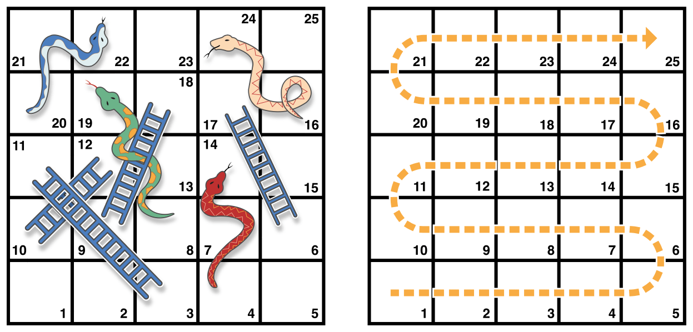

# Sesión 2: <br/> Swift <br/> avanzado

### Servicios de las plataformas móviles - iOS

<small>Domingo Gallardo - domingo.gallardo@ua.es  
Departamento Ciencia de la Computación e Inteligencia Artificial  
Master Programación de Dispositivos Móviles</small>

<!-- Tres líneas en blanco para la siguiente transparencia -->


#### Protocolos

- El concepto de protocolo en Swift es similar al de Objective-C o al concepto de _interface_ en Java.
- Un _protocolo_ proporciona una plantilla de métodos, propiedades y otros requisitos que definen una tarea o funcionalidad particular.
- Un protocolo no proporciona ninguna implementación, sino que debe ser _adoptada_ por una clase, un _struct_ o una enumeración.
- Un protocolo proporciona también un _tipo_ y se puede usar en muchos sitios donde se permiten usar tipos:
    - Como el tipo de un parámetro o de un valor devuelto por una función, un método o un inicializador.
    - Como el tipo de una constante, variable o propiedad.
    - Como el tipo de los ítems de un array, diccionario, o otros contenedores.

<!-- Tres líneas en blanco para la siguiente transparencia -->


#### Declaración de un protocolo

- Usamos `protocol` para declarar un protocolo.

```swift
protocol ProtocoloEjemplo {
    var descripcionSencilla: String { get }
    mutating func ajustar()
}
```

- Clases, enumeraciones y estructuras pueden todas adoptar protocolos.

<!-- Tres líneas en blanco para la siguiente transparencia -->


#### Clases que adopta un protocolo

- Para indicar que una clase, struct o enumeración adopta un protocolo escribimos el nombre del protocolo tras el nombre del tipo, separado por una coma. Se pueden listar múltiples protocolos, todos separadas por comas.

```swift
class ClaseSencilla: ProtocoloEjemplo {
    var descripcionSencilla: String = "Una clase muy simple."
    var otraPropiedad: Int = 69105
    func ajustar() {
        descripcionSencilla += "  Ahora 100% ajustada."
    }
}
var a = ClaseSencilla()
a.ajustar()
let descripcionA = a.descripcionSencilla
```

- Si una clase tiene una superclase, hay que escribir el nombre de la superclase antes de cualquiera de los protocolos que se adoptan.

```swift
class AlgunaClase: AlgunaSuperclase, PrimerProtocolo, OtroProtocolo {
    // definición de la clase
}
```

<!-- Tres líneas en blanco para la siguiente transparencia -->


#### Estructura que adopta un protocolo

```swift
struct EstructuraSencilla: ProtocoloEjemplo {
    var descripcionSencilla: String = "Una estructura sencilla"
    mutating func ajustar() {
        descripcionSencilla += " (ajustada)"
    }
}
var b = EstructuraSencilla()
b.ajustar()
let descripcionB = b.descripcionSencilla
```

> Escribe una enumeración que cumpla el protocolo.

- Hacer notar el uso de la palabra clave `mutating` en la declaración de `SimpleStructure` para marcar el método que modifica la estructura. 
- La declaración de `ClaseSencilla` no necesita que se marquen como mutadores ninguno de sus métodos porque los métodos en una clase siempre pueden modificar la clase.

<!-- Tres líneas en blanco para la siguiente transparencia -->


#### Extensiones

- Una `extension` sirve para añadir funcionalidad a un tipo existente, como métodos nuevos y propiedades calculadas. Similares a _categorías_ en Objective-C.
- Se puede utilizar una extensión para añadir un cumplimiento de un protocolo a un tipo que se declara en otro lugar, o incluso a un tipo que hayas importado de una biblioteca o un *framework*. 

```swift
extension Int: ProtocoloEjemplo {
    var descripcionSencilla: String {
        return "El número \(self)"
    }
    mutating func ajustar() {
        self += 42
    }
}
print(7.descripcionSencilla)
```

<!-- Tres líneas en blanco para la siguiente transparencia -->


#### Tipos protocolo

- Se puede usar un nombre de un protocolo de la misma forma que cualquier otro tipo con nombre; por ejemplo, para crear una colección de objetos que tienen tipos diferentes pero que cumplen un único protocolo. 
- Cuando se trabaja con valores cuyo tipo es un tipo de protocolo, no están disponibles los métodos fuera del protocolo.

```swift
let valorProtocolo: ProtocoloEjemplo = a
print(valorProtocolo.descripcionSencilla)
// print(valorProtocolo.otraPropiedad)  
// Descomentar para comprobar el error
```

- Incluso aunque la variable `valorProtocolo` tenga un tipo en tiempo de ejecución de `ClaseSencilla`, el compilador lo trata como uno del tipo `ProtocoloEjemplo`. De esta forma no es posible acceder accidentalmente a métodos o propiedades que implemente la clase de forma adicional al cumplimiento del protocolo.

<!-- Tres líneas en blanco para la siguiente transparencia -->


#### Manejo de errores

- Se representa un error  usando cualquier tipo que adopte el protocolo `ErrorType`.

```swift
enum ErrorImpresora: ErrorType {
    case SinPapel
    case SinToner
    case Ardiendo
}
```

- Usamos `throw` para arrojar un error y `throws` para marcar una función que puede arrojar un error. 
- Si arrojamos un error en una función, la función termina inmediatamente y el código que llamó a la función maneja el error:

```swift
func enviaAImpresora(nombreImpresora: String) throws -> String {
    if nombreImpresora == "Nunca Tiene Toner" {
        throw ErrorImpresora.SinToner
    }
    return "Trabajo enviado"
}
```


<!-- Tres líneas en blanco para la siguiente transparencia -->


#### Manejo de errores

- Hay varias formas de manejar errores. 
- Una forma es usar `do-catch`. Dentro del bloque `do`, marcamos el código que pueda lanzar un error escribiendo `try` frente a él. Dentro del bloque `catch` se le da al error el nombre `error` a menos que le demos un nombre diferente.

```swift
do {
    let respuestaImpresora = try enviaAImpresora("Bi Sheng")
    print(respuestaImpresora)
} catch {
    print(error)
}
```

> Cambia el nombre de la impresora a `"Nunca Tiene Toner", de forma que la función `enviaAImpresora(_:)` lance un error.

<!-- Tres líneas en blanco para la siguiente transparencia -->


#### Múltiples bloques `catch`

- Podemos proporcionar múltiples bloques `catch` que manejen errores específicos. 
- Se debe escribir un patrón después de `catch` de la misma forma que haces después de un `case` en un switch.

```swift
do {
    let respuestaImpresora = try enviaAImpresora("Gutenberg")
    print(respuestaImpresora)
} catch ErrorImpresora.Ardiendo {
    print("Pondré esto aquí, junto con el resto del fuego.")
} catch let errorImpresora as ErrorImpresora {
    print("Error impresora: \(errorImpresora).")
} catch {
    print(error)
}
```

> Añade código para lanzar un error dentro del bloque `do`. ¿Qué tipo de error debes lanzar para que el error se gestione en el primer bloque `catch`? ¿Y en el segundo y tercer bloque?

<!-- Tres líneas en blanco para la siguiente transparencia -->


#### Uso de `try?`

- Otra forma de manejar errores es usar `try?` para convertir el resultado en un opcional. 
- Si la función lanza un error, el error específico se descarta y el resultado es `nil`. En otro caso, el resultado es un opcional que contiene el valor que la función ha devuelto.

```swift
let exitoImpresora = try? enviaAImpresora("Mergenthaler")
let falloImpresora = try? enviaAImpresora("Nunca Tiene Toner")
```

<!-- Tres líneas en blanco para la siguiente transparencia -->


#### Uso de `defer`

- Usamos `defer` para escribir un bloque código que siempre se ejecute antes de que la función termine, independientemente de si se lanza un error. 
- Podemos usar `defer` incluso cuando no existe manejo de errores, para simplificar funciones que terminan en muchos sitios distintos.

```swift
var calentadorDeTe = false
func rutinaMatutina() throws {
    calentadorDeTe = true
    defer {
        calentadorDeTe = false
    }
    
    let diario = try enviaAImpresora("Lanston")
    print(diario)
    // Bebe el te y lee el diario
}
```

<!-- Tres líneas en blanco para la siguiente transparencia -->


#### Genéricos

- Escribimos un nombre dentro de paréntesis angulares para construir una función o un tipo genérico. 

```swift
func itemRepetido<Item>(item: Item, numeroDeVeces: Int) -> [Item] {
    var resultado = [Item]()
    for _ in 0..<numeroDeVeces {
        resultado.append(item)
    }
    return resultado
}
itemRepetido("knock", numeroDeVeces:4)
```

<!-- Tres líneas en blanco para la siguiente transparencia -->


#### Cualquier cosa puede ser genérica

- Podemos hacer formas genéricas de funciones y métodos, así como de clases, enumeraciones y estructuras.

```swift
// Reimplementamos el tipo Optional de la biblioteca estándar de Swift
enum ValorOpcional<Envuelto> {
    case Ninguno
    case Alguno(Envuelto)
}
var posibleInteger: ValorOpcional<Int> = .Ninguno
posibleInteger = .Alguno(100)
```

<!-- Tres líneas en blanco para la siguiente transparencia -->


#### Uso de `where`

- Usamos `where` después del nombre para especificar una lista de requisitos; por ejemplo, para requerir que el tipo implemente un protocolo, para requerir que dos tipos sean el mismo, o para requerir que una clase sea de una superclase particular.

```swift
func tienenElementosComunes <T: SequenceType, U: SequenceType where 
      T.Generator.Element: Equatable, 
      T.Generator.Element == U.Generator.Element> 
      (lhs: T, _ rhs: U) -> Bool {
    for lhsItem in lhs {
        for rhsItem in rhs {
            if lhsItem == rhsItem {
                return true
            }
        }
    }
    return false
}
tienenElementosComunes([1, 2, 3], [3])
```

- Escribir `<T: Equatable>` es lo mismo que escribir `<T where T: Equatable>`.

<!-- Tres líneas en blanco para la siguiente transparencia -->


#### El patrón _delegación_ 

- *Delegación* es un patrón de diseño que permite a una clase o estructura pasar (o delegar) alguna de sus responsabilidades a una instancia de otro tipo.
- Una forma de implementarlo es definiendo un protocolo que encapsula las responsabilidades delegadas y definiendo en la clase un método que actualiza el delegado con una instancia proporcionada por el programador que usa la clase.
- Permite extender funcionalidades de un _framework_ con código proporcionado por nosotros, los programadores que usamos el _framework_.
- Cocoa define propiedades y protocolos _delegados_ en muchas clases. Por ejemplo, [`UIScrollViewDelegate`](https://developer.apple.com/library/ios/documentation/UIKit/Reference/UIScrollViewDelegate_Protocol/) es el protocolo que debe cumplir el objeto delegado del [`UIScrollView`](https://developer.apple.com/library/ios/documentation/UIKit/Reference/UIScrollView_Class/index.html#//apple_ref/occ/instp/UIScrollView/delegate) y que nos permite definir ciertos comportamientos cuando el usuario realiza un scroll.
- Veremos que para gestionar las notificaciones se utiliza el objeto delegado [`UIApplicationDelegate`](https://developer.apple.com/library/ios/documentation/UIKit/Reference/UIApplicationDelegate_Protocol/#//apple_ref/occ/intfm/UIApplicationDelegate/application:willFinishLaunchingWithOptions:) de la clase [`UIApplication`](https://developer.apple.com/library/ios/documentation/UIKit/Reference/UIApplication_Class/index.html#//apple_ref/swift/cl/UIApplication).


<!-- Tres líneas en blanco para la siguiente transparencia -->


#### Cómo usar la delegación

1. Debemos crear una clase que adopte el protocolo delegado (por ejemplo `UIApplicationDelegate`). La clase puede ser de cualquier tipo y tener las propiedades y métodos añadidos que nos interesen.
2. Implementamos los métodos del delegado que nos interesen. Esos métodos representan eventos particulares detectados por la clase delegadora (por ejemplo `UIApplication`) en los que va a llamar a nuestro código. En todos esos métodos aparece como parámetro la clase delegadora y otros parámetros adicionales con información del evento. Usaremos estos parámetros en nuestro código para poder acceder a la clase delegadora o a la información del evento.
3. Hay que actualizar en algún momento la propiedad correspondiente de la clase delegadora (en este caso `UIApplication`). La propiedad suele llamarse `delegate`.
4. Cuando en tiempo de ejecución suceda el evento detectado por la clase delegadora se llamará a nuestro código.

<!-- Tres líneas en blanco para la siguiente transparencia -->


#### Un ejemplo de delegación

- Veamos una implementación del juego _Snake and ladders_ en el que se usa delegación para poder ampliar el comportamiento del juego cuando suceden determinados eventos.



<!-- Tres líneas en blanco para la siguiente transparencia -->


#### Protocolo `RandomNumberGenerator`

- Definimos un protocolo `RandomNumberGenerator` y una clase que lo implementa

```swift
protocol RandomNumberGenerator {
    func random() -> Double
}

class LinearCongruentialGenerator: RandomNumberGenerator {
    var lastRandom = 42.0
    let m = 139968.0
    let a = 3877.0
    let c = 29573.0
    func random() -> Double {
        lastRandom = ((lastRandom * a + c) % m)
        return lastRandom / m
    }
}
```

<!-- Tres líneas en blanco para la siguiente transparencia -->


#### Clase `Dice` 

- Veamos un ejemplo sencillo en el que se define un clase `Dice` que representa un dado de _n_ caras que puede usarse en un juego de mesa.

```swift
class Dice {
    let sides: Int
    let generator: RandomNumberGenerator
    init(sides: Int, generator: RandomNumberGenerator) {
        self.sides = sides
        self.generator = generator
    }
    func roll() -> Int {
        return Int(generator.random() * Double(sides)) + 1
    }
}
```

- La propiedad `generator` es del tipo `RandomNumberGenerator` y se inicializa en el constructor, pasándole una instancia de una clase que haya adoptado el protocolo.

```
var d6 = Dice(sides: 6, generator: LinearCongruentialGenerator())
for _ in 1...5 { print("Random dice roll is \(d6.roll())") }
```

<!-- Tres líneas en blanco para la siguiente transparencia -->


#### El estado del juego: tablero y variables

```swift
class SnakesAndLadders {
    let finalSquare = 25
    let dice = Dice(sides: 6, generator: LinearCongruentialGenerator())
    var square = 0
    var board: [Int]
    
    init() {
        board = [Int](count: finalSquare + 1, repeatedValue: 0)
        board[03] = +08; board[06] = +11; board[09] = +09; board[10] = +02
        board[14] = -10; board[19] = -11; board[22] = -02; board[24] = -08
    }
    ...
}
```

<!-- Tres líneas en blanco para la siguiente transparencia -->


#### El juego sin delegación

```swift
    func play() {
        square = 0
        gameLoop: while square != finalSquare {
            let diceRoll = dice.roll()
            switch square + diceRoll {
            case finalSquare:
                break gameLoop
            case let newSquare where newSquare > finalSquare:
                continue gameLoop
            default:
                square += diceRoll
                square += board[square]
            }
        }
    }
```

---

Se tira el dado al comienzo de cada bucle. En lugar de mover al jugador inmediatamente, se usa una sentencia switch en la que se considera el resultado del movimiento y se comprueba si es válido: 

- Si el dado mueve al jugador al cuadrado final, el juego termina. La sentencia `break` transfiere el control a la primera línea de código del bucle y finaliza el juego.
- Si el dado mueve al jugador más allá del cuadrado final, el movimiento es inválido, y el jugador necesita tirar de nuevo. La sentencia `continue` finaliza la iteración actual y comienza la siguiente iteración.
- En todos los demás casos el movimiento es válido. El jugador se mueve hacia adelante tantos cuadrados como la tirada del dado y la lógica del juego comprueba si hay alguna serpiente o escalera. El bucle termina y el control vuelve a la condición del `while` para decidir si se requiere otro turno.

<!-- Tres líneas en blanco para la siguiente transparencia -->


#### Definimos el protocolo del juego y su delegado

- Definimos dos protocolos, uno para definir un juego de dados genérico y otro para definir su delegado.

```swift
protocol DiceGame {
    var dice: Dice { get }
    func play()
}

protocol DiceGameDisplayDelegate {
    func gameDidStart(game: DiceGame)
    func game(game: DiceGame, didStartNewTurnWithDiceRoll diceRoll: Int)
    func gameDidEnd(game: DiceGame)
}
```

- En todos los métodos del protocolo delegado se nos va a pasar como parámetro el propio juego. Los métodos `gameDidStart` y `gameDidEnd` se llamarán al comienzo y al final del juego. El método `game` se llama en cada tirada y nos van a pasar como parámetro adicional el valor obtenido en el dado.


<!-- Tres líneas en blanco para la siguiente transparencia -->


#### Juego completo

```swift
class SnakesAndLadders: DiceGame {
    let finalSquare = 25
    let dice = Dice(sides: 6, generator: LinearCongruentialGenerator())
    var square = 0
    var board: [Int]
    var displayDelegate: DiceGameDisplayDelegate?

    init() {
        // Inicializamos el tablero, mismo código que antes
    }
    func play() {
        // bucle del juego completo
    }
}
```

<!-- Tres líneas en blanco para la siguiente transparencia -->


#### El bucle de juego con delegación


```swift
func play() {
    square = 0
    displayDelegate?.gameDidStart(self)
    gameLoop: while square != finalSquare {
        let diceRoll = dice.roll()
        displayDelegate?.game(self, didStartNewTurnWithDiceRoll: diceRoll)
        switch square + diceRoll {
        case finalSquare:
            break gameLoop
        case let newSquare where newSquare > finalSquare:
            continue gameLoop
        default:
            square += diceRoll
            square += board[square]
        }
    }
    displayDelegate?.gameDidEnd(self)
}
```


<!-- Tres líneas en blanco para la siguiente transparencia -->


#### La clase que adopta el delegado

```swift
class DiceGameDisplayer: DiceGameDisplayDelegate {
    var numberOfTurns = 0
    
    func gameDidStart(game: DiceGame) {
        numberOfTurns = 0
        if game is SnakesAndLadders {
            print("Comienza un juego nuevo de Serpientes y Escaleras")
        }
        // Falta código que tienes que completar
    }
    
    // Falta código que tienes que completar

    func gameDidEnd(game: DiceGame) {
        print("El juego ha durado \(numberOfTurns) movimientos")
    }
}
```

<!-- Tres líneas en blanco para la siguiente transparencia -->


#### El juego en acción

```swift
let displayer = DiceGameDisplayer()
let game = SnakesAndLadders()
game.displayDelegate = displayer
print("Comienza el juego")
game.play()
print("Final del juego")
//Comienza el juego
//Comienza un juego nuevo de Serpientes y Escaleras
//El juego está usando un dado de 6 caras
//Estás en la casilla 0 y sacas la tirada 3
//Estás en la casilla 11 y sacas la tirada 5
//Estás en la casilla 16 y sacas la tirada 4
//Estás en la casilla 20 y sacas la tirada 5
//El juego ha durado 4 movimientos
//Final del juego
```


<!-- Tres líneas en blanco para la siguiente transparencia -->


#### Práctica

<!-- .slide: data-background="#cbe0fc"-->

- Crea un _playground_ llamado _SerpientesEscaleras_
- Copia el código y corrígelo para que funcione
- _Assistant Editor > Show Assistant Editor_ para ver la salida
- Para probar distintas ejecuciones del juego puedes cambiar el valor inicial de `lastRandom` = 40.0, 41.0, 42.0, ...
- No olvides subirlo a tu cuenta de Bitbucket y confirmar la entrega en Moodle

<!-- Tres líneas en blanco para la siguiente transparencia -->


# Master Programación <br/> de Dispositivos Móviles


