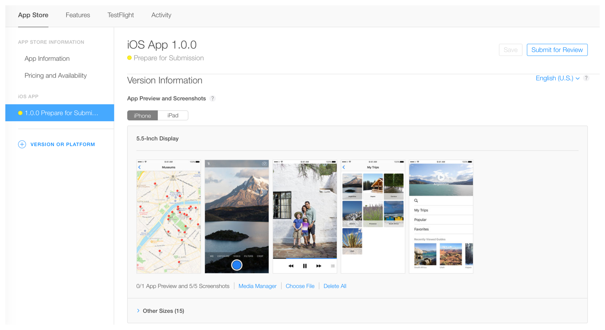
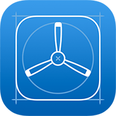
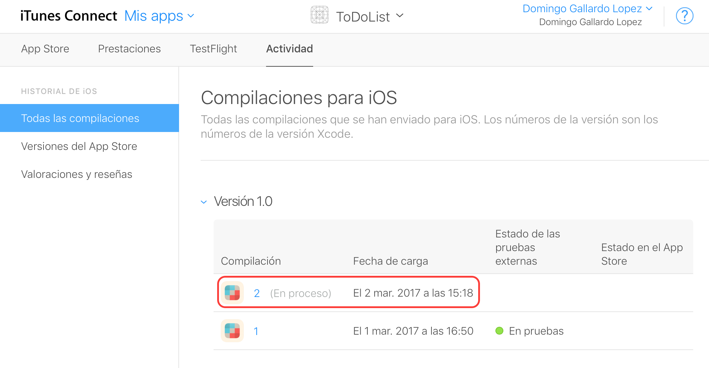

# Sesión 2:   Prueba y distribución de apps

#### Servicios de las plataformas móviles - iOS

<small>Domingo Gallardo - domingo.gallardo@ua.es  
Departamento Ciencia de la Computación e Inteligencia Artificial  
Master Programación de Dispositivos Móviles   
2016-17</small>

<!-- Tres líneas en blanco para la siguiente transparencia -->

## Distribución de apps

<!-- Tres líneas en blanco para la siguiente transparencia -->

## Recursos

- [App Distribution Guide](https://developer.apple.com/library/ios/documentation/IDEs/Conceptual/AppDistributionGuide/Introduction/Introduction.html#//apple_ref/doc/uid/TP40012582)
- [iTunes Connect Guide](https://developer.apple.com/library/content/documentation/LanguagesUtilities/Conceptual/iTunesConnect_Guide/Chapters/About.html#//apple_ref/doc/uid/TP40011225-CH1-SW1)
  
<!-- Tres líneas en blanco para la siguiente transparencia -->

## iTunes Connect

<!-- .slide: class="image-right"-->

- iTunes Connect es el servicio de Apple con el que los
  desarrolladores pueden organizar:
    - Todos sus productos (apps, eBooks, podcasts, etc.), para poder
      enviar a prueba versiones beta y subirlos al App Store.
    - Toda la información legal y de impuestos.
    - Información sobre el estado de los productos, retroalimentación
      e información de descargas, ventas y ganancias.
- Accesible desde el _member center_ en los programas de pago. No
  disponible en el programa de universidad.
- Accesible también en la URL [https://itunesconnect.apple.com](https://itunesconnect.apple.com).

<!-- Tres líneas en blanco para la siguiente transparencia -->

## Pasos para subir una app al App Store

1. Crear un registro en iTunes Connect, un identificador único para el
   app.
2. Subir una compilación de la app.
3. Pruebas Beta: probar la app con usuarios de la organización o
   usuarios invitados, usando Test Flight.
4. Completar toda la información y enviar la app a revisión de la App Store.
5. Una vez que ha superado la revisión, la app se pone a la venta en
   la App Store.
6. Analizar analíticas de la app (de ventas, de uso, etc.) y
   desarrollar una nueva versión.

<!-- Tres líneas en blanco para la siguiente transparencia -->

## Registro en iTunes Connect

<!-- Tres líneas en blanco para la siguiente transparencia -->

## Diseño de la página en el App Store

- iTunes Connect se usa también para gestionar todos los elementos
  necesarios para crear la página de la app en el App Store: nombre
  de la App, iconos, previsualizaciones (pantallas y vídeos),
  descripción, novedades, palabras claves y categorías.

<!-- Tres líneas en blanco para la siguiente transparencia -->

## Gestión en iTunes Connect

<!-- Tres líneas en blanco para la siguiente transparencia -->

## Subir una compilación de la app

- La forma más sencilla de subir una app a iTunes Connect es
  utilizando Xcode.
- Debes crear un archivo ipa con la opción Product > Archive y
  seleccionar la opción _Upload to App Store_.

<!-- Tres líneas en blanco para la siguiente transparencia -->

## Nuevos usuarios iTunes Connect

- Es posible **añadir usuarios** a la cuenta de iTunes Connect. Son
  usuarios que van a poder trabajar con las apps subidas, realizando
  funciones limitadas por su función.
- No es necesario tener una cuenta de organización para poder añadir
  usuarios colaboradores en iTunes Connect. Es posible en cuentas de
  desarrollador individual.
- Los usuarios añadidos podrán ser **probadores internos** en TestFlight.

<!-- Tres líneas en blanco para la siguiente transparencia -->

## Funciones usuarios iTunes Connect

- Los usuarios pueden tener distintos funciones. En la figura, por
  ejemplo, aparece un rol de desarrollador.

<!-- Tres líneas en blanco para la siguiente transparencia -->

## TestFlight

- TestFlight es una plataforma integrada en iTunes Connect que permite
  distribuir versiones beta de apps a probadores.
- Es posible distribuir la app hasta 25 probadores internos
  (seleccionados de entre los usuarios de la cuenta de iTunes Connect)
  y hasta 200 probadores externos.
- Los usuarios de prueba deben descargarse la **app TestFlight** con la
  que gestionarán la descarga de las pruebas en sus dispositivos.
- [Más información](https://developer.apple.com/testflight/).

<!-- Tres líneas en blanco para la siguiente transparencia -->

## Aprobación de pruebas externas
<!-- .slide: class="image-right"-->

- Una vez subida a iTunes Connect la app entra automáticamente en un
  proceso de aprobación para que se pueda distribuir **externamente** una
  versión beta en TestFlight.
- La aprobación suele tardar menos de 1 día la primera
  compilación y ser casi instantánea cada nueva compilación que se sube.
- No es necesaria aprobación para la distribución de pruebas internas.

<!-- Tres líneas en blanco para la siguiente transparencia -->

## Compilaciones listas para probar

- Los números de versión y de compilación (_build_) son los definidos
  en Xcode.

<!-- Tres líneas en blanco para la siguiente transparencia -->

## Lanzamiento de una prueba interna (1)

<!-- Tres líneas en blanco para la siguiente transparencia -->

## Lanzamiento de una prueba interna (2)

<!-- Tres líneas en blanco para la siguiente transparencia -->

## Pruebas de los usuarios 
<!-- .slide: class="image-right"-->

- Los usuarios de prueba deben reciben un correo avisándoles de que la
  beta está disponible.
- Deben instalar la app TestFlight
- No es necesario que el dispositivo esté en la lista incluida en el
  perfil de aprovisionamiento, porque la app está autorizada por Apple
  para su ejecución en cualquier dispositivo.

<!-- Tres líneas en blanco para la siguiente transparencia -->

## Prueba en TestFlight en el dispositivo

<!-- Tres líneas en blanco para la siguiente transparencia -->

## Nuevas compilaciones

- Si subimos desde Xcode una nueva compilación, se envía una
  notificación automáticamente a los probadores.

<!-- Tres líneas en blanco para la siguiente transparencia -->

##  Distribución de betas sin TestFlight

<!-- Tres líneas en blanco para la siguiente transparencia -->

## Falta

- Herramientas de terceros: Fabric
- Distribución de apps in House

<!-- Tres líneas en blanco para la siguiente transparencia -->

# Master Programación   de Dispositivos Móviles

