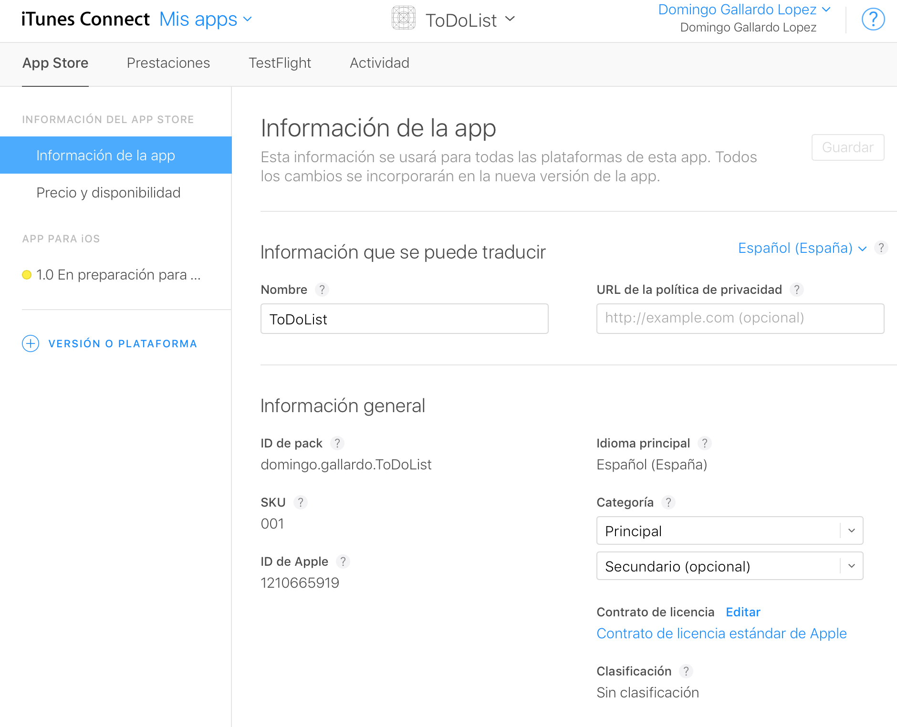
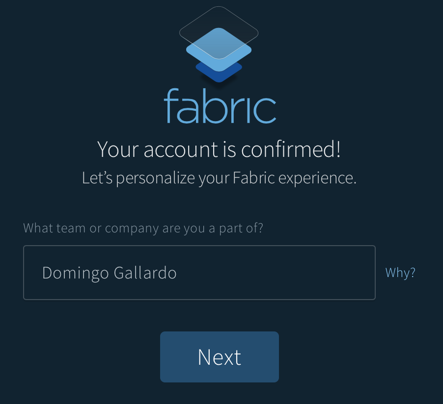
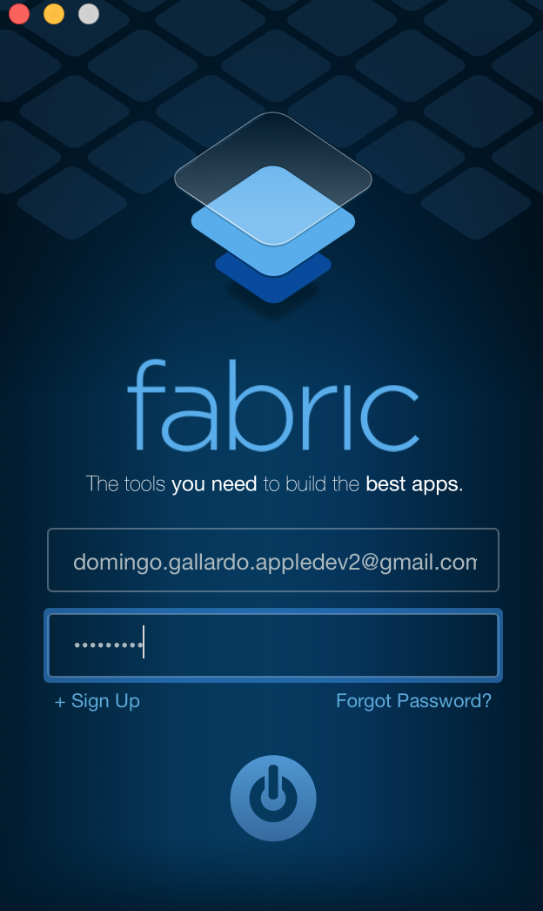
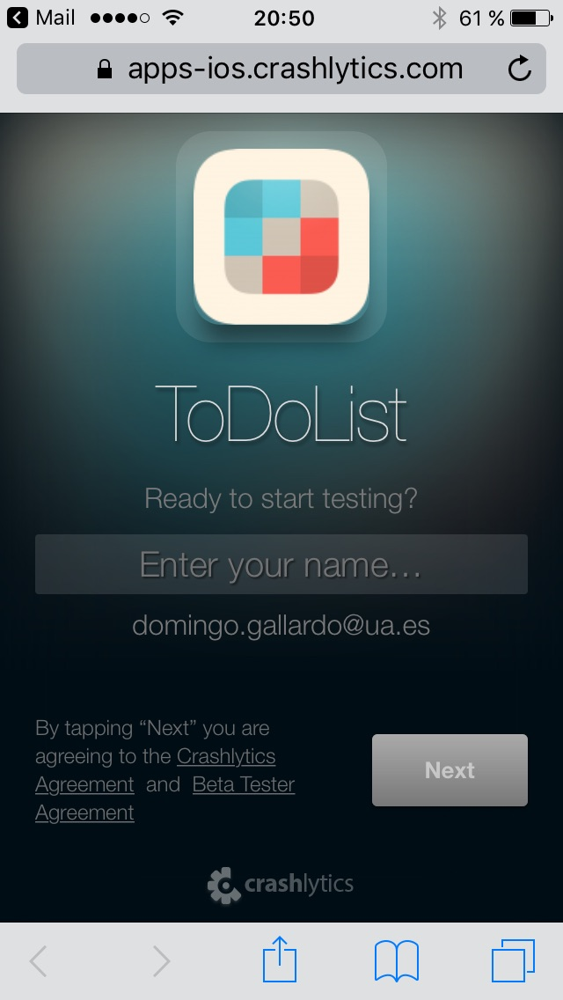
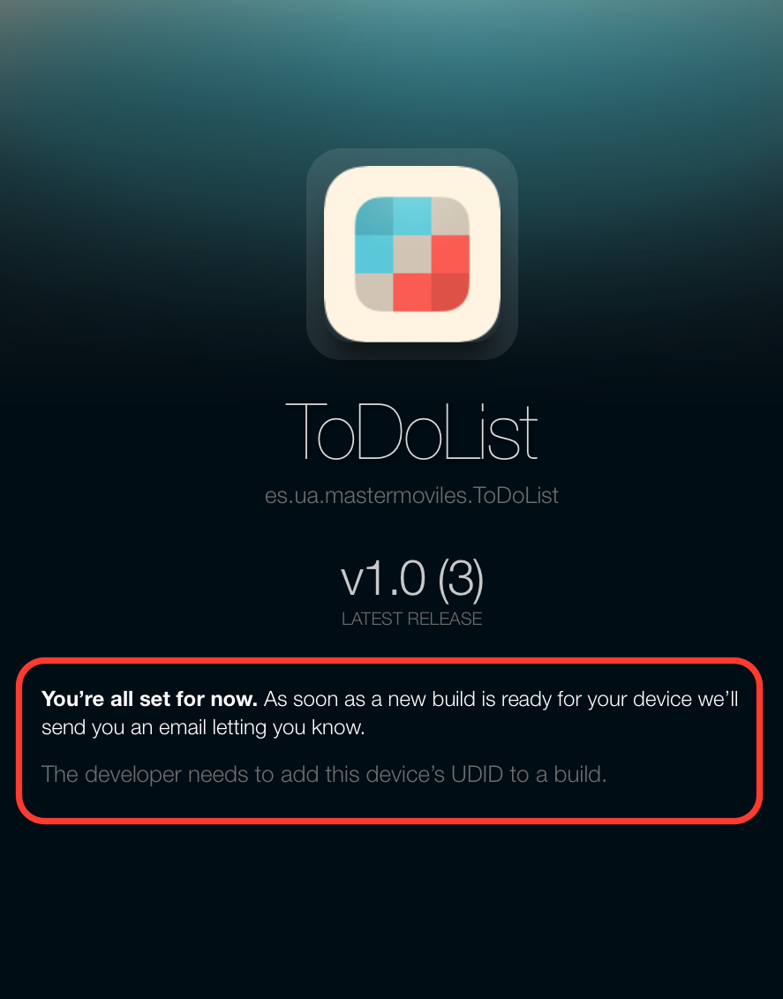

# Sesión 2: <br/> Prueba y distribución de apps

#### Servicios de las plataformas móviles - iOS

<small>Domingo Gallardo - domingo.gallardo@ua.es  
Departamento Ciencia de la Computación e Inteligencia Artificial  
Master Programación de Dispositivos Móviles   
2016-17</small>

<!-- Tres líneas en blanco para la siguiente transparencia -->


## Distribución de apps


<!-- Tres líneas en blanco para la siguiente transparencia -->


## iTunes Connect

<!-- .slide: class="image-right"-->


- iTunes Connect es el servicio de Apple con el que los
  desarrolladores pueden organizar:
    - Todos sus productos (apps, eBooks, podcasts, etc.), para poder
      enviar a prueba versiones beta y subirlos al App Store.
    - Toda la información legal y de impuestos.
    - Información sobre el estado de los productos, retroalimentación
      e información de descargas, ventas y ganancias.
- Accesible desde el _member center_ en los programas de pago. No
  disponible en el programa de universidad.
- Accesible también en la URL [https://itunesconnect.apple.com](https://itunesconnect.apple.com).

<!-- Tres líneas en blanco para la siguiente transparencia -->


## Pasos para subir una app al App Store

1. Crear un registro en iTunes Connect, un identificador único para el
   app.
2. Subir una compilación de la app.
3. Pruebas Beta: probar la app con usuarios de la organización o
   usuarios invitados, usando Test Flight.
4. Completar toda la información y enviar la app a revisión de la App Store.
5. Una vez que ha superado la revisión, la app se pone a la venta en
   la App Store.
6. Analizar analíticas de la app (de ventas, de uso, etc.) y
   desarrollar una nueva versión.

<!-- Tres líneas en blanco para la siguiente transparencia -->


## Registro en iTunes Connect



<!-- Tres líneas en blanco para la siguiente transparencia -->


## Diseño de la página en el App Store


- iTunes Connect se usa también para gestionar todos los elementos
  necesarios para crear la página de la app en el App Store: nombre
  de la App, iconos, previsualizaciones (pantallas y vídeos),
  descripción, novedades, palabras claves y categorías.

<!-- Tres líneas en blanco para la siguiente transparencia -->


## Gestión en iTunes Connect


<!-- Tres líneas en blanco para la siguiente transparencia -->


## Subir una compilación de la app


- La forma más sencilla de subir una app a iTunes Connect es
  utilizando Xcode.
- Debes crear un archivo ipa con la opción **_Product > Archive_** y
  seleccionar la opción _Upload to App Store_.

<!-- Tres líneas en blanco para la siguiente transparencia -->


## Nuevos usuarios iTunes Connect


- Es posible **añadir usuarios** a la cuenta de iTunes Connect. Son
  usuarios que van a poder trabajar con las apps subidas, realizando
  funciones limitadas por su función.
- No es necesario tener una cuenta de organización para poder añadir
  usuarios colaboradores en iTunes Connect. Es posible en cuentas de
  desarrollador individual.
- Los usuarios añadidos podrán ser **probadores internos** en TestFlight.

<!-- Tres líneas en blanco para la siguiente transparencia -->


## Funciones usuarios iTunes Connect


- Los usuarios pueden tener distintos funciones. En la figura, por
  ejemplo, aparece un rol de desarrollador.


<!-- Tres líneas en blanco para la siguiente transparencia -->


## TestFlight


- TestFlight es una plataforma integrada en iTunes Connect que permite
  distribuir versiones beta de apps a probadores.
- Es posible distribuir la app hasta 25 probadores internos
  (seleccionados de entre los usuarios de la cuenta de iTunes Connect)
  y hasta 200 probadores externos.
- Los usuarios de prueba deben descargarse la **app TestFlight** con la
  que gestionarán la descarga de las pruebas en sus dispositivos.
- [Más información](https://developer.apple.com/testflight/).

<!-- Tres líneas en blanco para la siguiente transparencia -->


## Aprobación de pruebas externas
<!-- .slide: class="image-right"-->


- Una vez subida a iTunes Connect la app entra automáticamente en un
  proceso de aprobación para que se pueda distribuir **externamente** una
  versión beta en TestFlight.
- La aprobación suele tardar menos de 1 día la primera
  compilación y ser casi instantánea cada nueva compilación que se sube.
- No es necesaria aprobación para la distribución de pruebas internas.


<!-- Tres líneas en blanco para la siguiente transparencia -->


## Compilaciones listas para probar


- Los números de versión y de compilación (_build_) son los definidos
  en Xcode.

<!-- Tres líneas en blanco para la siguiente transparencia -->


## Lanzamiento de una prueba interna (1)


<!-- Tres líneas en blanco para la siguiente transparencia -->


## Lanzamiento de una prueba interna (2)


<!-- Tres líneas en blanco para la siguiente transparencia -->


## Pruebas de los usuarios 
<!-- .slide: class="image-right"-->


- Los usuarios de prueba deben reciben un correo avisándoles de que la
  beta está disponible.
- Deben instalar la app TestFlight
- No es necesario que el dispositivo esté en la lista incluida en el
  perfil de aprovisionamiento, porque la app está autorizada por Apple
  para su ejecución en cualquier dispositivo.

<!-- Tres líneas en blanco para la siguiente transparencia -->


## Prueba en TestFlight en el dispositivo


<!-- Tres líneas en blanco para la siguiente transparencia -->


## Nuevas compilaciones


- Si subimos desde Xcode una nueva compilación, se envía una
  notificación automáticamente a los probadores.

<!-- Tres líneas en blanco para la siguiente transparencia -->


##  Distribución de betas sin TestFlight

- Es posible distribuir betas sin utilizar TestFlight usando AdHoc o
  Development Deployment.
- El UUID del dispositivo debe estar en el perfil de aprovisionamiento
  con el que firmamos la app.
- Es necesario instalar la app con iTunes
- Existen programas de terceros que permiten facilitar la
  distribución. 
- Vamos a ver **Fabric**, una plataforma y API que permite una gran
  cantidad de funcionalidades: distribución, recopilación de datos de
  crashes, recopilación de estadísticas de uso, etc.
- Se trata de una plataforma creada por Twitter y recién comprada por
  Google. Se puede acceder desde [esta URL](https://get.fabric.io).


<!-- Tres líneas en blanco para la siguiente transparencia -->


## Alta y descarga de Fabric
<!-- .slide: data-background="#cbe0fc"-->





- [Regístrate](https://fabric.io/kits?show_signup=true) en Fabric y
  descarga e instala la aplicación para Mac, moviéndola a la carpeta
  de Aplicaciones.
- Lanza la aplicación y regístrate en ella con la misma cuenta y
  contraseña que en la web.

<!-- Tres líneas en blanco para la siguiente transparencia -->


## Distribución de nuestra app con Fabric (1)
<!-- .slide: data-background="#cbe0fc"-->
<!-- .slide: class="image-right"-->


- Para la instalación de Fabric es necesario importar unas librerías
  en nuestra app y añadir un **Run Script Build Phase**.
- La aplicación Fabric te guía paso a paso:
    - Debes seleccionar el proyecto XCode
    - Elige el Kit a instalar. Vamos a elegir **Crashlytics** que nos
      permite, además de distribuir la app beta, obtener información
      de los crashes de nuestra app en los dispositivos de prueba.
    - Sigue las indicaciones que aparece en la aplicación Fabric.

<!-- Tres líneas en blanco para la siguiente transparencia -->


## Distribución de nuestra app con Fabric (2)
<!-- .slide: data-background="#cbe0fc"-->

 
 

- Selecciona en Xcode **Build Phases** y en el símbolo **+**
  selecciona **New Run Script Build Phase**.
- En la opción **Run Script** pega el código que aparece en la
  aplicación.

<!-- Tres líneas en blanco para la siguiente transparencia -->


## Distribución de nuestra app con Fabric (3)
<!-- .slide: data-background="#cbe0fc"-->

 
 

- Instala el SDK Kit en el proyecto, arrastrando desde la
  aplicación al proyecto.

<!-- Tres líneas en blanco para la siguiente transparencia -->


## Distribución de nuestra app con Fabric (4)
<!-- .slide: data-background="#cbe0fc"-->

 


- Copia el código que aparece en Fabric en el fichero **AppDelegate.swift**.
- Modifica el código de la app ToDoList para que en cada ítem añadido
aparezca tu nombre. 
- Asegúrate que la ToDoList está firmada con el perfil de
  aprovisionamiento del equipo de la Universidad y ejecuta la app
  ToDoList en el simulador para que Fabric compruebe que todo está
  funcionando correctamente.

<!-- Tres líneas en blanco para la siguiente transparencia -->


## Distribución de nuestra app con Fabric (4)
<!-- .slide: data-background="#cbe0fc"-->

 
 
 
 

- En la aplicación Fabric aparecerá la app ToDoList y podremos activar
  la distribución, añadiendo los correos electrónicos de las personas
  a las que se les enviará.
- Si el UUID del dispositivo del probador está incluido en el perfil
  de aprovisionamiento podrá ejecutar la app sin problemas. Si no,
  Fabric obtendrá el UUID y nos lo proporcionará para que actualicemos
  el perfil de aprovisionamiento.

<!-- Tres líneas en blanco para la siguiente transparencia -->


## Ejecución de la app por el probador (1)
<!-- .slide: data-background="#cbe0fc"-->

 
 
 
 

- El probador recibe un e-mail que le dirige a una página web desde la
  que debe instalar un perfil (que será el que permitirá leer el UUID
  del dispositivo y comprobar si está incluido en el perfil de
  aprovisionamiento instalado en la app que se distribuye).

<!-- Tres líneas en blanco para la siguiente transparencia -->


## Ejecución de la app por el probador (2)
<!-- .slide: data-background="#cbe0fc"-->

 
 

- Si el dispositivo puede ejecutar la app aparecerá un botón para
  instalarla. La forma de instalarla será tan sencilla como pulsar ese
  botón (no hay necesidad de usar iTunes ni Xcode).
- Si el dispositivo no puede ejecutar la app, aparecerá un mensaje
  indicándolo y nos informará del UUID.

<!-- Tres líneas en blanco para la siguiente transparencia -->


## Dashboard de Fabric
<!-- .slide: data-background="#cbe0fc"-->


- En el dashboard podemos acceder a estadísticas de descargas e
  instalaciones, información sobre los crashes de nuestra apps, etc.

<!-- Tres líneas en blanco para la siguiente transparencia -->


## Ejercicio adicional
<!-- .slide: data-background="#cbe0fc"-->


- El plugin de Fabric hace que cada vez que generes un nuevo build de
  la app (con **Product > Archive**) aparezca una notificación preguntando
  si se quiere distribuir a los testers.
- Compila una nueva versión de la app en la que provoques algún error
  que haga que se rompa.
    - Crea un botón en el `NumItemsViewController` y conéctalo con la
      acción:
      
```swift
    @IBAction func crashButtonTapped(_ sender: UIButton) {
        Crashlytics.sharedInstance().crash()
    }
```

- Pruébala en el simulador y provoca el crash. Después vuelve a lanzar
  la app en el simulador para que se suban las estadísticas a Fabric.
- Distribúyela y comprueba la información que aparece del crash.

<!-- Tres líneas en blanco para la siguiente transparencia -->


## Distribución en empresas
<!-- .slide: class="image-right"-->


- Tal y como vimos en la sesión 1, una empresa puede subscribirse por
  $299 al año al programa de desarrollo de empresa.
- El programa permite añadir usuarios con distintos roles
  (desarrolladores, administradores, etc.), tal y como
  hemos visto en _iTunes Connect_, junto herramientas adicionales para
  gestionar el equipo de desarrollo.
- La ventaja fundamental de este programa es que permite la
  **distribución _in-house_ de apps**: las apps se suben al portal interno de la
  empresa (denominado en la nomenclatura empresarial un _Mobile Device
  Management (MDM) system_) y desde ahí pueden descargarse en
  cualquier dispositivo de la empresa.
- Puedes encontrar más información sobre la distribución de apps
  _in-house_ y sobre otros aspectos de apps para empresas en la página
  de Apple
  [_Make your apps enterprise ready_](https://developer.apple.com/enterprise/integrate/). 


<!-- Tres líneas en blanco para la siguiente transparencia -->


## Recursos

- [App Distribution Guide](https://developer.apple.com/library/ios/documentation/IDEs/Conceptual/AppDistributionGuide/Introduction/Introduction.html#//apple_ref/doc/uid/TP40012582)
- [iTunes Connect Guide](https://developer.apple.com/library/content/documentation/LanguagesUtilities/Conceptual/iTunesConnect_Guide/Chapters/About.html#//apple_ref/doc/uid/TP40011225-CH1-SW1)
- [Documentación de Fabric](https://docs.fabric.io/apple/fabric/overview.html)
  

<!-- Tres líneas en blanco para la siguiente transparencia -->


# Master Programación <br/> de Dispositivos Móviles


