# Sesión 3: <br/> Firma y aprovisionamiento <br/> de apps

### Servicios de las plataformas móviles - iOS

<small>Domingo Gallardo - domingo.gallardo@ua.es  
Departamento Ciencia de la Computación e Inteligencia Artificial  
Master Programación de Dispositivos Móviles</small>

<!-- Tres líneas en blanco para la siguiente transparencia -->


## Firma y aprovisionamiento de apps

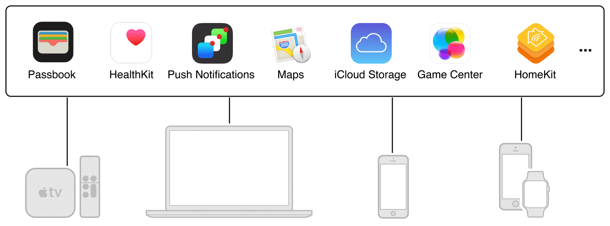

- Para probar una aplicación en el simulador como hemos estado haciendo hasta ahora sólo es necesario escribir el código en Xcode.
- Pero para probar la aplicación en un dispositivo real, para usar ciertos servicios como almacenamiento iCloud, mapas, compras In-App o notificaciones push o para [distribuir la app en el _App Store_](https://developer.apple.com/app-store/) no basta con eso. Hay que **firmar digitalmente** y **aprovisionar** la app.
- Vamos a ir paso a paso, explicando los conceptos según los vayamos necesitando. En esta primera sesión, vamos a explicar cómo firmar digitalmente una app y cómo crear un perfil de aprovisionamiento que nos permita probarla en dispositivos reales. Vamos a usar la app `Calculadora` desarrollada en la sesión anterior.

<!-- Tres líneas en blanco para la siguiente transparencia -->


### Recursos

- [App Distribution Quick Start](https://developer.apple.com/library/ios/documentation/IDEs/Conceptual/AppStoreDistributionTutorial/Introduction/Introduction.html#//apple_ref/doc/uid/TP40013839)
- [App Distribution Guide](https://developer.apple.com/library/ios/documentation/IDEs/Conceptual/AppDistributionGuide/Introduction/Introduction.html#//apple_ref/doc/uid/TP40012582)

<!-- Tres líneas en blanco para la siguiente transparencia -->


### Código firmado 

- Para poder distribuir la app en el _App Store_ y ejecutarla en dispositivos físicos es necesario firmar su código digitalmente.
- La **firma digital del código** (_code signing_) permite al sistema operativo identificar quién ha firmado la app y verificar que no se ha modificado desde el momento de su firma. El código ejecutable está protegido por la firma y ésta se invalida si el código cambia. Los recursos de la app como ficheros nib o imágenes no están firmados.
- En combinación con el **App ID**, el **perfil de aprovisionamiento** (_provisioning profile_) y los **permisos** (_entitlements_) se usa para asegurar que:
    - La app ha sido compilada y firmada por ti o por un miembro de confianza del equipo.
    - Las apps firmadas por ti o por tu equipo se ejecutan sólo en dispositivos de desarrollo escogidos.
    - Las apps se ejecutan únicamente en los dispositivos de prueba que especifiques.
    - Tu app no está usando servicios que no has añadido al app.
    - Sólo tú puedes enviar revisiones del app al _store_.

<!-- Tres líneas en blanco para la siguiente transparencia -->


### Identidad de firma 

<!-- .slide: class="image-right"-->


- Una **identidad de firma** (_signing identity_) consiste en una pareja de clave pública y clave privada que proporciona Apple.
- La clave privada se almacena en el llavero (_keychain_) y se usa para generar la firma. La clave pública se guarda en un certificado que te identifica como el propietario de la clave privada. El certificado se almacena en el llavero y en tu cuenta de desarrollador de Apple.
- Se necesita también un certificado intermedio proporcionado por Apple. Cuando instalas Xcode este certificado intermedio se guarda en el llavero.

---

Es muy importante conservar segura la clave privada, como si fuera una contraseña de una cuenta. Debes mantener una contraseña segura de tu pareja clave pública-privada. Si se pierde la clave privada, tendrás que crear una identidad completamente nueva para firmar el código. O peor aún, si alguien se hace con tu clave privada puede hacerse pasar por ti e intentar distribuir una app con código malicioso. Esto podría hacer que Apple revocara tus credenciales de desarrollador.

<!-- Tres líneas en blanco para la siguiente transparencia -->


### Certificados

- Dos tipos de certificados: de desarrollo y de distribución. El primero permite ejecutar aplicaciones en dispositivos y el segundo para enviarla al _app store_.
- Los certificados de desarrollo identifican a una persona del equipo. Los certificados de distribución identifican al equipo y pueden ser compartidos por los miembros del equipo que tienen permiso para enviar apps al _store_.
- Para comprobar el tipo de certificado podemos consultar el _member center_, _Xcode_ o _Acceso a llaveros_.

<!-- Tres líneas en blanco para la siguiente transparencia -->


### Práctica: configuración de la cuenta de desarrollador (1)
<!-- .slide: data-background="#cbe0fc"-->

- Crea un Apple ID en [este enlace](https://appleid.apple.com/account?localang=es_es).
- Date de alta como desarrollador Apple introduciendo el Apple ID recién creado en [este enlace](https://developer.apple.com/register/). Es gratuito, y permite acceder a las herramientas de desarrollo, la documentación y versiones beta.

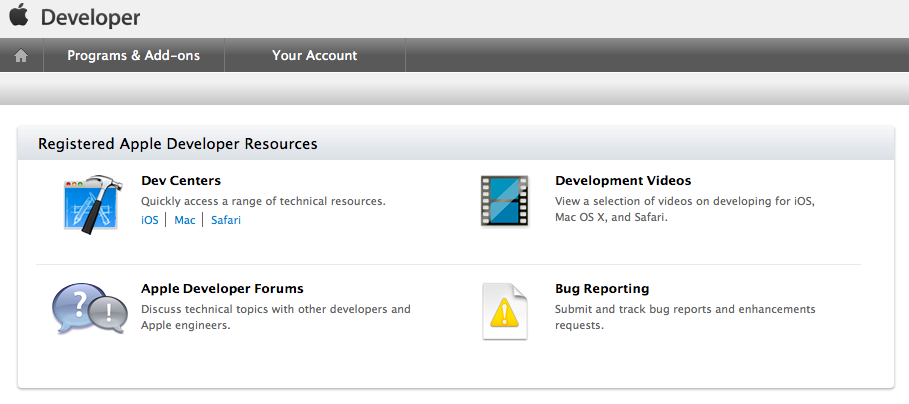

<!-- Tres líneas en blanco para la siguiente transparencia -->


### Práctica: configuración de la cuenta de desarrollador (2)
<!-- .slide: data-background="#cbe0fc"-->

- Para poder ejecutar apps en dispositivos es necesario darse de alta de forma individual en el [programa de desarrollo de iOS](https://developer.apple.com/programs/ios/) o apuntarse a un equipo de desarrollo. En la Universidad tenemos dado de alta un equipo [_iOS Developer University Program_](https://developer.apple.com/programs/ios/university/).
- Escribe tus datos en [este fichero Google Docs](https://docs.google.com/document/d/1-fgqgzKNPpo4--PGUvrsnXTe_ABA04gLcpv8rtJd9D0/edit?usp=sharing) y te añadiré al equipo. En el correo electrónico recibirás una invitación con un enlace. Pincha en el enlace e introduce allí tu Apple ID. 
- Una vez aceptada la invitación puedes entrar en el _member center_, comprobar que  ya estás en el programa y probar [las distintas opciones disponibles](https://developer.apple.com/programs/ios/university/gettingstarted/):

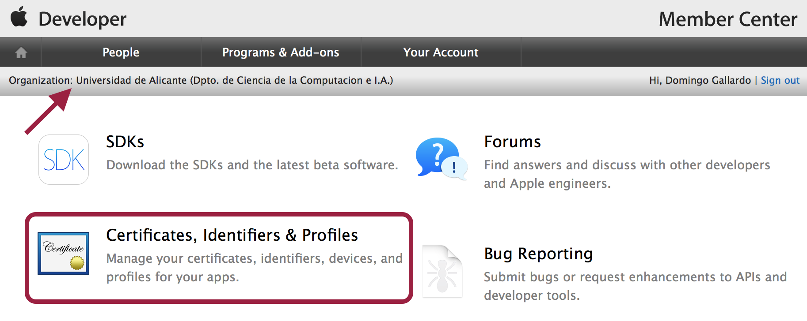

<!-- Tres líneas en blanco para la siguiente transparencia -->


### Cuenta de desarrollador 
<!-- .slide: data-background="#cbe0fc"-->

- La cuenta de desarrollo de la universidad está limitada al desarrollo y prueba de apps. No tiene las funcionalidades de distribución de apps que tienen las cuentas de pago:

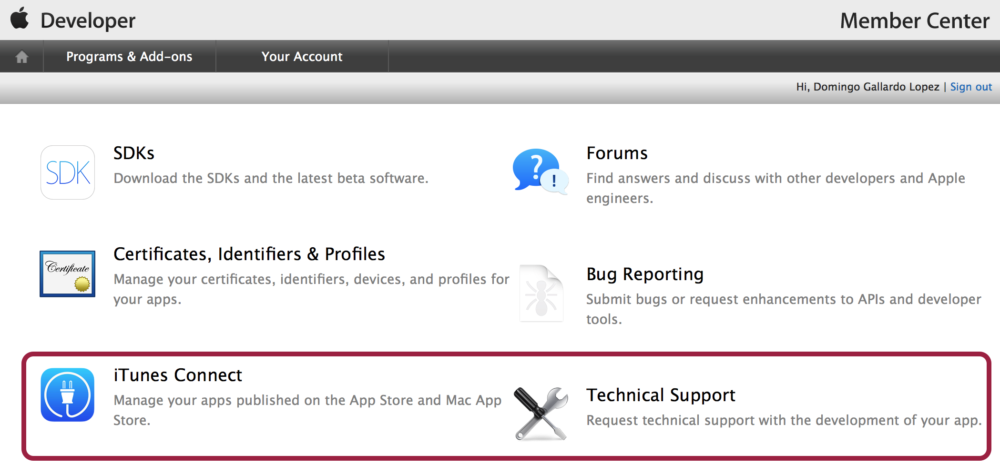

<!-- Tres líneas en blanco para la siguiente transparencia -->


### Instalación de la identidad de firma (1)
<!-- .slide: data-background="#cbe0fc"-->

- Xcode facilita el proceso de generación de nuestra identidad de firma y de nuestro certificado de desarrollador.
- Escoge Xcode > Preferences y pincha en el signo + para añadir un Apple ID.
- Si todo ha ido bien, Xcode mostrará la información de la cuenta.

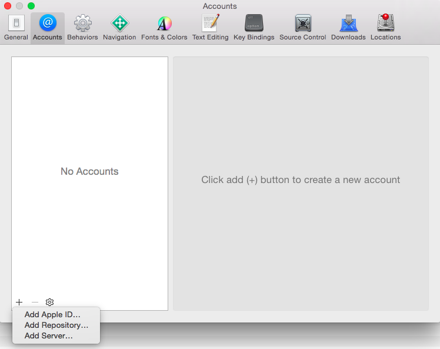 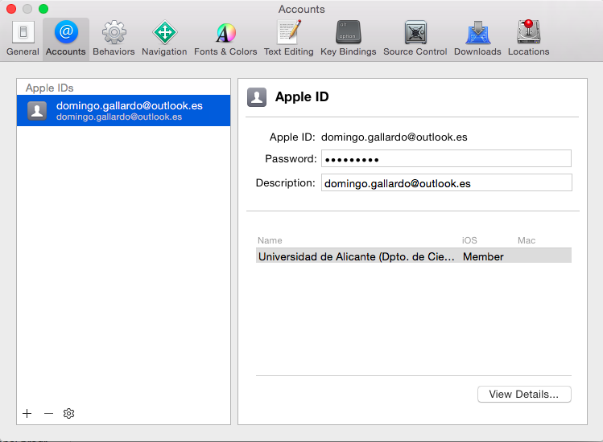

<!-- Tres líneas en blanco para la siguiente transparencia -->


### Instalación de la identidad de firma (2)
<!-- .slide: data-background="#cbe0fc"-->

- Pulsa View Details para crear la identidad de firma.
- Pulsa el botón de recargar en la esquina inferior izquierda para que Xcode solicite una identidad de firma, que debe autorizar el administrador del equipo.
- Una vez aprobada la petición, la identidad de firma aparecerá en el panel.

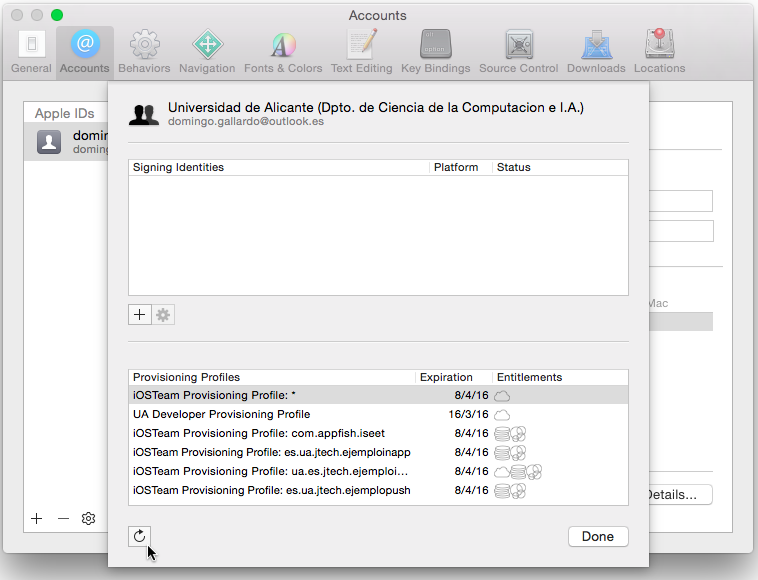 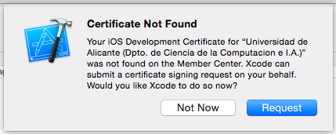 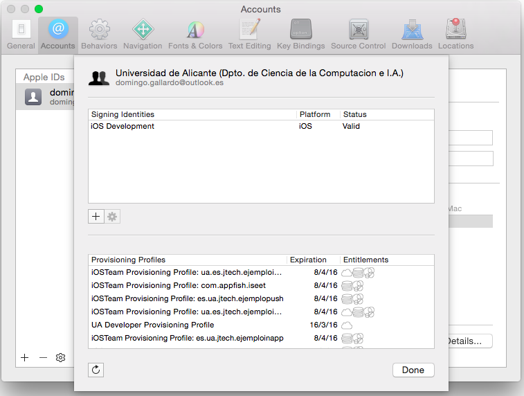

<!-- Tres líneas en blanco para la siguiente transparencia -->


### Comprobación de la identidad de firma en Acceso a Llaveros
<!-- .slide: data-background="#cbe0fc"-->

- Abre la aplicación Acceso a Llaveros y comprueba que se ha instalado el certificado junto con la clave privada en Mis certificados e Inicio de sesión.

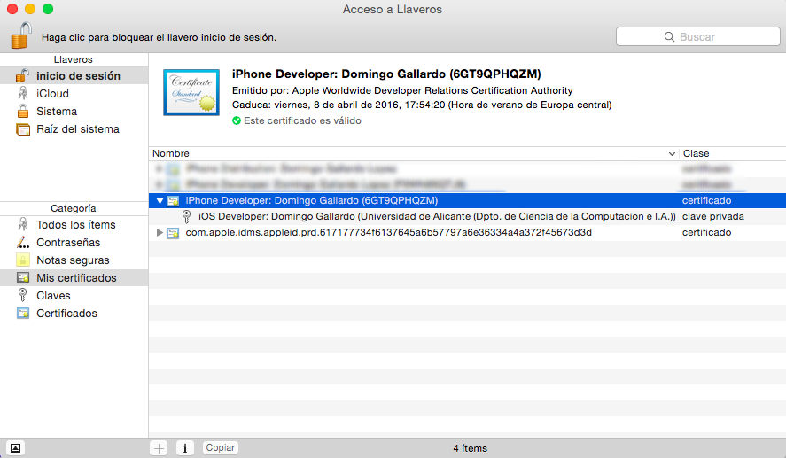

<!-- Tres líneas en blanco para la siguiente transparencia -->


### Comprobación del certificado en el _Member Center_
<!-- .slide: data-background="#cbe0fc"-->

- En el _Member Center_ puedes comprobar que se ha añadido tu certificado al del resto de miembros del equipo.
- El certificado en el _Member Center_ contiene tu clave pública. Tu clave privada está protegida en tu llavero.

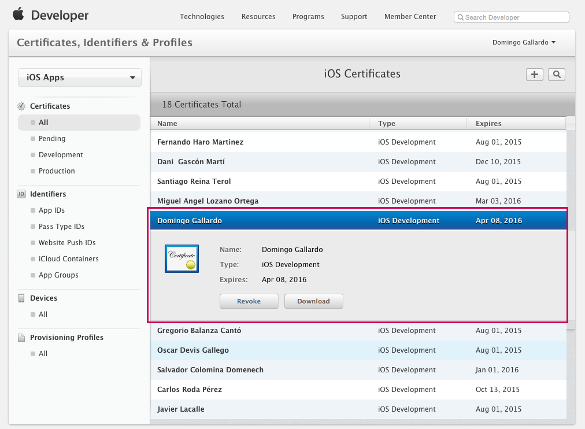

<!-- Tres líneas en blanco para la siguiente transparencia -->


### Exportación e importación del certificado y la identidad de firma

- La clave privada y el certificado asociado se pueden exportar desde Acceso a Llaveros o desde Xcode.
- Esa es tu identidad como de desarrollador y sólo la tienes tú, puedes exportarla para trabajar en otros equipos o para tener una copia de respaldo.
- Puedes encontrar más información sobre cómo exportar e importar la identidad de desarrollador en la [_App Distribution Guide_](https://developer.apple.com/library/ios/documentation/IDEs/Conceptual/AppDistributionGuide/Introduction/Introduction.html#//apple_ref/doc/uid/TP40012582).

<!-- Tres líneas en blanco para la siguiente transparencia -->


### Aprovisionamiento de una aplicación

- La firma digital es uno de los dos elementos que se necesita para poder ejecutar una app en un dispositivo. El otro es un **perfil de aprovisionamiento**.
- En el _Member Center_ se crean **perfiles de aprovisionamiento** que determinan en qué dispositivos pueden ejecutar las apps y qué servicios pueden usar éstas. Un perfil de aprovisionamiento contiene los siguientes elementos:


<!-- Tres líneas en blanco para la siguiente transparencia -->


#### Elementos de un perfil de aprovisionamiento


- App ID: nombre del perfil, cadena de búsqueda y servicios autorizados por el pérfil 
- Certificados de desarrolladores del equipo 
- Dispositivos: Nombre e identificadores de dispositivos

<!-- Tres líneas en blanco para la siguiente transparencia -->


### Examinar los perfiles de aprovisionamiento

- Podemos examinar los perfiles de aprovisionamiento desde el _Member Center_ o desde Xcode y el terminal
- En el _Member Center_ tenemos que entrar en la opción _Manage your certificates, App IDs, devices, and provisioning profiles_ y pulsar cualquiera de las opciones _Certificates_, _Identifiers_, _Devices_, _Provisioning Profiles_ para entrar en la página de gestión de los perfiles de aprovisionamiento.


<!-- Tres líneas en blanco para la siguiente transparencia -->


### Menú de opciones

<!-- .slide: class="image-left"-->


- Contiene todos los perfiles de aprovisionamiento creados, junto con la información asociada.
- **Certificados**: todos los certificados de los desarrolladores del equipo.
- **Identificadores**: todos los App IDs aprobados, con las características aprobadas en cada uno de ellos.
- **Dispositivos**: todos los dispositivos aprobados para probar las apps

<!-- Tres líneas en blanco para la siguiente transparencia -->


### App ID

- Un App ID define una lista de capacidades (_whitelist_) que permitimos usar a una app (_explicit App ID_) o varias apps (_wildcard App ID_). 
- Para usar un servicio determinado, hay que definir un App ID que lo permita e incluirlo en un perfil de aprovisionamiento.
- En Xcode se define el _bundle ID_ de la app y los servicios concretos que va a usar.
- Xcode busca algún perfil de aprovisionamiento que empareje el _bundle ID_ y que satisfaga estas necesidades. Si no existe ninguno, intenta crear uno.


<!-- Tres líneas en blanco para la siguiente transparencia -->


### Crear un App ID desde _Member Center_ (1)

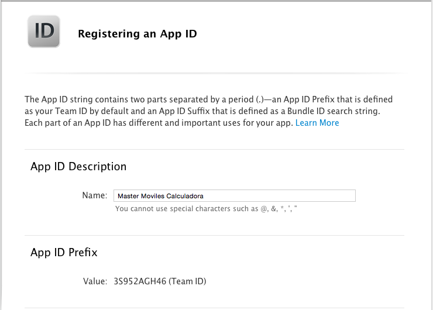

<!-- Tres líneas en blanco para la siguiente transparencia -->


### Crear un App ID desde _Member Center_ (2)

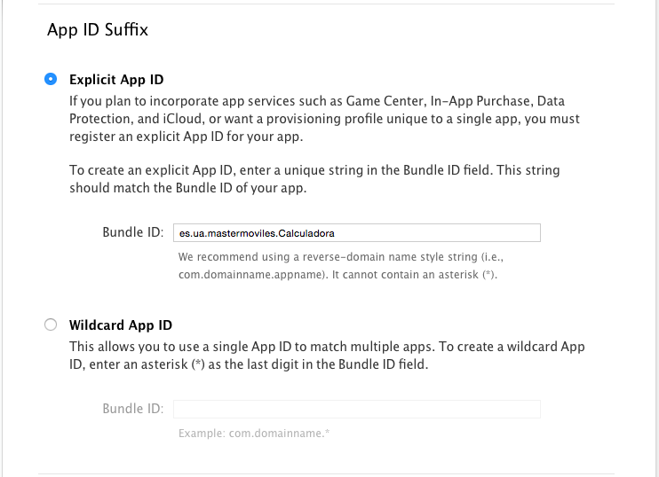

<!-- Tres líneas en blanco para la siguiente transparencia -->


### Crear un App ID desde _Member Center_ (3)

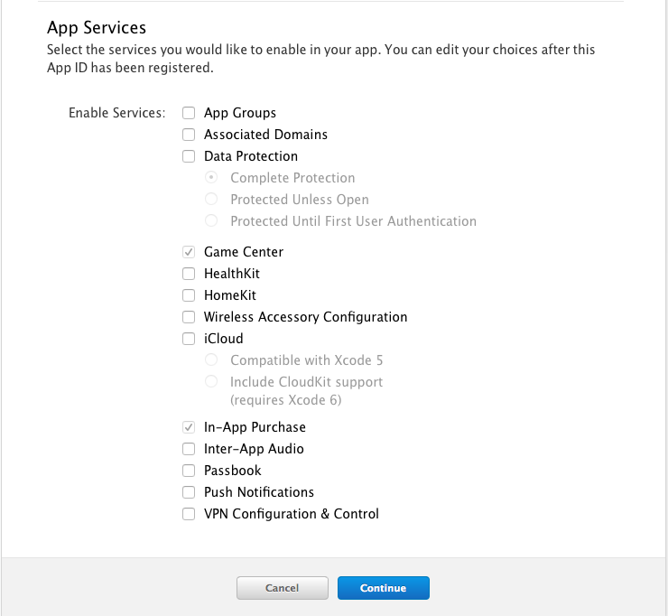


<!-- Tres líneas en blanco para la siguiente transparencia -->


### Crear un App ID desde _Member Center_ (4)

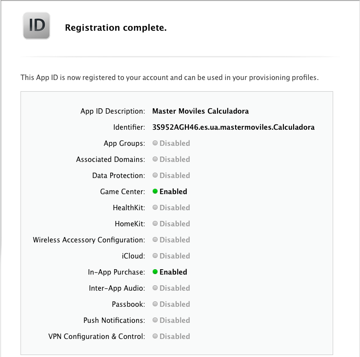


<!-- Tres líneas en blanco para la siguiente transparencia -->


### Dispositivos

<!-- .slide: class="image-right"-->

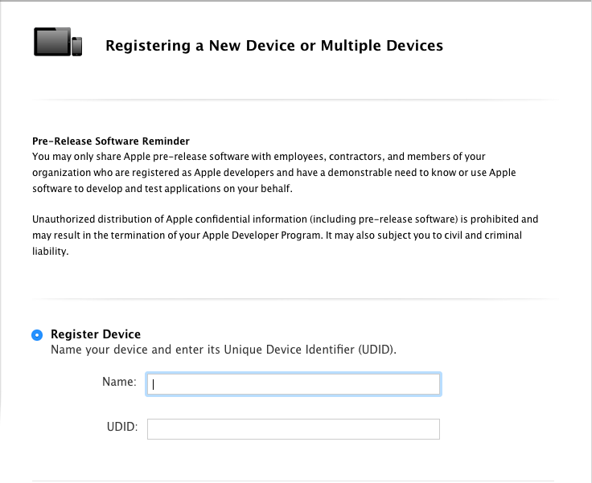

- Para añadir un dispositivo a un certificado de aprovisionamiento hay que añadir su UDID, _Unique Device Identifier_.
- Cadena de 40 caracteres de símbolos alfanuméricos (a-z y 0-9). 
- Desde Xcode se puede obtener en la pantalla de Dispositivos (Window > Devices).
- Se pueden registrar en el _Member Center_ hasta 100 UDIDs para probar aplicaciones en desarrollo.


<!-- Tres líneas en blanco para la siguiente transparencia -->


### Creación de perfiles de aprovisionamento

- Una vez creado el App ID con los permisos necesarios, añadidos los certificados de los desarrolladores del equipo y añadidos los dispositivos es posible crear un nuevo perfil de aprovisionamiento.
- Se puede hacer desde el _Member Center_ y también desde Xcode. Es más claro ver el proceso desde _Member Center_, ya que Xcode mezcla el proceso de creación del perfil con el de dar autorizaciones (_entitlements_) a la propia aplicación.

<!-- Tres líneas en blanco para la siguiente transparencia -->


### Nuevo perfil de aprovisionamiento desde _Member Center_ (1)

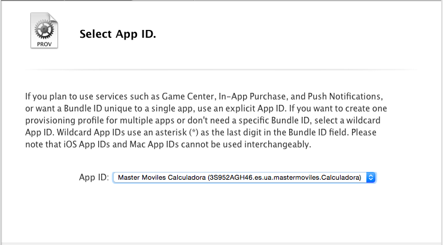

<!-- Tres líneas en blanco para la siguiente transparencia -->


### Nuevo perfil de aprovisionamiento desde _Member Center_ (2)


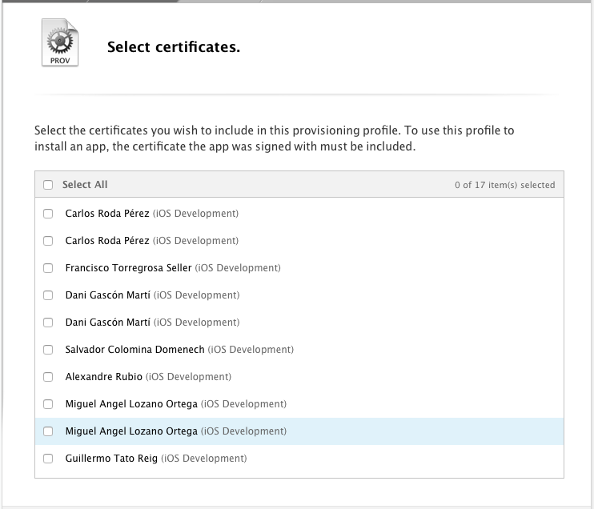

<!-- Tres líneas en blanco para la siguiente transparencia -->


### Nuevo perfil de aprovisionamiento desde _Member Center_ (3)

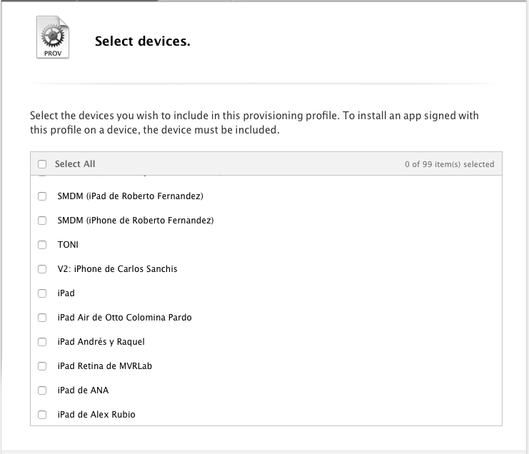

<!-- Tres líneas en blanco para la siguiente transparencia -->


### Nuevo perfil de aprovisionamiento desde _Member Center_ (4)

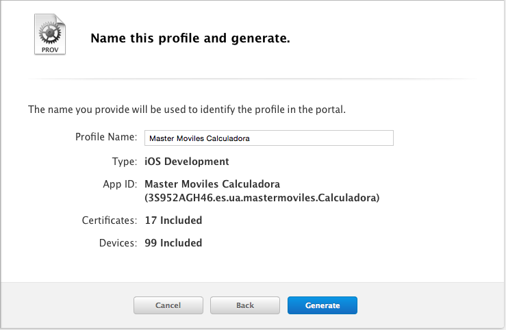

<!-- Tres líneas en blanco para la siguiente transparencia -->


### Perfiles de aprovisionamiento del equipo

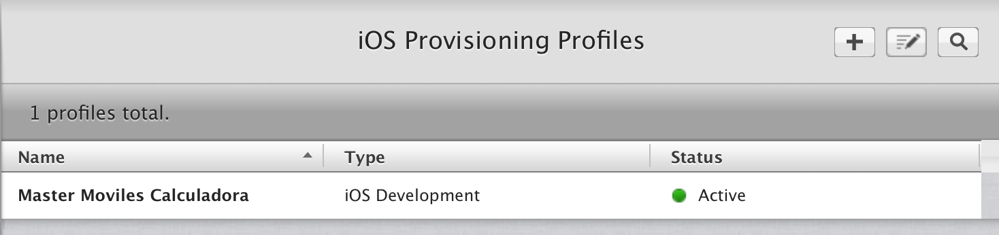


<!-- Tres líneas en blanco para la siguiente transparencia -->


### Práctica: instalar la app Calculadora en un dispositivo
<!-- .slide: data-background="#cbe0fc"-->

- Una vez instalado el certificado de desarrollador en Xcode debes configurar la aplicación para que sea compatible con el perfil de aprovisionamiento recién creado y poder instalarla y ejecutarla en un dispositivo.
- Tendrás que:
    - Definir como _bundle identifier_ de la app `es.ua.mastermoviles.Calculadora`.
    - Activar en la app el permiso (_entitlement_) de _Game Center_. No vamos a usar nada de _Game Center_, es sólo para comprobar que funciona correctamente el perfil de aprovisionamiento recién creado. Aparecerá un error si Xcode no ha descargado el perfil.
    - Actualizar los perfiles de aprovisionamiento en Xcode para descargar el perfil de aprovisionamiento recién creado en el _Member Center_.
    - Instalar y ejecutar la aplicación en un dispositivo conectado a Xcode.


<!-- Tres líneas en blanco para la siguiente transparencia -->


### Definición del _Bundle identifier_
<!-- .slide: data-background="#cbe0fc"-->

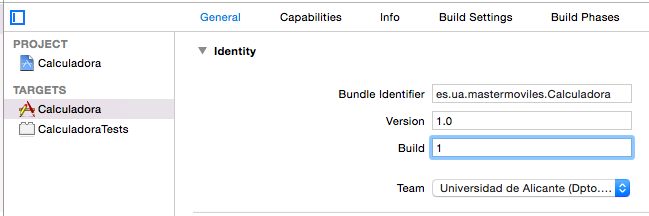

- El _bundle identifier_ identifica de forma única la app. Debe coincidir con el App ID del perfil de aprovisionamiento (o emparejar correctamente en el caso en que el App ID tenga una cadena con el carácter comodín).

<!-- Tres líneas en blanco para la siguiente transparencia -->


### Activación del permiso de _Game Center_
<!-- .slide: data-background="#cbe0fc"-->

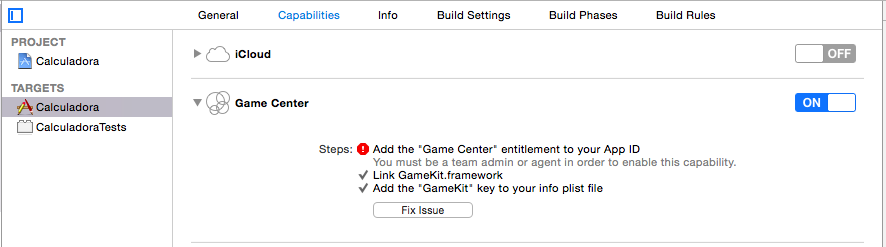

- Selecciona la opción Capabilities y activa el permiso de Game Center. Xcode buscará un perfil de aprovisionamiento que proporcione este permiso. Si no lo encuentra aparecerá un error y el botón Fix Issue.
- Xcode puede arreglar el error creando un nuevo perfil de aprovisionamiento y subiéndolo al _Member Center_. Para ello hay que tener permisos apropiados en la cuenta de desarrollador (ser un administrador del equipo en el caso de una organización o el propietario del equipo en el caso de un programa de desarrollo).

<!-- Tres líneas en blanco para la siguiente transparencia -->


### Perfiles de aprovisionamiento
<!-- .slide: data-background="#cbe0fc"-->

<!-- .slide: class="image-right"-->

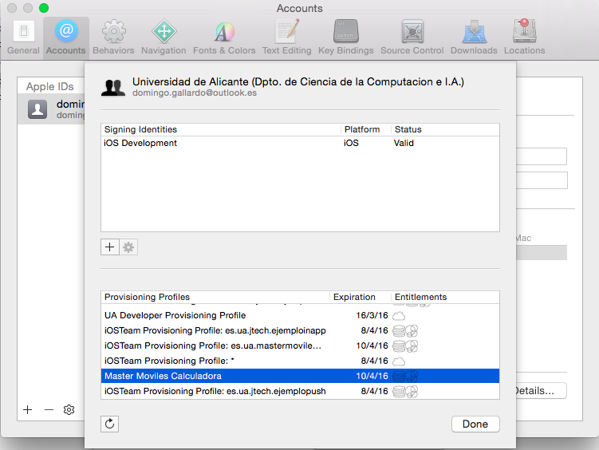

- Se pueden consultar los perfiles de aprovisionamiento entrando en Xcode > Preferences > Accounts > View Details.
- El botón de _recargar_ actualiza los perfiles, bajándoselos del _Member Center_.
- Pulsando con el botón derecho en cualquier perfil podemos ver su ubicación en el disco duro. Se encuentran en Librería > MobileDevice > Provisioning Profiles.
- Si los borramos de esa carpeta, automáticamente se borran de Xcode.
- Los perfiles de aprovisionamiento son ficheros XML encriptados. Es posible consultar su contenido desde el terminal con el comando:

```
security cms -D -i <perfil>.mobileprovision
```

<!-- Tres líneas en blanco para la siguiente transparencia -->


### Instalar y ejecutar la aplicación en un dispositivo
<!-- .slide: data-background="#cbe0fc"-->

<!-- .slide: class="image-right"-->

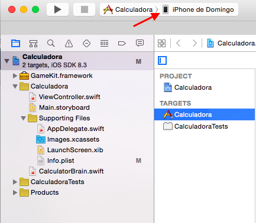

- Se conecta el dispositivo y se selecciona en el menú de ejecución.

<!-- Tres líneas en blanco para la siguiente transparencia -->


### Inspeccionar el dispositivo
<!-- .slide: data-background="#cbe0fc"-->

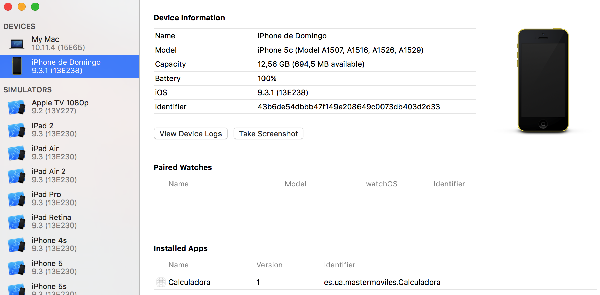

- Podemos inspeccionar el dispositivo abriendo la ventana de dispositivos con Window > Devices.
- Veremos algunos datos del dispositivo y las aplicaciones instaladas.
- Desde esta pantalla podemos examinar, eliminar e instalar aplicaciones en el dispositivo.

<!-- Tres líneas en blanco para la siguiente transparencia -->


### Perfil de aprovisionamiento copiado
<!-- .slide: data-background="#cbe0fc"-->

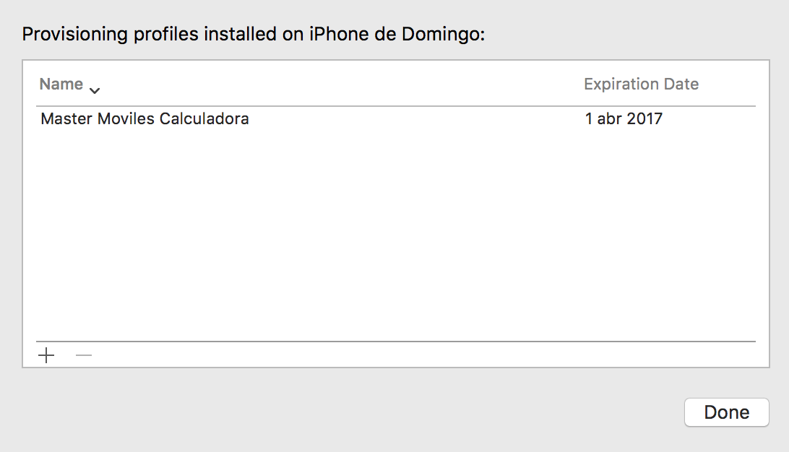


- Pulsando con el botón derecho sobre el dispositivo podemos seleccionar la opción Show Provisioning Profiles para ver los perfiles de aprovisionamiento copiados al dispositivo. Debe aparecer el que hemos creado en el _Member Center_.

<!-- Tres líneas en blanco para la siguiente transparencia -->


### Ejecutar la aplicación Calculadora en el dispositivo
<!-- .slide: data-background="#cbe0fc"-->

<!-- .slide: class="image-right"-->

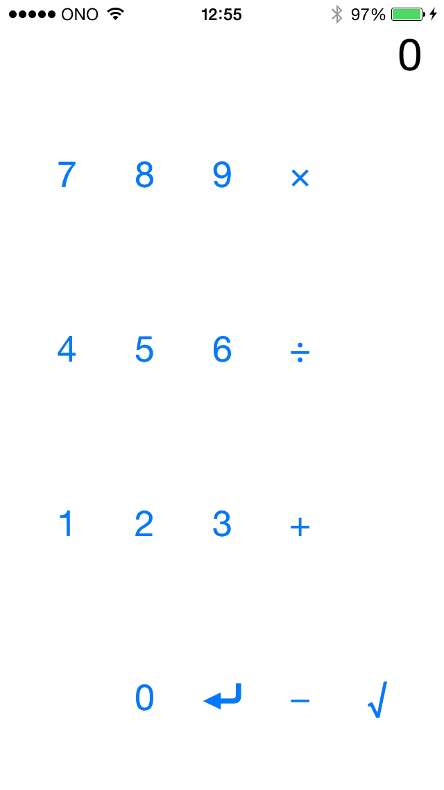

- Para terminar comprobamos que la aplicación instalada funciona correctamente en el dispositivo.

<!-- Tres líneas en blanco para la siguiente transparencia -->


# Master Programación <br/> de Dispositivos Móviles


