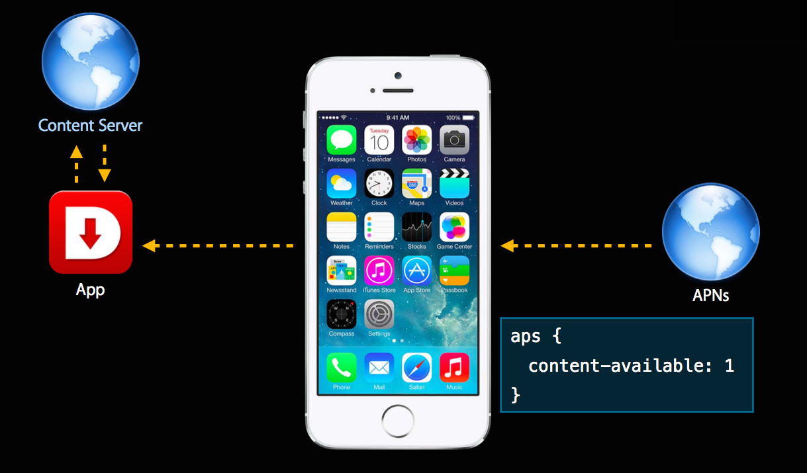
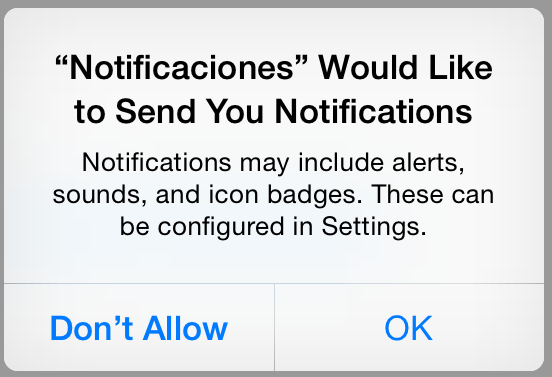
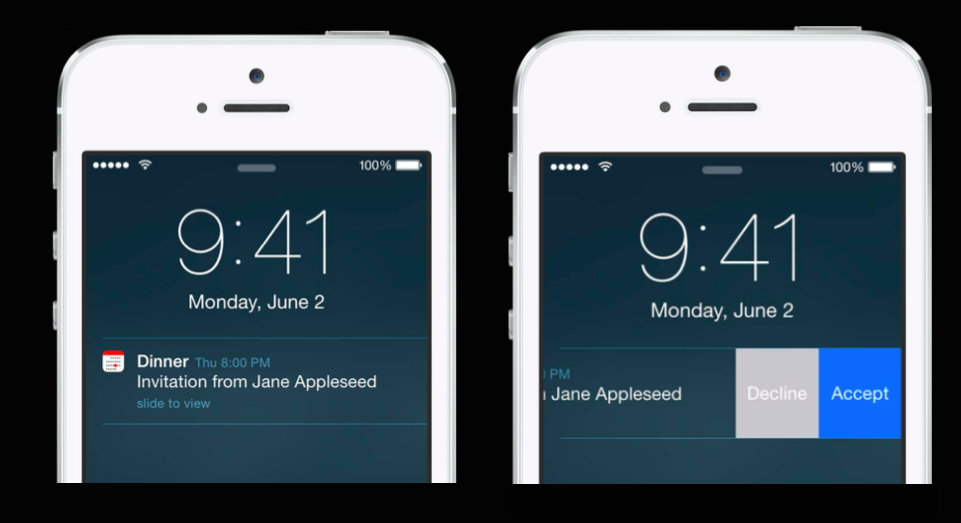
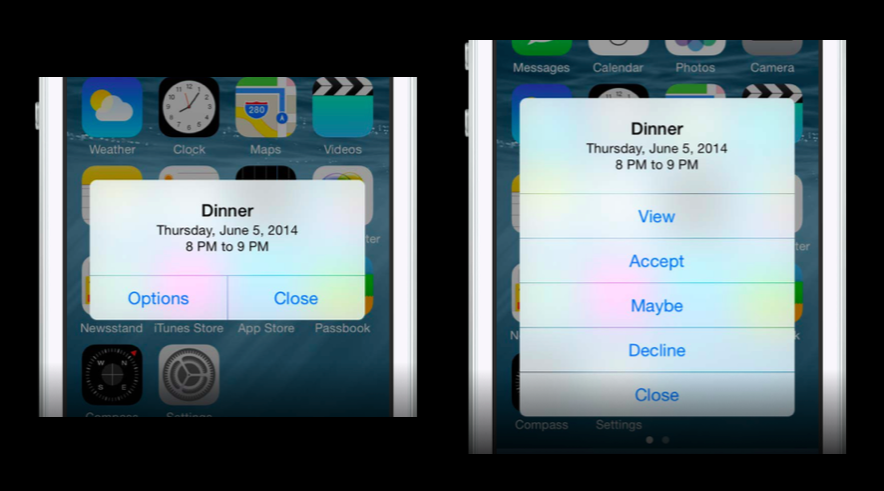

# Sesión 3: <br/> Notificaciones 

#### Servicios de las plataformas móviles - iOS

<small>Domingo Gallardo - domingo.gallardo@ua.es  
Departamento Ciencia de la Computación e Inteligencia Artificial  
Master Programación de Dispositivos Móviles  
2016-17</small>

<!-- Tres líneas en blanco para la siguiente transparencia -->


## Notificaciones

<!-- .slide: class="image-right"-->

- En iOS sólo una única aplicación puede estar activa en un momento
  dado. Sin embargo, en muchas ocasiones las apps operan en un entorno
  basado en el tiempo o interconectado en el que es necesario avisar
  al usuario cuando sucede algún evento y la aplicación que no está
  activa. Las **notificaciones locales y remotas** permiten a estas apps
  notificar a sus usuarios cuando ocurre algún suceso de su interés.
- Todo el API para gestionar las notificaciones se unifica en iOS 10
  en el
  [_User Notifications Framework_](https://developer.apple.com/reference/usernotifications)
  y en el
  [_User Notifications UI Framework Reference_](https://developer.apple.com/reference/usernotificationsui).


- Además de los usos comentados, las notificaciones se utilizan
  también para la comunicación entre nuestra app y el recién
  introducido _Apple Watch_. Se puede consultar la
  [página de recursos](https://developer.apple.com/watchos/resources/)
  de Apple sobre el _WatchKit Framework_ para más información.


<!-- Tres líneas en blanco para la siguiente transparencia -->


## API de notificaciones

- Antes de iOS 10:
    - API de notificaciones repartida en distintas clases. Por ejemplo,
   para lanzar notificaciones había que llamar a métodos de la clase
   `UIApplication` y la recepción de notificaciones se declaraban en
   el `UIApplicationDelegate`.
    - APIs distintas para notificaciones locales y remotas.
    - APIs distintas para iOS, watchOS
- En iOS 10 se unifican todas las funciones en el
  [UserNotifications](https://developer.apple.com/reference/usernotifications):
    - Mismo código para notificaciones locales y remotas
    - Métodos delegados simplificados
    - Mejor gestión de las notificaciones
    - Opción para presentar la notificación en el app
    - Planificación y manejo de notificaciones en extensiones
    


<!-- Tres líneas en blanco para la siguiente transparencia -->


## Notificaciones locales y remotas

- Las notificaciones remotas y locales satisfacen distintas
  necesidades de diseño.

- Una **notificación local** es planificada y enviada por la propia
  app, cuando está en funcionamiento o cuando está en _background_
  recogiendo datos de un servidor y recibe alguna información
  interesante.
    - Ejemplo: en una app que gestiona una lista de tareas por hacer,
      en la que cada ítem tiene una fecha y hora en el que debe ser
      completado.
    - Ejemplo: en una app que recibe en _background_ información de
      cotizaciones en bolsa y en la que hay un cambio considerable en
      la cotización de una empresa que el usuario ha marcado.

- Una **notificación remota**, también llamada _notificación push_,
  llega del exterior del dispositivo. Se origina en un servidor remoto
  gestionado por el desarrollador de la app (denominado proveedor de
  la aplicación) y se envía al dispositivo del usuario a través del
  _Apple Push Notification service_ (APNs).
    - Ejemplo: en una aplicación de mensajería (estilo WhatsApp) se
      notifica cuando el usuario recibe un nuevo mensaje.


<!-- Tres líneas en blanco para la siguiente transparencia -->


## Para qué se usan las notificaciones

- Notificaciones locales: alarmas, recordatorios, eventos de una forma
  sencilla, sin tocar las apps Calendario, Alarmas o Recordatorios
  (_EventKit Framework_).
- Notificaciones remotas
    - Avisar al usuario de que han sucedido determinados eventos.
    - Notificar a la app para que descargue contenido nuevo para que
      esté disponible la próxima vez que el usuario la utilice.  




<!-- Tres líneas en blanco para la siguiente transparencia -->


## Notification service app extensions

<!-- .slide: class="image-right"-->


- Las **_app extensions_** de tipo _notification service_ permiten
  modificar el contenido de las notificaciones remotas antes de ser
  entregadas al usuario.

- Ejemplos de uso:
    - Implementar encriptación _end-to-end_ de las notificaciones.
    - Modificar el contenido de la notificación, adaptándolo a algún
      contexto modificado en la app.
    - Descargar del servidor imágenes o media adicionales.

<!-- Tres líneas en blanco para la siguiente transparencia -->


## Apariencia de las notificaciones


- Tanto las notificaciones locales como las remotas pueden aparecer
  como:
    - Un aviso (_alert_) o tira (_banner_) en la parte superior de la
      pantalla. Los avisos obligan al usuario a realizar una
      interacción, las tiras aparecen y desaparecen.
    - Un globo (_badge_) en el icono de la app.
    - Un sonido que acompaña la alerta, _banner_ o _badge_.
- El usuario puede configurar la aceptación de notificaciones y su
  apariencia en los ajustes (**Ajustes > Notificaciones**).


<!-- Tres líneas en blanco para la siguiente transparencia -->


## Dónde aparecen las notificaciones

 <br/>
 
 

- Si el dispositivo está en uso: en la parte superior.
- Si el dispositivo está bloqueado: en la pantalla de bloqueo.
- En el centro de notificaciones (se abre deslizando hacia abajo desde
  la parte superior de la pantalla).


<!-- Tres líneas en blanco para la siguiente transparencia -->


## Interacción en las notificaciones
<!-- .slide: class="image-right"-->


- Con el nuevo _User Notifications UI Framework_ (iOS 10) es posible
  añadir imágenes, audio, vídeo e interfaces de usuario a las notificaciones y
  permitir al usuario interaccionar en la propia notificación sin abrir
  la app.

<!-- Tres líneas en blanco para la siguiente transparencia -->


## Notificaciones remotas

- Hablaremos más de las notificaciones remotas en la siguiente
  sesión. 
- Las notificaciones remotas se originan en un servidor nuestro
  (_provider_) que realiza la petición al _Apple Push Notification
  Service_.
- El servicio APNs se encargar de enviar la notificación al
  dispositivo y éste a la app.


<!-- Tres líneas en blanco para la siguiente transparencia -->


## Registro de los tipos de notificación 

- Las apps que usan notificaciones locales o remotas deben registrar
  los tipos de notificaciones que intentan enviar al usuario.
- Lo normal es hacerlo antes de que la aplicación termine de lanzarse,
  en el método `application:didFinishLaunchingWithOptions:` del
  delegado de la aplicación.
- El usuario debe aceptar el tipo de notificación: globos, alertas o
  sonidos. Inicialmente le aparecerá una alerta en el que permite
  aceptar o rechazar todos los tipos.
- Después en cualquier momento puede modificar esta aceptación en los
  ajustes de la aplicación (**Ajustes > Notificaciones**).




<!-- Tres líneas en blanco para la siguiente transparencia -->


## _UIApplication_ y _UIApplication Delegate_

- `UIApplication` y `UIApplicationDelegate` son tipos muy importantes
  que debemos conocer.
- Contienen los métodos necesarios para gestionar las notificaciones y
  otros eventos del ciclo de vida de las apps.
- Xcode proporciona una clase _app delegate_ para cada proyecto. UIKit
  crea automáticamente una instancia de la clase proporcionada por
  Xcode y la usa para ejecutar los primeros bits de código _custom_ de
  la app. Todo lo que tienes que hacer es añadir tu código _custom_ a
  la clase que proporciona Xcode.
- La clase `UIApplication` define un _singleton_ al que podemos
  acceder con el método de clase `sharedApplication()` o como el
  parámetro recibido en los métodos del ciclo de vida de la app

```swift
let application = UIApplication.sharedApplication();
```

- Referencias: [`UIApplication`](https://developer.apple.com/library/ios/documentation/UIKit/Reference/UIApplication_Class/index.html#//apple_ref/swift/cl/UIApplication) y [`UIApplicationDelegate`](https://developer.apple.com/library/ios/documentation/UIKit/Reference/UIApplicationDelegate_Protocol/).

<!-- Tres líneas en blanco para la siguiente transparencia -->


## Ciclo de vida de la app


[The App Life Cycle](https://developer.apple.com/library/content/documentation/iPhone/Conceptual/iPhoneOSProgrammingGuide/TheAppLifeCycle/TheAppLifeCycle.html)

<strong>Nota:</strong>

<table>
  <tr>
    <td><strong><em>Estado</em></strong></td> 
    <td><strong><em>Descripción</em></strong></td>
  </tr>
  <tr>
  <td><strong>No corriendo</strong></td> 
    <td>La app no ha sido lanzada o fue terminada por el usuario o por el sistema.</td>
  </tr>
  <tr>
    <td><strong>Inactiva</strong></td> 
    <td>La app está corriendo en primer plano pero no está recibiendo eventos (puede estar ejecutando código, sin embargo). Una app permanece en este estado brevemente, mientras realiza una transición a otro estado.</td>
  </tr>
  <tr>
    <td><strong>Activa</strong></td> 
    <td>La app está corriendo en primer plano y recibiendo eventos.</td>
  </tr>
  <tr>
    <td><strong>Background</strong></td> 
    <td>La app está ejecutando código pero no es visible en pantalla. Cuando el usuario sale de una app, el sistema mueve la app al estado de _background_ antes de suspenderla. En otros momentos, el sistema puede lanzar una aplicación en _background_ (o despertar una app suspendida) y darle tiempo para manejar ciertas tareas específicas. Por ejemplo, el sistema puede despertar una app para que procese descargas en _background_, o responda a notificaciones remotas. Una app en estado _background_ debe hacer el mínimo trabajo posible y devolver rápidamente el control al sistema.</td>
  </tr>
  <tr>
    <td><strong>Suspendida</strong></td> 
    <td>La app está en memoria pero no ejecuta código. El sistema suspende apps que están en _background_ y no tienen tareas pendientes que completar. El sistema puede eliminar apps suspendidas en cualquier momento sin despertarlas, para hacer sitio para otras apps.</td>
  </tr>
</table>

<!-- Tres líneas en blanco para la siguiente transparencia -->


## Métodos relacionados con los cambios de estado en el `UIApplicationDelegate`

- En [`UIApplicationDelegate` - Monitoring App State Change](https://developer.apple.com/library/ios/documentation/UIKit/Reference/UIApplicationDelegate_Protocol/index.html#//apple_ref/doc/uid/TP40006786-CH3-SW5)
    - `application(_:willFinishLaunchingWithOptions:)`
    - `application(_:didFinishLaunchingWithOptions:)`
    - `applicationDidBecomeActive(_:)`
    - `applicationWillResignActive(_:)`
    - `applicationDidEnterBackground(_:)`
    - `applicationWillEnterForeground(_:)`
    - `applicationWillTerminate(_:)`
- Todos reciben el parámetro `application`, el _singleton_ de tipo
  [`UIApplication`](https://developer.apple.com/library/ios/documentation/UIKit/Reference/UIApplication_Class/index.html)
  que contiene todos los datos de la app.

<!-- Tres líneas en blanco para la siguiente transparencia -->


## Inicialización de las notificaciones (iOS 9)

- Podemos inicializar las notificaciones al arrancar la app con el
  método `aplication(_:didFinishLaunchingWithOptions:)` del
  [`UIApplicationDelegate`](https://developer.apple.com/library/ios/documentation/UIKit/Reference/UIApplicationDelegate_Protocol/index.html#//apple_ref/swift/intf/UIApplicationDelegate)
- Llamamos a `registerUserNotificationSettings(_:)` con los tipos de
  notificación deseados. La app pide permiso para usar las
  notificaciones y el usuario puede autorizar o no. Después, el
  sistema llama al método
  `application(_:didRegisterUserNotificationSettings:)` del delegado
  para informar de los resultados.
- Independientemente de que el usuario acepte o no las notificaciones,
  éstas se van a lanzar y los métodos que las manejan en el app
  delegado se van a disparar. Lo que el usuario desactiva es la
  aparición de las notificaciones en pantalla.

<!-- Tres líneas en blanco para la siguiente transparencia -->


## `UNUserNotificationCenter` (iOS 10)

- La clase
  [`UNUserNotificationCenter`](https://developer.apple.com/reference/usernotifications/unusernotificationcenter)
  es la clase principal de UserNotifications Framework. Define un
  _singleton_ que es el objeto encargado de planificar y gestionar
  todo lo relacionado con notificaciones.
- Este objeto es el que se debe utilizar para todos los siguientes
  tipos de tareas:
    - Pedir autorización para mostrar las notificaciones.
    - Declarar los tipos de notificación y las acciones que soporta la
    app.
    - Planificar el envío de notificaciones a la app.
    - Gestionar notificaciones específicas de la app mostradas en el
    Centro de Notificaciones.
    - Obtener los ajustes relacionados con notificaciones de la app.

<!-- Tres líneas en blanco para la siguiente transparencia -->


## Inicialización de las notificaciones (iOS 10)


- Se utiliza el método de instancia
  [`requestAuthorization(options:completionHandler:)`](https://developer.apple.com/reference/usernotifications/unusernotificationcenter/1649527-requestauthorization)
  del singleton `UserNotificationCenter` (accesible con el método de
  tipo
  [`current()`](https://developer.apple.com/reference/usernotifications/unusernotificationcenter/1649510-current)).
- Se pasa como parámetro los tipos de notificación que solicitamos
  usar (tira, sonido o aviso) y un _completion handler_ que se ejecuta
  tras la aceptación o negación de los servicios por parte del usuario.

<!-- Tres líneas en blanco para la siguiente transparencia -->


## Código (iOS 10)

```swift
func application(_ application: UIApplication, 
                 didFinishLaunchingWithOptions launchOptions: 
                     [UIApplicationLaunchOptionsKey: Any]?) -> Bool {
    UNUserNotificationCenter.current()
        .requestAuthorization(options: [.alert, .sound, .badge])
        { (granted, error) in print(granted)}
    return true
}
```

- La primera vez que la app solicita autorización, aparece un aviso y
el usuario puede aceptar o denegar la autorización.
- Después de la petición inicial, el sistema recuerda la respuesta del
  usuario y la devuelve en cualquier nueva petición.
- En el ejemplo anterior se solicita autorización para mostrar avisos,
  sonidos y globos.


<!-- Tres líneas en blanco para la siguiente transparencia -->


## Obtener los ajustes definidos por el usuario (iOS 10)

- El método
  [`getNotificationSettings(completionHandler:)`](https://developer.apple.com/reference/usernotifications/unusernotificationcenter/1649524-getnotificationsettings)
  pide al sistema los ajustes y ejecuta asíncronamente un _completion
  handler_ que recibe un objeto `UNNotificationSettings` como
  parámetro.

```swift
func applicationWillEnterForeground(_ application: UIApplication) {
    print("Voy a pedir los settigs")
    UNUserNotificationCenter.current().
        getNotificationSettings(completionHandler:
            {(settings: UNNotificationSettings) in
                if (settings.alertSetting == UNNotificationSetting.enabled) {
                    print("Alert enabled")
                } else {
                    print("Alert not enabled")
                }
                if (settings.badgeSetting == UNNotificationSetting.enabled) {
                    print("Badge enabled")
                } else {
                    print("Badge not enabled")
                }})
}
```

<!-- Tres líneas en blanco para la siguiente transparencia -->


## Notificaciones locales 

- El sistema operativo es responsable de entregar las notificaciones
  locales en la fecha y hora planificada, la app no tiene que estar en
  marcha para que esto suceda.
- Las notificaciones locales son similares a las remotas en el sentido
  de que se usan para mostrar alertas, ejecutar sonidos y añadir
  globos al icono del app.
- Se usan principalmente en apps con conductas basadas en
  temporizadores y en apps sencillas de calendarios o de listas de
  to-do. Una app que está ejecutándose en background también puede
  planificar una notificación para informar al usuario de que ha
  llegado un mensaje, un chat o se ha actualizado algún estado.


<!-- Tres líneas en blanco para la siguiente transparencia -->


## Creación de una notificación local (iOS 9)

- En iOS 9 hay que crear una instancia de la clase 
  [`UILocalNotification`](https://developer.apple.com/library/ios/documentation/iPhone/Reference/UILocalNotification_Class/)
  y definir los siguientes atributos:
    - `fireDate: NSDate?` - fecha en la que se lanza la notificación.
    - `repeatInterval: NSCalendarUnit` - intervalo de repetición.
    - `alertAction: String?` - título del botón de la alerta de la acción por defecto
    - `alertBody: String?` - mensaje en la alerta.
    - `applicationIconBadgetNumber: Int` - número a incluir en el
      globo cuando llegue la notificación.
    - `soundName: String?` - nombre del fichero del sonido a reproducir.
    - `userInfo: [NSObject : AnyObject]?` - un diccionario para pasar
      información _custom_ a la app notificada. En Swift se declaran
      todos los `NSDictionary` como diccionarios del tipo
      `[NSObject: AnyObject]`. Podemos inicializarlo a cualquier tipo
      de diccionario y después hay que hacer un _downcasting_.
    - `category: String?` - el nombre de un grupo de acciones a
      mostrar en la alerta (lo veremos más adelante).

<!-- Tres líneas en blanco para la siguiente transparencia -->


## Planificación de una notificación local (iOS 9)

- Para planificar una notificación local hay que invocar el método
  `scheduleLocalNotification(_:)` o `presentLocalNotificationNow(_:)`
  de la clase `UIApplication` pasando como parámetro la notificación
  creada.
- El primer método usa la fecha `fireDate` como fecha de entrega.
- El segundo método presenta la notificación inmediatamente,
  independientemente de la fecha de la notificación.

<!-- Tres líneas en blanco para la siguiente transparencia -->


## Ejemplo de código para enviar una notificación local (iOS 9)

- Creamos una notificación local que aparece a los 10 segundos

```swift
let localNotification = UILocalNotification()
localNotification.alertBody = "¡¡Funciona!!"
localNotification.alertAction = "Volver a la app"
localNotification.soundName = UILocalNotificationDefaultSoundName
localNotification.fireDate = NSDate(timeIntervalSinceNow: 10)

// application contiene el singleton UIApplication
application.scheduleLocalNotification(localNotification)
```

<!-- Tres líneas en blanco para la siguiente transparencia -->


## Creación de notificaciones (iOS 10)

- En iOS 10 la creación de una nueva notificación se realiza con la
  clase
  [`UNNotificationRequest`](https://developer.apple.com/reference/usernotifications/unnotificationrequest)
    - Identificador (`identifier: String`) que identifica de forma única la
    petición de notificación.
    - Contenido de la notificación (`content: UNNotificationContent`)
    - Condiciones que disparan la notificación (` trigger:
    UNNotificationTrigger?`)
- <!-- .element: class="fragment"  data-fragment-index="1" --> `UNNotificationContent`:
    - `title: String`: Breve descripción de la razón del aviso
    - `subtitle: String`: Descripción secundaria 
    - ` body: String`: El mensaje mostrado en el aviso 
    - `badge: NSNumber?`: El número a mostrar en el globo de la app
    - `sound: UNNotificationSound?`: El sonido cuando se entrega la notificación 
    - `launchImageName: String`: El nombre de la imagen de lanzamiento
      a mostrar cuando la app se lanza en respuesta a la notificación
    - `var userInfo: [AnyHashable : Any]`: Un diccionario de información asociada con la notificación
    - `var attachments: [UNNotificationAttachment]`: Un array de adjuntos a mostrar con la notificación

<!-- Tres líneas en blanco para la siguiente transparencia -->


## Ejemplo (iOS 10)


```swift
let content = UNMutableNotificationContent()
content.title = "Introduction to Notifications"
content.subtitle = "Session 707"
content.body = "Woah! These new notifications look amazing! Don’t you agree?"
content.badge = 1
```

<!-- Tres líneas en blanco para la siguiente transparencia -->


## Condiciones de disparo de la notificación (iOS 10) (1)

- `UNNotificationTrigger` es una clase abstracta. Para definir las
  condiciones de lanzamiento de una notificación hay que instanciar
  una de las siguientes subclases:
    - `UNTimeIntervalNotificationTrigger`: Para entregar una
      notificación local en cierto momento relativo a al momento
      actual. Se debe especificar el número de segundos que debe pasar
      antes de que la notificación se lance. También se puede definir
      un intervalo de repetición.

    ```swift
    // Fire in 30 minutes (60 seconds times 30)
    let trigger = UNTimeIntervalNotificationTrigger(timeInterval: (30*60), repeats: false)
    ```

    - `UNCalendarNotificationTrigger`: Para especificar una fecha y
      hora concreta en la que lanzar una notificación. Por ejemplo,
      para crear un _trigger_ que lanza notificaciones todas las
      mañanas a las 8:30:
      
      ```swift
      let date = DateComponents()
      date.hour = 8
      date.minute = 30 
      let trigger = UNCalendarNotificationTrigger(dateMatching: date, repeats: true)
      ```
    
<!-- Tres líneas en blanco para la siguiente transparencia -->


## Condiciones de disparo de la notificación (iOS 10) (2)

- `UNLocationNotificationTrigger`: Para entregar una notificación
  cuando el dispositivo entra o abandona una zona geográfica
  específica.

```swift
let center = CLLocationCoordinate2D(latitude: 37.335400, longitude: -122.009201)
let region = CLCircularRegion(center: center, radius: 2000.0, identifier: "Headquarters")
region.notifyOnEntry = true
region.notifyOnExit = false
let trigger = UNLocationNotificationTrigger(region: region, repeats: false)
```


<!-- Tres líneas en blanco para la siguiente transparencia -->


## Creación de la notificación local (iOS 10) 

- Una vez definido el contenido y las condiciones de disparo se puede
  crear la notificación local.

```swift
let content = UNMutableNotificationContent()
content.title = "Introducción a Notificaciones"
content.body = "Hablemos sobre notificaciones!"
content.sound = UNNotificationSound.default()
let trigger = UNTimeIntervalNotificationTrigger(timeInterval: 10, repeats: false)
let requestIdentifier = "peticionEjemplo"
let request = UNNotificationRequest(identifier: requestIdentifier,
                                    content: content,
                                    trigger: trigger)
UNUserNotificationCenter.current().add(request) {
            (error) in print ("Error \(error)")}
```

- La notificación se dispara usando el método `add` del centro de
  notificaciones compartido.

<!-- Tres líneas en blanco para la siguiente transparencia -->


## Media attachments (1)

- En iOS 10 es posible adjuntar a una notificación imágenes, vídeo o
  audio.
- Los _attachments_ deben ser ficheros en el disco y el formato del
fichero debe ser uno de los tipos soportados:
    - Audio: MP3, MPEG4
    - Imagen: JPEG, GIF, PNG
    - Vídeo: MPEG, MPEG2, MPEG4, AVI
- Se debe crear un objeto de tipo
  [`UNNotificationAttachment`](https://developer.apple.com/reference/usernotifications/unnotificationattachment).
  


<!-- Tres líneas en blanco para la siguiente transparencia -->


## Media attachments (2)

- El siguiente código presenta una extensión de
  `UNNotificationAttachment` que permite crear un _attachment_ de tipo
  imagen a partir de una `UIImage`:

```swift
extension UNNotificationAttachment {
    static func create(identifier: String, image: UIImage, options: [NSObject : AnyObject]?) -> UNNotificationAttachment? {
        let fileManager = FileManager.default
        let tmpSubFolderName = ProcessInfo.processInfo.globallyUniqueString
        let tmpSubFolderURL = URL(fileURLWithPath: NSTemporaryDirectory()).appendingPathComponent(tmpSubFolderName, isDirectory: true)
        do {
            try fileManager.createDirectory(at: tmpSubFolderURL, withIntermediateDirectories: true, attributes: nil)
            let imageFileIdentifier = identifier+".png"
            let fileURL = tmpSubFolderURL.appendingPathComponent(imageFileIdentifier)
            guard let imageData = UIImagePNGRepresentation(image) else {
                return nil
            }
            try imageData.write(to: fileURL)
            let imageAttachment = try UNNotificationAttachment.init(identifier: imageFileIdentifier, url: fileURL, options: options)
            return imageAttachment
        } catch {
            print("error " + error.localizedDescription)
        }
        return nil
    }
}
```


<!-- Tres líneas en blanco para la siguiente transparencia -->


## Media attachments (3)

- Para incluir el _attachment_ en la notificación usando la extensión
  de la diapositiva anterior:

```swift
if let attachment = UNNotificationAttachment.
                           create(identifier: "prueba",
                                  image: UIImage(named: "gatito.png")!,
                                  options: nil) {
   content.attachments = [attachment]
}
```

<!-- Tres líneas en blanco para la siguiente transparencia -->


## Práctica: app `Notificaciones`

<!-- .slide: data-background="#cbe0fc"-->
<!-- .slide: class="image-right"-->


- Crea un proyecto `Notificaciones`.
- _Bundle Identifier_: `es.ua.mastermoviles.Notificaciones`
- Utiliza el código de iOS 10.
- Añade un botón en la app, de forma que cuando pulsemos
  el botón se planifique una nueva notificación. Se puede pulsar el
  botón tantas veces como queramos y se generarán otras tantas
  notificaciones. Incluye alguna imagen en la notificación.
- Una vez pulsado el botón debes salir de la app y comprobar que las
  notificaciones se lanzan correctamente.

<!-- Tres líneas en blanco para la siguiente transparencia -->


## Métodos del `UIApplicationDelegate` para manejar notificaciones (iOS 9)

- Se deben consultar en la referencia de
  [`UIApplicationDelegate`](https://developer.apple.com/library/ios/documentation/UIKit/Reference/UIApplicationDelegate_Protocol/index.html#//apple_ref/occ/intfm/UIApplicationDelegate/)
- Si la app está en primer plano y recibe la notificación el sistema
  no muestra al usuario ninguna alerta, pero sí se invoca al siguiente
  método del delegado:
    - `application(_:didReceiveLocalNotification:)`
- Es el mismo método que se invoca cuando la app está en segundo plano
  y el usuario pulsa la notificación.


<!-- Tres líneas en blanco para la siguiente transparencia -->


## Ejemplo (iOS 9)

```swift
...
localNotification.userInfo = ["Mensaje":"Hola, mundo"]
...
```

```swift
func application(application: UIApplication, didReceiveLocalNotification notification: UILocalNotification) {
    print("Recibida notificación")
    let userInfo = notification.userInfo as? Dictionary<String,String>
    if let s = userInfo?["Mensaje"] {
        print("Mensaje: \(s)")
    }
    else {
        print("No he encontrado el mensaje\n")
    }
}
```
<!-- Tres líneas en blanco para la siguiente transparencia -->


## Manejo de notificaciones en iOS 10

- El protocolo
  [`UNUserNotificationCenterDelegate`](https://developer.apple.com/reference/usernotifications/unusernotificationcenterdelegate)
  debe ser cumplido por el delegado que se asigna al centro de
  notificaciones.
- Se suele hacer que el `AppDelegate` cumpla este protocolo y
  asignarlo al centro de notificaciones en los métodos
  `application(_:willFinishLaunchingWithOptions:)` o
  `application(_:didFinishLaunchingWithOptions:)`
- En el protocolo se define la función
  `userNotificationCenter(_:willPresent:withCompletionHandler:)` a la
  que el sistema llama cuando se recibe una notificación y la app está
  en primer plano.
- Si queremos que la notificación aparezca debemos llamar al
  _completionHandler_ pasando como parámetro un array con las opciones
  de visualización que deseamos.
  

<!-- Tres líneas en blanco para la siguiente transparencia -->


## Ejemplo de código (iOS 10)

```swift
func application(_ application: UIApplication, 
                 didFinishLaunchingWithOptions launchOptions: 
                       [UIApplicationLaunchOptionsKey: Any]?) -> Bool {
    ...
    UNUserNotificationCenter.current().delegate = self
    ...
}

func userNotificationCenter(_ center: UNUserNotificationCenter, 
                            willPresent notification: UNNotification,
                            withCompletionHandler completionHandler: @escaping (UNNotificationPresentationOptions) -> Void) {
    print("Recibida notificacion \(notification)")
    // Recuperamos el mensaje en la notificación
    let userInfo = notification.request.content.userInfo as? Dictionary<String,String>
    if let s = userInfo?["Mensaje"] {
        print("Mensaje: \(s)")
    }
    else {
        print("No he encontrado el mensaje\n")
    }
    // Mostramos la notificación
    completionHandler([.alert, .sound])
}
```

<!-- Tres líneas en blanco para la siguiente transparencia -->


## Práctica: app `Notificaciones`

<!-- .slide: data-background="#cbe0fc"-->

- Añade el código anterior en la aplicación para probar el paso de
  datos y el manejo de la notificación cuando la app está en primer plano.

<!-- Tres líneas en blanco para la siguiente transparencia -->


## Acciones en las notificaciones (iOS 9)

- En versiones anteriores a 8, las notificaciones sólo podían tener
  una acción por defecto.
- A partir de iOS 8, las notificaciones pueden tener acciones _custom_
  adicionales.
- En la pantalla de bloqueo, en las tiras y en el Centro de
  Notificaciones se pueden mostrar dos acciones.
- En las alertas modales, las notificaciones pueden mostrar hasta
  cuatro acciones cuando el usuario pulsa el botón `Opciones`.
- Para usar acciones de notificación en tu app, debes crear los
  posibles conjuntos de acciones de tipo
  [`UIMutableUserNotificationAction`](https://developer.apple.com/library/ios/documentation/UIKit/Reference/UIMutableUserNotificationAction_class/index.html#//apple_ref/occ/cl/UIMutableUserNotificationAction),
  agruparlos en la clase
  [`UIMutableUserNotificationCategory`](https://developer.apple.com/library/ios/documentation/UIKit/Reference/UIMutableUserNotificationCategory_class/index.html#//apple_ref/occ/cl/UIMutableUserNotificationCategory),
  registrarlos al inicializar las notificaciones y seleccionar uno de
  los conjuntos en la notificación.

<!-- Tres líneas en blanco para la siguiente transparencia -->


## Acciones en las notificaciones (iOS 9)




<!-- Tres líneas en blanco para la siguiente transparencia -->


## Acciones en las notificaciones (iOS 9)



<!-- Tres líneas en blanco para la siguiente transparencia -->


## Registro de acciones de notificación (iOS 9)

- En la inicialización de las notificaciones definimos las posibles acciones:

```swift
let acceptAction = UIMutableUserNotificationAction()
acceptAction.identifier = "ACEPTAR"
acceptAction.title = "Aceptar"
// Indica si la app debe ser activada
acceptAction.activationMode = UIUserNotificationActivationMode.Foreground
// Acciones destructivas se muestran en rojo
acceptAction.destructive = false 
// Determina si el usuario necesita autenticarse
acceptAction.authenticationRequired = true

let declineAction = UIMutableUserNotificationAction()
declineAction.identifier = "DECLINAR"
declineAction.title = "Declinar"
declineAction.activationMode = UIUserNotificationActivationMode.Background
declineAction.destructive = false
declineAction.authenticationRequired = false
```

<!-- Tres líneas en blanco para la siguiente transparencia -->


## Agrupación de acciones en categorías (iOS 9)

- Las agrupamos en la categoría `INVITACION`:

```swift
let category = UIMutableUserNotificationCategory()
category.identifier = "INVITACION"
category.setActions([acceptAction, declineAction], 
                    forContext: 
                        UIUserNotificationActionContext.Default)
```

<!-- Tres líneas en blanco para la siguiente transparencia -->


## Registro de las categorías y actualización en la notificación (iOS 9)

- Y registramos la categoría (puede haber más de una):

```swift
let notificationSettings = UIUserNotificationSettings(
     forTypes: [.Badge, .Sound, .Alert], categories: [category])

application.registerUserNotificationSettings(notificationSettings)
```

- En la notificación ya podemos usar la categoría recién registrada:

```swift
...
localNotification.category = "INVITACION"
...
```

<!-- Tres líneas en blanco para la siguiente transparencia -->


## Métodos del `UIApplicationDelegate` para manejar acciones en las notificaciones (iOS 9)

- En el protocolo
  [`UIApplicationDelegate`](https://developer.apple.com/library/ios/documentation/UIKit/Reference/UIApplicationDelegate_Protocol/index.html#//apple_ref/occ/intfm/UIApplicationDelegate/)
-  Manejo de notificaciones locales:
    - `application(_:handleActionWithIdentifier:forLocalNotification:completionHandler:)`
-  Manejo de notificaciones remotas:
    - `application(_:handleActionWithIdentifier:forRemoteNotification:completionHandler:)`
- Cuando la app no está en primer plano si el usuario pulsa una acción
  en una notificación el sistema llama al
  `application(_:handleActionWithIdentifier:forLocalNotification:)`
  `completionHandler:` En el métodos, obtenemos el identificador de la
  acción que el usuario ha pulsado, junto con el objeto notificación
  local. El _completionHandler_ es una clausura que nos pasa el
  sistema a la que hay invocar una vez terminado el procesamiento de
  la notificación. Si no se realiza esa invocación la app muere.
- Si la app está en primer plano el sistema llama a `application(_:didReceiveRemoteNotification:fetchCompletionHandler:)` 

<!-- Tres líneas en blanco para la siguiente transparencia -->


## Ejemplo de código (iOS 9)

```swift
func application(application: UIApplication, 
                 handleActionWithIdentifier identifier: String?, 
                 forLocalNotification notification: UILocalNotification, 
                 completionHandler: () -> Void) {
        print(identifier)
        completionHandler()
    }
```
<!-- Tres líneas en blanco para la siguiente transparencia -->


## Recepción de notificaciones en iOS 10
<!-- .slide: class="image-right"-->


- Se unifican las acciones y la conducta por defecto en la que el
  usuario pulsa la notificación. Ambos casos se manejan con el mismo
  API.
- La acción en la que el usuario pulsa en la notificación se denomina
  **acción por defecto**.
- Es posible incorporar en la notificación distintos tipos de
  acciones:
    - Botones con títulos customizables
    - Entrada de texto
- Las acciones se registran con la clase
  [`UNNotificationAction`](https://developer.apple.com/reference/usernotifications/untextinputnotificationaction)
- La categoría con la clase [`UNNotificationCategory`](https://developer.apple.com/reference/usernotifications/unnotificationcategory)
- Para conseguir una entrada de texto hay que crear un objeto de tipo [`UNTextInputNotificationAction`](https://developer.apple.com/reference/usernotifications/untextinputnotificationaction)


<!-- Tres líneas en blanco para la siguiente transparencia -->


## Ejemplo de código (iOS 10)


```swift
let action1 = UNNotificationAction(identifier:"acepto", title: "Acepto", options: [])
let action2 = UNNotificationAction(identifier:"otro", title: "Otro día", options: [])
// Acción con entrada de texto
let action3 = ... // a completar en el ejercicio práctico
let category = UNNotificationCategory(identifier: "invitacion", 
                                      actions: [action1, action2, action3], 
                                      intentIdentifiers: [], options: [])
UNUserNotificationCenter.current().setNotificationCategories([category])
```

- Las acciones añaden a una notificación actualizando el
  `categoryIdentifier` con el identificador apropiado:

```swift
content.categoryIdentifier = "invitacion"
```

<!-- Tres líneas en blanco para la siguiente transparencia -->


## Aspecto


<!-- Tres líneas en blanco para la siguiente transparencia -->


## Recepción de la notificación

- La función
  `userNotificationCenter(_:didReceive:withCompletionHandler:)` del protocolo
  [`UNUserNotificationCenterDelegate`](https://developer.apple.com/reference/usernotifications/unusernotificationcenterdelegate)
  es a la que se llama cuando el usuario pulsa en la opción o en la propia
  notificación.
- Ejemplo (definido en la clase `AppDelegate`):

```swift
func userNotificationCenter(_ center: UNUserNotificationCenter, 
                            didReceive response: UNNotificationResponse, 
                            withCompletionHandler completionHandler: @escaping () -> Void) {
    // Obtener la acción y, en su caso, el texto introducido
    // a partir del objeto response
    completionHandler()
}
```

- Si el usuario pulsa en la propia notificación (no en una opción) el
  identificador de la acción seleccionada será `com.apple.UNNotificationDefaultActionIdentifier`.

<!-- Tres líneas en blanco para la siguiente transparencia -->


## Práctica: app `Notificaciones`
<!-- .slide: data-background="#cbe0fc"-->
<!-- .slide: class="image-right"-->


- Prueba el código anterior para incluir acciones en la notificación.
- Añade el código necesario para que una de las acciones sea pedir un mensaje
  al usuario.
- Añade el código del manejador de la respuesta de la notificación
  para que imprima por la consola la acción escogida y, en su caso, el
  texto introducido.

<!-- Tres líneas en blanco para la siguiente transparencia -->


## Notifications UI Framework (iOS 10)
<!-- .slide: class="image-right"-->


- En iOS 10 es posible también incluir en la notificación animaciones y 
gráficos dinámicos usando el nuevo _framework_
[Notifications UI Framework](https://developer.apple.com/reference/usernotificationsui).
- No tenemos tiempo de verlo en clase, puedes consultar la sesión de
  WWDC 2016 [Advanced Notifications](https://developer.apple.com/videos/play/wwdc2016/708/).


## Recursos


- [Local and Remote Programming Guide](https://developer.apple.com/library/ios/documentation/NetworkingInternet/Conceptual/RemoteNotificationsPG/Chapters/Introduction.html)
- [User Notifications Framework Reference](https://developer.apple.com/reference/usernotifications)
- [User Notifications UI Framework Reference](https://developer.apple.com/reference/usernotificationsui)

<!-- Tres líneas en blanco para la siguiente transparencia -->


# Master Programación <br/> de Dispositivos Móviles


