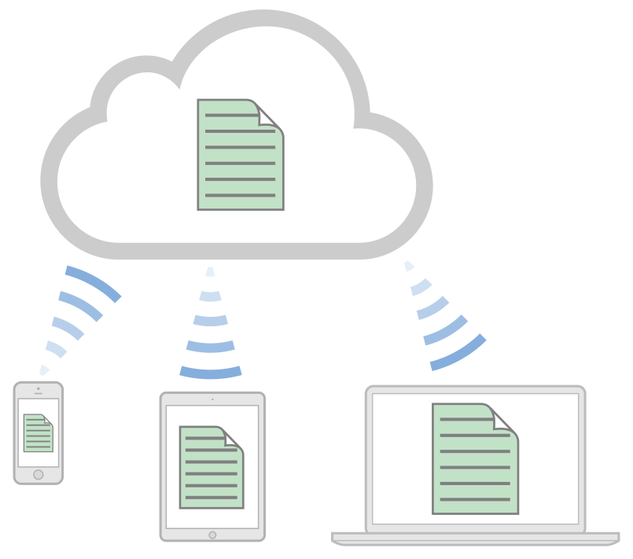
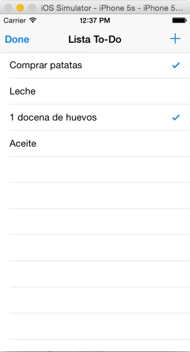
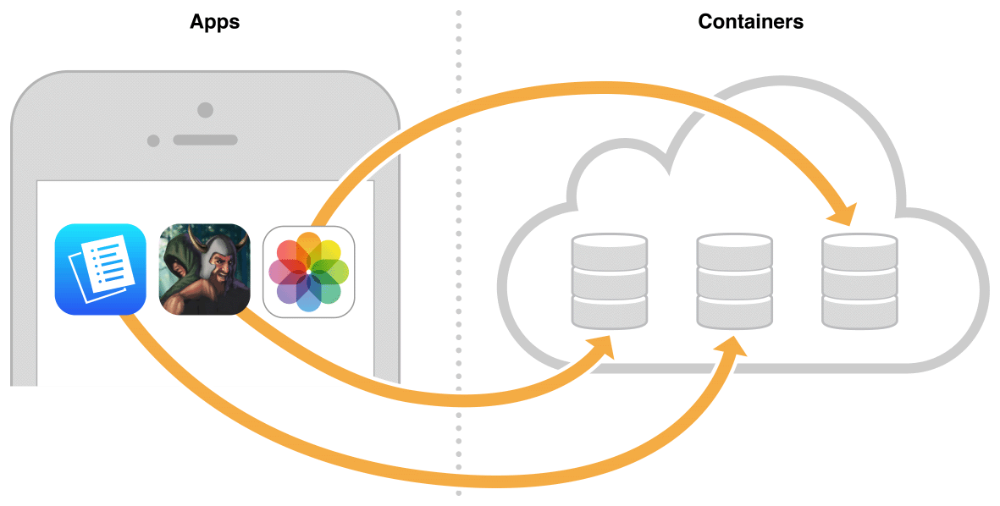
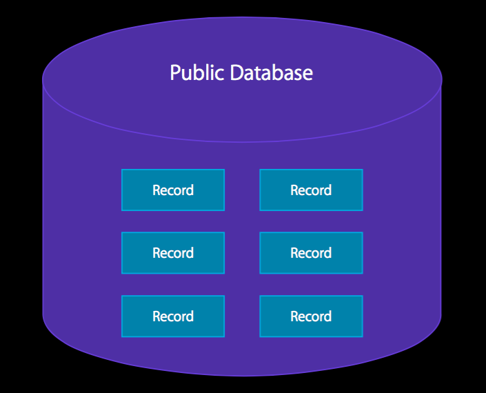
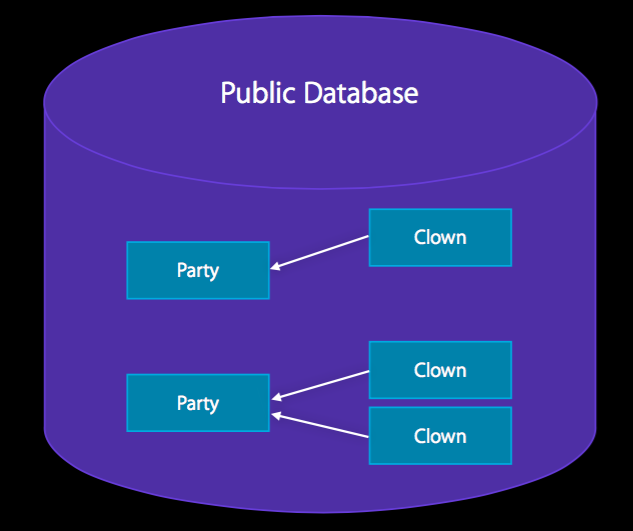
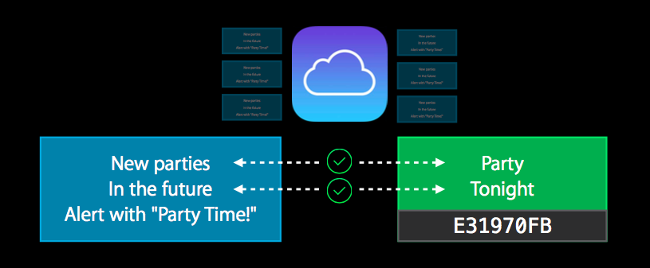

<!--
Referencias:
WWDC vídeo What's next in CoreData: https://developer.apple.com/videos/wwdc/2014/?id=225
WWDC vídeo Advanced CloudKit: https://developer.apple.com/videos/wwdc/2014/?id=231
WWDC vídeo Introducing CloudKit: https://developer.apple.com/videos/wwdc/2014/?id=208
iCloud Design Guide: https://developer.apple.com/library/ios/documentation/General/Conceptual/iCloudDesignGuide/Chapters/Introduction.html
CloudKit Quick Start: https://developer.apple.com/library/ios/documentation/DataManagement/Conceptual/CloudKitQuickStart/Introduction/Introduction.html#//apple_ref/doc/uid/TP40014987


Xamarin Tutorial CloudKit: http://developer.xamarin.com/guides/ios/platform_features/intro_to_cloudkit/
Ray Wenderlich Core Data Tutorial con Swift: http://www.raywenderlich.com/85578/first-core-data-app-using-swift


-->

# Sesión 4: iCloud

### Servicios de las plataformas móviles - iOS

<small>Domingo Gallardo - domingo.gallardo@ua.es  
Departamento Ciencia de la Computación e Inteligencia Artificial  
Master Programación de Dispositivos Móviles</small> 

<!-- Tres líneas en blanco para la siguiente transparencia -->


### Referencias

- [iCloud Design Guide](https://developer.apple.com/library/ios/documentation/General/Conceptual/iCloudDesignGuide/Chapters/Introduction.html#//apple_ref/doc/uid/TP40012094)
- [CloudKit Quick Start](https://developer.apple.com/library/ios/documentation/DataManagement/Conceptual/CloudKitQuickStart/Introduction/Introduction.html#//apple_ref/doc/uid/TP40014987)
- [iCloud Programming Guide for Core Data](https://developer.apple.com/library/ios/documentation/DataManagement/Conceptual/UsingCoreDataWithiCloudPG/Introduction/Introduction.html#//apple_ref/doc/uid/TP40013491)

<!-- Tres líneas en blanco para la siguiente transparencia -->


### iCloud
<!-- .slide: class="image-right"-->



- iCloud es un servicio de Apple que permite a un usuario acceder a su contenido personal (datos, documentos) en todos sus dispositivos utilizando su Apple ID.
- iCloud consigue esto combinando almacenamiento en la nube y APIs dedicadas integradas en el sistema operativo.
- Apple proporciona la infraestructura de servidores, de transmisión de datos y de cuentas de usuario, facilitando el trabajo a los desarrolladores que no necesitan crear sus propios servicios ni recurrir a soluciones de terceros.

<!-- Tres líneas en blanco para la siguiente transparencia -->


### Filosofía de iCloud

- La idea principal tras iCloud es eliminar la sincronización explícita entre dispositivos.
- Un usuario nunca necesita pensar sobre la sincronización, y la app nunca interactúa directamente con los servidores de iCloud.
- Para el usuario, los cambios aparecen automáticamente en todos los dispositivos conectados a la cuenta iCloud.
- Para el desarrollador, depende del API de iCloud que se utilice estos cambios son más o menos automáticos.


<!-- Tres líneas en blanco para la siguiente transparencia -->


### Cuenta iCloud

- Todo usuario de Apple puede activar una cuenta de iCloud usando su Apple ID
- Permite identificarse y mantenerse logeado en el dispositivo
- Puede activarse desde un Mac, desde un dispositivo iOS, desde la web o desde el simulador
- Permite mantener el estado en aplicaciones ejecutándose en distintos dispositivos: Recordatorios, Notas, ...

<!-- Tres líneas en blanco para la siguiente transparencia -->


### Distintas APIs

- Almacenamiento **clave-valor en iCloud**: para mantener el estado de la aplicación (puntuación de un juego, última página leída, etc.).
- **Documentos en iCloud**: para mantener documentos sincronizados.
- **iCloud con Core Data**: para mantener de forma automática en iCloud una copia de todos los datos de la app gestionados con Core Data. Versión inicial con muchos problemas, muy mejorado en las últimas versiones.
- **CloudKit** (iOS 8): nueva tecnología en iOS 8 que permite mayor flexibilidad y control. Basado en registros con diccionarios clave-valor, enfoque muy similar a las tecnologías NoSQL. 
  - API de transporte que no mantiene un estado local.
  - Basada en peticiones y respuestas asíncronas.

<!-- Tres líneas en blanco para la siguiente transparencia -->


### Preparación de aprovisionamiento y permisos para iCloud

- Para desarrollar con iCloud es necesario estar registrado como desarrollador, puedes hacerlo con tu Apple ID registrado en el equipo de la UA.
- Para usar los servicios de iCloud es necesario crear un perfil de aprovisionamiento con un App Id concreto, añadir el servicio de iCloud y activar el permiso (_capabilities_) en la app con XCode.
- Si estás registrado en el equipo de desarrollo con un rol de administrador (o tienes una cuenta de pago en la que tienes todos los permisos de tu equipo), lo puedes hacer todo desde XCode.

<!-- Tres líneas en blanco para la siguiente transparencia -->


### Clave-valor
<!-- .slide: class="image-right"-->


- Permite guardar y recuperar en iCloud claves y valores desde los dispositivos en los que el usuario está registrado con su Apple Id.
- Para acceder a los valores debemos usar la clase [NSUbiquitousKeyValueStore](https://developer.apple.com/library/ios/documentation/Foundation/Reference/NSUbiquitousKeyValueStore_class/index.html).
- Puedes almacenar `String`s, valores escalares como `BOOL` o `Double`, diccionarios y también objetos de cualquiera de los siguientes tipos: `NSNumber`, `NSString`, `NSDate`, `NSData`, `NSArray`, or `NSDictionary`.
- El espacio de almacenamiento total, para un usuario dado, es de 1 MB y un máximo de 1024 claves.

<!-- Tres líneas en blanco para la siguiente transparencia -->


### `NSUbiquitousKeyValueStore`

- A partir de la clase NSUbiquitousKeyValueStore se obtiene el `defaultStore()` (una instancia también de la misma clase):

```swift
let iCloudStore = NSUbiquitousKeyValueStore.defaultStore() 
let itemsiCloud = iCloudStore.longLongForKey("itemsDone")
```

<!-- Tres líneas en blanco para la siguiente transparencia -->


### Obtención de valores del almacén de claves-valor

- Funciones que obtienen los distintos tipos de datos a partir de una clave (una cadena):
    - `arrayForKey`
    - `boolForKey`
    - `dictionaryForKey`
    - `StringForKey`
    - ...

- Por ejemplo, [`longlongForKey`](https://developer.apple.com/library/ios/documentation/Foundation/Reference/NSUbiquitousKeyValueStore_class/index.html#//apple_ref/occ/instm/NSUbiquitousKeyValueStore/longLongForKey:)  devuelve el valor long long (`Int64`) asociado a una clave especificada:

```swift
func longlongForKey(_ aKey: String) -> Int64
```

- Parámetros y resultados del método:
    - `aKey`: la clave en el almacén de claves-valor
    - Devuelve: el valor asociado a la clave o 0 si la clave no existe o no contiene un valor numérico

<!-- Tres líneas en blanco para la siguiente transparencia -->


### Por ejemplo, en el _ViewController_

```swift
func loadNumTerminados() {
    let store = NSUbiquitousKeyValueStore.defaultStore()
    let itemsStore = store.longLongForKey("numItemsDone")
    if (itemsStore > 0) {
        itemsTerminados = Int(itemsStore)
        println("Leído de iCloud: \(itemsTerminados) ítems terminados")
    } else {
        println("Sin valor en iCloud de ítems terminados")
    }
}
```

<!-- Tres líneas en blanco para la siguiente transparencia -->


### Guardar valores en el almacén de claves-valor

- Para actualizar los valores hay que usar los métodos _setters_:
    - `setArray(_:forKey:)`
    - `setBool(_:forKey:)`
    - `setDiccionary(_:forKey_)`
    - ...


- Por ejemplo, [`setLongLong(_:forKey:)`](https://developer.apple.com/library/ios/documentation/Foundation/Reference/NSUbiquitousKeyValueStore_class/index.html#//apple_ref/occ/instm/NSUbiquitousKeyValueStore/setLongLong:forKey:) actualiza en el almacén el valor long long (`Int64`) asociándolo a una clave especificada:

```swift
func setLongLong(_ value: Int64, forKey aKey: String)
```

- Parámetros del método:
  - `value`: El valor long long que se quiere almacenar.
  - `aKey`: La clave en la que se almacena el valor.

<!-- Tres líneas en blanco para la siguiente transparencia -->


### Por ejemplo, en el `ViewController`

```swift
func saveNumItemsTerminados() {
    let store = NSUbiquitousKeyValueStore.defaultStore()
    store.setLongLong(Int64(itemsTerminados), forKey: "numItemsDone")
}
```
<!-- Tres líneas en blanco para la siguiente transparencia -->


### Método `synchronize`

```swift
func synchronize() -> Bool
```
- Devuelve `true` si las claves y valores en memoria y en disco están sincronizados o `false` si ha sucedido algún error. Por ejemplo, devuelve `false` si la app no se ha compilado con las peticiones adecuadas de _entitlement_.

- Se recomienda llamar a este método sólo en el momento de lanzar la app, o cuando vuelve al primer plano.

- Los cambios al almacén de claves-valor se salvan en memoria. El sistema sincroniza automáticamente estos datos con la caché del disco en los momentos apropiados. Por ejemplo, cuando el app pasa a segundo plano o cuando se reciben cambios de iCloud.

- Este método no fuerza la subida a iCloud de los nuevos valores y claves, sino que hace saber a iCloud que los valores están listos para ser subidos. El sistema controla cuándo subir los datos. La frecuencia de subida está limitada a bastantes por minuto.

<!-- Tres líneas en blanco para la siguiente transparencia -->


### Ejemplo de uso de `synchronize`


```swift
func application(application: UIApplication, didFinishLaunchingWithOptions launchOptions: [NSObject: AnyObject]?) -> Bool {
    let store = NSUbiquitousKeyValueStore.defaultStore()
    if (store.synchronize()) {
        println("Sincronización OK")
    } else {
        println("Problemas en la sincronización")
    }
    return true
}
```

<!-- Tres líneas en blanco para la siguiente transparencia -->


### Definiendo un observador de cambios

- Además de almacenar los valores podemos recibir notificaciones de cambio de los valores en otros dispositivos conectados a iCloud.
- En el lanzamiento del app hay que registrarse para la notificación `NSUbiquitousKeyValueStoreDidChangeExternallyNotification`.
- La notificación se envía cuando el valor de una o más claves han cambiado debido a datos que han llegado desde iCloud. La notificación no se envía cuando la propia app ha cambiado los valores.
- El diccionario atributo `userInfo` de la notificación contiene la razón de la notificación, así como una lista de los valores cambiados.
- El objeto en la notificación es el `NSUbiquitousKeyValueStore` cuyo contenido ha cambiado.

<!-- Tres líneas en blanco para la siguiente transparencia -->


### Ejemplo de definición de un observador de la notifiación

- Registramos una clausura para la notificación `NSUbiquitousKeyValueStoreDidChangeExternallyNotification` en el momento de lanzar la app, y llamamos al método `synchronize()` para obtener las parejas de claves-valor más recientes.

```swift
func application(application: UIApplication, didFinishLaunchingWithOptions launchOptions: [NSObject: AnyObject]?) -> Bool {
    NSNotificationCenter.defaultCenter().addObserverForName(
        NSUbiquitousKeyValueStoreDidChangeExternallyNotification, 
        object: NSUbiquitousKeyValueStore.defaultStore(), 
        queue: NSOperationQueue.mainQueue()) { 
            (notification) in 
                let ubiquitousKeyValueStore = 
                    notification.object as! NSUbiquitousKeyValueStore
                ubiquitousKeyValueStore.synchronize()
        }
    return true
}
```

<!-- Tres líneas en blanco para la siguiente transparencia -->


### Práctica: ToDoList con iCloud clave-valor

<!-- .slide: data-background="#cbe0fc"-->
<!-- .slide: class="image-right"-->



- Se ha dejado la app `es.ua.mastermoviles.ToDoList` en el repositorio [plantillas-servicios-ios](https://bitbucket.org/mastermoviles/plantillas-servicios-ios/) de Bitbucket.
- Modifica la aplicación ToDoList en el almacén clave-valor de iCloud para que se guarden los datos en el almacén clave-valor de iCloud del usuario.
- Debes usar el perfil de aprovisionamiento `Master iCloud: es.ua.mastermoviles.ToDoList`
- La sincronización con iCloud no funciona del todo bien el simulador. Debes reiniciar el simulador cada vez que quieras actualizar los valores de iCloud. Lo probaremos en el dispositivo real. Para hacer las pruebas en el simulador debes registrarte con tu cuenta de iCloud en el simulador.

<!-- Tres líneas en blanco para la siguiente transparencia -->


## CloudKit

<!-- Tres líneas en blanco para la siguiente transparencia -->


### Introducción a CloudKit
<!-- .slide: class="image-right"-->


- CloudKit es un proyecto interno de Apple en el que se basan muchas de sus APIs de persistencia.
- Su uso se ofrece a les desarrolladores en la WWDC de 2014, para apps en iOS 8.
- Acceso a servidores de iCloud.
- Usa las cuentas iCloud de los usuarios.
- Bases de datos públicas (de la app) y privadas (de cada usuario).
- Permite datos estructurados y datos _bulk_.
- Tecnología de transporte, no proporciona base de datos local.

<!-- Tres líneas en blanco para la siguiente transparencia -->


#### CloudKit trabaja sobre registros en iCloud

- CloudKit proporciona una forma de mover datos estructurados entre tu aplicación y iCloud.
- CloudKit trabaja sobre registros, diccionarios de parejas clave-valor con cada clave representando un campo del registro.
- El valor de cada campo suele ser un tipo de datos simple como una cadena, una fecha o un número, pero es posible almacenar también bloques de datos arbitrarios (ficheros),
- Es posible guardar en los valores referencias a otros registros, permitiendo definir relaciones entre registros.


<!-- Tres líneas en blanco para la siguiente transparencia -->


#### Tecnología de transporte

- CloudKit no proporciona ninguna forma de almacenar datos localmente.
- Es un servicio para mover datos a y desde iCloud y no está pensado para reemplazar los modelos de datos ya existentes en tu app (CoreData).
- El objetivo del framework es complementar estos modelos con una forma de empaquetar los datos para iCloud y recibir actualizaciones posteriores sobre esos datos.
- Con CloudKit, tu eres el responsable de mover los datos desde tu app a iCloud y desde iCloud a la App. Aunque CloudKit proporciona facilidades para mantenerte informado cuando sucede un cambio, tu debes obtener esos cambios explícitamente.
- Debido a que eres el responsable de obtener y salvar los datos, debes de asegurarte de que los datos se obtienen en el momento oportuno y en el orden correcto, y de manejar los errores que se producen.

<!-- Tres líneas en blanco para la siguiente transparencia -->


### Elementos de CloudKit

- Contenedores
- Bases de datos
- Registros
- Zonas de registros
- Identificadores
- Referencias 
- _Assets_


<!-- Tres líneas en blanco para la siguiente transparencia -->


### Contenedores 

<!-- .slide: class="image-right"-->



- Múltiples apps y usuarios tienen acceso a iCloud, pero los datos se encuentran segregados y encapsulados en particiones llamadas `contenedores`.
- Los contenedores de tus apps no pueden ser usados por apps de otro desarrollador.
- Puedes compartir un contenedor entre varias apps.
- Existe un contenedor por defecto para cada app, pero puedes crear contenedores adicionales.
- El identificador por defecto se llama igual que el bundle ID de la app.
- Los contenedores adicionales deben tener un nombre único entre todas las apps de los desarrolladores. 
- **Los contenedores no pueden borrarse.**

<!-- Tres líneas en blanco para la siguiente transparencia -->


### Dashboard

- _Dashboard_ es una interfaz web con la que podemos gestionar nuestros contenedores
- Acceso restringido al administrador del equipo de desarrollo (en los equipos con múltiples desarrolladores)
- [https://icloud.developer.apple.com/dashboard/](https://icloud.developer.apple.com/dashboard/)
- Permite crear registros, definir sus atributos, definir permisos de acceso, etc.


<!-- Tres líneas en blanco para la siguiente transparencia -->


### Clase CKContainer

- La clase con la que trabajar para gestionar el contenedor es [CKContainer](https://developer.apple.com/library/ios/documentation/CloudKit/Reference/CKContainer_class/index.html#//apple_ref/occ/cl/CKContainer)
- La debemos usar para:
  - Obtener las bases de datos públicas y privadas
  - Obtener el identificador del contenedor
  - Determinar el estado del acceso de la cuenta iCloud del usuario
  - Solicitar y determinar permisos de la app
  - Ejecutar operaciones sobre el contenedor
  - Descubrir registros de usuarios 

<!-- Tres líneas en blanco para la siguiente transparencia -->


### Ejemplo: Información de otros usuarios

- La función `discoverAllContactUserInfosWithCompletionHandler` de `CKContainer` permite implementar funciones sociales en nuestras app.

```swift
func discoverAllContactUserInfosWithCompletionHandler(_ 
               completionHandler: (([AnyObject]!, NSError!) -> Void)!)
```

- `completionHandler` es una clausura que se ejecutará cuando lleguen los resultados. Debe ser capaz de ejecutarse en cualquier hilo de la app.
- No devuelve ningún valor, y toma dos parámetros:
   - `userInfos`: Un array de objetos `CKDiscoveredUserInfo`. Cada objeto en el array contiene información sobre el usuario, incluyendo el ID de su registro de usuario correspondiente. Si no hay usuarios, el array estará vacío. error	
   - Un objeto error si sucede algún problema, o `nil` si los IDs se han obtenido correctamente.


<!-- Tres líneas en blanco para la siguiente transparencia -->


### Bases de datos


<!-- Tres líneas en blanco para la siguiente transparencia -->


### Bases de datos


<!-- Tres líneas en blanco para la siguiente transparencia -->


### Bases de datos

- Las bases de datos son instancias de la clase [`CKDatabase`](https://developer.apple.com/library/ios/documentation/CloudKit/Reference/CKDatabase_class/index.html#//apple_ref/occ/cl/CKDatabase)
- Cada app tiene acceso a dos bases de datos
  - Base de datos pública
  - Base de datos privada
- Se obtienen a través del `CKContainer`:

```swift
let container : CKContainer
let publicDB : CKDatabase
let privateDB : CKDatabase
 
init() {
  container = CKContainer.defaultContainer() 
  publicDB = container.publicCloudDatabase 
  privateDB = container.privateCloudDatabase 
}
```

<!-- Tres líneas en blanco para la siguiente transparencia -->


### Bases de datos


<!-- Tres líneas en blanco para la siguiente transparencia -->


### Registros




<!-- Tres líneas en blanco para la siguiente transparencia -->


### Registros

- Se definen con la clase [CKRecord](https://developer.apple.com/library/ios/documentation/CloudKit/Reference/CKRecord_class/)
- Datos estructurados
- Conjunto de parejas clave y valor

<!-- Tres líneas en blanco para la siguiente transparencia -->


### Datos en los registros

- `NSString`
- `NSNumber`
- `NSData`
- `NSDate`
- `CLLocation`
- `CKReference`
- `CKAsset`
- Arrays de todo lo anterior

<!-- Tres líneas en blanco para la siguiente transparencia -->


### Uso de clave-valor para los datos en los registros


```swift
let party = CKRecord(recordType: “Party”)
party.setValue("Post Presentation Beers", forkey:"summary")
let summary = party.objectForKey("summary")
```

<!-- Tres líneas en blanco para la siguiente transparencia -->


### Relaciones entre registros: referencias




<!-- Tres líneas en blanco para la siguiente transparencia -->


### Referencias

<!-- .slide: class="image-right"-->


- Clase [CKReference](https://developer.apple.com/library/ios/documentation/CloudKit/Reference/CKReference_class/index.html#//apple_ref/occ/cl/CKReference)
- El servidor entiende las relaciones _Padre_ _Hijo_
- Borrados en cascada
- Cuidado con los problemas de integridad, será normal que no existan referencias
- Se prefieren las referencias hacia atrás para modelar las relaciones anteriores

<!-- Tres líneas en blanco para la siguiente transparencia -->


### Queries y suscripciones



- Posibilidad de hacer consultas "permanentes"
- Ejecutadas en background por el servidor tras cada registro salvado
- Generan notificaciones push con los resultados

<!-- Tres líneas en blanco para la siguiente transparencia -->


### Flujo de trabajo

- Obtener el objeto CKContainer
- Obtener la CKDatabase que contiene los registros que buscamos
- Identificar los registros que queremos conseguir:
  - Si conocemos sus IDs, crear un `CKFetchRecordsOperation` para recuperarlos
  - Si no conocemos los IDs crear una `CKQuery` con un criterio de búsqueda y ejecutar la búsqueda.
  - Asignar clausuras a los _completion handlers_ de las búsquedas. Usar las clausuras para procesar los resultados.
  - Pasar los objetos operación al método `addOperation` de la `CKDatabase` para encolar la operación. 
  - La operación envía asíncronamente los resultados a las clausuras.
- Para salvar registros creados o modificados, crear un `CKModifyRecordsOperation`con el objeto que queremos salvar. Ejecutar la operación de la misma forma que antes. El resultado llega de forma asíncrona e informa del estado de la operación.

<!-- Tres líneas en blanco para la siguiente transparencia -->


# Master Programación <br/> de Dispositivos Móviles


