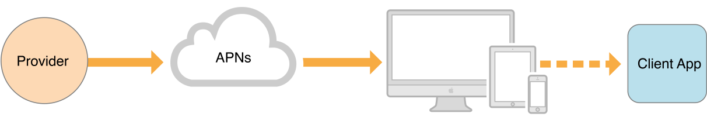
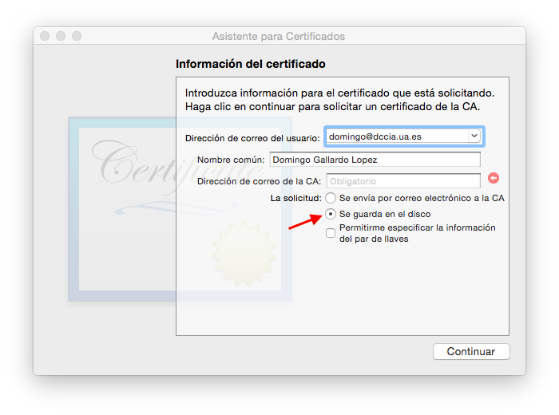
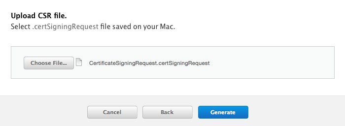
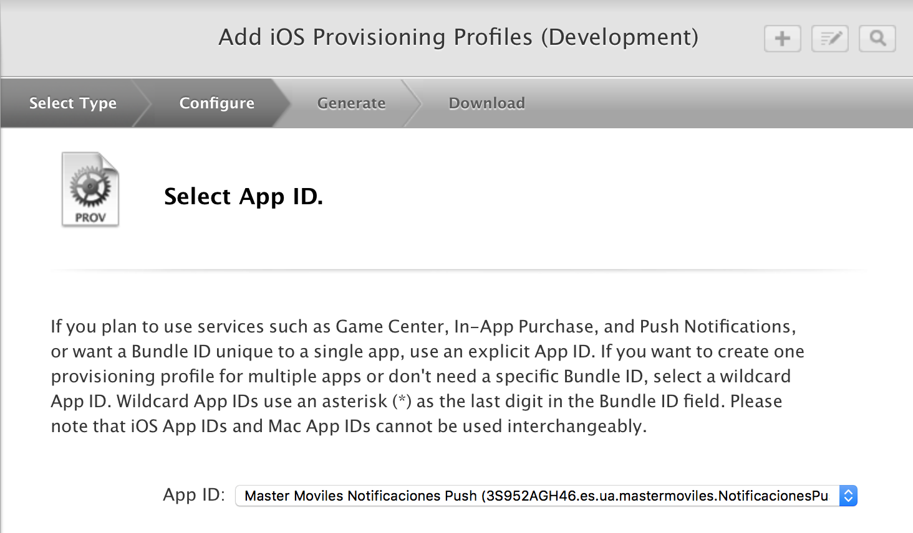
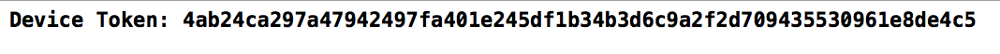

# Sesión 4: <br/> Notificaciones remotas (push)

## Servicios de las plataformas móviles - iOS

<small>Domingo Gallardo - domingo.gallardo@ua.es  
Departamento Ciencia de la Computación e Inteligencia Artificial  
Master Programación de Dispositivos Móviles  
2016-17</small>

<!-- Tres líneas en blanco para la siguiente transparencia -->


## Notificaciones remotas (_push_)


<!-- Tres líneas en blanco para la siguiente transparencia -->


## Objetivo de las notificaciones remotas


- La app tiene un componente _server-side_ en el que se detecta que
  ha sucedido algo interesante para el usuario.
- La notificación remota permite enviar la información desde el
  servicio directamente al usuario.
- También es posible enviar una notificación invisible que llega a la
  app para que descargue nueva información en _background_ y la
  muestre instantáneamente la siguiente vez que el usuario acceda a la
  app. 
- El envío de notificaciones se hace a través del APNs (_Apple Push
  Notification service_).

<!-- Tres líneas en blanco para la siguiente transparencia -->


## Arquitectura de las notificaciones remotas



- Apple Push Notification service (APNs) es la pieza central de las
  notificaciones remotas. Es un servicio robusto y altamente eficiente
  para propagar información a dispositivos iOS y OS X.
- Cada dispositivo establece una conexión acreditada y encriptada con
  el servicio y recibe notificaciones sobre esta conexión persistente.
- Si llega una notificación para una app cuando el dispositivo está
  fuera de cobertura, el APNs guarda la notificación hasta que el
  dispositivo vuelve a estar disponible.
- Las notificaciones se originan en servidores (_proveedores_) propios
  del desarrollador. Los proveedores se conectan con el APNs y reciben
  datos de sus apps clientes. Cuando llegan nuevos datos para un app,
  los proveedores preparan y envían notificaciones a través de los
  canales al APNs, que se encarga de enviarlas a los dispositivos.

<!-- Tres líneas en blanco para la siguiente transparencia -->


## Arquitectura de seguridad

<!-- .slide: class="image-right"-->


- No queremos que nuestras notificaciones (con datos personales)
  puedan aparecer en otros dispositivos.
- El servicio de notificaciones remota de Apple (APNs) define unas
  condiciones de seguridad bastante estrictas tanto entre dispositivo
  y servicio como entre proveedor y el servicio.
- Seguridad en la **conexión Proveedor-APNs**
    - Basada en JWT (JSON web tokens) o basada en un certificado.
    - Utilizaremos la seguridad basada en un certificado, obteniéndolo
      en el _member center_ y usándolo para que el APNs confíe en los
      mensajes que recibe del proveedor.
- Seguridad en la **conexión APNs-Dispositivo**
    - Basada en un _token de dispositivo_ (único para cada dispositivo
      y encriptado con su clave privada) que envía el APNs al
      dispositivo y que debe estar presente en cada petición del
      proveedor al APNs.

<!-- Tres líneas en blanco para la siguiente transparencia -->


## Secuencia de registro del dispositivo

<!-- .slide: class="image-right"-->


- Sin considerar aspectos de seguridad y codificación, los pasos que
  se siguen al registrarse un dispositivo con el método de la clase
  `Application`
  [registerForRemoteNotifications()](https://developer.apple.com/reference/uikit/uiapplication/1623078-registerforremotenotifications)
  son los siguientes:


1. El dispositivo establece una conexión SSL con el APNs.
2. El APNs le envía un _token_ único asociado con el dispositivo.
3. El dispositivo le envía el _token_ al app.
4. El app envía el _token_ a su servidor (_Provider_) para que lo
   utilice a partir de ese momento en cada petición de notificación
   realizada al APNs.

<!-- Tres líneas en blanco para la siguiente transparencia -->


## Token del dispositivo

<!-- .slide: class="image-right"-->


- Cada dispositivo iOS tiene un certificado y una clave privada
  criptográfica, proporcionada por el sistema operativo en la
  activación inicial y almacenada en el llavero del dispositivo.
- Este certificado sirve para establecer una conexión segura basada en
  TLS con el APNs. Con la conexión TLS activa, las apps en el dispositivo pueden
  registrarse con APNs para recibir un token específico para recibir
  notificaciones remotas.
- El APNs genera el token, que contiene la información del dispositivo,
  lo encripta utilizando una clave asociada al token y lo envía al
  dispositivo. El sistema entrega el token encriptado a la app,
  llamando al método del delegado
  `application:didRegisterForRemoteNotificationsWithDeviceToken:`.
- Una vez recibido el token, el app debe enviarlo al proveedor (en
  formato binario o hexadecimal) para que lo utilice para enviar
  notificaciones al dispositivo.

<!-- Tres líneas en blanco para la siguiente transparencia -->


## Envío de notificación remota usando el token

<!-- .slide: class="image-right"-->


- Cuando el servidor envía una petición de notificación al APNs,
  incluye el token del dispositivo.
- El APNs desencripta el token para asegurarse de la validez de la
  petición y determina el dispositivo de destino.
- Si el APNs determina que el emisor y el receptor son legítimos,
  envía la notificación al dispositivo identificado.

<!-- Tres líneas en blanco para la siguiente transparencia -->


## Contenido de la notificación

- Una vez definido el mecanismo de seguridad en el envío de las
  notificaciones, veamos cómo se define el **contenido** de la
  notificación.
- El mensaje enviado al APNs se denomina _payload_ y debe cumplir unas
  condiciones estrictas definidas en la
  [documentación de Apple](https://developer.apple.com/library/ios/documentation/NetworkingInternet/Conceptual/RemoteNotificationsPG/Chapters/TheNotificationPayload.html#//apple_ref/doc/uid/TP40008194-CH107-SW1).
- Si se utiliza el API HTTP/2 el tamaño máximo está limitado a 4096
  bytes.
- Debe tener el formato de un objeto JSON diccionario (parejas clave,
  valor).

```json
{
    "aps" : {
        "alert" : {
            "title" : "Introducción a las notificaciones",
            "subtitle" : "Sesión 707",
            "body" : "La nueva API de notificaciones es genial!!!",
            "category" : "mensaje",
        },
        "badge" : 1
    },
}
```


<!-- Tres líneas en blanco para la siguiente transparencia -->


## Contenido de la notificación (2)

- El diccionario debe contener otro diccionario identificado por la
  clave `aps`. Este diccionario contiene una o más propiedades que
  especifican los siguientes tipos de notificación:
    - Mensaje de alerta a mostrar al usuario
    - Numero a añadir en el globo del icono de la app
    - Sonido a tocar
- El diccionario `aps` también puede tener la clave
  `content-available` con un valor de 1. Eso significa que la
  notificación será una notificación silenciosa que hará que el
  sistema despierte la app y la ponga en _background_ para que pueda
  conectarse al servidor o hacer alguna tarea de background. El
  usuario no recibirá ninguna notificación, pero verá el nuevo
  contenido la siguiente vez que abra la app.
- El resto del diccionario contendrá parejas clave-valor con
  información _custom_.
- La información JSON se convierte en un diccionario que se pasa como
  parámetro `userInfor` en el método
  [`didReceiveRemoteNotification`](https://developer.apple.com/library/ios/documentation/UIKit/Reference/UIApplicationDelegate_Protocol/index.html#//apple_ref/occ/intfm/UIApplicationDelegate/application:didReceiveRemoteNotification:fetchCompletionHandler:)
  del delegado del app.

<!-- Tres líneas en blanco para la siguiente transparencia -->


## Otros ejemplos de _payload_

```json
{
    "aps" : {
        "alert" : "You got your emails.",
        "badge" : 9,
        "sound" : "bingbong.aiff"
    },
    "acme1" : "bar",
    "acme2" : 42
}
```

```json
{
    "aps" : {
        "alert" : {
            "loc-key" : "GAME_PLAY_REQUEST_FORMAT",
            "loc-args" : [ "Jenna", "Frank"]
        },
        "sound" : "chime.aiff"
    },
    "acme" : "foo"
}
```

<!-- Tres líneas en blanco para la siguiente transparencia -->


## Otros ejemplos de _payload_

```json
{
   "aps" : {
      "alert” : {
         “body” : "Acme message received from Johnny Appleseed”,
         “action-loc-key” : “VIEW”,
         "actions" : [
            {
               “id" : “delete",
               "title" : "Delete"
            },
            {
               “id" : “reply-to”,
               "loc-key" : “REPLYTO”,
               "loc-args" : [“Jane"]
            }
         ]
      }
      "badge" : 3,
      "sound" : “chime.aiff"
   },
   "acme-account" : "jane.appleseed@apple.com",
   "acme-message" : "message123456"
}
```

<!-- Tres líneas en blanco para la siguiente transparencia -->


## Servidores proveedores

- Las notificaciones remotas se deben originar en un servidor
  proveedor nuestro que debe conectarse con el APNs usando la API
  definida en la
  [documentación de Apple](https://developer.apple.com/library/prerelease/content/documentation/NetworkingInternet/Conceptual/RemoteNotificationsPG/CommunicatingwithAPNs.html#//apple_ref/doc/uid/TP40008194-CH11-SW1). Esta
  API usa el protocolo HTTP/2 desde diciembre de 2015.
- La mayoría de servicios PaaS proporcionan conexiones con el APNs y
  librerías que facilitan el envío de notificaciones:
    - [Firebase Cloud Messaging for iOS](https://developers.google.com/cloud-messaging/ios/start?ver=swift)
    - [Amazon Web Services](http://docs.aws.amazon.com/sns/latest/dg/mobile-push-apns.html)
    - [Microsoft Azure](https://azure.microsoft.com/en-us/documentation/articles/notification-hubs-ios-get-started/)
- Otras alternativas, como [Parse](http://parse.com/), que utilizamos
  en un curso pasado, han ido desapareciendo o han ido cambiando de
  configuración.
- Una opción sencilla, que usaremos en la práctica, es usar un
  [script PHP](https://gist.github.com/domingogallardo/b7946d8fe500187b426afb7ac8d8e470)
  desde el terminal.

<!-- Tres líneas en blanco para la siguiente transparencia -->


## Pasos necesarios para la primera parte de la práctica

- En la primera parte de la práctica vamos a hacer una demostración en
  la que podremos comprobar cómo se envían y reciben notificaciones
  remotas.
- Ejecutaremos una app que va a recibir las notificaciones
  ([NotificacionesPush]()) en un dispositivo real.
- Cada estudiante podrá enviar notificaciones a este dispositivo real
  utilizando un script en PHP.
- Para configurar el script PHP necesitamos:
    - Certificado SSL autorizado por el APNs para enviar
      notificaciones
    - Token del dispositivo al que se envía la notificación.
- Para ello necesitaremos crear en el _member center_ un _App ID_ y
configurar: 
    - **Certificado SSL** para autentificar el proveedor de
      notificaciones frente al APNs.
    - **Perfil de aprovisionamiento** con la capacidad de notificación push.

<!-- Tres líneas en blanco para la siguiente transparencia -->


## Nuevo App ID en el _member center_ (1)

- Un administrador del equipo UA debe crear una App ID con el nombre
  explícito de la app que se va a poner en producción.


<!-- Tres líneas en blanco para la siguiente transparencia -->


## Nuevo App ID en el _member center_ (2)

- Se debe añadir en el App ID la autorización de notificaciones push.


<!-- Tres líneas en blanco para la siguiente transparencia -->


## Creación del certificado SSL en el _member center_ (1)

- Debemos obtener un certificado de una autoridad de certificación que
  después subiremos al _member center_.
- Abrimos Acceso a Llaveros y seleccionamos _Acceso a Llaveros >
  Asistente de Certificados > Solicitar un certificado de una
  autoridad de certificación_.
- Salvamos el fichero `CertificateSigningRequest.certSigningRequest`.



<!-- Tres líneas en blanco para la siguiente transparencia -->


## Creación del certificado SSL en el _member center_ (2)


<!-- Tres líneas en blanco para la siguiente transparencia -->


## Creación del certificado SSL en el _member center_ (3)

- Para crear el certificado es necesario subir el fichero generado
  previamente `CertificateSigningRequest.certSigningRequest`

 




<!-- Tres líneas en blanco para la siguiente transparencia -->


## Creación del perfil de aprovisionamiento 

- Creamos un nuevo perfil de aprovisionamiento que podrán usar todos
  los miembros del equipo.




<!-- Tres líneas en blanco para la siguiente transparencia -->


## Generación del fichero `.pem` (1)

- Una vez creado el certificado en el _Member Center_ lo descargamos y
  lo instalamos en Acceso a llaveros, lo exportamos como fichero
  `.p12` y después lo convertiremos en un fichero `.pem` con el que
  nuestro servidor establecerá la conexión SSL con el APNs.


- Se guarda el certificado como `UADevelopmentPushCertificate.p12` con
  una contraseña (mastermoviles17)

<!-- Tres líneas en blanco para la siguiente transparencia -->


## Generación del fichero `.pem` (2)

- Creamos el fichero `.pem` con el siguiente comando:

```
$ openssl pkcs12 -in UADevelopmentPushCertificate.p12 \
   -out UADevelopmentPushCertificate.pem -nodes -clcerts
```

- Nos pedirá la contraseña que hemos introducido antes y se generará
  el certificado `UADevelopmentPushCertificate.pem`.
- Podrás usarlo para enviar la notificación push al APNs con un script PHP.

<!-- Tres líneas en blanco para la siguiente transparencia -->


## Obtención del token del dispositivo

- Ya hemos obtenido el certificado SSL que utilizaremos en el script
  PHP para enviar las notificaciones al APNs.
- Necesitamos obtener el token del dispositivo.
- Para ello hemos incluido en la app el código que imprime el token en
  la consola una vez recibido del APNs.
- Repasemos el código y la configuración de la app `NotificacionesPush`.

<!-- Tres líneas en blanco para la siguiente transparencia -->


## Registro de las notificaciones

- Igual que con las notificaciones locales, en `application(application:didFinishLaunchingWithOptions)`
  se realiza el registro de las notificaciones:

```swift
func application(application: UIApplication, 
                 didFinishLaunchingWithOptions launchOptions: [NSObject: AnyObject]?) -> Bool {
    // ...
    let notificationSettings = UIUserNotificationSettings(
          types: [.badge, .sound, .alert],
          categories: nil)
    application.registerUserNotificationSettings(notificationSettings)

    // ...
}
```

<!-- Tres líneas en blanco para la siguiente transparencia -->


## Obtención del token del dispositivo (1)

- El método `registerForRemoteNotifications` es el que se encarga de
  establecer al conexión con el APNs y solicitar el token de
  conexión. Se le invoca en el manejador
  `didRegisterUserNotificationSettings` al que se llama cuando el
  usuario ha aceptado recibir notificaciones.

```swift
func application(_ application: UIApplication, 
                 didRegister notificationSettings: UIUserNotificationSettings) {
    if notificationSettings.types != .none {
        application.registerForRemoteNotifications()
    }
}
```

<!-- Tres líneas en blanco para la siguiente transparencia -->


## Obtención del token del dispositivo (2)

- Cuando la app se registra en el APNs, éste envía un token (cadena
  hexadecimal) que identifica el dispositivo. Se recibe en el
  siguiente manejador, que lo imprime por la salida estándar.

```swift
func application(_ application: UIApplication, 
                 didRegisterForRemoteNotificationsWithDeviceToken deviceToken: Data) {
    var token = ""
    for i in 0..<deviceToken.count {
        token = token + String(format: "%02.2hhx", arguments: [deviceToken[i]])
    }
    print(token)
}
    
func application(_ application: UIApplication, 
                 didFailToRegisterForRemoteNotificationsWithError error: Error) {
    print("Failed to register:", error)
}
```



<!-- Tres líneas en blanco para la siguiente transparencia -->


## Descarga de la app `NotificacionesPush`

<!-- .slide: data-background="#cbe0fc"-->

- Descarga el proyecto NotificacionesPush desde
  [este enlace](). Contiene la app y los scripts PHP para enviar las
  notificaciones al APNs.

<!-- Tres líneas en blanco para la siguiente transparencia -->


## Ejecución de `NotificacionesPush` en un dispositivo

- La app debe estar firmada con el perfil de aprovisionamiento creado
  y deben estar configuradas las _capabilities_ para activar las
  notificaciones push:


- Ejecutamos el app en un dispositivo físico en el que recibiremos las
  notificaciones remotas, ya que éstas no funcionan en el simulador.

<!-- Tres líneas en blanco para la siguiente transparencia -->


## Envío de las notificaciones remotas al dispositivo
<!-- .slide: data-background="#cbe0fc" -->
<!-- .slide: class="image-right"-->


1. Descarga
  [desde este enlace](http://domingogallardo.github.io/apuntes-mastermoviles/UADevelopmentPushCertificate.pem)
  el certificado SSL `UADevelopmentPushCertificate.pem` que hemos generado
  y guárdalo en el mismo directorio `Scripts` en el que se encuentra
  el script `apnspush.php`.
2. Edita el script `apnspush.php` (en el directorio `Scripts`) y
**modifica en la línea 4 el `$deviceToken`**. Escribe el token que ha
aparecido en la consola y que puedes copiar de
[este enlace](https://gist.github.com/domingogallardo/6afdc3a6d34aa3a45bed61685ce710f7). Este
token identifica el dispositivo al que el APNs enviará la
notificación.
3. Llama al script para crear una notificación remota en el dispositivo:

```bash
$ php apnspush.php 'Hola mundo desde la UA'
Connected to APNS
Message successfully delivered
```

<!-- Tres líneas en blanco para la siguiente transparencia -->


## Recepción de las notificaciones en la app
<!-- .slide: class="image-right"-->


- Vamos a ver ahora cómo se reciben las notificaciones en la app.
- Veremos cómo lo hace la app usando el API de iOS 9.
- Como práctica deberás actualizar la app a iOS 10.

<!-- Tres líneas en blanco para la siguiente transparencia -->


## API de manejo de notificaciones remotas

- En iOS 9 existían dos APIs distintas para el manejo de
  notificaciones en la app: unos métodos para notificaciones locales y
  otros para remotas. 
- En iOS 10 se unifican en el
  [UserNotifications Framework](https://developer.apple.com/reference/usernotifications)
  visto en la sesión anterior.
- La programación es similar a la ya vista en notificaciones locales:
    - Registro de las notificaciones para solicitar permiso al usuario
    - Definición de manejadores que se lanzan cuando llega una
      notificación


## Gestión de notificaciones en iOS 9

- Si la app no está activa y el usuario la lanza al pulsar la
notificación, el contenido de ésta se pasa en el parámetro
`launchOptions` del método [`application(_:didFinishLaunchingWithOptions:)`](https://developer.apple.com/reference/uikit/uiapplicationdelegate/1623032-application).
- Si la app está en primer plano, la notificación no se muestra, pero
se llama a [`application(_:didReceiveRemoteNotification:)`](https://developer.apple.com/reference/uikit/uiapplicationdelegate/1623117-application).
- Si el app está en background y el usuario pulsa la notificación, se
llama al método `application(_:didReceiveRemoteNotification:)`.


<!-- Tres líneas en blanco para la siguiente transparencia -->


## Código en la app `NotificacionesPush` (1)

- Definimos el siguiente método en clase AppDelegate:

```swift
func application(application: UIApplication, 
      didReceiveRemoteNotification userInfo: [NSObject : AnyObject]) {
  let aps = userInfo["aps"] as! [String: AnyObject]
  createNewNewsItem(aps)
}
```

- El método se llama cuando se pulsa en una notificación que se ha
  recibido o cuando la app está en primer plano y recibe una
  notificación. 
- Se obtiene a partir el contenido de la notificación (el _payload_)
  en el `userInfo`. Se convierte en un diccionario y se pasa a la función
  `createNewNewsItem(_:)`, que crea un nuevo `NewsItem` a partir del
  diccionario y refresca la tabla de noticias.

<!-- Tres líneas en blanco para la siguiente transparencia -->


## Código en la app `NotificacionesPush` (2)

- Se incluye el siguiente código en el método `application(:didFinishLaunchingWithOptions:)`

```swift
func application(_ application: UIApplication, 
                 didFinishLaunchingWithOptions launchOptions: 
                          [UIApplicationLaunchOptionsKey: Any]?) -> Bool {
    ...
    if let notification = launchOptions?[UIApplicationLaunchOptionsKey.remoteNotification]
        as? [String: AnyObject] {
        let aps = notification["aps"] as! [String: AnyObject]
        createNewNewsItem(aps)
        (window?.rootViewController as? UITabBarController)?.selectedIndex = 1
    ...
}
```

- Si la app estaba desactivada y se activa debido a que el usuario
  pulsa en una notificación remota, la notificación se pasa en el
  parámetro `launchOptions`.
- Si existe, será el payload que se envió. 
- Se obtiene a partir de él el diccionario y se pasa a la función
  `createNewNewsItem(_:)`, que crea un nuevo `NewsItem` a partir del
  diccionario y refresca la tabla de noticias.

<!-- Tres líneas en blanco para la siguiente transparencia -->


## Gestión de notificaciones en iOS 10

- Se debe realizar en los métodos del delegado que cumple el protocolo
  [UNUserNotificationCenterDelegate](https://developer.apple.com/reference/usernotifications/unusernotificationcenterdelegate):
    - Si la app está en primer plano el sistema llama al método `userNotificationCenter(_:willPresent:withCompletionHandler:)`
    - Si la app no está en primer plano y el usuario pulsa en la
      notificación (o en alguna de sus acciones) se lanza el método
      `userNotificationCenter(_:didReceive:withCompletionHandler:)`
- Ambos métodos reciben el contenido de la notificación y un
  _completion handler_ al que hay que llamar una vez procesado este
  contenido. 

<!-- Tres líneas en blanco para la siguiente transparencia -->


## Práctica (1)
<!-- .slide: data-background="#cbe0fc" -->
<!-- .slide: class="image-right"-->


- Como práctica debes adaptar el código de la app a iOS 10.
- [UserNotifications Framework](https://developer.apple.com/reference/usernotifications).
- Cambia el _Deployment Target_ a 10.2 y verás que aparecen unos
  warnings en las funciones que realizan el registro de las
  notificaciones. Adáptalas a iOS 10.
- Elimina el código de iOS 9 de gestión de notificaciones (ver
  siguiente diapositiva) y sustitúyelo por código que utilice el
  `UNUserNotificationCenterDelegate` de iOS 10.
- Comprueba con el dispositivo del profesor que la app funciona
  correctamente, comprime el proyecto y entrégalo en Moodle.

<!-- Tres líneas en blanco para la siguiente transparencia -->


## Práctica (2)
<!-- .slide: data-background="#cbe0fc" -->

- Código a eliminar que gestiona la actualización de la tabla cuando
  se recibe la notificación remota estando la app está en primer plano
  y cuando se pulsa la notificación:

```swift 
func application(_ application: UIApplication, didReceiveRemoteNotification userInfo: [AnyHashable : Any]) {
    let aps = userInfo["aps"] as! [String: AnyObject]
    createNewNewsItem(aps)
}
```

- Código a eliminar que gestiona la actualización de la tabla cuando
  la app pasa de ejecutarse a activa:
  
```swift
    if let notification = launchOptions?[UIApplicationLaunchOptionsKey.remoteNotification]
        as? [String: AnyObject] {
        let aps = notification["aps"] as! [String: AnyObject]
        createNewNewsItem(aps)
        (window?.rootViewController as? UITabBarController)?.selectedIndex = 1
    }
```

<!-- Tres líneas en blanco para la siguiente transparencia -->


## Referencias

- [Local and Remote Programming Guide](https://developer.apple.com/library/ios/documentation/NetworkingInternet/Conceptual/RemoteNotificationsPG/Chapters/Introduction.html)
- [UserNotifications Framework](https://developer.apple.com/reference/usernotifications)

<!-- Tres líneas en blanco para la siguiente transparencia -->


# Master Programación <br/> de Dispositivos Móviles


