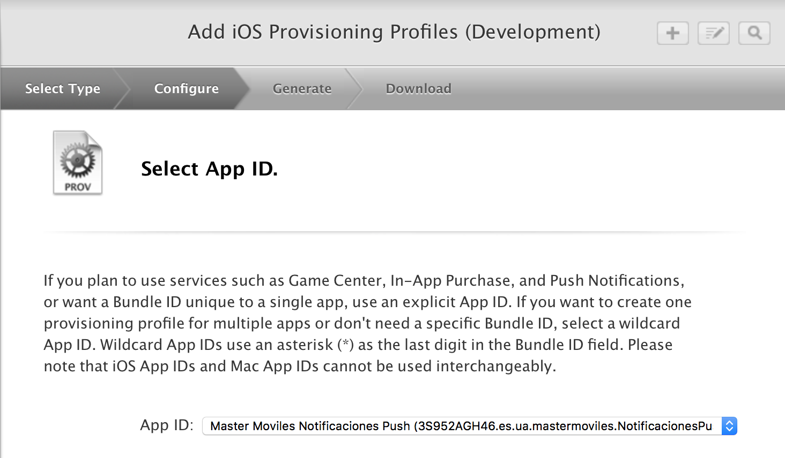
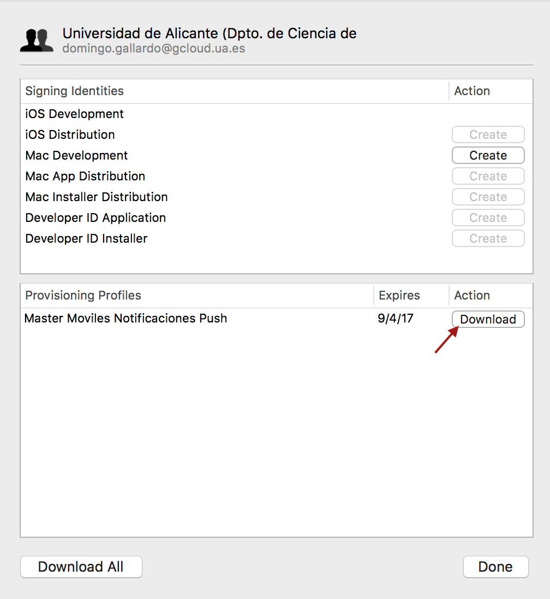
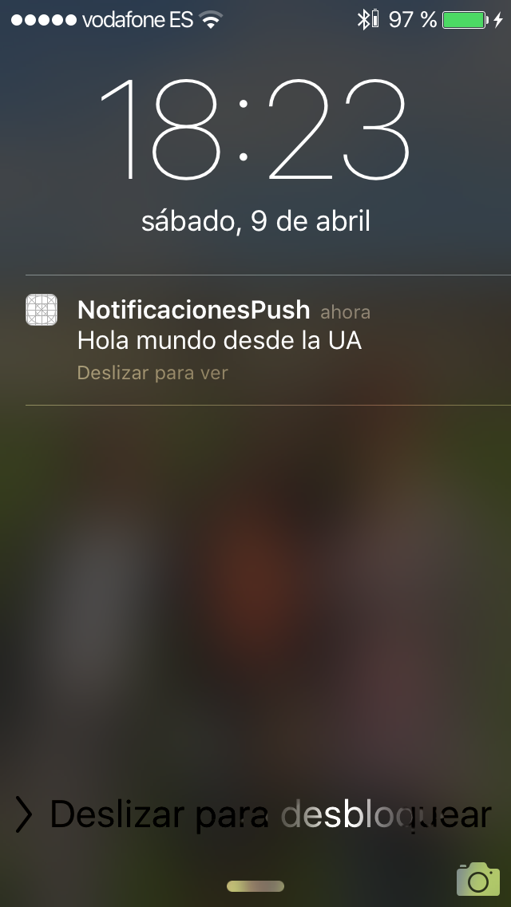
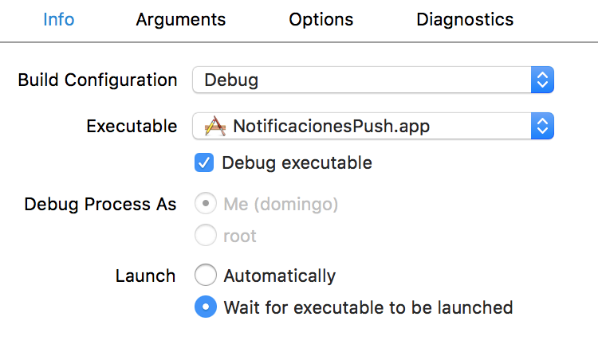
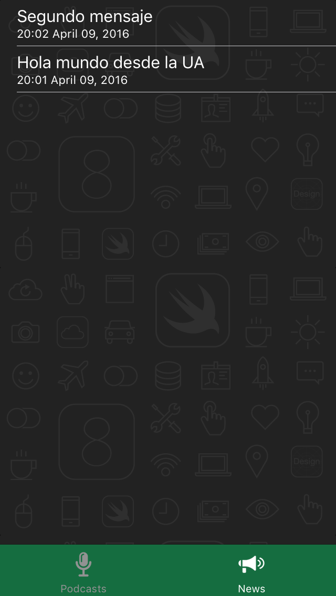

# Sesión 5: <br/> Notificaciones remotas (push)

#### Servicios de las plataformas móviles - iOS

<small>Domingo Gallardo - domingo.gallardo@ua.es  
Departamento Ciencia de la Computación e Inteligencia Artificial  
Master Programación de Dispositivos Móviles</small>

<!-- Tres líneas en blanco para la siguiente transparencia -->


#### Referencias

- [Local and Remote Programming Guide](https://developer.apple.com/library/ios/documentation/NetworkingInternet/Conceptual/RemoteNotificationsPG/Chapters/Introduction.html)

<!-- Tres líneas en blanco para la siguiente transparencia -->


#### Notificaciones remotas (_push_)


<!-- Tres líneas en blanco para la siguiente transparencia -->


#### Arquitectura de las notificaciones remotas

<!-- .slide: class="image-right"-->


- Apple Push Notification service (APNs) es la pieza central de las notificaciones remotas. Es un servicio robusto y altamente eficiente para propagar información a dispositivos iOS y OS X.
- Cada dispositivo establece una conexión acreditada y encriptada con el servicio y recibe notificaciones sobre esta conexión persistente.
- Si llega una notificación para una app cuando el dispositivo está fuera de cobertura, el APNs guarda la notificación hasta que el dispositivo vuelve a estar disponible.
- Las notificaciones se originan en servidores (_proveedores_) propios del desarrollador. Los proveedores se conectan con el APNs a través de canales persistentes y seguros al tiempo que monitorizan los datos recibidos de sus apps clientes. Cuando llegan nuevos datos para un app, los proveedores preparan y envían notificaciones a través de los canales al APNs, que se encarga de enviar las notificaciones remotas (_push_) a los dispositivos interesados.

<!-- Tres líneas en blanco para la siguiente transparencia -->


#### Servidores proveedores

- Las notificaciones remotas se deben originar en un servidor proveedor nuestro que debe conectarse con el APNs usando la API definida en la  [documentación de Apple](https://developer.apple.com/library/ios/documentation/NetworkingInternet/Conceptual/RemoteNotificationsPG/Chapters/APNsProviderAPI.html#//apple_ref/doc/uid/TP40008194-CH101-SW1). Esta API usa el protocolo HTTP/2 desde diciembre de 2015.
- La mayoría de servicios PaaS proporcionan conexiones con el APNs y librerías que facilitan el envío de notificaciones:
    - [Google Cloud Messaging for iOS](https://developers.google.com/cloud-messaging/ios/start?ver=swift)
    - [Amazon Web Services](http://docs.aws.amazon.com/sns/latest/dg/mobile-push-apns.html)
    - [Microsoft Azure](https://azure.microsoft.com/en-us/documentation/articles/notification-hubs-ios-get-started/)
- Otras alternativas, como [Parse](http://parse.com/), que utilizamos el curso pasado, han ido desapareciendo o han ido cambiando de configuración.
- Una opción sencilla, que usaremos en la práctica, es usar un [script PHP](https://gist.github.com/domingogallardo/b7946d8fe500187b426afb7ac8d8e470) desde el terminal.

<!-- Tres líneas en blanco para la siguiente transparencia -->


#### Arquitectura de seguridad

<!-- .slide: class="image-right"-->


- No queremos que nuestras notificaciones (con datos personales) puedan aparecer en otros dispositivos.
- El servicio de notificaciones remota de Apple (APNs) define unas condiciones de seguridad bastante estrictas tanto entre dispositivo y servicio como entre proveedor y el servicio.
- Se basa en el establecimiento de conexiones SSL seguras con el dispositivo y el proveedor y la creación de un _token de dispositivo_ que envía el APNs al dispositivo y que debe estar presente en cada petición del proveedor al APNs.
- Para establecer estas conexiones seguras es necesario instalar en el proveedor el certificado obtenido en el _member center_ y firmar la app con un App ID que proporcione el permiso de conexión push. Haremos una práctica paso a paso en donde lo probaremos.

<!-- Tres líneas en blanco para la siguiente transparencia -->


#### Secuencia de registro

<!-- .slide: class="image-right"-->


1. El dispositivo establece una conexión SSL con el APNs.
2. El APNs le envía un _token_ único asociado con el dispositivo.
3. El dispositivo le envía el _token_ al app.
4. El app envía el _token_ a su servidor (_Provider_) para que lo utilice a partir de ese momento en cada petición de notificación realizada al APNs.

<!-- Tres líneas en blanco para la siguiente transparencia -->


#### Confianza en el token

<!-- .slide: class="image-right"-->


- Después de que el sistema obtiene un token de dispositivo del APNs, debe proporcionarlo al APNs cada vez que se conecta al servicio. El APNs descifra el token de dispositivo y valida que fue el mismo que fue generado para el dispositivo. Para ello, el APNs se asegura que el identificador de dispositivo contenido en el token coincide con el identificador de dispositivo en el certificado del dispositivo.
- Cada notificación que un proveedor envía al APNs para ser entregada en un dispositivo debe acompañarse del token de dispositivo obtenido por una app en ese dispositivo. El APNs descifra el token usando la clave del token, y asegurándose por tanto que la notificación es válida. Después utiliza el identificador de dispositivo contenido en el token de dispositivo para determinar el dispositivo destino de la notificación.

<!-- Tres líneas en blanco para la siguiente transparencia -->


#### Contenido del _payload_

- El mensaje enviado al APNs (_payload_) se denomina debe cumplir unas condiciones estrictas definidas en la [documentación de Apple](https://developer.apple.com/library/ios/documentation/NetworkingInternet/Conceptual/RemoteNotificationsPG/Chapters/TheNotificationPayload.html#//apple_ref/doc/uid/TP40008194-CH107-SW1)
- Si se utiliza el API HTTP/2 el tamaño máximo está limitado a 4096 bytes.
- Debe tener el formato de un objeto JSON diccionario (parejas clave, valor).

```json
{
    "aps" : {
        "alert" : {
            "title" : "Game Request",
            "body" : "Bob wants to play poker",
            "action-loc-key" : "PLAY"
        },
        "badge" : 5,
    },
    "acme1" : "bar",
    "acme2" : [ "bang",  "whiz" ]
}
```


<!-- Tres líneas en blanco para la siguiente transparencia -->


#### Contenido del _payload_ (2)

- El diccionario debe contener otro diccionario identificado por la clave `aps`. Este diccionario contiene una o más propiedades que especifican los siguientes tipos de notificación:
    - Mensaje de alerta a mostrar al usuario
    - Numero a añadir en el globo del icono de la app
    - Sonido a tocar
- El diccionario `aps` también puede tener la clave `content-available` con un valor de 1. Eso significa que la notificación será una notificación silenciosa que hará que el sistema despierte la app y la ponga en _background_ para que pueda conectarse al servidor o hacer alguna tarea de background. El usuario no recibirá ninguna notificación, pero verá el nuevo contenido la siguiente vez que abra la app.
- El resto del diccionario contendrá parejas clave-valor con información _custom_.
- La información JSON se convierte en un diccionario que se pasa como parámetro `userInfor` en el método [`didReceiveRemoteNotification`](https://developer.apple.com/library/ios/documentation/UIKit/Reference/UIApplicationDelegate_Protocol/index.html#//apple_ref/occ/intfm/UIApplicationDelegate/application:didReceiveRemoteNotification:fetchCompletionHandler:) del delegado del app.

<!-- Tres líneas en blanco para la siguiente transparencia -->


#### Otros ejemplos de _payload_

```json
{
    "aps" : {
        "alert" : "You got your emails.",
        "badge" : 9,
        "sound" : "bingbong.aiff"
    },
    "acme1" : "bar",
    "acme2" : 42
}
```

```json
{
    "aps" : {
        "alert" : {
            "loc-key" : "GAME_PLAY_REQUEST_FORMAT",
            "loc-args" : [ "Jenna", "Frank"]
        },
        "sound" : "chime.aiff"
    },
    "acme" : "foo"
}
```

<!-- Tres líneas en blanco para la siguiente transparencia -->


#### Otros ejemplos de _payload_

```json
{
   "aps" : {
      "alert” : {
         “body” : "Acme message received from Johnny Appleseed”,
         “action-loc-key” : “VIEW”,
         "actions" : [
            {
               “id" : “delete",
               "title" : "Delete"
            },
            {
               “id" : “reply-to”,
               "loc-key" : “REPLYTO”,
               "loc-args" : [“Jane"]
            }
         ]
      }
      "badge" : 3,
      "sound" : “chime.aiff"
   },
   "acme-account" : "jane.appleseed@apple.com",
   "acme-message" : "message123456"
}
```

<!-- Tres líneas en blanco para la siguiente transparencia -->


#### Método `didReceiveRemoteNotification`

- El método [`didReceiveRemoteNotification`](https://developer.apple.com/library/ios/documentation/UIKit/Reference/UIApplicationDelegate_Protocol/index.html#//apple_ref/occ/intfm/UIApplicationDelegate/application:didReceiveRemoteNotification:fetchCompletionHandler:) del delegado del app se lanza cuando se recibe la notificación.
- El sistema llama a este método independientemente de si la app está activa o en background. Si está habilitado el modo de actualización en segundo plano, el sistema lanza la app (o la despierta del estado suspendido) y la pone en estado de background.
- Cuando la notificación llega, el sistema muestra la notificación al usuario y lanza la app en background, para que se pueda llamar a este método. De esta forma, la app tiene tiempo de procesar la notificación y descargar cualquier dato asociada a ella, para que esté disponible cuando el usuario pulsa en la notificación.
- En cuanto se termina de procesar la notificación se debe llamar a la clausura que se recibe en el parámetro `handler`. La app tiene hasta 30 segundos para procesar la notificación y llamar al `handler`. Si transcurrido este tiempo no se ha llamado, el sistema finaliza la app. El sistema hace un seguimiento del tiempo, batería y coste de las descargas en background de las apps y aquellas que consumen cantidades significativas pueden ser penalizadas y no activarse rápidamente en notificaciones futuras.


<!-- Tres líneas en blanco para la siguiente transparencia -->


## Práctica: Notificaciones remotas
<!-- .slide: data-background="#cbe0fc"-->

- Basado en el tutorial de _Jack Wu_ en _RayWenderlich_ [Push Notifications Tutorial: Getting Started](https://www.raywenderlich.com/123862/push-notifications-tutorial).
- Utilizaremos scripts PHP para enviar las notificaciones al APNs.
- Un administrador del equipo de la UA debe crear un certificado SSL (en formato `.pem`) que cada desarrollador descargará en su equipo.
- Cada desarrollador creará su propia app y podrá enviar sus notificaciones push desde el terminal.
- Las notificaciones sólo se pueden recibir en un dispositivo real.

<!-- Tres líneas en blanco para la siguiente transparencia -->


#### Nuevo App ID en el _member center_ (1)

- Un administrador del equipo UA debe crear una App ID con el nombre explícito de la app que se va a poner en producción.


<!-- Tres líneas en blanco para la siguiente transparencia -->


#### Nuevo App ID en el _member center_ (2)

- Se debe añadir en el App ID la autorización de notificaciones push.


<!-- Tres líneas en blanco para la siguiente transparencia -->


#### Creación del certificado SSL en el _member center_ (1)

- Debemos obtener un certificado de una autoridad de certificación que después subiremos al _member center_.
- Abrimos Acceso a Llaveros y seleccionamos _Asistente de Certificados > Solicitar un certificado de una autoridad de certificación_.
- Salvamos el fichero `CertificateSigningRequest.certSigningRequest`.


<!-- Tres líneas en blanco para la siguiente transparencia -->


#### Creación del certificado SSL en el _member center_ (2)


<!-- Tres líneas en blanco para la siguiente transparencia -->


#### Creación del certificado SSL en el _member center_ (3)

- Para crear el certificado es necesario subir el fichero generado previamente `CertificateSigningRequest.certSigningRequest` 

 


<!-- Tres líneas en blanco para la siguiente transparencia -->


#### Creación del perfil de aprovisionamiento 

- Creamos un nuevo perfil de aprovisionamiento que podrán usar todos los miembros del equipo.




<!-- Tres líneas en blanco para la siguiente transparencia -->


#### Generación del fichero `.pem` (1)

- Una vez creado el certificado en el _Member Center_ lo descargamos y lo instalamos en Acceso a llaveros, lo exportamos como fichero `.p12` y después lo convertiremos en un fichero `.pem` con el que nuestro servidor establecerá la conexión SSL con el  APNs.


- Se guarda el certificado como `UADevelopmentPushCertificate.p12` con una contraseña (mastermoviles16)

<!-- Tres líneas en blanco para la siguiente transparencia -->


#### Generación del fichero `.pem` (2)

- Creamos el fichero `.pem` con el siguiente comando:

```
$ openssl pkcs12 -in UADevelopmentPushCertificate.p12 \
   -out UADevelopmentPushCertificate.pem -nodes -clcerts
```

- Nos pedirá la contraseña que hemos introducido antes y se generará el certificado `UADevelopmentPushCertificate.pem`. Cuando estemos en clase lo podrás descargar [desde este enlace](http://domingogallardo.github.io/apuntes-mastermoviles/UADevelopmentPushCertificate.pem).

- Podrás usarlo para enviar la notificación push al APNs con un script PHP.

<!-- Tres líneas en blanco para la siguiente transparencia -->


#### Descargar el pérfil de aprovisionamiento


<!-- .slide: data-background="#cbe0fc"-->

- Carga en Xcode el perfil de aprovisionamiento que acabamos de crear:




<!-- Tres líneas en blanco para la siguiente transparencia -->


#### Abrir la app `NotificacionesPush`

<!-- .slide: data-background="#cbe0fc"-->

- Descarga de Bitbucket el proyecto `NotificacionesPush`. Contiene una app ejemplo y los scripts PHP para enviar las notificaciones al APNs.
- Abre la aplicación y selecciona `Push Notifications` en la pestaña `Capabilities`:


<!-- Tres líneas en blanco para la siguiente transparencia -->


#### Añadir el código de gestión de las notificaciones al app (1)
<!-- .slide: data-background="#cbe0fc" -->

- En el delegado del app definimos la función `registerForPushNotifications`:

```swift
func registerForPushNotifications(application: UIApplication) {
  let notificationSettings = UIUserNotificationSettings(
    forTypes: [.Badge, .Sound, .Alert], categories: nil)
  application.registerUserNotificationSettings(notificationSettings)
}
```

- Y se hace una llamada a la función anterior en el método `application(_:didFinishLaunchingWithOptions:)`:

```swift
func application(application: UIApplication, didFinishLaunchingWithOptions launchOptions: [NSObject: AnyObject]?) -> Bool {
  //...
  registerForPushNotifications(application)
  //...
}
```

<!-- Tres líneas en blanco para la siguiente transparencia -->


#### Añadir el código de gestión de las notificaciones al app (2)
<!-- .slide: data-background="#cbe0fc" -->

- El método `registerForRemoteNotifications` es el que se encarga de establecer al conexión con el APNs y solicitar el token de conexión. Se le invoca en el manejador `didRegisterUserNotificationSettings`:

```swift
func application(application: UIApplication, didRegisterUserNotificationSettings notificationSettings: UIUserNotificationSettings) {
  if notificationSettings.types != .None {
    application.registerForRemoteNotifications()
  }
}
```

<!-- Tres líneas en blanco para la siguiente transparencia -->


#### Añadir el código de gestión de las notificaciones al app (3)
<!-- .slide: data-background="#cbe0fc" -->

- Cuando la app se registra en el APNs, éste envía un token (cadena hexadecimal) que identifica el dispositivo. Se recibe en el siguiente manejador, que lo imprime por la salida estándar. 

```swift
func application(application: UIApplication, didRegisterForRemoteNotificationsWithDeviceToken deviceToken: NSData) {
  let tokenChars = UnsafePointer<CChar>(deviceToken.bytes)
  var tokenString = ""
 
  for i in 0..<deviceToken.length {
    tokenString += String(format: "%02.2hhx", arguments: [tokenChars[i]])
  }
 
  print("Device Token:", tokenString)
}
 
func application(application: UIApplication, didFailToRegisterForRemoteNotificationsWithError error: NSError) {
  print("Failed to register:", error)
}
```


<!-- Tres líneas en blanco para la siguiente transparencia -->


#### Ejecución de la app en el dispositivo
<!-- .slide: data-background="#cbe0fc" -->
<!-- .slide: class="image-right"-->



- Hay que ejecutar el app en el dispositivo físico en el que queramos recibir las notificaciones remotas, ya que éstas no funcionan en el simulador.
- Podemos todos enviar notificaciones al dispositivo del profesor.
- Copiamos el certificado `UADevelopmentPushCertificate.pem` en el mismo directorio `Scripts` en el que se encuentra el script `apnspush.php`.
- Edita `apnspush.php` y modifica el `$deviceToken` al que se ha recibido en el dispositivo. Este token identifica el dispositivo al que el APNs enviará la notificación.
- Ejecutamos el script:

```bash
$ php apnspush.php 'Hola mundo desde la UA' 'http://www.ua.es'
Connected to APNS
Message successfully delivered
```

<!-- Tres líneas en blanco para la siguiente transparencia -->


#### Modificación de la IU cuando se recibe una notificación
<!-- .slide: data-background="#cbe0fc" -->

- Vamos por último a añadir código a los manejadores para que cuando se reciba la notificación push se modifique la interfaz de la app.
- Hay que considerar los posibles manejadores que se pueden lanzar:
    - Si la app no está ejecutándose y el usuario pulsa en la notificación la información sobre la notificación se pasa en el parámetro `launchOptions` del método `application(_:didFinishLaunchingWithOptions:)`.
    - Si la app está ejecutándose en primer plano la notificación push no se mostrará, pero se llamará al método `application(_:didFinishLaunchingWithOptions:)`
    - Si la app está suspendida en segundo plano y el usuario pulsa la notificación se llamará al mismo método anterior


<!-- Tres líneas en blanco para la siguiente transparencia -->


#### Código en los manejadores (1)
<!-- .slide: data-background="#cbe0fc" -->

- Añade en el método `application(_:didFinishLaunchingWithOptions:)`, antes del `return`:

```swift
if let notification = launchOptions?[UIApplicationLaunchOptionsRemoteNotificationKey] 
    as? [String: AnyObject] {
    let aps = notification["aps"] as! [String: AnyObject]
    createNewNewsItem(aps)
    (window?.rootViewController as? UITabBarController)?.selectedIndex = 1
}
```

- El código comprueba si existe el valor `UIApplicationLaunchOptionsRemoteNotificationKey` en `launchOptions`. Si existe, será el _payload_ que se envió. Se obtiene a partir de él el diccionario y se pasa a la función `createNewNewsItem(_:)`, que crea un nuevo `NewsItem` a partir del diccionario y refresca la tabla de noticias.
- La última línea cambia la pestaña seleccionada del _tab controller_ a 1, la sección de noticias.


<!-- Tres líneas en blanco para la siguiente transparencia -->


#### Código en los manejadores (2)
<!-- .slide: data-background="#cbe0fc" -->

- Añade el siguiente método, para manejar los otros dos casos:

```swift
func application(application: UIApplication, 
      didReceiveRemoteNotification userInfo: [NSObject : AnyObject]) {
  let aps = userInfo["aps"] as! [String: AnyObject]
  createNewNewsItem(aps)
}
```

<!-- Tres líneas en blanco para la siguiente transparencia -->


#### Lanzar desde Xcode una ejecución en segundo plano
<!-- .slide: data-background="#cbe0fc" -->

- Podemos desplegar la app desde Xcode de forma que permanezca en segundo plano y Xcode se espere a que el ejecutable se lance.
- Para ello seleccionamos _Product > Scheme > Edit Scheme ..._ y activamos la opción _Wait for executable to be launched_:



- También podemos desplegarla y probarla sin controlarla desde Xcode

<!-- Tres líneas en blanco para la siguiente transparencia -->


#### Probamos
<!-- .slide: data-background="#cbe0fc" -->
<!-- .slide: class="image-right"-->



- Probamos la app en un dispositivo real.
- Recuerda subirla a tu cuenta de Bitbucket.

<!-- Tres líneas en blanco para la siguiente transparencia -->


# Master Programación <br/> de Dispositivos Móviles


