# Sesión 5: <br/> Notificaciones remotas

#### Servicios de las plataformas móviles - iOS

<small>Domingo Gallardo - domingo.gallardo@ua.es  
Departamento Ciencia de la Computación e Inteligencia Artificial  
Master Programación de Dispositivos Móviles</small>

<!-- Tres líneas en blanco para la siguiente transparencia -->


#### Referencias

- [Local and Remote Programming Guide](https://developer.apple.com/library/ios/documentation/NetworkingInternet/Conceptual/RemoteNotificationsPG/Chapters/Introduction.html)

<!-- Tres líneas en blanco para la siguiente transparencia -->


#### Notificaciones

<!-- .slide: class="image-right"-->

- En iOS sólo una única aplicación puede estar activa en un momento dado. Sin embargo, en muchas ocasiones las apps operan en un entorno basado en el tiempo o interconectado en el que es necesario avisar al usuario cuando sucede algún evento y la aplicación que no está activa. Las notificaciones locales y remotas permiten a estas apps notificar a sus usuarios cuando ocurre algún suceso de su interés.
- Las notificaciones locales y remotas tienen orígenes distintos. Una notificación local es planificada y enviada por la propia app, mientras que una notificación remota (también conocida como notificación _push_) tiene su origen fuera del dispositivo, en un servidor remoto denominado _proveedor de la app_ y se _empuja_ al dispositivo mediante el servicio _Apple Push Notification service_ (_APN_).


- Además de los usos comentados, las notificaciones se utilizan también para la comunicación entre nuestra app y el recién introducido _Apple Watch_. Se puede consultar la [página de recursos](https://developer.apple.com/watchkit/) de Apple sobre el _WatchKit Framework_ para más información.


<!-- Tres líneas en blanco para la siguiente transparencia -->


#### Uso de los tipos de notificaciones

- Las notificaciones remotas y locales satisfacen distintas necesidades de diseño.
- Una **notificación local** se planifica y envía por la propia app, sin que intervenga Internet.
- Una **notificación remota**, también llamada _notificación push_, llega del exterior del dispositivo. Se origina en un servidor remoto gestionado por el desarrollador de la app (denominado proveedor de la aplicación) y se envía al dispositivo del usuario a través del _Apple Push Notification service_ (APNs).


<!-- Tres líneas en blanco para la siguiente transparencia -->


#### Ejemplo de uso: lista to-do

- Un ejemplo del uso de notificaciones puede ser una app que gestiona una lista de tareas por hacer, en la que cada ítem tiene una fecha y hora en el que debe ser completado.
- El usuario puede pedir a la app que le notifique en un determinado intervalo de tiempo antes de que se cumpla esa fecha.
- Para implementar esta conducta, la app planifica una notificación local para esa fecha y hora. En lugar de especificar un mensaje de alerta, la app elige usar un globo (1) y un sonido. En el momento planificado, iOS hace sonar el sonido y muestra el número en la esquina del icono de la app.


<!-- Tres líneas en blanco para la siguiente transparencia -->


#### Apariencia de las notificaciones

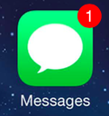 <br/>

Tanto las notificaciones locales como las remotas pueden aparecer como:

- Una alerta o tira (_banner_) en pantalla.
- Un globo (_badge_) en el icono de la app.
- Un sonido que acompaña la alerta, _banner_ o _badge_.
- Desde la perspectiva del usuario ha sucedido algo de interés en la app.

<!-- Tres líneas en blanco para la siguiente transparencia -->


#### Dónde aparecen las notificaciones

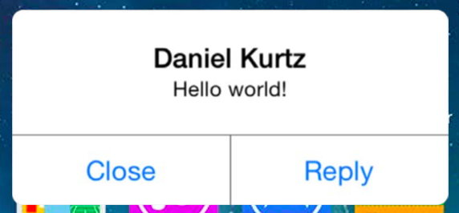 <br/>
  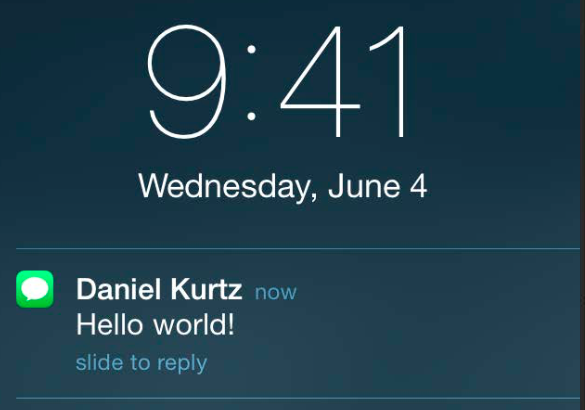 

- Alerta modal, cuando el dispositivo está desbloqueado.
- Centro de notificaciones.
- Pantalla bloqueada.

<!-- Tres líneas en blanco para la siguiente transparencia -->


#### Dónde se originan las notificaciones locales

<!-- .slide: class="image-right"-->

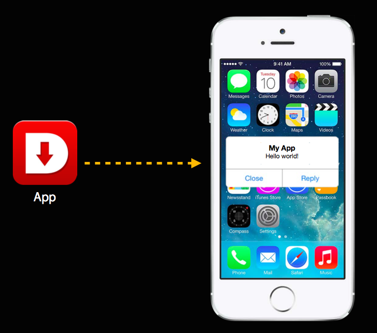

- Las notificaciones locales se originan en la propia aplicación, que las crea y las planifica para una fecha futura.

<!-- Tres líneas en blanco para la siguiente transparencia -->


#### Dónde se originan las notificaciones remotas

- Las notificaciones remotas se originan en un servidor nuestro (_provider_) que realiza la petición al _Apple Push Notification Service_.
- El servicio APNs se encargar de enviar la notificación al dispositivo y éste a la app.


<!-- Tres líneas en blanco para la siguiente transparencia -->


#### Para qué se usan las notificaciones

- Notificaciones locales: alarmas, recordatorios, eventos de una forma sencilla, sin tocar las apps Calendario, Alarmas o Recordatorios (_EventKit Framework_).
- Notificaciones remotas <!-- .element: class="fragment" data-fragment-index="1" -->
    - Avisar al usuario de que han sucedido determinados eventos.
    - Notificar a la app para que descargue contenido nuevo para que esté disponible la próxima vez que el usuario la utilice.  <!-- .element: class="fragment" data-fragment-index="2" -->

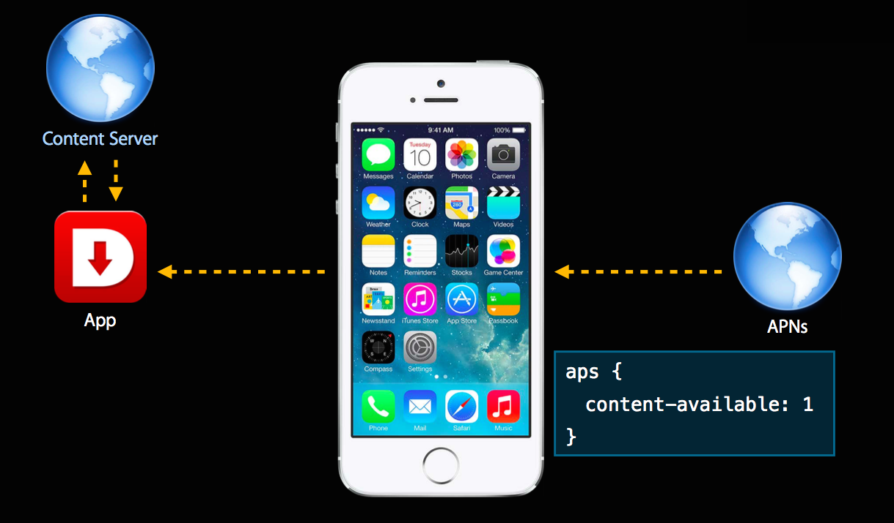


<!-- Tres líneas en blanco para la siguiente transparencia -->


#### Estados de la app


---

<table>
  <tr>
    <td><strong><em>Estado</em></strong></td> 
    <td><strong><em>Descripción</em></strong></td>
  </tr>
  <tr>
  <td><strong>No corriendo</strong></td> 
    <td>La app no ha sido lanzada o fue terminada por el usuario o por el sistema.</td>
  </tr>
  <tr>
    <td><strong>Inactiva</strong></td> 
    <td>La app está corriendo en primer plano pero no está recibiendo eventos (puede estar ejecutando código, sin embargo). Una app permanece en este estado brevemente, mientras realiza una transición a otro estado.</td>
  </tr>
  <tr>
    <td><strong>Activa</strong></td> 
    <td>La app está corriendo en primer plano y recibiendo eventos.</td>
  </tr>
  <tr>
    <td><strong>Background</strong></td> 
    <td>La app está ejecutando código pero no es visible en pantalla. Cuando el usuario sale de una app, el sistema mueve la app al estado de _background_ antes de suspenderla. En otros momentos, el sistema puede lanzar una aplicación en _background_ (o despertar una app suspendida) y darle tiempo para manejar ciertas tareas específicas. Por ejemplo, el sistema puede despertar una app para que procese descargas en _background_, o responda a notificaciones remotas. Una app en estado _background_ debe hacer el mínimo trabajo posible y devolver rápidamente el control al sistema.</td>
  </tr>
  <tr>
    <td><strong>Suspendida</strong></td> 
    <td>La app está en memoria pero no ejecuta código. El sistema suspende apps que están en _background_ y no tienen tareas pendientes que completar. El sistema puede eliminar apps suspendidas en cualquier momento sin despertarlas, para hacer sitio para otras apps.</td>
  </tr>
</table>

<!-- Tres líneas en blanco para la siguiente transparencia -->


#### _UIApplication_ y _UIApplication Delegate_

- `UIApplication` y `UIApplicationDelegate` son tipos muy importantes que debemos conocer.
- Contienen los métodos necesarios para gestionar las notificaciones y otros eventos del ciclo de vida de las apps.
- Xcode proporciona una clase _app delegate_ para cada proyecto. UIKit crea automáticamente una instancia de la clase proporcionada por Xcode y la usa para ejecutar los primeros bits de código _custom_ de la app. Todo lo que tienes que hacer es añadir tu código _custom_ a la clase que proporciona Xcode.
- La clase `UIApplication` define un _singleton_ al que podemos acceder con el método de clase `sharedApplication()`

```swift
let application = UIApplication.sharedApplication();
```

- Referencias: [`UIApplication`](https://developer.apple.com/library/ios/documentation/UIKit/Reference/UIApplication_Class/index.html#//apple_ref/swift/cl/UIApplication) y [`UIApplicationDelegate`](https://developer.apple.com/library/ios/documentation/UIKit/Reference/UIApplicationDelegate_Protocol/).

<!-- Tres líneas en blanco para la siguiente transparencia -->


#### Métodos relacionados con los cambios de estado en el `UIApplicationDelegate`

- En [`UIApplicationDelegate` - Monitoring App State Change](https://developer.apple.com/library/ios/documentation/UIKit/Reference/UIApplicationDelegate_Protocol/index.html#//apple_ref/doc/uid/TP40006786-CH3-SW5)
    - `application(_:willFinishLaunchingWithOptions:)`
    - `application(_:didFinishLaunchingWithOptions:)`
    - `applicationDidBecomeActive(_:)`
    - `applicationWillResignActive(_:)`
    - `applicationDidEnterBackground(_:)`
    - `applicationWillEnterForeground(_:)`
    - `applicationWillTerminate(_:)`
- Todos reciben el parámetro `application`, el _singleton_ de tipo [`UIApplication`](https://developer.apple.com/library/ios/documentation/UIKit/Reference/UIApplication_Class/index.html) que contiene todos los datos de la app.

<!-- Tres líneas en blanco para la siguiente transparencia -->


#### Registro de los tipos de notificación

- Las apps que usan notificaciones locales o remotas deben registrar los tipos de notificaciones que intentan enviar al usuario.
- El usuario debe aceptar el tipo de notificación: globos, alertas o sonidos. Inicialmente le aparecerá una alerta en el que permite aceptar o rechazar todos los tipos. 
- Después en cualquier momento puede modificar esta aceptación en los ajustes de la aplicación (Ajustes > Notificaciones).


<!-- Tres líneas en blanco para la siguiente transparencia -->


#### Inicialización de las notificaciones

- Podemos inicializar las notificaciones al arrancar la app con el método `aplication(_:didFinishLaunchingWithOptions:)` del [`UIApplicationDelegate`](https://developer.apple.com/library/ios/documentation/UIKit/Reference/UIApplicationDelegate_Protocol/index.html#//apple_ref/swift/intf/UIApplicationDelegate)
- Llamamos a `registerUserNotificationSettings(_:)` con los tipos de notificación deseados. La app pide permiso para usar las notificaciones y el usuario puede autorizar o no. Después, el sistema llama al método `application(_:didRegisterUserNotificationSettings:)` del delegado para informar de los resultados.
- Independientemente de que el usuario acepte o no las notificaciones, éstas se van a lanzar y los métodos que las manejan en el app delegado se van a disparar. Lo que el usuario desactiva es la aparición de las notificaciones en pantalla.

<!-- Tres líneas en blanco para la siguiente transparencia -->


#### Código

```swift
func application(application: UIApplication, didFinishLaunchingWithOptions launchOptions: 
                                   [NSObject: AnyObject]?) -> Bool {
    let notificationSettings = UIUserNotificationSettings(
        forTypes: [.Badge, .Sound, .Alert], categories: nil)
    application.registerUserNotificationSettings(notificationSettings)

    // Resto de código para inicializar la app
    
    return true
}

func application(application: UIApplication,
                 didRegisterUserNotificationSettings notificationSettings: UIUserNotificationSettings) {
    print(notificationSettings)
}
```

<!-- Tres líneas en blanco para la siguiente transparencia -->


#### Notificaciones locales

- Un objeto [`UILocalNotification`](https://developer.apple.com/library/ios/documentation/iPhone/Reference/UILocalNotification_Class/) especifica una notificación que una app puede planificar que se envíe en una fecha y hora específica.
- El sistema operativo es responsable de entregar las notificaciones locales en la fecha y hora planificada, la app no tiene que estar en marcha para que esto suceda.
- Las notificaciones locales son similares a las remotas en el sentido de que se usan para mostrar alertas, ejecutar sonidos y añadir globos al icono del app.
- Se usan principalmente en apps con conductas basadas en temporizadores y en apps sencillas de calendarios o de listas de to-do. Una app que está ejecutándose en background también puede planificar una notificación para informar al usuario de que ha llegado un mensaje, un chat o se ha actualizado algún estado.


<!-- Tres líneas en blanco para la siguiente transparencia -->


#### Qué contiene una notificación local

- Para crear una notificación local hay que crear una instancia de `UILocalNotification` y definir los siguientes atributos: 
    - `fireDate: NSDate?` - fecha en la que se lanza la notificación.
    - `repeatInterval: NSCalendarUnit` - intervalo de repetición.
    - `alertAction: String?` - título del botón de la alerta de la acción por defecto
    - `alertBody: String?` - mensaje en la alerta.
    - `applicationIconBadgetNumber: Int` - número a incluir en el globo cuando llegue la notificación.
    - `soundName: String?` - nombre del fichero del sonido a reproducir.
    - `userInfo: [NSObject : AnyObject]?` - un diccionario para pasar información _custom_ a la app notificada. En Swift se declaran todos los `NSDictionary` como diccionarios del tipo `[NSObject: AnyObject]`. Podemos inicializarlo a cualquier tipo de diccionario y después hay que hacer un _downcasting_.
    - `category: String?` - el nombre de un grupo de acciones a mostrar en la alerta (lo veremos más adelante).

<!-- Tres líneas en blanco para la siguiente transparencia -->


#### Planificación de una notificación local

- Para planificar una notificación local hay que invocar el método `scheduleLocalNotification(_:)` o `presentLocalNotificationNow(_:)` de la clase `UIApplication` pasando como parámetro la notificación creada.
- El primer método usa la fecha `fireDate` como fecha de entrega.
- El segundo método presenta la notificación inmediatamente, independientemente de la fecha de la notificación.

<!-- Tres líneas en blanco para la siguiente transparencia -->


#### Ejemplo de código para enviar una notificación local

- Creamos una notificación local que aparece a los 10 segundos

```swift
let localNotification = UILocalNotification()
localNotification.alertBody = "¡¡Funciona!!"
localNotification.alertAction = "Volver a la app"
localNotification.soundName = UILocalNotificationDefaultSoundName
localNotification.fireDate = NSDate(timeIntervalSinceNow: 10)

// application contiene el singleton UIApplication
application.scheduleLocalNotification(localNotification)
```

<!-- Tres líneas en blanco para la siguiente transparencia -->


#### Práctica: app `Notificaciones`

<!-- .slide: data-background="#cbe0fc"-->

- Crea un proyecto `Notificaciones`en el directorio en el que has inicializado el control de versiones y tienes conectado con tu cuenta de Bitbucket. 
- _Bundle Identifier_: `es.ua.mastermoviles.Notificaciones`
- Escribe el código anterior para lanzar una notificación en el método de `application(_:, didFinishLaunchingWithOptions)` del `AppDelegate`. 
- Comprueba que se lanza la notificación correctamente.
- Cuando la termines haz un commit y un push para subirla a Bitbucket.
- **Avanzado**: Añade un botón en la app, de forma que cuando pulsemos el botón se planificará una nueva notificación. Se puede pulsar el botón tantas veces como queramos y se generarán otras tantas notificaciones.

<!-- Tres líneas en blanco para la siguiente transparencia -->


#### Métodos del `UIApplicationDelegate` para manejar notificaciones

- Se deben consultar en la referencia de [`UIApplicationDelegate`](https://developer.apple.com/library/ios/documentation/UIKit/Reference/UIApplicationDelegate_Protocol/index.html#//apple_ref/occ/intfm/UIApplicationDelegate/)
- Dependiendo de si la notificación es local o remota:
-  <!-- .element: class="fragment" data-fragment-index="1" --> Manejo de notificaciones locales:
    - `application(_:didReceiveLocalNotification:)`
-  <!-- .element: class="fragment" data-fragment-index="2" --> Manejo de notificaciones remotas:
    - `application(_:didRegisterForRemoteNotificationsWithDeviceToken:)`
    - `application(_:didFailToRegisterForRemoteNotificationsWithError:)`
    - `application(_:didReceiveRemoteNotification:fetchCompletionHandler:)`
    - `application(_:didReceiveRemoteNotification:)`

<!-- Tres líneas en blanco para la siguiente transparencia -->


#### Manejo de notificaciones locales cuando la app no está en primer plano

- Cuando la aplicación no está en primer plano, puede mostrar al usuario una alerta, añadir un globo al icono, tocar un sonido y mostrar uno o más botones de acciones.
- Si el usuario toca la notificación el sistema lanza la app y llama al método `application(_:didReceiveLocalNotification:)` si la notificación es local o `application(_:didReceiveRemoteNotification:fetchCompletitionHandler:)` si es remota.

<!-- Tres líneas en blanco para la siguiente transparencia -->


#### Manejo de notificaciones locales cuando la app está en primer plano

- Si la app está en primer plano el sistema no muestra al usuario ninguna alerta, pero sí añade la notificación en el centro de notificaciones y también se invoca a los métodos correspondientes del delegado de la app vistos anteriormente.

<!-- Tres líneas en blanco para la siguiente transparencia -->


#### Código ejemplo que añade datos en la notificación

```swift
...
localNotification.userInfo = ["Mensaje":"Hola, mundo"]
...
```

<!-- Tres líneas en blanco para la siguiente transparencia -->


#### Código ejemplo para manejar una notificación

```swift
func application(application: UIApplication, didReceiveLocalNotification notification: UILocalNotification) {
    print("Recibida notificación")
    let userInfo = notification.userInfo as? Dictionary<String,String>
    if let s = userInfo?["Mensaje"] {
        print("Mensaje: \(s)")
    }
    else {
        print("No he encontrado el mensaje\n")
    }
}
```
<!-- Tres líneas en blanco para la siguiente transparencia -->


#### Práctica: app `Notificaciones`

<!-- .slide: data-background="#cbe0fc"-->

- Añade el código anterior en la aplicación para probar el paso de datos y el manejo de la notificación.

<!-- Tres líneas en blanco para la siguiente transparencia -->


#### Acciones en las notificaciones

- En versiones anteriores a 8, las notificaciones sólo podían tener una acción por defecto. 
- A partir de iOS 8, las notificaciones pueden tener acciones _custom_ adicionales.
- En la pantalla de bloqueo, en las tiras y en el Centro de Notificaciones se pueden mostrar dos acciones.
- En las alertas modales, las notificaciones pueden mostrar hasta cuatro acciones cuando el usuario pulsa el botón `Opciones`.
- Para usar acciones de notificación en tu app, debes crear los posibles conjuntos de acciones de tipo [`UIMutableUserNotificationAction`](https://developer.apple.com/library/ios/documentation/UIKit/Reference/UIMutableUserNotificationAction_class/index.html#//apple_ref/occ/cl/UIMutableUserNotificationAction), agruparlos en la clase [`UIMutableUserNotificationCategory`](https://developer.apple.com/library/ios/documentation/UIKit/Reference/UIMutableUserNotificationCategory_class/index.html#//apple_ref/occ/cl/UIMutableUserNotificationCategory), registrarlos al inicializar las notificaciones y seleccionar uno de los conjuntos en la notificación.

<!-- Tres líneas en blanco para la siguiente transparencia -->


#### Acciones en las notificaciones

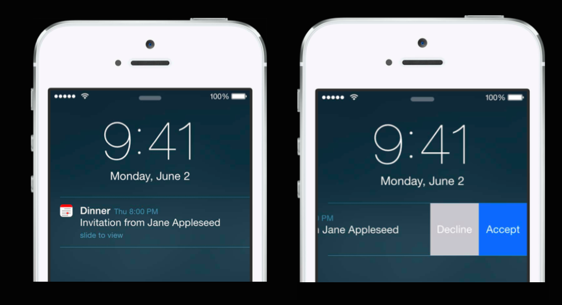


<!-- Tres líneas en blanco para la siguiente transparencia -->


#### Acciones en las notificaciones

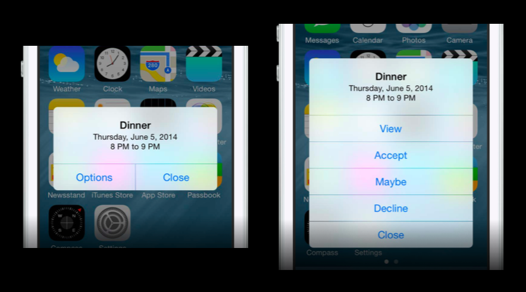

<!-- Tres líneas en blanco para la siguiente transparencia -->


#### Registro de acciones de notificación

- En la inicialización de las notificaciones definimos las posibles acciones:

```swift
let acceptAction = UIMutableUserNotificationAction()
acceptAction.identifier = "ACEPTAR"
acceptAction.title = "Aceptar"
// Indica si la app debe ser activada
acceptAction.activationMode = UIUserNotificationActivationMode.Foreground
// Acciones destructivas se muestran en rojo
acceptAction.destructive = false 
// Determina si el usuario necesita autenticarse
acceptAction.authenticationRequired = true

let declineAction = UIMutableUserNotificationAction()
declineAction.identifier = "DECLINAR"
declineAction.title = "Declinar"
declineAction.activationMode = UIUserNotificationActivationMode.Background
declineAction.destructive = false
declineAction.authenticationRequired = false
```

<!-- Tres líneas en blanco para la siguiente transparencia -->


#### Agrupación de acciones en categorías

- Las agrupamos en la categoría `INVITACION`:

```swift
let category = UIMutableUserNotificationCategory()
category.identifier = "INVITACION"
category.setActions([acceptAction, declineAction], 
                    forContext: 
                        UIUserNotificationActionContext.Default)
```

<!-- Tres líneas en blanco para la siguiente transparencia -->


#### Registro de las categorías y actualización en la notificación

- Y registramos la categoría (puede haber más de una):

```swift
let notificationSettings = UIUserNotificationSettings(
     forTypes: [.Badge, .Sound, .Alert], categories: [category])

application.registerUserNotificationSettings(notificationSettings)
```

- En la notificación ya podemos usar la categoría recién registrada:

```swift
...
localNotification.category = "INVITACION"
...
```

<!-- Tres líneas en blanco para la siguiente transparencia -->


#### Métodos del `UIApplicationDelegate` para manejar acciones en las notificaciones

- En el protocolo [`UIApplicationDelegate`](https://developer.apple.com/library/ios/documentation/UIKit/Reference/UIApplicationDelegate_Protocol/index.html#//apple_ref/occ/intfm/UIApplicationDelegate/)
-  Manejo de notificaciones locales:
    - `application(_:handleActionWithIdentifier:forLocalNotification:completionHandler:)`
-  Manejo de notificaciones remotas:
    - `application(_:handleActionWithIdentifier:forRemoteNotification:completionHandler:)`
- Cuando la app no está en primer plano si el usuario pulsa una acción en una notificación el sistema llama al `application(_:handleActionWithIdentifier:forLocalNotification:)` `completionHandler:` o a su método equivalente de notificación remota. En ambos métodos, obtenemos el identificador de la acción que el usuario ha pulsado, junto con el objeto notificación local o remoto. El _completionHandler_ es una clausura que nos pasa el sistema a la que hay invocar una vez terminado el procesamiento de la notificación. Si no se realiza esa invocación la app muere.
- Si la app está en primer plano el sistema llama a `application(_:didReceiveRemoteNotification:fetchCompletionHandler:)` 

<!-- Tres líneas en blanco para la siguiente transparencia -->


#### Ejemplo de código

```swift
func application(application: UIApplication, 
                 handleActionWithIdentifier identifier: String?, 
                 forLocalNotification notification: UILocalNotification, 
                 completionHandler: () -> Void) {
        print(identifier)
        completionHandler()
    }
```
<!-- Tres líneas en blanco para la siguiente transparencia -->


#### Práctica: app `Notificaciones`

<!-- .slide: data-background="#cbe0fc"-->

- Prueba el código anterior para incluir acciones en la notificación que se lanza al arrancar la app.
- **(Opcional)**: Escribe un ejemplo de código en el que se usen los números en los globos de la app: incialízalo a 1 y ponlo a 0 cuando se pulse la acción de la notificación.

<!-- Tres líneas en blanco para la siguiente transparencia -->


## Notificaciones remotas (_push_)


<!-- Tres líneas en blanco para la siguiente transparencia -->


#### Arquitectura de las notificaciones remotas

<!-- .slide: class="image-right"-->

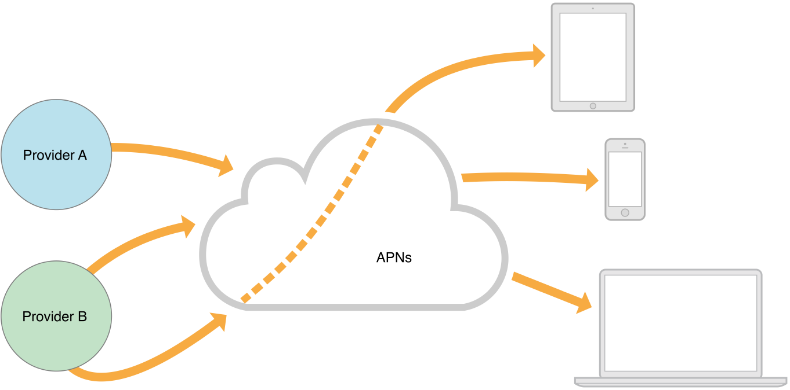

- Apple Push Notification service (APNs) es la pieza central de las notificaciones remotas. Es un servicio robusto y altamente eficiente para propagar información a dispositivos iOS y OS X.
- Cada dispositivo establece una conexión acreditada y encriptada con el servicio y recibe notificaciones sobre esta conexión persistente.
- Si llega una notificación para una app cuando el dispositivo está fuera de cobertura, el APNs guarda la notificación hasta que el dispositivo vuelve a estar disponible.
- Las notificaciones se originan en servidores (_proveedores_) propios del desarrollador. Los proveedores se conectan con el APNs a través de canales persistentes y seguros al tiempo que monitorizan los datos recibidos de sus apps clientes. Cuando llegan nuevos datos para un app, los proveedores preparan y envían notificaciones a través de los canales al APNs, que se encarga de enviar las notificaciones remotas (_push_) a los dispositivos interesados.

<!-- Tres líneas en blanco para la siguiente transparencia -->


#### Servidores proveedores

- Podemos poner en marcha nosotros mismos un servidor proveedor, utilizando la [documentación de Apple](https://developer.apple.com/library/ios/documentation/NetworkingInternet/Conceptual/RemoteNotificationsPG/Chapters/CommunicatingWIthAPS.html#//apple_ref/doc/uid/TP40008194-CH101-SW1) o instalando algún paquete _open source_:
    - [ApnsPHP](https://github.com/duccio/ApnsPHP) para servidores PHP
    - [Pushy](http://relayrides.github.io/pushy/) para servidores Java
- La mayoría de servicios PaaS (como RedHat OpenShift, Microsoft Azure o Amazon WS) proporcionan conexiones con el APNs y librerías que facilitan el envío de notificaciones.
- Existen plataformas denominadas [_Mobile Backend As a Service_](http://www.infoworld.com/article/2842791/application-development/mbaas-shoot-out-5-cloud-platforms-for-building-mobile-apps.html) (MBaaS) que proporcionan servicios específicos para móviles, entre ellos el envío de notificaciones _push_.
- Existen bastantes opciones, con distintos enfoques de funcionalidades y precios: Appcelerator, Kinvey, Backendless, etc. Una de las más populares es la que vamos a utilizar en el ejercicio práctico, [Parse](https://www.parse.com).

<!-- Tres líneas en blanco para la siguiente transparencia -->


#### Arquitectura de seguridad

<!-- .slide: class="image-right"-->

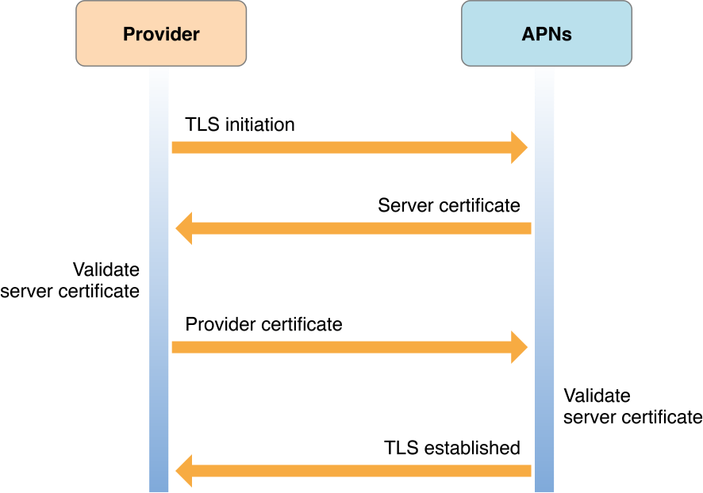


- No queremos que nuestras notificaciones (con datos personales) puedan aparecer en otros dispositivos.
- El servicio de notificaciones remota de Apple (APNs) define unas condiciones de seguridad bastante estrictas tanto entre dispositivo y servicio como entre proveedor y el servicio.
- Se basa en el establecimiento de conexiones SSL seguras con el dispositivo y el proveedor y la creación de un _token de dispositivo_ que envía el APNs al dispositivo y que debe estar presente en cada petición del proveedor al APNs.
- Para establecer estas conexiones seguras es necesario instalar en el proveedor el certificado obtenido en el _member center_ y firmar la app con un App ID que proporcione el permiso de conexión push. Haremos una práctica paso a paso en donde lo probaremos.

<!-- Tres líneas en blanco para la siguiente transparencia -->


#### Secuencia de registro

<!-- .slide: class="image-right"-->


1. El dispositivo establece una conexión SSL con el APNs.
2. El APNs le envía un _token_ único asociado con el dispositivo.
3. El dispositivo le envía el _token_ al app.
4. El app envía el _token_ a su servidor (_Provider_) para que lo utilice a partir de ese momento en cada petición de notificación realizada al APNs.

<!-- Tres líneas en blanco para la siguiente transparencia -->


#### Confianza en el token

<!-- .slide: class="image-right"-->


- Después de que el sistema obtiene un token de dispositivo del APNs, debe proporcionarlo al APNs cada vez que se conecta al servicio. El APNs descifra el token de dispositivo y valida que fue el mismo que fue generado para el dispositivo. Para ello, el APNs se asegura que el identificador de dispositivo contenido en el token coincide con el identificador de dispositivo en el certificado del dispositivo.

- Cada notificación que un proveedor envía al APNs para ser entregada en un dispositivo debe acompañarse del token de dispositivo obtenido por una app en ese dispositivo. El APNs descifra el token usando la clave del token, y asegurándose por tanto que la notificación es válida. Después utiliza el identificador de dispositivo contenido en el token de dispositivo para determinar el dispositivo destino de la notificación.

<!-- Tres líneas en blanco para la siguiente transparencia -->


#### Contenido de las notificaciones (_payload_)


- Limitado a 2 kilobytes.
- Diccionario con formato JSON que debe contener un diccionario con la clave `aps`, en la que se incluyen las características de la notificación (las mismas vistas en las notificaciones locales). Consultar [este enlace](https://developer.apple.com/library/ios/documentation/NetworkingInternet/Conceptual/RemoteNotificationsPG/Chapters/ApplePushService.html#//apple_ref/doc/uid/TP40008194-CH100-SW1) para examinar el formato.
- El diccionario `aps` también puede tener la clave `content-available` con un valor de 1. Eso significa que la notificación será una notificación silenciosa que hará que el sistema despierte la app y la ponga en _background_ para que pueda conectarse al servidor o hacer alguna tarea de background. El usuario no recibirá ninguna notificación, pero verá el nuevo contenido la siguiente vez que abra la app.
- El resto del diccionario contendrá parejas clave-valor con información _custom_.
- La información JSON se convierte en un diccionario que se pasa como el parámetro `userInfo` en los métodos que reciben la notificación, como 
`application:didReceiveRemoteNotification:fetchCompletionHandler:`.


<!-- Tres líneas en blanco para la siguiente transparencia -->


#### Ejemplos (1)

```json
{
    "aps" : { "alert" : "Message received from Bob" },
    "acme2" : [ "bang",  "whiz" ]
}
```


```json
{
    "aps" : {
        "alert" : {
            "title" : "Game Request",
            "body" : "Bob wants to play poker",
            "action-loc-key" : "PLAY"
        },
        "badge" : 5,
    },
    "acme1" : "bar",
    "acme2" : [ "bang",  "whiz" ]
}
```

<!-- Tres líneas en blanco para la siguiente transparencia -->


#### Ejemplos (2)

```json
{
    "aps" : {
        "alert" : "You got your emails.",
        "badge" : 9,
        "sound" : "bingbong.aiff"
    },
    "acme1" : "bar",
    "acme2" : 42
}
```

```json
{
    "aps" : {
        "alert" : {
            "loc-key" : "GAME_PLAY_REQUEST_FORMAT",
            "loc-args" : [ "Jenna", "Frank"]
        },
        "sound" : "chime.aiff"
    },
    "acme" : "foo"
}
```

<!-- Tres líneas en blanco para la siguiente transparencia -->


#### Ejemplos (3)

```json
{
   "aps" : {
      "alert” : {
         “body” : "Acme message received from Johnny Appleseed”,
         “action-loc-key” : “VIEW”,
         "actions" : [
            {
               “id" : “delete",
               "title" : "Delete"
            },
            {
               “id" : “reply-to”,
               "loc-key" : “REPLYTO”,
               "loc-args" : [“Jane"]
            }
         ]
      }
      "badge" : 3,
      "sound" : “chime.aiff"
   },
   "acme-account" : "jane.appleseed@apple.com",
   "acme-message" : "message123456"
}
```

<!-- Tres líneas en blanco para la siguiente transparencia -->


## Práctica: Notificaciones remotas
<!-- .slide: data-background="#cbe0fc"-->

- Utilizaremos [Parse](https://www.parse.com) como plataforma para enviar notificaciones remotas.
- Un administrador del equipo de la UA debe crear un certificado SSL (en formato `.p12`).
- Cada desarrollador creará su propio servicio en Parse (lo llaman también _app_) y podrá enviar sus notificaciones push.
- Las notificaciones sólo se pueden recibir en un dispositivo real.

<!-- Tres líneas en blanco para la siguiente transparencia -->


#### Nuevo App ID en el _member center_ (1)

- Un administrador del equipo UA debe crear una App ID con el nombre explícito de la app que se va a poner en producción.

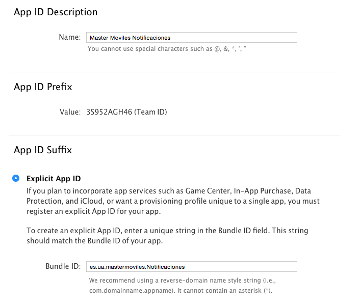

<!-- Tres líneas en blanco para la siguiente transparencia -->


#### Nuevo App ID en el _member center_ (2)

- Se debe añadir en el App ID la autorización de notificaciones push.


<!-- Tres líneas en blanco para la siguiente transparencia -->


#### Creación del certificado SSL en el _member center_ (1)

- Debemos obtener un certificado de una autoridad certificadora que después subiremos al _member center_.
- Abrimos Acceso a Llaveros y seleccionamos _Asistente de Certificados > Solicitar un certificado de una autoridad certificadora_.
- Salvamos el fichero `CertificateSigningRequest.certSigningRequest`.

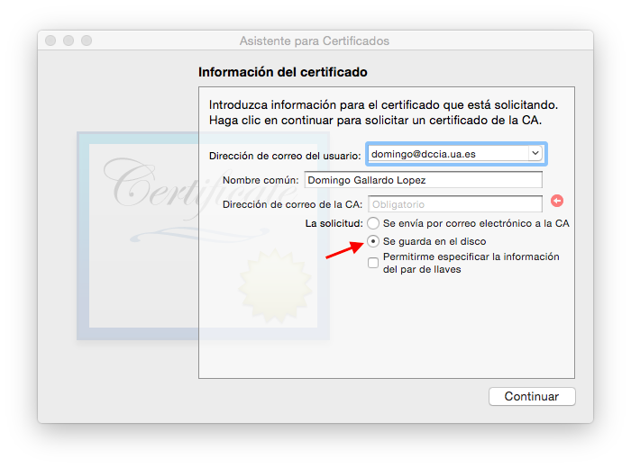

<!-- Tres líneas en blanco para la siguiente transparencia -->


#### Creación del certificado SSL en el _member center_ (2)


<!-- Tres líneas en blanco para la siguiente transparencia -->


#### Creación del certificado SSL en el _member center_ (3)

- Para crear el certificado es necesario subir el fichero generado previamente `CertificateSigningRequest.certSigningRequest` 

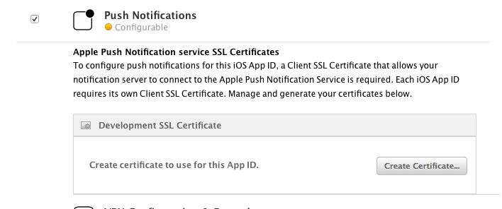 

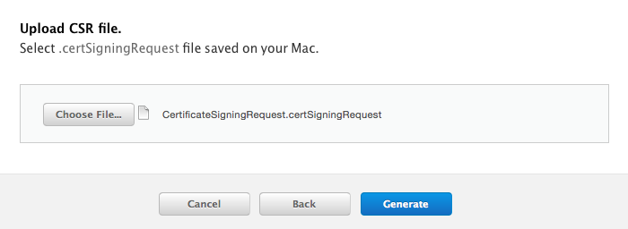


<!-- Tres líneas en blanco para la siguiente transparencia -->


#### Generación del fichero `.p12` (1)


<!-- Tres líneas en blanco para la siguiente transparencia -->


#### Generación del fichero `.p12` (2)

- Una vez creado el certificado en el _Member Center_ lo descargamos y lo instalamos en Acceso a llaveros para generar un fichero `.p12` que enviaremos a Parse.

- Lo salvamos como `ParseDevelopmentPushCertificate.p12` sin crear una contraseña asociada al certificado. Cuando estemos en clase lo podrás descargar [desde este enlace](http://domingogallardo.github.io/apuntes-mastermoviles/ParseDevelopmentPushCertificate.p12).

- Después subiremos a Parse este certificado para que el servicio que crearemos allí pueda establecer una conexión SSL con el APNs. Todos podemos subir a Parse el mismo certificado para cada uno de los servicios que crearemos.

<!-- Tres líneas en blanco para la siguiente transparencia -->


#### Creación del servicio en Parse (1)

<!-- .slide: data-background="#cbe0fc"-->

- Date de alta en [Parse](https://www.parse.com)
- Crea una nueva App en Parse y entra en el menú de _Settings_

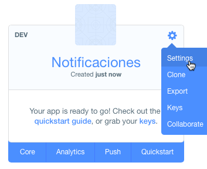

<!-- Tres líneas en blanco para la siguiente transparencia -->


#### Creación del servicio en Parse (2)
<!-- .slide: data-background="#cbe0fc"-->

- En el menú de la izquierda selecciona Push y sube el certificado .p12

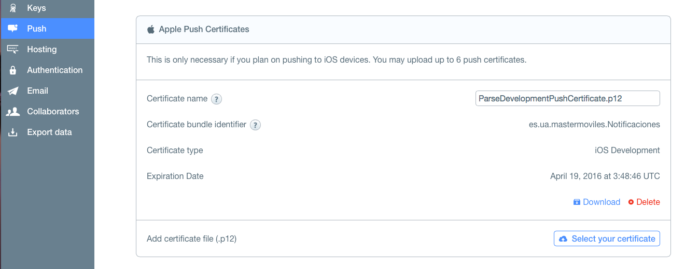

<!-- Tres líneas en blanco para la siguiente transparencia -->


#### Actualizar la app Notificaciones

<!-- .slide: data-background="#cbe0fc"-->

- En Xcode debemos comprobar que se ha cargado el perfil de aprovisionamiento recién creado que nos permite desarrollar e instalar aplicaciones que usan notificaciones remotas.

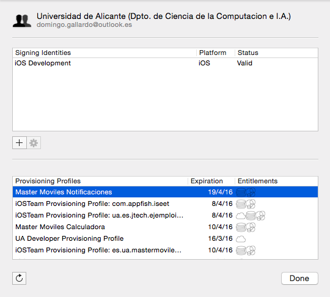


<!-- Tres líneas en blanco para la siguiente transparencia -->


#### Añadir Frameworks a la app

<!-- .slide: data-background="#cbe0fc" -->
<!-- .slide: class="image-right"-->

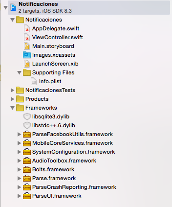

- Para poder trabajar con las notificaciones remotas usando Parse debemos incorporar en nuestro proyecto _frameworks_ de la biblioteca de Parse (descargarlo desde [este enlace](https://www.parse.com/downloads/ios/parse-library/latest)) y del sistema.
- Añadir las dependencias con Targets > Notificaciones > Build Phases > Link Binary With Libraries 

- Añadir las siguientes clases del sistema:
    - MobileCoreServices.framework
    - SystemConfiguration.framework
    - AudioToolbox.framework
    - libstdc++.6.dylib
    - libsqlite3.dylib


<!-- Tres líneas en blanco para la siguiente transparencia -->


#### Incluir el código para conectar con Parse y con APNs (1)
<!-- .slide: data-background="#cbe0fc" -->

- [Documentación Push en Parse](https://www.parse.com/docs/push_guide#top/iOS)

- En el fichero `AppDelegate.swift` añade los siguientes imports:

```swift
import Bolts
import Parse
```

- Al comienzo de la función `application:didFinishLaunchingWithOptions:` añadir las claves de la app de Parse (las puedes encontrar en el apartado _Keys_ del menú de la izquierda ):

```swift
Parse.setApplicationId("parseAppID", clientKey: "clientKey")
```

<!-- Tres líneas en blanco para la siguiente transparencia -->


#### Incluir el código para conectar con Parse y con APNs (2)
<!-- .slide: data-background="#cbe0fc" -->

- Al final de la función `application:didFinishLaunchingWithOptions:` registrar la app para notificaciones remotas:

```swift
application.registerForRemoteNotifications()
```

- Añadir el código que obtiene del APNs el token de dispositivo y se lo envía a Parse

```swift
func application(application: UIApplication, didRegisterForRemoteNotificationsWithDeviceToken deviceToken: NSData) {
    let installation = PFInstallation.currentInstallation()
    installation.setDeviceTokenFromData(deviceToken)
    installation.saveInBackground()
}
```

<!-- Tres líneas en blanco para la siguiente transparencia -->


#### Instalar la app en un dispositivo físico
<!-- .slide: data-background="#cbe0fc" -->

- Las notificaciones remotas no funcionan en el simulador.
- Hay que instalar la app en un dispositivo real, abrirla y enviar las notificaciones desde Parse


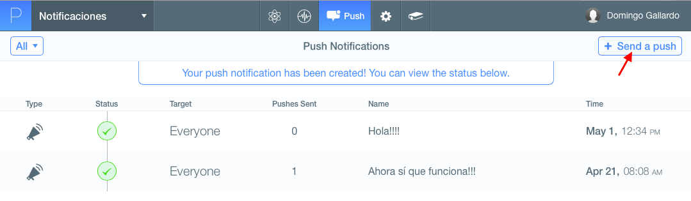

<!-- Tres líneas en blanco para la siguiente transparencia -->


#### Práctica opcional
<!-- .slide: data-background="#cbe0fc" -->

- **Avanzado**: Añadir una etiqueta en la pantalla de la app, que muestre el texto de la notificación remota enviada.


<!-- Tres líneas en blanco para la siguiente transparencia -->


# Master Programación <br/> de Dispositivos Móviles


