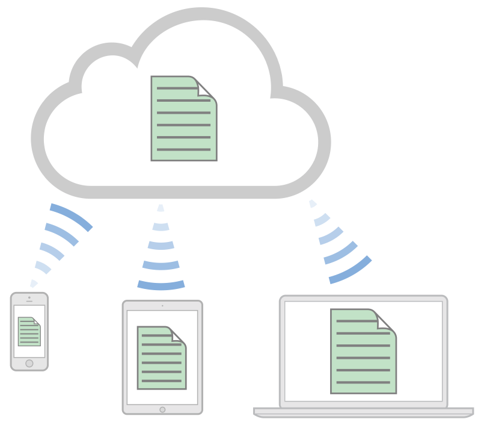
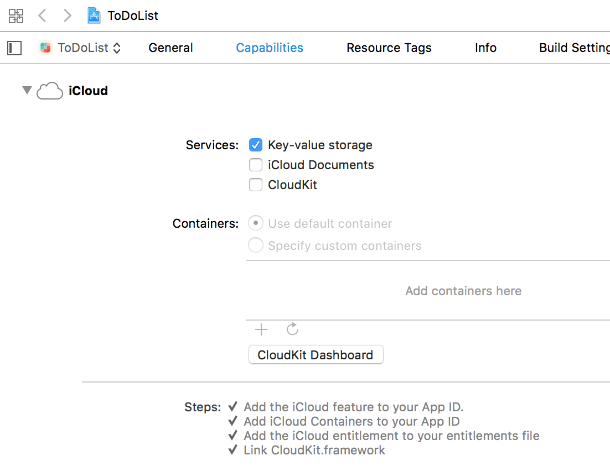
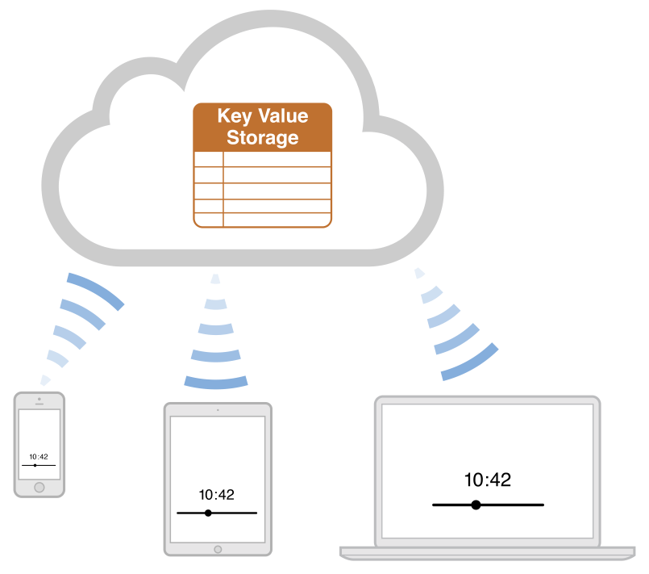

<!--
Referencias:
WWDC vídeo What's next in CoreData: https://developer.apple.com/videos/wwdc/2014/?id=225
WWDC vídeo Advanced CloudKit: https://developer.apple.com/videos/wwdc/2014/?id=231
WWDC vídeo Introducing CloudKit: https://developer.apple.com/videos/wwdc/2014/?id=208
iCloud Design Guide: https://developer.apple.com/library/ios/documentation/General/Conceptual/iCloudDesignGuide/Chapters/Introduction.html
CloudKit Quick Start: https://developer.apple.com/library/ios/documentation/DataManagement/Conceptual/CloudKitQuickStart/Introduction/Introduction.html#//apple_ref/doc/uid/TP40014987


Xamarin Tutorial CloudKit: http://developer.xamarin.com/guides/ios/platform_features/intro_to_cloudkit/
Ray Wenderlich Core Data Tutorial con Swift: http://www.raywenderlich.com/85578/first-core-data-app-using-swift


-->

# Sesión 5: iCloud

#### Servicios de las plataformas móviles - iOS

<small>Domingo Gallardo - domingo.gallardo@ua.es  
Departamento Ciencia de la Computación e Inteligencia Artificial  
Master Programación de Dispositivos Móviles   
2016-17</small> 

<!-- Tres líneas en blanco para la siguiente transparencia -->


## iCloud
<!-- .slide: class="image-right"-->



- iCloud es un servicio de Apple que permite a un usuario acceder a su
  contenido personal (datos, documentos) en todos sus dispositivos
  utilizando su Apple ID.
- iCloud consigue esto combinando almacenamiento en la nube y APIs
  dedicadas integradas en el sistema operativo.
- Apple proporciona la infraestructura de servidores, de transmisión
  de datos y de cuentas de usuario, facilitando el trabajo a los
  desarrolladores que no necesitan crear sus propios servicios ni
  recurrir a soluciones de terceros.

<!-- Tres líneas en blanco para la siguiente transparencia -->


## Filosofía de iCloud (para el usuario de iOS)

- La idea principal tras iCloud es eliminar la sincronización
  explícita entre dispositivos.
- Un usuario nunca necesita pensar sobre la sincronización, y la app
  nunca interactúa directamente con los servidores de iCloud.
- Para el usuario, los cambios aparecen automáticamente en todos los
  dispositivos conectados a la cuenta iCloud.
- Para el desarrollador, depende del API de iCloud que se utilice
  estos cambios son más o menos automáticos.


<!-- Tres líneas en blanco para la siguiente transparencia -->


## Cuenta iCloud

- Todo usuario de Apple puede activar una cuenta de iCloud usando su
  Apple ID
- Permite identificarse y mantenerse logeado en el dispositivo
- Puede activarse desde un Mac, desde un dispositivo iOS, desde la web
  o desde el simulador
- Permite mantener el estado en aplicaciones ejecutándose en distintos
  dispositivos: Recordatorios, Notas, ...
- Necesita activar en el dispositivo el servicio llamado `iCloud
  Drive` (_Ajustes > iCloud > iCloud Drive_).

<!-- Tres líneas en blanco para la siguiente transparencia -->


## Distintas APIs

- Almacenamiento **clave-valor en iCloud**: para mantener el estado de
  la aplicación (puntuación de un juego, última página leída, etc.).
- **Documentos en iCloud**: para mantener documentos sincronizados.
- **iCloud con Core Data**: para mantener de forma automática en
  iCloud una copia de todos los datos de la app gestionados con Core
  Data. Versión inicial con muchos problemas, muy mejorado en las
  últimas versiones.
- **CloudKit** (a partir de iOS 8): nueva tecnología a partir de iOS 8
  que permite mayor flexibilidad y control. Basado en registros con
  diccionarios clave-valor, enfoque muy similar a las tecnologías
  NoSQL.
  - API de transporte que no mantiene un estado local.
  - Basada en peticiones y respuestas asíncronas.

<!-- Tres líneas en blanco para la siguiente transparencia -->


## Preparación de aprovisionamiento y permisos para iCloud

- Para desarrollar con iCloud es necesario estar registrado como
  desarrollador en el programa de desarrollo de Apple. También puedes
  hacerlo con tu Apple ID registrado en el equipo de la UA.
- Para usar los servicios de iCloud es necesario crear un perfil de
  aprovisionamiento con un App Id concreto, añadir el servicio de
  iCloud y activar el permiso (_capabilities_) en la app con XCode.
- Si estás registrado en el equipo de desarrollo con un rol de
  administrador (o tienes una cuenta de pago en la que tienes todos
  los permisos de tu equipo), se puede hacer todo automaticamente
  desde XCode.

<!-- Tres líneas en blanco para la siguiente transparencia -->


## Actualización de capacidades de la app ToDoList
<!-- .slide: data-background="#cbe0fc"-->

 

- Vamos a empezar trabajando en esta primera sesión con **iCloud clave-valor**.
- Copia la carpeta del proyecto `ToDoList` y renómbrala `ToDoList clave-valor`.
- Modifica las _Capabilities_ de tu app ToDoList para activar el
  almacenamiento clave-valor en iCloud.

<!-- Tres líneas en blanco para la siguiente transparencia -->


## Almacenamiento clave-valor
<!-- .slide: class="image-right"-->



- Permite guardar y recuperar en iCloud claves y valores desde los
  dispositivos en los que el usuario está registrado con su Apple Id.
- Para acceder a los valores debemos usar la clase
  [NSUbiquitousKeyValueStore](https://developer.apple.com/library/ios/documentation/Foundation/Reference/NSUbiquitousKeyValueStore_class/index.html).
- Puedes almacenar `String`s, valores escalares como `BOOL` o
  `Double`, diccionarios y también objetos de cualquiera de los
  siguientes tipos: `NSNumber`, `NSString`, `NSDate`, `NSData`,
  `NSArray`, or `NSDictionary`.
- El espacio de almacenamiento total, para un usuario dado, es de 1 MB
  y un máximo de 1024 claves.

```swift
let iCloudStore = NSUbiquitousKeyValueStore.default()
```

<!-- Tres líneas en blanco para la siguiente transparencia -->


## Método `synchronize`

```swift
func synchronize() -> Bool
```
- Devuelve `true` si las claves y valores en memoria y en disco están
  sincronizados o `false` si ha sucedido algún error. Por ejemplo,
  devuelve `false` si la app no se ha compilado con las peticiones
  adecuadas de _entitlement_.
- Los cambios al almacén de claves-valor se salvan en memoria. El
  sistema sincroniza automáticamente estos datos con la caché del
  disco en los momentos apropiados. Por ejemplo, cuando el app pasa a
  segundo plano o cuando se reciben cambios de iCloud.
- Este método no fuerza la subida a iCloud de los nuevos valores y
  claves, sino que hace saber a iCloud que los valores están listos
  para ser subidos. El sistema controla cuándo subir los datos. La
  frecuencia de subida está limitada a bastantes por minuto.
- No es obligatorio su uso, pero es recomendable cuando estamos
  trabajando con el simulador para asegurarnos de que el almacén de
  claves-valor se guarda.


<!-- Tres líneas en blanco para la siguiente transparencia -->


## Ejemplo de uso de `synchronize` al lanzar la app
<!-- .slide: data-background="#cbe0fc"-->

```swift
func application(application: UIApplication, didFinishLaunchingWithOptions launchOptions: [NSObject: AnyObject]?) -> Bool {
    let store = NSUbiquitousKeyValueStore.defaul()
    if (store.synchronize()) {
        print("Sincronización OK")
    } else {
        print("Problemas en la sincronización")
    }
    return true
}
```

<!-- Tres líneas en blanco para la siguiente transparencia -->


## Guardar valores en el almacén de claves-valor

- Para actualizar los valores hay que usar los métodos _set_. El
  primer parámetro es el valor a guardar y el segundo la clave:
    - `set(Bool, forKey: String)`
    - `set(Double, forKey: String)`
    - `set(Int64, forKey: String)`
    - `set([Any]?, forKey: String)`
    - ...
- Por ejemplo,
  [`set(Int64, forKey: String)`](https://developer.apple.com/reference/foundation/nsubiquitouskeyvaluestore/1407812-set) actualiza en el almacén el valor long long (`Int64`) asociándolo a
  una clave especificada:

```swift
store.set(Int64(100), forKey: "puntuacion")
```

<!-- Tres líneas en blanco para la siguiente transparencia -->


## Ejemplo de uso en la práctica
<!-- .slide: data-background="#cbe0fc"-->

```swift
let store = NSUbiquitousKeyValueStore.default()
store.set(Int64(itemsTerminados), forKey: "numItemsDone")
store.synchronize()
```

<!-- Tres líneas en blanco para la siguiente transparencia -->


## Obtención de valores del almacén de claves-valor

- Funciones que obtienen los distintos tipos de datos a partir de una
  clave (una cadena):
    - `array(forKey: String)`
    - `bool(forKey: String)`
    - `dictionary(forKey: String)`
    - `string(forKey: String)`
    - ...

- Por ejemplo,
  [`longlong(forKey: String)`](https://developer.apple.com/reference/foundation/nsubiquitouskeyvaluestore/1413240-longlong)
  devuelve el valor `Int64` asociado a una clave especificada:

```swift
func longlong(forKey: String) -> Int64
```

- Parámetros y resultados del método:
    - `forKey`: un String que es la clave en el almacén de
      claves-valor.
    - Devuelve: el valor asociado a la clave o 0 si la clave no existe
      o no contiene un valor numérico

<!-- Tres líneas en blanco para la siguiente transparencia -->


## Ejemplo de uso en la práctica
<!-- .slide: data-background="#cbe0fc"-->

```swift
let store = NSUbiquitousKeyValueStore.default()
let itemsStore = store.longLong(forKey:"numItemsDone")
itemsTerminados = Int(itemsStore)
let mensaje = "Terminados \(itemsTerminados) ítems"
print(mensaje)
```

<!-- Tres líneas en blanco para la siguiente transparencia -->


## Definiendo un observador de cambios

- Además de almacenar los valores podemos recibir notificaciones
  ([`NSNotification`](https://developer.apple.com/reference/foundation/nsnotification)
  gestionadas por el
  [`NotificationCenter`](https://developer.apple.com/reference/foundation/notificationcenter))
  de cambio de los valores en otros dispositivos conectados a iCloud.
- En el lanzamiento del app hay que registrarse para la notificación
  `NSUbiquitousKeyValueStoreDidChangeExternallyNotification`.
- La notificación se envía cuando el valor de una o más claves han
  cambiado debido a datos que han llegado desde iCloud. La
  notificación no se envía cuando la propia app ha cambiado los
  valores.
- El diccionario atributo `userInfo` de la notificación contiene la
  razón de la notificación, así como una lista de los valores
  cambiados.
- El objeto en la notificación es el `NSUbiquitousKeyValueStore` cuyo
  contenido ha cambiado.

<!-- Tres líneas en blanco para la siguiente transparencia -->


## Ejemplo de definición de un observador de la notificación

- Registramos una clausura para la notificación con el nombre
  `NSUbiquitousKeyValueStore.didChangeExternallyNotification` en el
  momento de lanzar la app, y llamamos al método `synchronize()` para
  obtener las parejas de claves-valor más recientes.

```swift
func application(application: UIApplication, 
                 didFinishLaunchingWithOptions launchOptions: [NSObject: AnyObject]?) -> Bool {
        NotificationCenter.default.addObserver(
            forName: NSUbiquitousKeyValueStore.didChangeExternallyNotification,
            object: NSUbiquitousKeyValueStore.default(),
            queue: OperationQueue.main) {
                (notification) in
                let ubiquitousKeyValueStore =
                    notification.object as! NSUbiquitousKeyValueStore
                ubiquitousKeyValueStore.synchronize()
        }
}
```

<!-- Tres líneas en blanco para la siguiente transparencia -->


## Práctica: ToDoList con iCloud clave-valor

<!-- .slide: data-background="#cbe0fc"-->
<!-- .slide: class="image-right"-->


 


- Estamos trabajando en el proyecto `ToDoList clave-valor`.
- Elimina las referencias a `Fabric` y `Crashlytics`
- Modifica la aplicación para que se guarden en el almacén clave-valor
  de iCloud del usuario:
    - Número de tareas terminadas
    - Última tarea terminada
- Debes usar el perfil de aprovisionamiento `UA Master Moviles ToDoList
  iCloud` y el _bundle name_ `ua.mastermoviles.ToDoList`
- Debes usar la app en el simulador habiéndote logeado en iCloud en el
  propio simulador.
- Prueba a ejecutar distintas veces la app desde el simulador, incluso
  a eliminar la aplicación y volver a instalarla. Debería conservarse
  el número de tareas terminadas y el nombre de la última. Se borrarán
  las tareas pendientes (las guardaremos en CloudKit en la sesión
  siguiente).
- Muestra los datos guardados con una
  [alerta](https://developer.apple.com/reference/uikit/uialertcontroller)
  al arrancar la app.

<!-- Tres líneas en blanco para la siguiente transparencia -->


## Referencias

- [Recursos sobre iCloud](https://developer.apple.com/icloud/index.html)
- [iCloud Design Guide](https://developer.apple.com/library/ios/documentation/General/Conceptual/iCloudDesignGuide/Chapters/Introduction.html#//apple_ref/doc/uid/TP40012094)

<!-- Tres líneas en blanco para la siguiente transparencia -->


# Master Programación <br/> de Dispositivos Móviles


