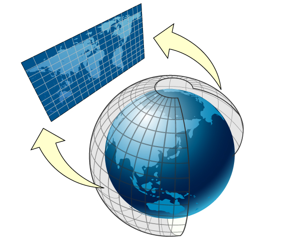
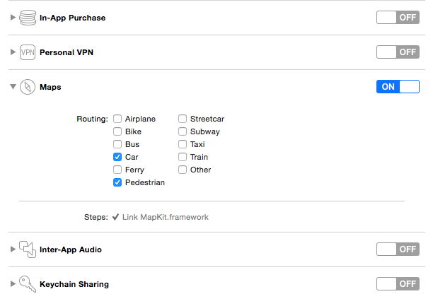
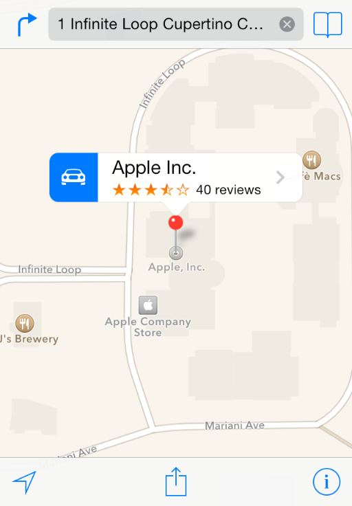
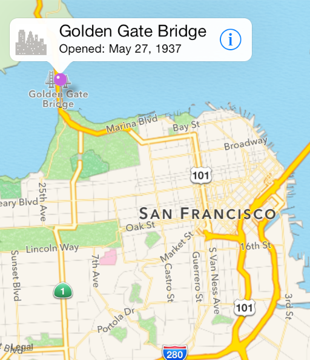
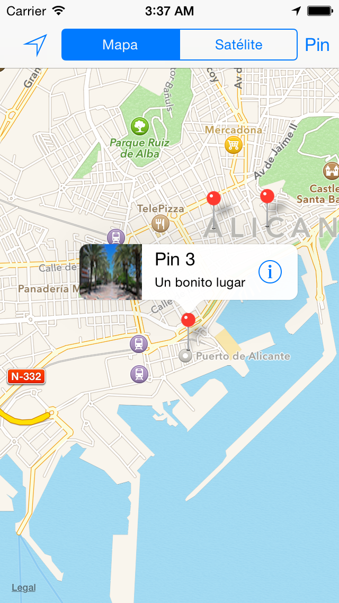
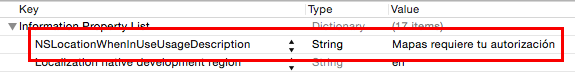
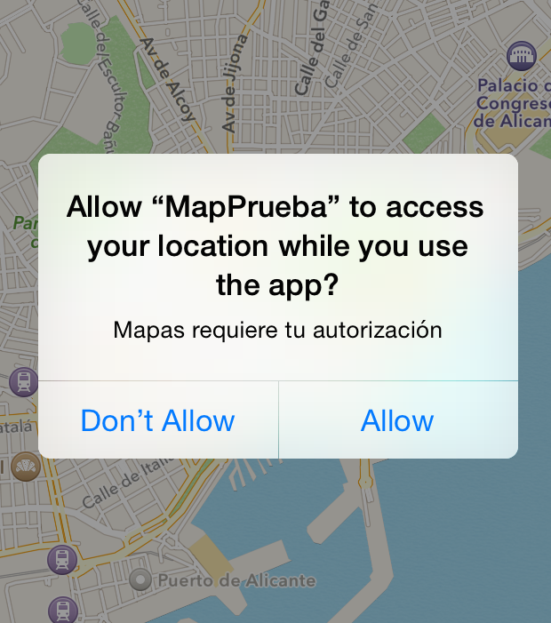
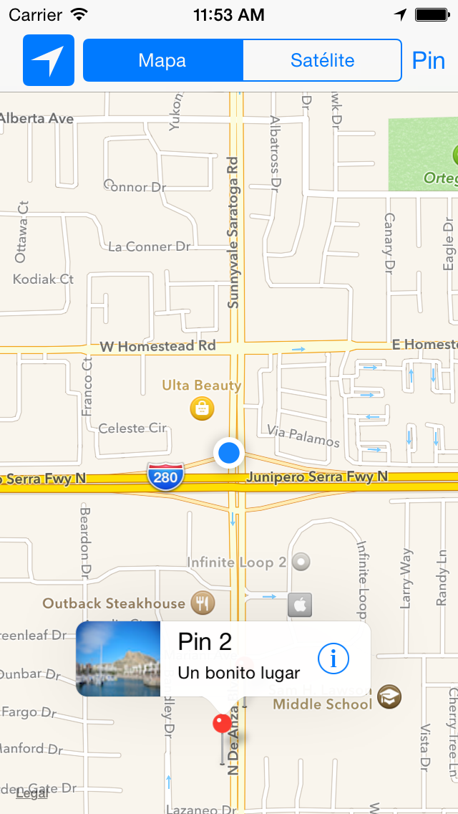
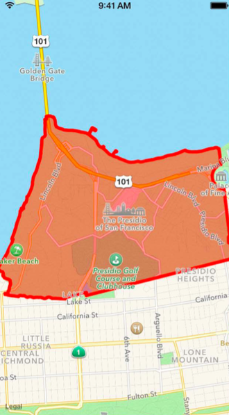
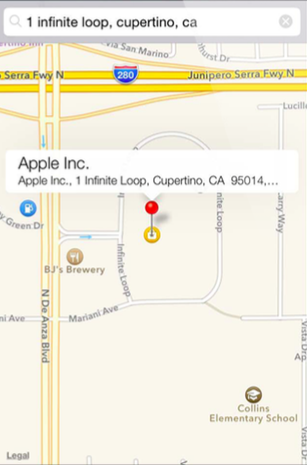

# Sesión 6: <br/> Mapas y <br/>localización

### Servicios de las plataformas móviles - iOS

<small>Domingo Gallardo - domingo.gallardo@ua.es  
Departamento Ciencia de la Computación e Inteligencia Artificial  
Master Programación de Dispositivos Móviles</small>

<!-- Tres líneas en blanco para la siguiente transparencia -->


### Referencias

- [Recursos sobre mapas y localización](https://developer.apple.com/maps/)
- [Location and maps programming guide](https://developer.apple.com/library/ios/documentation/UserExperience/Conceptual/LocationAwarenessPG/Introduction/Introduction.html)
- APIs:
  - [Map Kit Framework Reference](https://developer.apple.com/library/ios/documentation/MapKit/Reference/MapKit_Framework_Reference/)
  - [Core Location Framework Reference](https://developer.apple.com/library/ios/documentation/CoreLocation/Reference/CoreLocation_Framework/)

<!-- Tres líneas en blanco para la siguiente transparencia -->


### Aspectos básicos de MapKit

- [Map Kit](https://developer.apple.com/library/ios/documentation/MapKit/Reference/MapKit_Framework_Reference/) es el framework de Apple para trabajar con mapas.
- Permite muchas funcionalidades: pan y zoom, anotaciones, localización, overlays, búsquedas, rutas, direcciones, ...
- Junto con los servicios de localización proporciona la forma de incluir datos geográficos en nuestras apps.

 


<!-- Tres líneas en blanco para la siguiente transparencia -->


### Aspectos básicos de MapKit

<!-- .slide: class="image-right"-->


- Los mapas permiten a los usuarios a visualizar datos geográficos de una forma fácil de entender.
- Por ejemplo, un mapa puede mostrar datos de satélite de un área, o una visualización tridimensional de una perspectiva de la zona.
- El framework Map Kit permite embeber en tu app un map completamente funcional, que soporta funcionalidades similares a la de la app `Mapas`.
- Con Map Kit puedes incorporar en tu app vistas de un punto geográfico concreto.
- Además, el framework te permite añadir capas de información sobre el mapa, moverlo, o tomar instantáneas de un mapa para imprimir.

<!-- Tres líneas en blanco para la siguiente transparencia -->


### Geometría de los mapas

<!-- .slide: class="image-right"-->



- Map Kit usa una proyección Mercator, que es un tipo específico de proyección cilíndrica.
- Una coordenada se define por una **latitud** y una **longitud**. 
  - La **latitud** es la distancia angular (en grados: de -90.0 a 90.0) desde el punto de la superficie hasta el ecuador. Las latitudes positivas definen puntos por encima del ecuador y las negativas por debajo.
  - La **longitud** es la distancia angular (en grados: de -180.0 a 180.0) desde el punto de la superficie hasta el meridiano 0 (meridianto de Greenwich). Las longitudes positivas definen puntos al este del meridiano y las negativas al oeste.
- La estructura [`CLLocationCoordinate2D`](https://developer.apple.com/library/ios/documentation/CoreLocation/Reference/CoreLocationDataTypesRef/index.html#//apple_ref/c/tdef/CLLocationCoordinate2D) representa esta estructura. Por ejemplo, para crear una localización situada en Alicante:

```swift
let alicanteLocation = CLLocationCoordinate2D(latitude: 38.3453, 
                                              longitude: -0.4831)
```

<!-- Tres líneas en blanco para la siguiente transparencia -->


### Otros puntos

<!-- .slide: class="image-right"-->


- Un _punto en el mapa_ se define por los valores `x` e `y` en la proyección de Mercator. Se define utilizando la estructura [`MKMapPoint`](https://developer.apple.com/library/ios/documentation/MapKit/Reference/MapKitDataTypesReference/index.html#//apple_ref/c/tdef/MKMapPoint). Se utiliza para especificar la posición y forma de los _overlays_ que podemos pintar sobre el mapa.
- Un _punto_ es una unidad gráfica asociada con el sistema de coordenadas de una vista. Los puntos en el mapa y las coordenadas deben convertirse en puntos antes de dibujar contenido en una vista. Los puntos individuales se definen usando la estructura `CGPoint` y las áreas usando `CGSize` y `CGRect`. Consultar las funciones del API de geometría y los tipos de datos en [este enlace](https://developer.apple.com/library/ios/documentation/GraphicsImaging/Reference/CGGeometry/index.html).
- Para almacenar los datos en ficheros es preferible usar coordenadas de mapas.

<!-- Tres líneas en blanco para la siguiente transparencia -->


### Permisos para activar los mapas en nuestra app

<!-- .slide: class="image-right"-->



- Para poder distribuir apps que trabajen con el servicio de mapas es necesario activar en la app el _entitlement_ correspondiente, activando los servicios que necesitamos.
- Debemos tener un perfil de aprovisionamiento aprobado con un App ID que soporte estos servicios.
- No es necesario para el desarrollo y las pruebas.

<!-- Tres líneas en blanco para la siguiente transparencia -->


### Añadir un mapa en nuestra app

- La clase [`MKMapView`](https://developer.apple.com/library/ios/documentation/MapKit/Reference/MKMapView_Class/index.html#//apple_ref/occ/cl/MKMapView) es una interfaz autocontenida para presentar los mapas en tu app. Proporciona todo el soporte para mostrar los datos del mapa, gestionar las interacciones del usuario y hospedar el contenido proporcionado por tu app. Debes importar `MapKit`.
- No debes hacer una subclase de `MKMapView` sino embeberla tal cual en la jerarquía de vistas de tu app:
    - Usando el _Interface Builder_ puedes arrastrar un objeto _Map view_ a la vista o ventana apropiada.
    - Para añadir un mapa por programa, crea una instancia de la clase `MKMapView`, inicialízala con el método [`initWithFrame:`](https://developer.apple.com/library/ios/documentation/UIKit/Reference/UIView_Class/index.html#//apple_ref/occ/instm/UIView/initWithFrame:) y añádela como una subvista a tu ventana o a tu vista.
- Por último debes actualizar el delegado con un objeto que implemente el protocolo [`MKMapViewDelegate`](https://developer.apple.com/library/ios/documentation/MapKit/Reference/MKMapViewDelegate_Protocol/index.html#//apple_ref/occ/intf/MKMapViewDelegate).


<!-- Tres líneas en blanco para la siguiente transparencia -->


### Ejemplo: añadir un mapa mediante programa

```swift
import UIKit
import MapKit

class ViewController: UIViewController, MKMapViewDelegate {

    override func viewDidLoad() {
        super.viewDidLoad()
        let map = MKMapView(frame: CGRectMake(0, 30, 320, 200))
        self.view.addSubview(map)
        map.delegate = self
    }

    override func didReceiveMemoryWarning() {
        super.didReceiveMemoryWarning()
    }
}
```

<!-- Tres líneas en blanco para la siguiente transparencia -->


### Resultado


<!-- Tres líneas en blanco para la siguiente transparencia -->


### Inicialización del mapa

- Podemos también inicializar el mapa cuando se crea usando el _Interface Builder_, usando un `didSet` en el _outlet_ `mapView` que definimos arrastrando desde el _storyboard_:

```swift
@IBOutlet weak var mapView: MKMapView! {
    didSet {
        mapView.mapType = .Standard
        mapView.delegate = self
        let alicanteLocation = 
            CLLocationCoordinate2D(latitude: 38.3453, 
                                   longitude: -0.4831)
        let initialLocation = 
            CLLocation(latitude: alicanteLocation.latitude,
                       longitude: alicanteLocation.longitude)
        centerMapOnLocation(mapView, loc: initialLocation)
    }
}
```

- Para que los controles del mapa funcionen correctamente es necesario asignar el delegado.
- Lo más sencillo es definir el propio `View Controller` como el delegado.

<!-- Tres líneas en blanco para la siguiente transparencia -->


### Centrado del mapa

- La propiedad `region` del mapa controla el área del mapa mostrada.
- Contiene al mismo tiempo el punto de longitud y latitud en el que el mapa está centrado y la zona visible, determinando de forma implícita el zoom del mapa.
- Por ejemplo, la siguiente función centra el mapa en una localización y muestra una zona de 4 km. de alto y ancho:

```swift
func centerMapOnLocation(mapView: MKMapView, loc: CLLocation) {
    let regionRadius: CLLocationDistance = 1000
    let coordinateRegion = 
        MKCoordinateRegionMakeWithDistance(loc.coordinate,
                       regionRadius * 4.0, regionRadius * 4.0)
    mapView.setRegion(coordinateRegion, animated: true)
}
```
    

<!-- Tres líneas en blanco para la siguiente transparencia -->


### Tipos de mapas

- La definición del tipo de mapa se controla con la propiedad `mapType` del mapa.
- Puede tener los valores:

```swift
enum MKMapType : UInt {
    case Standard
    case Satellite
    case Hybrid
}
```

<!-- Tres líneas en blanco para la siguiente transparencia -->


### Ejemplo de selección del tipo de mapa con un `SegmentedControl`

- Supongamos un `SegmentedControl` con los valores `Mapa` y `Satélite`.
- Podemos cambiar la visualización del mapa en la acción definida en el _View Controller_ que contiene el `mapView`:

```swift
enum TipoMapa: Int {
    case Mapa = 0
    case Satélite
}

...

// En el ViewController

@IBAction func seleccion(sender: UISegmentedControl) {
    let tipoMapa = TipoMapa(rawValue: sender.selectedSegmentIndex)
    switch (tipoMapa!) {
        case .Mapa:
            mapView.mapType = MKMapType.Standard
        case .Satélite:
            mapView.mapType = MKMapType.Satellite
    }
}
```

<!-- Tres líneas en blanco para la siguiente transparencia -->


### Uso del delegado

- El objeto delegado puede implementar las funciones del protocolo [`MKMapViewDelegate`](https://developer.apple.com/library/ios/documentation/MapKit/Reference/MKMapViewDelegate_Protocol/index.html#//apple_ref/occ/intf/MKMapViewDelegate) donde recibe los eventos relacionados con el mapa:
  - Cambios en la región visible del mapa.
  - La carga de zonas del mapa de la red.
  - Cambios en la localización del usuario.
  - Cambios asociados con anotaciones y overlys.
- Lo más sencillo es definir como delegado el _view controller_ en el que se incluye el mapa

<!-- Tres líneas en blanco para la siguiente transparencia -->


### Práctica: Mapas (1)

<!-- .slide: class="image-right"-->
<!-- .slide: data-background="#cbe0fc"-->


- Debes crear la app `es.ua.mastermoviles.Mapas` en el repositorio el que estás creando todas las prácticas (no olvides subirlo a Bitbucket).
- Empieza por definir un _View Controller_ en el que debes incluir un mapa centrado inicialmente en Alicante.
- Incluye el _View Controller_ en un _Navigation Controller_ con la opción _Editor > Embed In > Navigation Controller_.
- Añade en el centro de la barra del _Navigation Controller_ un _Segmented Control_ con los valores `Mapa` y `Satélite`, conéctalos con el _ViewController_ y haz que el mapa cambie de tipo cuando se pulse en el control.

<!-- Tres líneas en blanco para la siguiente transparencia -->


### Anotaciones

<!-- .slide: class="image-right"-->



- Las anotaciones permite resaltar coordenadas específicas del mapa y proporcionar información adicional sobre ellas.
- Puedes usar anotaciones para resaltar direcciones, puntos de interés y otros tipos de destinos.
- Cuando se muestran en el mapa, las anotaciones tienen algún tipo de imagen para identificar su localización y también pueden tener un bocadillo (_callout_) que proporciona información y enlaces hacia más contenido.
- En la imagen se muestra una vista estándar en forma de chincheta para marcar un lugar y un _callout_ que muestra más información.

<!-- Tres líneas en blanco para la siguiente transparencia -->


### Clases relacionadas

- Para mostrar una anotación en un mapa necesitamos dos objetos:
  - Un **objeto `annotation`**, que es un objeto que cumple el protocolo [`MKAnnotation`](https://developer.apple.com/library/ios/documentation/MapKit/Reference/MKAnnotation_Protocol/index.html#//apple_ref/occ/intf/MKAnnotation) y que gestiona los datos de la anotación.
  - Una **vista** de la anotación, que es una vista (derivada de la clase [`MKAnnotationView`](https://developer.apple.com/library/ios/documentation/MapKit/Reference/MKAnnotationView_Class/index.html#//apple_ref/occ/cl/MKAnnotationView)) usada para dibujar la representación visual de la anotación sobre la superficie del mapa.


<!-- Tres líneas en blanco para la siguiente transparencia -->


### El protocolo `MKAnnotation`

```swift
var coordinate: CLLocationCoordinate2D { get }
optional var title: String! { get }
optional var subtitle: String! { get }
```
- `coordinate`: coordenadas de la anotación
- `title`: cadena mostrada en el _callout_
- `subtitle`: cadena subtítulo mostrada en el _callout_

<!-- Tres líneas en blanco para la siguiente transparencia -->


### El objeto `annotation`

- Los objetos `annotation` son objetos que conforman el protocolo `MKAnnotation`
- Un ejemplo sencillo:

```swift
class Pin:  NSObject, MKAnnotation {
    var coordinate: CLLocationCoordinate2D
    var title: String!
    var subtitle: String!

    init(num: Int, coordinate: CLLocationCoordinate2D) {
        self.title = "Pin \(num)"
        self.subtitle = "Un bonito lugar"
        self.coordinate = coordinate
        super.init()
    }
}
```

<!-- Tres líneas en blanco para la siguiente transparencia -->


### Vistas de las anotaciones

- Map Kit proporciona vistas estándar de las anotaciones, como la vista de la chincheta.
- Es posible definir vistas _custom_.
- No hay que añadir las vistas en el mapa, sino que hay que definir en el objeto delegado la función que proporciona una vista cuando el mapa la solicita. Se trata de la función `mapView(_:viewForAnnotation:)`

```swift
optional func mapView(_ mapView: MKMapView!, 
                      viewForAnnotation annotation: MKAnnotation!) 
                          -> MKAnnotationView!
```

- En la implementación de esta función debemos construir una vista asociada a la anotación que nos pasan y devolverla para que el _mapView_ la gestione.

<!-- Tres líneas en blanco para la siguiente transparencia -->


### `MKAnnotationView`

- La clase [`MKAnnotationView`](https://developer.apple.com/library/ios/documentation/MapKit/Reference/MKAnnotationView_Class/index.html#//apple_ref/swift/cl/MKAnnotationView) permite bastante flexibilidad para definir las distintas características de las vistas de las anotaciones.
- Permite definir la imagen de la anotación, con su propiedad `image`.
- Permite definir las características del _callout_ que aparecerá cuando el usuario pinche sobre la imagen, así como mantener el estado del mismo. Cuando la anotación está seleccionada, el _callaout_ está activo.
- La clase `MKPinAnnotationView` proporciona unos valores por defecto que podemos usar (por ejemplo, la imagen de la chincheta).
- Como la creación de vistas es costosa, es conveniente reutilizarlas cuando dejan de estar visibles.


<!-- Tres líneas en blanco para la siguiente transparencia -->


### Un ejemplo de vista de anotación

```swift
func mapView(mapView: MKMapView!,
             viewForAnnotation annotation: MKAnnotation!) -> MKAnnotationView! {
    var view: MKPinAnnotationView
    if let dequedView = mapView.dequeueReusableAnnotationViewWithIdentifier("PinAnnotationView") as? MKPinAnnotationView {
        dequedView.annotation = annotation
        view = dequedView
    } else {
        view = MKPinAnnotationView(annotation: annotation, reuseIdentifier: "PinAnnotationView")
        view.pinColor = MKPinAnnotationColor.Red
        view.animatesDrop = true
        view.canShowCallout = true
    }
    return view
}
```

<!-- Tres líneas en blanco para la siguiente transparencia -->


### Añadir anotaciones en el mapa

- Para añadir una anotación al mapa hay que usar el método `addAnnotation` del `viewMap`.
- Por ejemplo, podemos crear una anotación en el centro del mapa creando una instancia de `Pin` (la clase definida anteriormente, que cumple el protocolo `MKAnnotation`) que inicializamos con un número (variable definida en el `viewController` que vamos incrementado):

```swift
let pin = Pin(num: numPin, coordinate: mapView.centerCoordinate)
mapView.addAnnotation(pin)
```

<!-- Tres líneas en blanco para la siguiente transparencia -->


### Práctica: Mapas (2)

<!-- .slide: class="image-right"-->
<!-- .slide: data-background="#cbe0fc"-->


- En el _Storyboard_ añade un `Bar Button Item` en la parte derecha de la barra de navegación.
- Llámalo `Pin` y enlázalo con una acción en el `ViewController` que añada una anotación en el mapa.


<!-- Tres líneas en blanco para la siguiente transparencia -->


### Elementos en el _callout_

<!-- .slide: class="image-right"-->



- Es posible definir en el _callout_ una imagen en su parte izquierda y un botón en la parte derecha.
- Hay que actualizar las propiedades de la vista `leftCalloutAccessoryView` y `rightCalloutAccessoryView` con objetos `UIView`.
- En la parte derecha es común usar un objeto `UIButton` con tipo `UIButtonTypeDetailDisclosure`.

<!-- Tres líneas en blanco para la siguiente transparencia -->


### Imágenes en las anotaciones

- Vamos a mostrar imágenes en la parte izquierda del _callout_, por ejemplo, _thumbnails_ con la foto del sitio en el que está situada la anotación.
- Lo más apropiado es guardar las imágenes en el objeto _annotation_.
- Por simplificar, guardamos dos imágenes predefinidas según el número del pin sea par o impar:

```swift
class Pin:  NSObject, MKAnnotation {
    var coordinate: CLLocationCoordinate2D
    var title: String!
    var subtitle: String!
    var thumbImage: UIImage

    init(num: Int, coordinate: CLLocationCoordinate2D) {
        self.title = "Pin \(num)"
        self.subtitle = "Un bonito lugar"
        self.coordinate = coordinate
        if (num % 2 == 0) {
            self.thumbImage = UIImage(named: "alicante1_thumb.png")!
        } else {
            self.thumbImage = UIImage(named: "alicante2_thumb.png")!
        }
        super.init()
    }
}
```

<!-- Tres líneas en blanco para la siguiente transparencia -->


### Actualización del _callout_

- La actualización del _callout_ se hace en el mismo método `mapView:viewForAnnotation:` que devuelve la vista de una anotación:

```swift
func mapView(mapView: MKMapView!, viewForAnnotation annotation: MKAnnotation!) -> MKAnnotationView! {
    //
    // el mismo código que antes
    //
    let pin = annotation as! Pin
    let thumbnailImageView = UIImageView(frame: CGRect(x:0, y:0, width: 59, height: 59))
    thumbnailImageView.image = pin.thumbImage
    view.leftCalloutAccessoryView = thumbnailImageView
    view.rightCalloutAccessoryView = UIButton.buttonWithType(UIButtonType.DetailDisclosure) as! UIButton
    return view
}
```

<!-- Tres líneas en blanco para la siguiente transparencia -->


### Práctica: Mapas (3)

<!-- .slide: class="image-right"-->
<!-- .slide: data-background="#cbe0fc"-->




- Añade en los _callouts_ imágenes _thumbnails_ predefinidas, dependiendo de si el número de pin es par o impar.
- Añade en los _callouts_ el botón de información.

<!-- Tres líneas en blanco para la siguiente transparencia -->


### Práctica: Mapas (opcional)

<!-- .slide: data-background="#cbe0fc"-->

- Implementa un _segue_ que haga aparecer otra vista con un detalle de la foto.

 


<!-- Tres líneas en blanco para la siguiente transparencia -->


### Práctica: Mapas (opcional)

<!-- .slide: data-background="#cbe0fc"-->

- Pista:

```swift
func mapView(mapView: MKMapView!, annotationView view: MKAnnotationView!, calloutAccessoryControlTapped control: UIControl!) {
    performSegueWithIdentifier("DetalleImagen", sender: view)
}
    
override func prepareForSegue(segue: UIStoryboardSegue, sender: AnyObject?) {
    if segue.identifier == "DetalleImagen" {
        if let pin = (sender as? MKAnnotationView)?.annotation as? Pin {
            if let vc = segue.destinationViewController as? ImageDetailViewController {
                vc.imageDetail = pin.fullImage
            }
        }
    }
}
```

<!-- Tres líneas en blanco para la siguiente transparencia -->


### Localización
<!-- .slide: class="image-right"-->


- Las apps usan datos de localización del dispositivo para múltiples propósitos, desde redes sociales hasta servicios de navegación.
- Los datos de localización se obtienen mediante el framework [`Core Location`](https://developer.apple.com/library/ios/documentation/CoreLocation/Reference/CoreLocation_Framework/). La clase principal es [`CLLocationManager`](https://developer.apple.com/library/ios/documentation/CoreLocation/Reference/CLLocationManager_Class/index.html).
- Este framework proporciona bastantes servicios que puedes usar para obtener y monitorizar la localización actual del dispositivo:
  - El servicio de localización de cambios-significativos proporciona una forma de bajo consumo de obtener la localización actual y ser notificado cuando ha ocurrido un cambio significativo.
  - El servicio de localización estándar ofrece una forma altamente configurable de obtener la localización actual y de hacer un seguimiento de los cambios.
  - La monitorización de regiones te permite monitorizar regiones geográficas y regiones definidas por _beacons_ de Bluetooth de baja energía.

<!-- Tres líneas en blanco para la siguiente transparencia -->


### Activación de los servicios de localización

- Si la app requiere servicios de localización para funcionar correctamente, debes incluir la clave `UIRequiredDeviceCapabilities` en el fichero `Info.plist` de la app. La App Store usa la información en esta clava para prevenir la descarga de la app a dispositivos que no contienen estos servicios. Puedes no añadir esta clave si quieres permitir descargar la app aunque no esté disponible el servicio.
- El valor de la clave es un array de cadenas indicando las características que requiere la app. En el caso de los servicios de localización son relevantes las cadenas `location-services` y `gps`. La primera si se requieren servicios de localización en general y la segundo si se requiere la precisión ofrecida por el GPS.


<!-- Tres líneas en blanco para la siguiente transparencia -->


### Solicitar información al usuario



- En iOS 8 es necesario añadir también en `Info.plist` una cadena asociada a la clave `NSLocationWhenInUseUsageDescription`. Esa cadena se mostrará como subtítulo en el diálogo en el que se solicita al usuario la autorización.



<!-- Tres líneas en blanco para la siguiente transparencia -->


### Para activar la localización

- La clase `AppDelegate` también puede funcionar como `CLLocationManagerDelegate`. Inicializamos ahí el `CLLocationManager`.
- En el método `didFinishLaunchingWithOptions` podemos actualizar el gestor de localización:
  - Inicializamos el delegado del gestor de localización
  - Solicitamos permiso al usuario de que la app va a usar los servicios de localización invocando al método `requestWhenInUseAuthorization()`

<!-- Tres líneas en blanco para la siguiente transparencia -->


### Código

```swift
import UIKit
import CoreLocation

@UIApplicationMain
class AppDelegate: UIResponder, UIApplicationDelegate, CLLocationManagerDelegate {

    var window: UIWindow?
    let locationManager = CLLocationManager()

    func application(application: UIApplication, didFinishLaunchingWithOptions launchOptions: [NSObject: AnyObject]?) -> Bool {
        // Override point for customization after application launch.
        locationManager.delegate = self
        locationManager.requestWhenInUseAuthorization()
        return true
    }
    
    ...
```


<!-- Tres líneas en blanco para la siguiente transparencia -->


### Monitorización de la localización

- Se debe configurar la precisión de la localización, actualizando la propiedad `desiredAccuracy` del gestor de localización, asignándole el valor en metros de la precisión deseada. Cuanto mayor sea la precisión deseada, mayor será el consumo de batería del dispositivo.
- Después se debe llamar al método `startUpdatingLocation()`.
- Cuando suceda un cambio en localización se notificará al delegado llamando a su método `didUpdateLocations` pasándole un array de localizaciones (objetos `CLLocation`):


```swift
func locationManager(manager: CLLocationManager!, didUpdateLocations locations: [AnyObject]!) {
   // Código para gestionar las localizaciones
}
```

<!-- Tres líneas en blanco para la siguiente transparencia -->


### Clase `CLLocation`

- La clase `CLLocation` permite representar una posición _outdoor_ o _indoor_ y el instante de tiempo asociado a ella.
- Atributos:
  - `coordinate`
  - `altitude`
  - `floor`
  - `horizontalAccuracy`
  - `verticalAccuracy`
  - `timestamp`
  - `description`

<!-- Tres líneas en blanco para la siguiente transparencia -->


### Activación de la localización en el mapa

- Una vez activado el servicio de localización se puede activar la localización en el mapa obteniendo el `MKUserTrackingBarButtonItem` y añadiéndolo a la barra de navegación.
- No hace falta llamar a `startUpdatingLocation()`.
- Se puede hacer en el `ViewController` que contiene el mapa:

```swift
override func viewDidLoad() {
    super.viewDidLoad()
    let userTrackingButton = MKUserTrackingBarButtonItem(mapView: mapView)
    self.navigationItem.leftBarButtonItem = userTrackingButton
}
```

<!-- Tres líneas en blanco para la siguiente transparencia -->


### Prueba de la localización en el simulador

- Es posible probar los servicios de localización desde el simulador
- Seleccionar la simulación del movimiento y localización del dispositivo en _Debug > Location_
- Opciones:
  - Ninguna
  - Custom
  - Apple
  - City Bicycle Ride
  - City Run
  - Freeway Ride

<!-- Tres líneas en blanco para la siguiente transparencia -->


### Práctica: Mapas (Localización - opcional)

<!-- .slide: class="image-right"-->
<!-- .slide: data-background="#cbe0fc"-->



- Añade la localización al mapa, haciendo que aparezca en la parte izquierda de la barra de navegación el botón de navegación.
- Cuando pulses el botón de navegación se debe mostrar la posición actual del dispositivo.
- Deberás modificar la función que muestra la vista de una anotación ([`mapView:viewForAnnotation:`](https://developer.apple.com/library/mac/documentation/MapKit/Reference/MKMapViewDelegate_Protocol/#//apple_ref/occ/intfm/MKMapViewDelegate/mapView:viewForAnnotation:)) porque se utiliza también para mostrar la vista de la posición actual del dispositivo (que también es una anotación).


<!-- Tres líneas en blanco para la siguiente transparencia -->


### Otras características: overlays



<!-- Tres líneas en blanco para la siguiente transparencia -->


### Otras características: búsquedas



<!-- Tres líneas en blanco para la siguiente transparencia -->


### Otras características: rutas


<!-- Tres líneas en blanco para la siguiente transparencia -->


### Otras características: 3D

 

<!-- Tres líneas en blanco para la siguiente transparencia -->


# Master Programación <br/> de Dispositivos Móviles


