<!--
Referencias:
WWDC vídeo What's next in CoreData: https://developer.apple.com/videos/wwdc/2014/?id=225
WWDC vídeo Advanced CloudKit: https://developer.apple.com/videos/wwdc/2014/?id=231
WWDC vídeo Introducing CloudKit: https://developer.apple.com/videos/wwdc/2014/?id=208
iCloud Design Guide: https://developer.apple.com/library/ios/documentation/General/Conceptual/iCloudDesignGuide/Chapters/Introduction.html
CloudKit Quick Start: https://developer.apple.com/library/ios/documentation/DataManagement/Conceptual/CloudKitQuickStart/Introduction/Introduction.html#//apple_ref/doc/uid/TP40014987


Xamarin Tutorial CloudKit: http://developer.xamarin.com/guides/ios/platform_features/intro_to_cloudkit/
Ray Wenderlich Core Data Tutorial con Swift: http://www.raywenderlich.com/85578/first-core-data-app-using-swift


-->

# Sesión 6: CloudKit

#### Servicios de las plataformas móviles - iOS

<small>Domingo Gallardo - domingo.gallardo@ua.es  
Departamento Ciencia de la Computación e Inteligencia Artificial  
Master Programación de Dispositivos Móviles   
2016-17</small> 

<!-- Tres líneas en blanco para la siguiente transparencia -->


## Introducción a CloudKit
<!-- .slide: class="image-right"-->


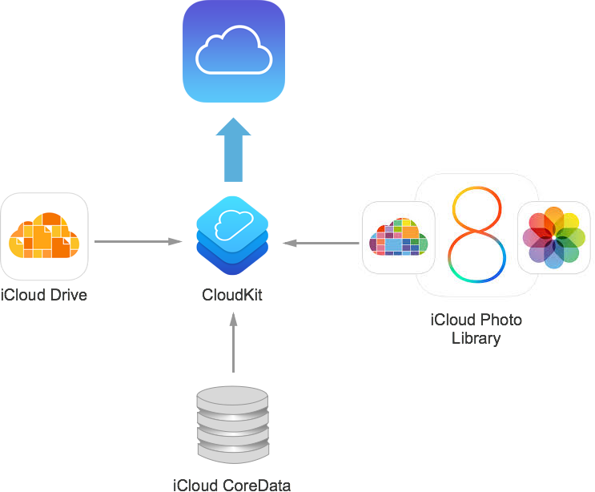


- CloudKit es un proyecto interno de Apple en el que se basan muchas
  de sus APIs de persistencia.
- Su uso se ofrece a les desarrolladores en la WWDC de 2014, para apps
  a partir de iOS 8.
- Acceso a servidores de iCloud.
- Usa las cuentas iCloud de los usuarios.
- Bases de datos públicas (de la app) y privadas (de cada usuario).
- Permite datos estructurados y datos _bulk_.
- Tecnología de transporte, no proporciona base de datos local.

<!-- Tres líneas en blanco para la siguiente transparencia -->


## CloudKit trabaja sobre registros en iCloud

- CloudKit proporciona una forma de mover datos estructurados entre tu
  aplicación y iCloud.
- CloudKit trabaja sobre registros, diccionarios de parejas
  clave-valor con cada clave representando un campo del registro.
- El valor de cada campo suele ser un tipo de datos simple como una
  cadena, una fecha o un número, pero es posible almacenar también
  bloques de datos arbitrarios (ficheros),
- Es posible guardar en los valores referencias a otros registros,
  permitiendo definir relaciones entre registros.


<!-- Tres líneas en blanco para la siguiente transparencia -->


## Registros públicos y privados

- Se pueden guardar registros de forma pública y privada, dependiendo
  de si se guardan en la base de datos pública o en la privada.
- Los registros públicos son accesibles a todos los usuarios del app,
  mientras que los privados son sólo visibles por el usuario actual
  por defecto.
- La base de datos pública está siempre disponible para lectura,
  aunque el usuario no se haya identificado con su cuenta de iCloud
- Para salvar registros en la base de datos pública es necesario que
  el usuario esté identificado, porque siempre se guarda el usuario
  propietario del registro.

<!-- Tres líneas en blanco para la siguiente transparencia -->


## Tecnología de transporte

- CloudKit no proporciona ninguna forma de almacenar datos localmente.
- Es un servicio para mover datos a y desde iCloud y no está pensado
  para reemplazar los modelos de datos ya existentes en tu app
  (CoreData).
- El objetivo del framework es complementar estos modelos con una
  forma de empaquetar los datos para iCloud y recibir actualizaciones
  posteriores sobre esos datos.
- Con CloudKit, tu eres el responsable de mover los datos desde tu app
  a iCloud y desde iCloud a la App. Aunque CloudKit proporciona
  facilidades para mantenerte informado cuando sucede un cambio, tu
  debes obtener esos cambios explícitamente.
- Debido a que eres el responsable de obtener y salvar los datos,
  debes de asegurarte de que los datos se obtienen en el momento
  oportuno y en el orden correcto, y de manejar los errores que se
  producen.

<!-- Tres líneas en blanco para la siguiente transparencia -->


## Elementos de CloudKit

- Contenedores
- Bases de datos
- Registros
- Zonas de registros
- Identificadores
- Referencias 
- _Assets_


<!-- Tres líneas en blanco para la siguiente transparencia -->


## Contenedores 

<!-- .slide: class="image-right"-->


- Múltiples apps y usuarios tienen acceso a iCloud, pero los datos se
  encuentran segregados y encapsulados en particiones llamadas
  `contenedores`.
- Los contenedores de tus apps no pueden ser usados por apps de otro
  desarrollador.
- Puedes compartir un contenedor entre varias apps.
- Existe un contenedor por defecto para cada app, pero puedes crear
  contenedores adicionales.
- El identificador por defecto se llama igual que el bundle ID de la
  app.
- Los contenedores adicionales deben tener un nombre único entre todas
  las apps de los desarrolladores.
- **Los contenedores no pueden borrarse.**

<!-- Tres líneas en blanco para la siguiente transparencia -->


## Gestión en el _member center_

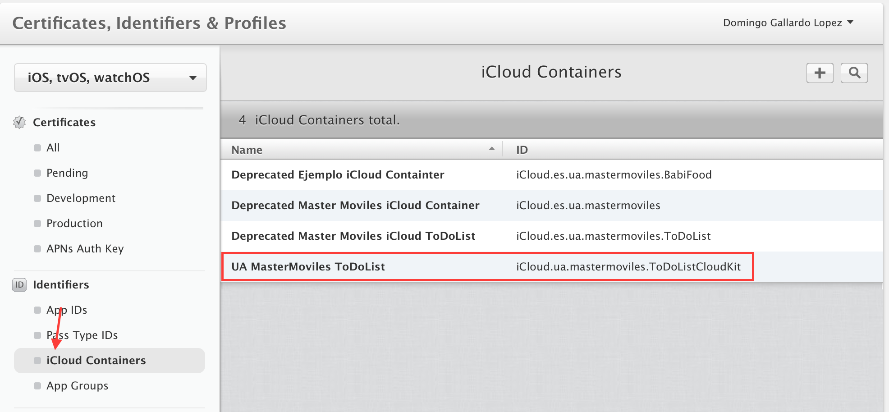

- Una de las opciones del _member center_ permite gestionar
  contenedores de iCloud.
- Creamos uno con el identificador `iCloud.ua.mastermoviles.ToDoListCloudKit` que utilizaremos en la app _ToDoList_.
- No es posible borrar contenedores.

<!-- Tres líneas en blanco para la siguiente transparencia -->


## Creación del App ID

- Se debe crear el App ID que otorgue la capacidad de acceso a iCloud.
- Creamos el permiso (App ID) `UA MasterMoviles ToDoListCloudKit` que
  incluye la capacidad de iCloud.

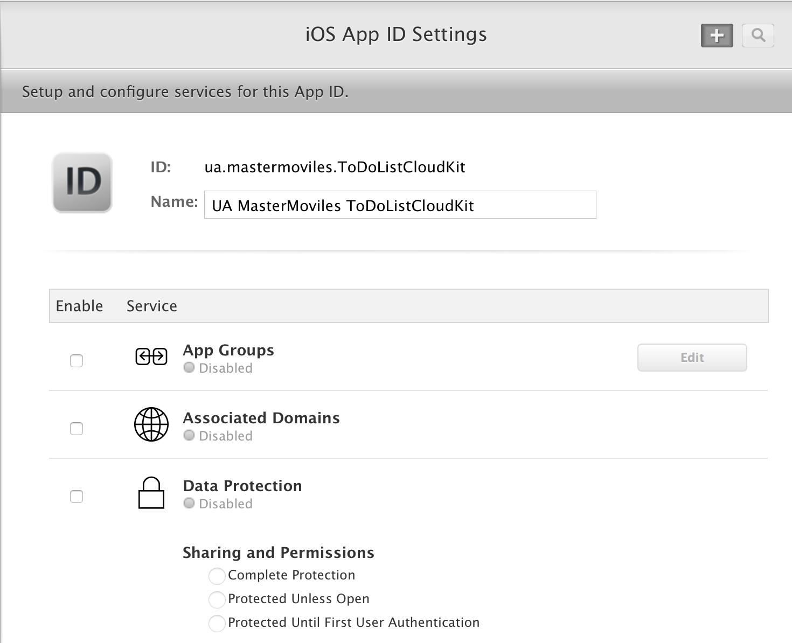 

<!-- Tres líneas en blanco para la siguiente transparencia -->


## Asignación del container al App ID

- Incluimos en el App ID el contenedor de iCloud anterior.

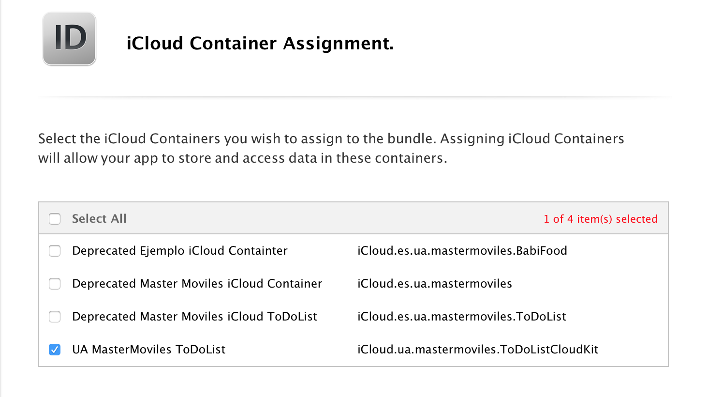 

<!-- Tres líneas en blanco para la siguiente transparencia -->


## Creación del perfil de aprovisionamiento

- Creamos el perfil de aprovisionamiento `UA ToDoListCloudKit Profile`
  con el App ID anterior.

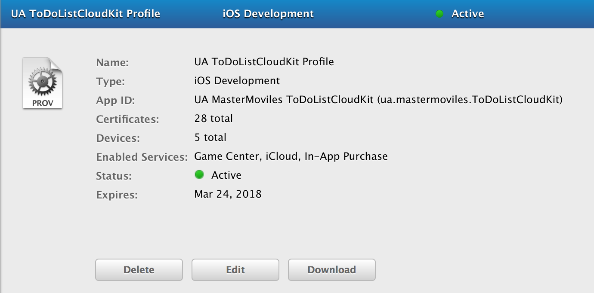

<!-- Tres líneas en blanco para la siguiente transparencia -->


## Actualización de capacidades de la app ToDoListCloudKit
<!-- .slide: data-background="#cbe0fc"-->

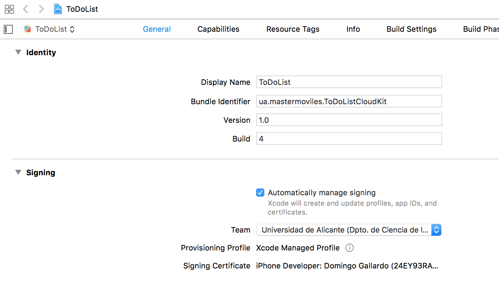 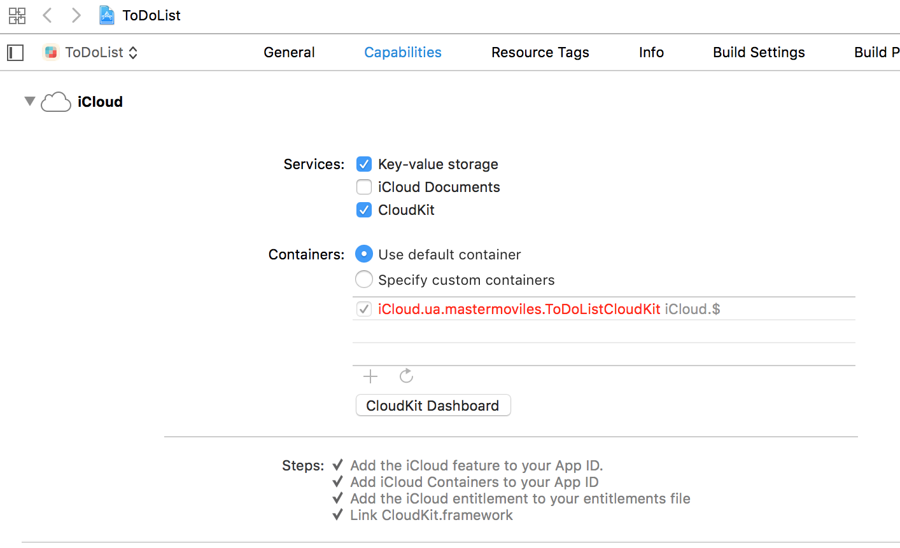

<!-- Tres líneas en blanco para la siguiente transparencia -->


## Dashboard

- _Dashboard_ es una interfaz web con la que podemos gestionar
  nuestros contenedores
- El administrador del equipo de desarrollo puede gestionar permisos
  para el resto de miembros. Los permisos se definen a nivel de
  contenedor.
- [https://icloud.developer.apple.com/dashboard/](https://icloud.developer.apple.com/dashboard/)
- Permite:
    - Crear, visualizar, editar y borrar esquemas, registros, etc.
    - Estadísticas de uso
    - Administración de acceso
    - Configuración de despliegue

<!-- Tres líneas en blanco para la siguiente transparencia -->


## Dashboard: permisos
<!-- .slide: data-background="#cbe0fc"-->

- Comprobamos los permisos de los miembros del equipo de la
  universidad en el _dashboard_ de iCloud.

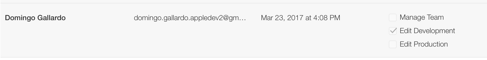

<!-- Tres líneas en blanco para la siguiente transparencia -->


## Dashboard: tipos de registros

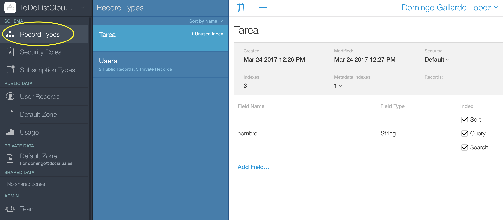

<!-- Tres líneas en blanco para la siguiente transparencia -->


## Dashboard: uso

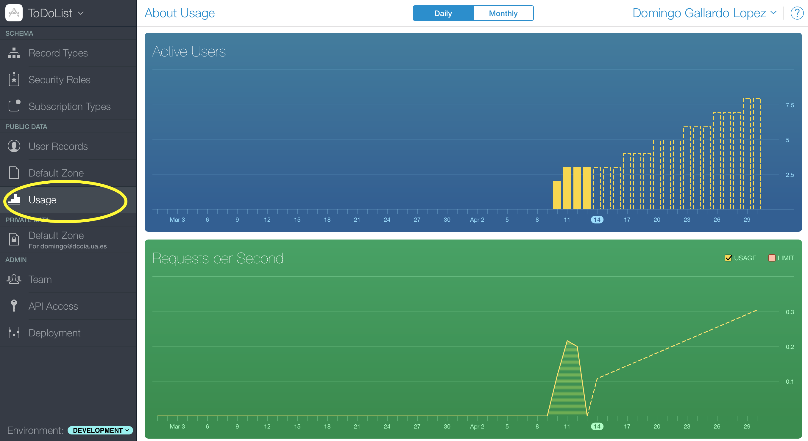

<!-- Tres líneas en blanco para la siguiente transparencia -->


## Clase CKContainer

- La clase con la que trabajar para gestionar el contenedor es
  [CKContainer](https://developer.apple.com/library/ios/documentation/CloudKit/Reference/CKContainer_class/index.html#//apple_ref/occ/cl/CKContainer)
- La debemos usar para:
  - Obtener las bases de datos públicas y privadas
  - Obtener el identificador del contenedor
  - Determinar el estado del acceso de la cuenta iCloud del usuario
  - Solicitar y determinar permisos de la app
  - Ejecutar operaciones sobre el contenedor
  - Descubrir registros de usuarios 
- En CloudKit todas las operaciones son asíncronas: se pasa el código
  de _callback_ al que se llamará cuando la petición devuelva la
  respuesta.

<!-- Tres líneas en blanco para la siguiente transparencia -->


## Características sociales de CloudKit

<!-- .slide: class="image-right"-->


- CloudKit permite descubrirse entre ellos a usuarios que están usando
  nuestra app. Los usuarios podrán compartir datos de identidad
  (nombre de usuario y correo elctrónico) si:
    - Están en los contactos del usuario actual
    - Han dado el permiso a la app
- Para que otros usuarios puedan acceder a la información del usuario
  actual, hay que solicitarle su aprobación llamando a la función
  [`requestApplicationPermission`](https://developer.apple.com/reference/cloudkit/ckcontainer/1399174-requestapplicationpermission)
- Se le pasa como parámetro `completionHandler` el manejador de la
  respuesta del usuario. Recibiremos dos parámetros, el
  `applicationPermissionStatus` (constante que indica lo que ha
  respondido el usuario) y un objeto `error` que será `nil` si todo ha
  ido correctamente.

<!-- Tres líneas en blanco para la siguiente transparencia -->


## Características sociales de CloudKit

- Se pueden buscar los usuarios que han dado permiso y que están en la
  agenda del usuario actual por su dirección de correo electrónico
  registrada en el Apple Id.
- La función
  [`discover​All​Identities(completion​Handler:​)`](https://developer.apple.com/reference/cloudkit/ckcontainer/1640421-discoverallidentities)
  de `CKContainer` permite obtener estos usuarios
    - Se le pasa como parámetro `completionHandler`, una función que
      la consulta ejecutará cuando se obtengan los resultados. Tiene
      dos parámetros:
        - Un array de objetos `CKUser​Identity` que corresponde con los
        contactos del usuario que han autorizado conocerlos. Si no hay
        usuarios, el array estará vacío.
        - Un objeto error si sucede algún problema, o `nil` si los IDs
          se han obtenido correctamente.


<!-- Tres líneas en blanco para la siguiente transparencia -->


## Ejemplo de código


```swift
let container = CKContainer.default()
print("Container: ")
print(container)
// Solicitamos permiso para que el usuario se haga descubrible
container.requestApplicationPermission(
    CKApplicationPermissions.userDiscoverability,
    completionHandler: { (permissionStatus, error) in
        print("Permiso concedido: " +
            "\(permissionStatus == CKApplicationPermissionStatus.granted)")})
        
// Obtenemos los usuarios de la app que han dado permiso
container.discoverAllIdentities(completionHandler: { (optUsers, error) in
    if let users = optUsers {
        for user in users {
            print(user)
            // usamos user.userRecordID para buscar
            // registros públicos de un usuario
        }
    }})

```

<!-- Tres líneas en blanco para la siguiente transparencia -->


## Bases de datos


<!-- Tres líneas en blanco para la siguiente transparencia -->


## Bases de datos

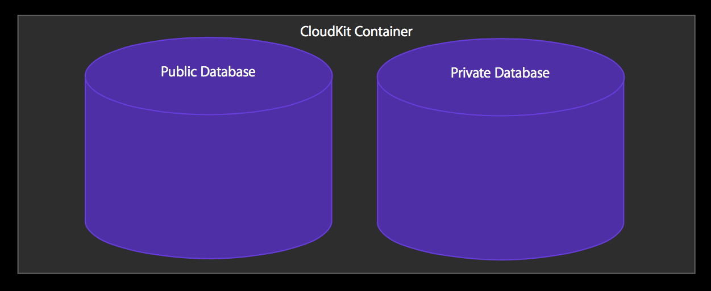


<!-- Tres líneas en blanco para la siguiente transparencia -->


## Bases de datos

- Las bases de datos son instancias de la clase
  [`CKDatabase`](https://developer.apple.com/library/ios/documentation/CloudKit/Reference/CKDatabase_class/index.html#//apple_ref/occ/cl/CKDatabase)
- Cada app tiene acceso a dos bases de datos
  - Base de datos pública
  - Base de datos privada
- Se obtienen a través del `CKContainer`:

```swift
let container = CKContainer.default()
let privateDB = container.privateCloudDatabase
let publicDB = container.publicCloudDatabase
```

<!-- Tres líneas en blanco para la siguiente transparencia -->


## Bases de datos


<!-- Tres líneas en blanco para la siguiente transparencia -->


## Registros


<!-- Tres líneas en blanco para la siguiente transparencia -->


## Registros

- Se definen con la clase
  [CKRecord](https://developer.apple.com/library/ios/documentation/CloudKit/Reference/CKRecord_class/).
- Conjunto de parejas clave y valor con un identificador único de la
  clase. [`CKRecordID`](https://developer.apple.com/library/ios/documentation/CloudKit/Reference/CKRecordID_class/index.html#//apple_ref/occ/cl/CKRecordID)
- Se crean a partir de un tipo registro (definido en el esquema del
  contenedor) definido por un `String`.

```swift
let tareaRecord = CKRecord(recordType: "Tarea")
tareaRecord["nombre"] = nombre as CKRecordValue?
```
- Los tipos de registro se pueden crear dinámicamente al añadir un
  registro a una base de datos, en tiempo de desarrollo.
- Se añaden registros a una base de datos usando la función
  [`save`](https://developer.apple.com/reference/cloudkit/ckdatabase/1449114-save),
  a la que hay que pasar un bloque que recibe el registro salvado y un
  error (en caso en que no se haya podido salvar).

```swift
privateDB.save(tareaRecord, completionHandler: {
    (record: CKRecord?, error: Error?) -> Void in
        print("Registro: \(record)")
        print("Error: \(error)")})
```

<!-- Tres líneas en blanco para la siguiente transparencia -->


## Datos en los registros

- El protocolo
[CKRecordValue](https://developer.apple.com/reference/cloudkit/ckrecordvalue)
define los posibles valores que pueden haber en los atributos de los registros:
    - `NSString`: Cadenas
    - `NSNumber`: Números, incluidos enteros y punto flotante.
    - `NSData`: Bytes arbitrarios de datos (por ejemplo, la
  serialización binaria de un `struct`. No usar para almacenar
  ficheros binarios grandes, usar `CKAsset` en su lugar.
    - `NSDate`: Fechas
    - `CLLocation`: Coordenadas geográficas
    - `CKReference`: Referencias a otros registros para crear relaciones entre ellos.
    - `CKAsset`: Fichero binario.
    - Arrays de todo lo anterior

<!-- Tres líneas en blanco para la siguiente transparencia -->


## Relaciones entre registros: referencias


<!-- Tres líneas en blanco para la siguiente transparencia -->


## Referencias

<!-- .slide: class="image-right"-->

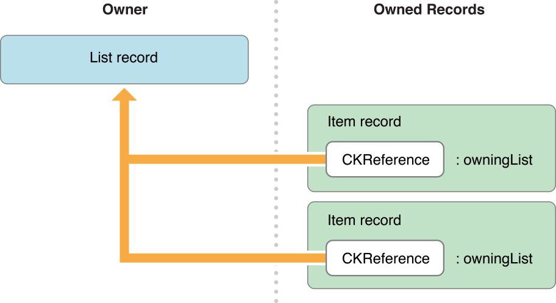

- Clase
  [CKReference](https://developer.apple.com/library/ios/documentation/CloudKit/Reference/CKReference_class/index.html#//apple_ref/occ/cl/CKReference)
- El servidor entiende las relaciones _Padre_ _Hijo_
- Borrados en cascada
- Cuidado con los problemas de integridad, será normal que no existan
  referencias
- Se prefieren las referencias hacia atrás para modelar las relaciones
  anteriores

<!-- Tres líneas en blanco para la siguiente transparencia -->


## Queries

- Para realizar una consulta se debe utilizar la clase
  [`CKQuery`](https://developer.apple.com/library/ios/documentation/CloudKit/Reference/CKQuery_class/index.html#//apple_ref/occ/cl/CKQuery)
  para buscar objetos que cumplen una determinada condición en una
  base de datos.
- La consulta almacena los parámetros de búsqueda, incluyendo el tipo
  de registros a buscar, el criterio (predicado) a aplicar, y el
  parámetro de ordenación que aplicar a los resultados.
- El objeto de la búsqueda se usa para ejecutar una consulta en la
  base de datos usando el método
  [`perform`](https://developer.apple.com/reference/cloudkit/ckdatabase/1449127-perform)
  Se le pasa un manejador al que se llamará cuando se obtengan los
  resultados. La operación de búsqueda se restringe a los objetos de
  una zona (se pasa `nil` para la zona por defecto).
- Para realizar consultas con más control sobre el número de registros
  devueltos, o utilizar un cursor definido por el límite de registros
  devueltos, hay que realizar una
  [`CKQueryOperation`](https://developer.apple.com/library/ios/documentation/CloudKit/Reference/CKQueryOperation_class/index.html#//apple_ref/occ/cl/CKQueryOperation).


<!-- Tres líneas en blanco para la siguiente transparencia -->


## Ejemplo

- Query que devuelve todos los registros de tipo "Tarea" de la base de
  datos privada del usuario actual

```swift
let query = CKQuery(recordType: "Tarea", predicate: NSPredicate(value:true))
let container = CKContainer.default()
let privateDB = container.privateCloudDatabase
privateDB.perform(query, inZoneWith: nil, completionHandler: {
    (results, error) in
    for result in results! {
        if let nombre = result["nombre"] {
            print("Tarea: \(nombre)")
            let toDoItem = ToDoItem(nombre: nombre as! String)
            self.toDoItems.append(toDoItem)
        }
    }
})
```

- Otros ejemplos de predicados (consultar
  [CKQuery](https://developer.apple.com/reference/cloudkit/ckquery) y [NSPredicate](https://developer.apple.com/reference/foundation/nspredicate))

```swift
let predicate = NSPredicate(format: "nombre BEGINSWITH 'Limpiar'")
let predicate = NSPredicate(format: "favoriteColors CONTAINS 'red'")
```

<!-- Tres líneas en blanco para la siguiente transparencia -->


## Operaciones con registros obtenidos

- Un ejemplo de código en el que borramos los registros de tipo
  "Tarea" cuyo nombre coincide con un nombre:

```swift
func deleteTarea(_ nombre: String) {
    let query = CKQuery(recordType: "Tarea", 
                     predicate: NSPredicate(format: "nombre == %@", argumentArray: [nombre]))
    let container =  CKContainer.default()
    let privateDB = container.privateCloudDatabase
    privateDB.perform(query, inZoneWith: nil, completionHandler: {
        (results, error) in
        if error == nil {
            for result in results! {
                let record: CKRecord! = result as CKRecord
                privateDB.delete(withRecordID: record.recordID, completionHandler: {
                    (recordID, error) in print("Error: \(error)")
                })
            }
        }
    })
}
```

<!-- Tres líneas en blanco para la siguiente transparencia -->


## Suscripciones


- Posibilidad de hacer consultas "permanentes"
- Ejecutadas en background por el servidor tras cada registro salvado
- Generan notificaciones push con los resultados

<!-- Tres líneas en blanco para la siguiente transparencia -->


## CloudKit JS
<!-- .slide: class="image-right"-->

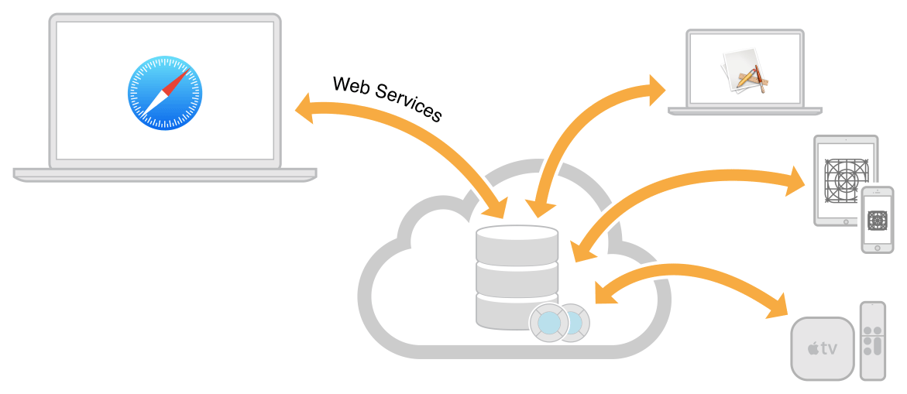

- [CloudKit JS](https://developer.apple.com/library/ios/documentation/CloudKitJS/Reference/CloudKitJavaScriptReference/index.html)
  es una librería que proporciona un API JavaScript para acceder a los
  datos en los contenedores CloudKit.
- Lanzado en WWDC 2015.
- Necesita un token generado en el dashboard para acceso seguro al API
  en la conexión servidor-servidor.
- Permite autentificarse y realizar peticiones seguras JavaScript
  desde una aplicación web para acceder a los datos de CloudKit.
- Sistema usado por la interfaz web de las apps de Apple en la página
  web de iCloud (Notas, Photos, etc.)
- En 2016 Apple ha lanzado un
  [servicio web](https://developer.apple.com/library/ios/documentation/DataManagement/Conceptual/CloutKitWebServicesReference/Introduction/Introduction.html)
  para acceder a CloudKit usando peticiones REST.

<!-- Tres líneas en blanco para la siguiente transparencia -->


## Práctica: ToDoList en CloudKit

<!-- .slide: data-background="#cbe0fc"-->
<!-- .slide: class="image-right"-->


- Configuración de la app:
    - Trabajamos con el proyecto `ToDoList CloudKit` y el _bundle ID_
      `ua.mastermoviles.ToDoListCloudKit` y el perfil de
      aprovisionamiento `UA ToDoListCloudKit Profile`.
    - Arregla el _storyboard_ de la app (hay una vista de navegación de más).
- Desarrollo de la práctica:
    - Añade el código necesario para que las tareas pendientes
      se guarden y recuperen de la base de datos privada de
      CloudKit.
    - (Opcional): Utiliza la base de datos pública para
     publicar tareas compartidas por todos los usuarios de la
     app. Muestra el texto de las tareas públicas en un color
     diferente en el listado de tareas.

<!-- Tres líneas en blanco para la siguiente transparencia -->


## Pista para actualizar la tabla
<!-- .slide: data-background="#cbe0fc"-->

- Los _callbacks_ en los que se reciben los resultados de las
  _queries_ son asíncronos y se procesan en hilos secundarios.
- Si actualizamos los datos de la tabla en un _callback_ de este tipo,
  la interfaz de usuario no se refrescará hasta que el usuario no
  interactúe con la tabla.
- Se puede forzar a ejecutar la actualización de los datos de la tabla en
  el hijo principal con este código:
  
```swift
DispatchQueue.main.async( execute: {
    self.tableView.reloadData()
})
```

<!-- Tres líneas en blanco para la siguiente transparencia -->


## Referencias

- [Recursos sobre iCloud](https://developer.apple.com/icloud/index.html)
- [iCloud Design Guide](https://developer.apple.com/library/ios/documentation/General/Conceptual/iCloudDesignGuide/Chapters/Introduction.html#//apple_ref/doc/uid/TP40012094)
- [CloudKit Quick Start](https://developer.apple.com/library/ios/documentation/DataManagement/Conceptual/CloudKitQuickStart/Introduction/Introduction.html#//apple_ref/doc/uid/TP40014987)
- [iCloud Programming Guide for Core Data](https://developer.apple.com/library/ios/documentation/DataManagement/Conceptual/UsingCoreDataWithiCloudPG/Introduction/Introduction.html#//apple_ref/doc/uid/TP40013491)

<!-- Tres líneas en blanco para la siguiente transparencia -->


# Master Programación <br/> de Dispositivos Móviles


