# Sesión 7: <br/> Plataforma iAd

### Servicios de las plataformas móviles - iOS

<small>Domingo Gallardo - domingo.gallardo@ua.es  
Departamento Ciencia de la Computación e Inteligencia Artificial  
Master Programación de Dispositivos Móviles</small>

<!-- Tres líneas en blanco para la siguiente transparencia -->


### Referencias

- [Recursos sobre iAd](https://developer.apple.com/iad/resources/)
- [iAd Programming Guide](https://developer.apple.com/library/ios/documentation/UserExperience/Conceptual/iAd_Guide/Introduction/Introduction.html)
- [View Controller iAd Additions](https://developer.apple.com/library/ios/documentation/iAd/Reference/UIViewController_iAd_Additions/index.html)
- [ADBannerView Reference](https://developer.apple.com/library/ios/documentation/UserExperience/Reference/ADBannerView_Ref/)
- [Monetizing Your iOS Apps with iAd](https://developer.apple.com/iad/resources/Implementing-iAd-in-Your-iOS-Apps.PDF)
- [Implementing a Shared iAd Banner](https://developer.apple.com/library/ios/technotes/tn2286/_index.html)

<!-- Tres líneas en blanco para la siguiente transparencia -->


### ¿Qué es iAd?

- Monetizar tus apps: incluir anuncios en tus apps.
- Promocionar tus apps: crear campañas [Anúnciate con Apple](http://advertising.apple.com/es/).

<!-- Tres líneas en blanco para la siguiente transparencia -->


### Beneficios de la integración de iAd para monetizar tus apps

- Anuncios de calidad tanto en la producción como en los medios (animaciones, vídeo, interacción).
- Garantía de privacidad de los usuarios.
- Integración fácil y rápida.

<!-- Tres líneas en blanco para la siguiente transparencia -->


### Extensión global de la red iAd


- [Más de 100 países](https://support.apple.com/en-us/HT203102).
- Una gran excepción: no está presente en China.

<!-- Tres líneas en blanco para la siguiente transparencia -->


### Gestión sencilla

- Reparto de beneficios: 70% para el desarrollador - 30% Apple.
- Fácil darse de alta en [iTunes Connect](https://itunesconnect.apple.com).
- Integración rápida en la app.
- Proceso de aprobación sencillo, incluido en la revisión de la app para distribución en la App Store.

<!-- Tres líneas en blanco para la siguiente transparencia -->


### Gestión centralizada en iTunes Connect

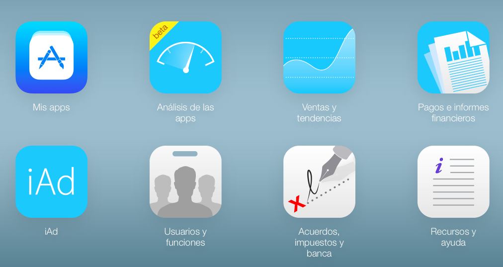

<!-- Tres líneas en blanco para la siguiente transparencia -->


### Promoción: uso de iAd para lanzar campañas para nuestras app

<!-- .slide: class="image-right"-->

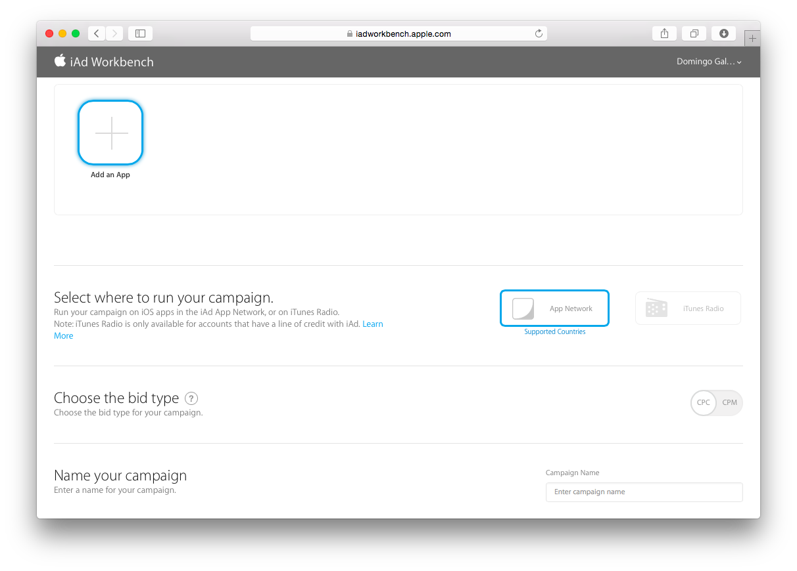

- Servicio [iAd Workbench](https://iadworkbench.apple.com/) para que los desarrolladores lancen campañas para sus apps.
- Permite crear banners o usar banners predefinidos.
- Distribuir anuncios en la red iAd.
- Gestionar las campañas.

<!-- Tres líneas en blanco para la siguiente transparencia -->


### Red de iAd 

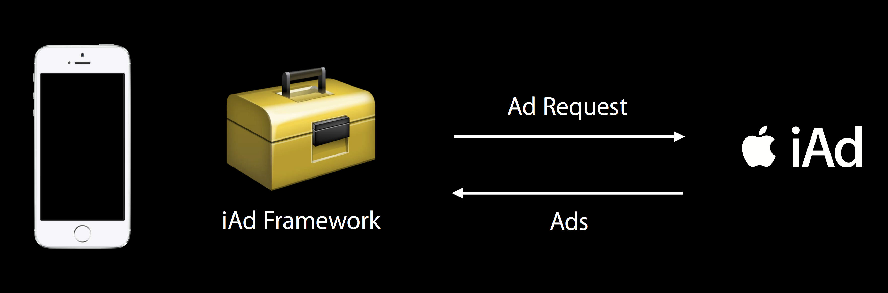

- Inventario de anuncios.
- Nuevo anuncio cada 30 segundos.
- El framework se encarga de la recarga del anuncio en la vista de la app.

<!-- Tres líneas en blanco para la siguiente transparencia -->


### Conceptos

- _Fill rate_ = anuncios enviados / peticiones
- Varía mucho según la red de anuncios, país, etc.
- _Tap-through rate_ = anuncios pulsados / anuncios mostrados.
- iAd tiene buenos resultados en estas métricas.

<!-- Tres líneas en blanco para la siguiente transparencia -->


### Conseguir más anuncios pulsados

<!-- .slide: class="image-right"-->

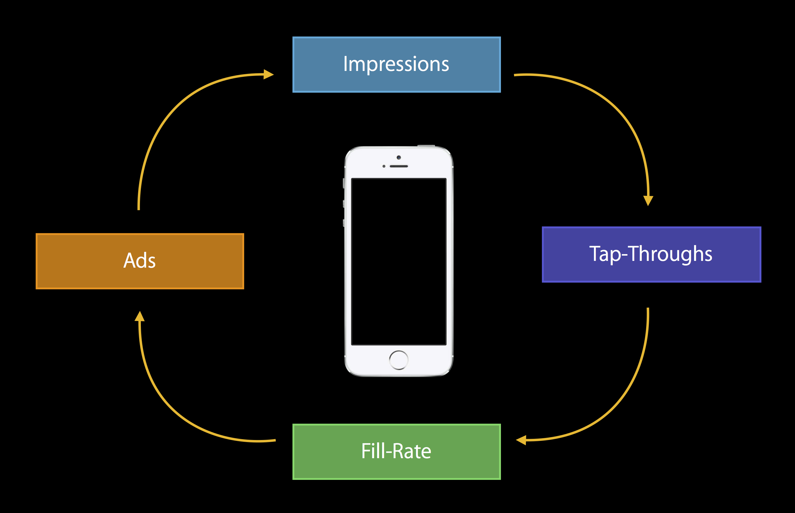


- Elegir cuidadosamente el sitio donde mostrar el anuncio.
- App que enganche: cuanto más tiempo de uso, más pulsaciones.
- Lealtad de los usuarios.

<!-- Tres líneas en blanco para la siguiente transparencia -->


### Formatos de anuncios


<!-- Tres líneas en blanco para la siguiente transparencia -->


### Banner


- Poco invasivo.
- Situado normalmente en la parte inferior del contenido.
- Carga continua de anuncios (cada 30 segundos).
- Pantalla completa cuando se pulsa.
- Soporte para iPhone e iPad.

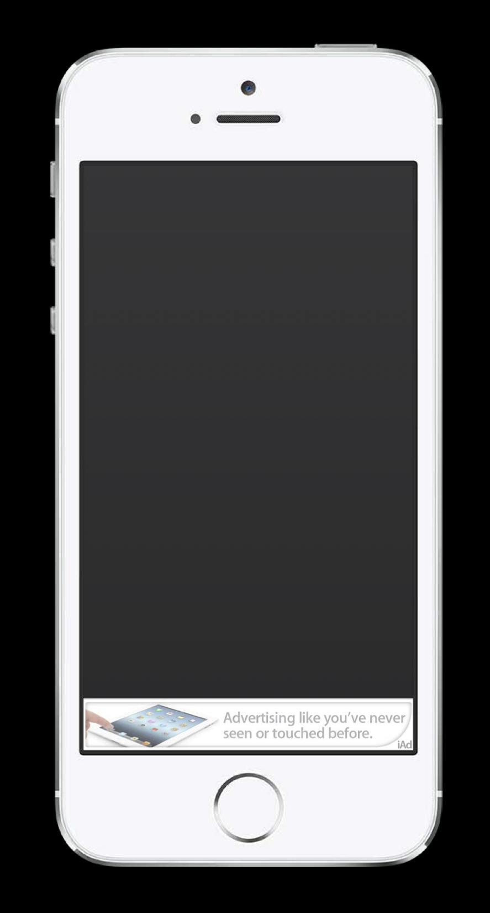
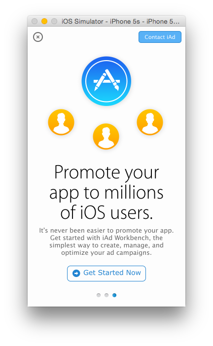

<!-- Tres líneas en blanco para la siguiente transparencia -->


### Dimensiones banner

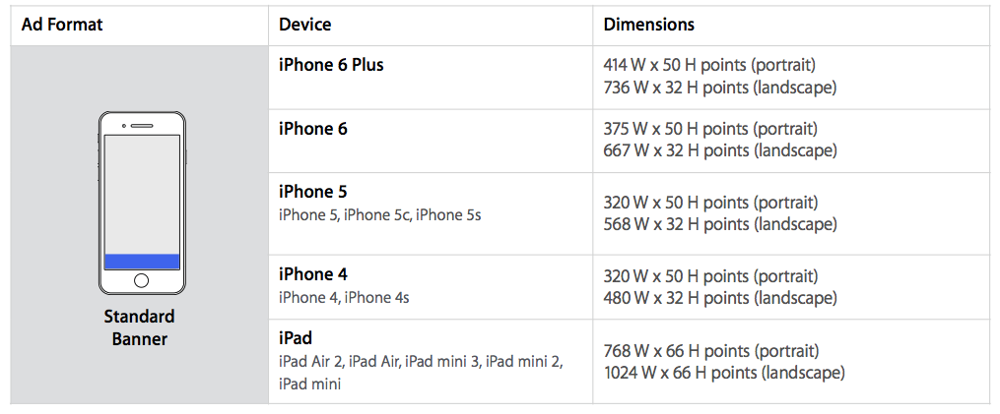

<!-- Tres líneas en blanco para la siguiente transparencia -->


### Código

- Dos formas de trabajar con iAd: gestionar las vistas de los anuncios de forma automática o gestionarlas manualmente.
- Vamos a presentar la primera, aunque en las referencias y en la guía de programación con iAd se explican los detalles de la gestión manual.
- Se basa en la extensión introducida en iOS 7 [UIViewController iAd Additions](https://developer.apple.com/library/ios/documentation/iAd/Reference/UIViewController_iAd_Additions/index.html).

<!-- Tres líneas en blanco para la siguiente transparencia -->


### Configuración básica

- Lincar el framework iAd (en XCode pinchar en el _target_ > _Build Phases_ > _Link Binary With Libraries_ > _iAd.framework_).
- Importar la biblioteca `iAd` y configurar los _view controllers_ en los que queremos que se presenten anuncios, poniendo `canDisplayBannerAds` a `true`:

```swift
import UIKit
import iAd

class MiViewController: UIViewController {

    override func viewDidLoad() {
        super.viewDidLoad()
        self.canDisplayBannerAds = true
    }

    ...
}
```

<!-- Tres líneas en blanco para la siguiente transparencia -->


### Demo con la calculadora


<!-- Tres líneas en blanco para la siguiente transparencia -->


### Configuración en los ajustes 

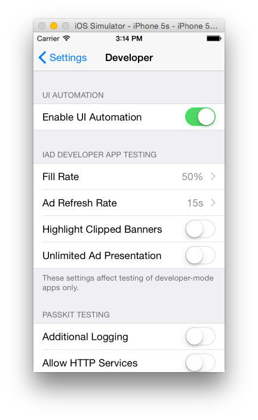


<!-- Tres líneas en blanco para la siguiente transparencia -->


### Funcionamiento 

- La vista del _view controller_ (`.view`) se guarda en `.originalContentView`.
- Se envía una petición de un anuncio.
- Se carga el banner.
- El banner se pone en pantalla y la vista original se cambia de tamaño.

<!-- Tres líneas en blanco para la siguiente transparencia -->


### Funcionamiento (1)

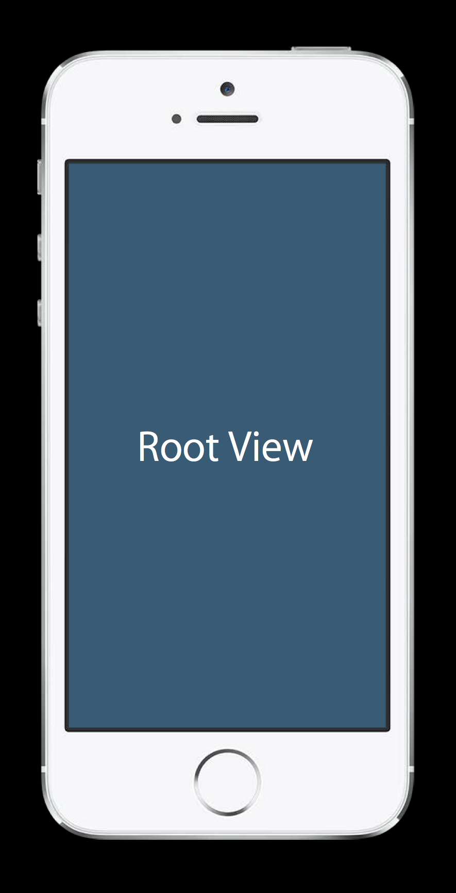

<!-- Tres líneas en blanco para la siguiente transparencia -->


### Funcionamiento (2)

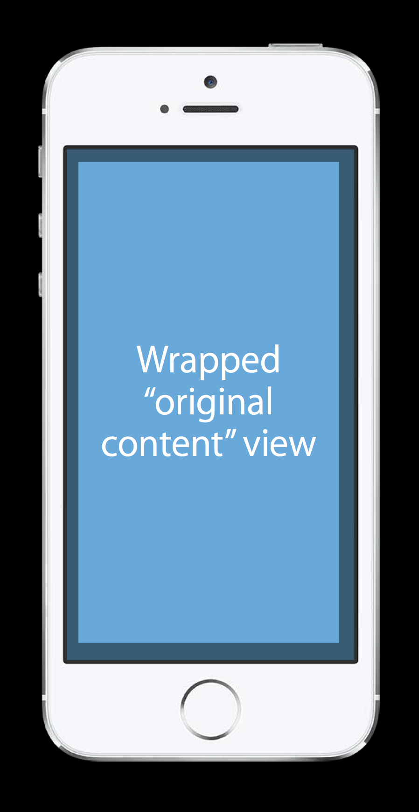

<!-- Tres líneas en blanco para la siguiente transparencia -->


### Funcionamiento (3)


<!-- Tres líneas en blanco para la siguiente transparencia -->


### Funcionamiento (4)

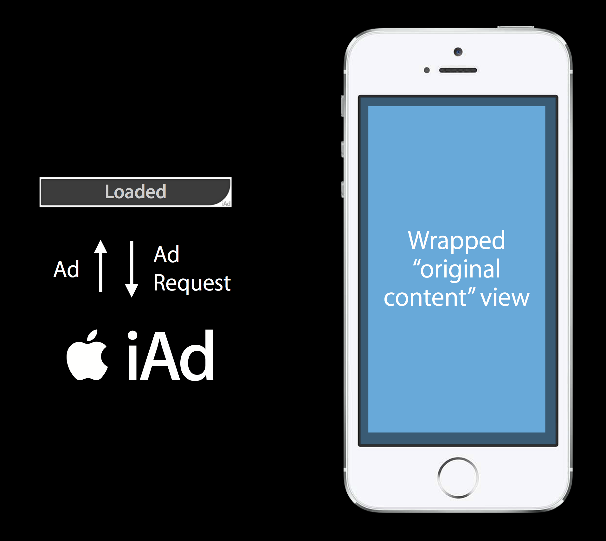

<!-- Tres líneas en blanco para la siguiente transparencia -->


### Funcionamiento (5)

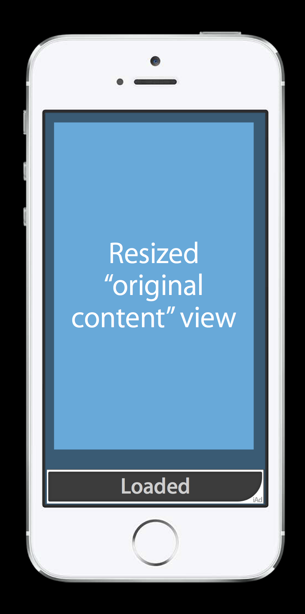

<!-- Tres líneas en blanco para la siguiente transparencia -->


### Interacción

<!-- .slide: class="image-right"-->


- El anuncio cubre toda la pantalla cuando se pulsa.
- La app se debe parar mientras que el anuncio está visible y poner en marcha cuando el anuncio se cierra.
- Se deben usar los métodos del _view controller_ `viewWillDisappear` (parar ahí la app) y  `viewDidAppear` (poner en marcha la app).

<!-- Tres líneas en blanco para la siguiente transparencia -->


### Ejemplo 

- Por ejemplo, podríamos hacer que el banner sólo aparezca una vez:

```swift
    override func viewWillDisappear(animated: Bool) {
        self.canDisplayBannerAds = false
    }
```

<!-- Tres líneas en blanco para la siguiente transparencia -->


### Interstital

<!-- .slide: class="image-right"-->

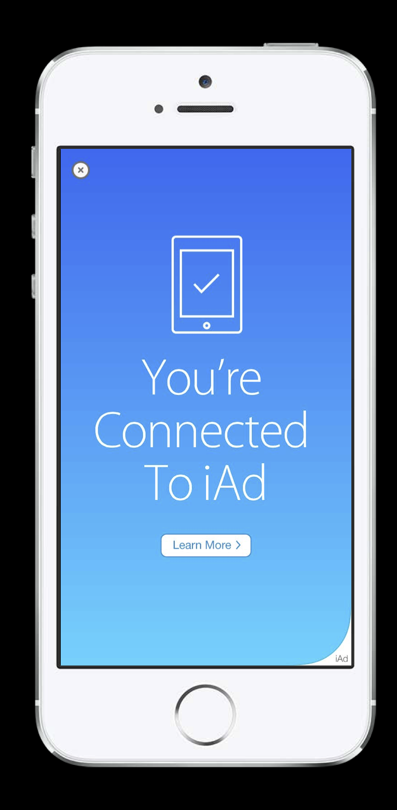


- El anuncio cubre inmediatamente toda la pantalla.
- Se puede lanzar cuando se activa un _view controller_ mediante una _segue_.

<!-- Tres líneas en blanco para la siguiente transparencia -->


### Dimensiones Interstital


<!-- Tres líneas en blanco para la siguiente transparencia -->


### Código

- Para activar el anuncio en el controlador de destino de un segue usando una presentación automática:

```swift
override func prepareForSegue(segue: UIStoryboardSegue, sender: AnyObject?) {
    if segue.identifier == "MiSegue" {
        if let viewController = segue.destinationViewController as? 
                                                    MiViewController {
            viewController.interstitialPresentationPolicy = 
                   ADInterstitialPresentationPolicy.Automatic
        }
    }
}
```

- Es posible definir una política manual y lanzar el anuncio cuando nos interese con 

```swift
viewController.requestInterstitialAdPresentation()
```

<!-- Tres líneas en blanco para la siguiente transparencia -->


### Para preparar la carga de anuncios Interstitial

```swift
func application(application: UIApplication, 
                 didFinishLaunchingWithOptions launchOptions: 
                   [NSObject: AnyObject]?) -> Bool {
    ...
    UIViewController.prepareInterstitialAds()
    return true
}
```

<!-- Tres líneas en blanco para la siguiente transparencia -->


### Práctica: anuncios iAd en ToDolist

<!-- .slide: data-background="#cbe0fc"-->
<!-- .slide: class="image-right"-->


- Anuncio tipo _banner_ en la vista inicial.
- Anuncio tipo _interstitial_ en la vista con el número de ítems terminados.

<!-- Tres líneas en blanco para la siguiente transparencia -->


### API avanzada para gestionar los anuncios

- Mayor control en la gestión de la interacción del usuario con el anuncio.
- Creamos y posicionamos el anuncio en la vista de un view controller.
- Definimos el delegado de la vista del anuncio.
- Gestionamos la aparición, desaparición del _banner_ en los métodos del delegado.

<!-- Tres líneas en blanco para la siguiente transparencia -->


### Clase `ADBannerView`

- La clase [`ADBannerView`](https://developer.apple.com/library/ios/documentation/UserExperience/Reference/ADBannerView_Ref/) es la subclase de `UIView` que define los anuncios.
- Proporciona una vista en la que se muestra el anuncio y con la que el usuario interacciona.
- El tamaño del anuncio se define por el tipo de anuncio `ADAdType`: 
  - `ADAdType.Banner`: Banner. El ancho es el del dispositivo y la altura depende del dispositivo y de la orientación. En el móvil en vertical es de 50 puntos y en horizontal de 32. En el iPad es de 66 puntos en horizontal y vertical.
  - `ADAdType.MediumRectangle`: Sólo para el iPad con las dimensiones estándar de 320x250 puntos.
- Se notifica a nuestra aplicación mediante métodos del delegado cuando el usuario entra y sale del anuncio o cuando se ha cargado un nuevo anuncio en la vista.

<!-- Tres líneas en blanco para la siguiente transparencia -->


### Buenas prácticas en la gestión de la vista de anuncios

- Debemos implementar dos buenas prácticas muy importantes en la gestión de la vista de anuncios.
- Debemos mostrar o esconder la vista en función de la disponibilidad de anuncios. Si no hay ningún anuncio disponible no se debe mostrar.
- Si nuestra aplicación tiene varias vistas, todas ellas deben compartir una única instancia de `ADBannerView`. En este caso podríamos:
  - Crear la instancia en `application:didFinishLaunchingWithOptions:` del delegado de la aplicación.
  - Usar el delegado de la aplicación como el delegado del banner y hacer que el delegado de la aplicación le diga al _view controller_ si debería mostrar o esconder el banner. Podríamos usar el protocolo `UINavigationControllerDelegate` o `UITabBarControllerDelegate` para enviar el banner al _view controller_.

<!-- Tres líneas en blanco para la siguiente transparencia -->


### Creación del banner

- Consideramos el caso más sencillo de una aplicación con un único _view controller_ y creamos el anuncio en `viewDidLoad`:

```swift
override func viewDidLoad() {
    super.viewDidLoad()
    adView = ADBannerView(adType: ADAdType.Banner)
    adView!.frame = CGRectOffset(adView!.frame, 0, self.view.frame.height)
    self.view.addSubview(adView!)
    adView!.delegate = self
}
```
- La posición `y` del banner es justo el borde inferior de la vista actual para que no aparezca en pantalla (suponemos que la vista ocupa toda la pantalla)

<!-- Tres líneas en blanco para la siguiente transparencia -->


### API `ADBannerViewDelegate`

- Funciones más importantes del API delegado: [`ADBannerViewDelegate`](https://developer.apple.com/library/ios/documentation/UserExperience/Reference/ADBannerViewDelegate_Ref/index.html):
  - `func bannerViewDidLoadAd(_ banner: ADBannerView!)`: Se ha recibido un anuncio de iAd. Se debe mostrar el banner.
  - `func bannerViewActionShouldBegin(_ banner: ADBannerView!,`
  `              willLeaveApplication willLeave: Bool) -> Bool`: Se va a comenzar a ejecutar un anuncio a pantalla completa. Se debe pausar la app (si hay algo en ejecución, como un juego). Se devuelve `true` para que el anuncio se muestre a pantalla completa.
  - `func bannerViewActionDidFinish(_ banner: ADBannerView!)`: Se ha terminado de ejecutar el anuncio. Se debe volver a poner en marcha la app.
  - `func bannerView(_ banner: ADBannerView!,
  didFailToReceiveAdWithError error: NSError!)`: iAd no ha podido enviarnos un anuncio. Se debe esconder el banner.

<!-- Tres líneas en blanco para la siguiente transparencia -->


### Ejemplo de funcionamiento del delegado

```swift
func bannerViewDidLoadAd(banner: ADBannerView!) {
    println("bannerViewDidLoadAd")
    hacerVisibleAnuncio()
}
    
func bannerView(banner: ADBannerView!, didFailToReceiveAdWithError error: NSError!) {
    println("didFailToReceiveAd")
    hacerInvisibleAnuncio()
}
```

<!-- Tres líneas en blanco para la siguiente transparencia -->


### Mostrar el banner

- La forma de esconder y mostrar el banner es modificando la posición de su vista. Fuera de pantalla para esconderla y en la parte inferior de la pantalla para mostrarla.
- La modificación de la posición de la vista no modifica la interfaz de usuario. Se debe llamar a `layoutIfNeeded` de la vista padre:

```swift
func hacerVisibleAnuncio() {
    if (!bannerVisible) {
        // Suponemos que el anuncio está posicionado en y = posición inferior de la pantalla
        adView!.frame = CGRectOffset(adView!.frame, 0, -adView!.frame.size.height)
        self.view.layoutIfNeeded()
        bannerVisible = true
    }
}
```
- También se puede hacer una pequeña animación:

```swift
...
UIView.beginAnimations("animationBanner", context: nil)
adView!.frame = CGRectOffset(adView!.frame, 0, -adView!.frame.size.height)
UIView.commitAnimations()
...

```


<!-- Tres líneas en blanco para la siguiente transparencia -->


### Esconder el banner

```swift
func hacerInvisibleAnuncio() {
    if (bannerVisible) {
        // Sumamos a la posición y el tamaño del banner para moverlo fuera de pantalla
        adView!.frame = CGRectOffset(adView!.frame, 0, adView!.frame.size.height)
        self.view.layoutIfNeeded()
        bannerVisible = false
    }
}
```

<!-- Tres líneas en blanco para la siguiente transparencia -->


### Práctica opcional: Añadir anuncios a Mapas

<!-- .slide: class="image-right"-->
<!-- .slide: data-background="#cbe0fc"-->

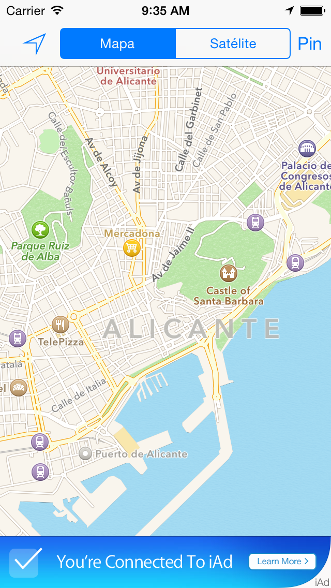

- Utilizar el API avanzada para añadir anuncios a Mapas. Hacer que el banner se esconda cuando no se reciba ningún anuncio.
- Dejar de mostrar el banner cuando el usuario haya visto 3 anuncios.

<!-- Tres líneas en blanco para la siguiente transparencia -->


# Master Programación <br/> de Dispositivos Móviles


